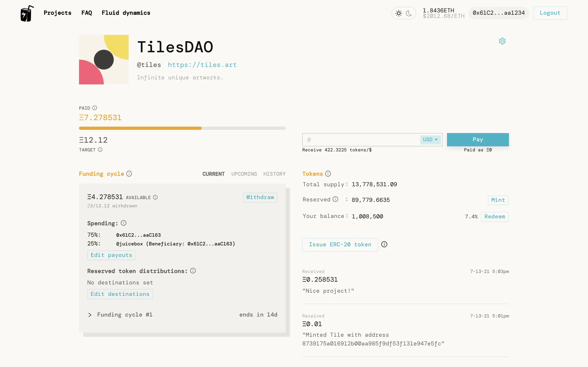
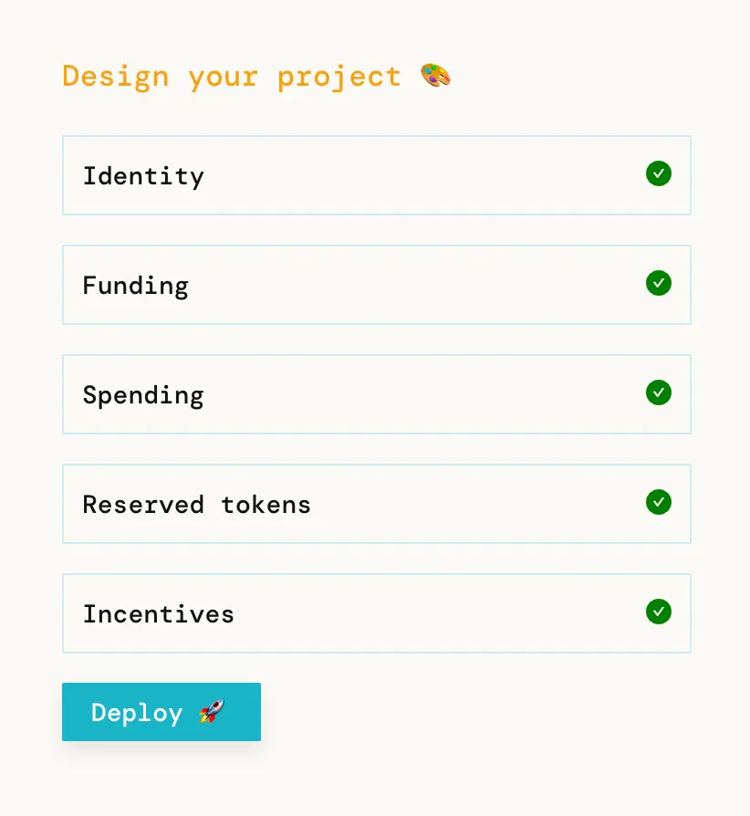
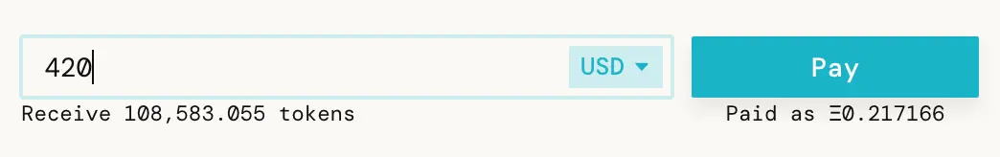
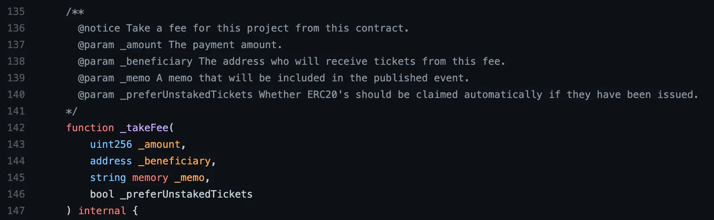
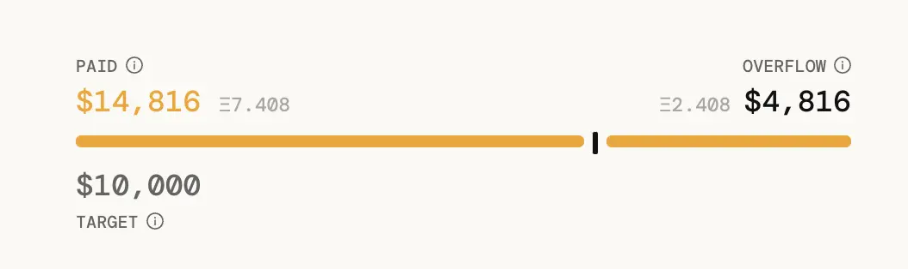

*这是诠释 Juicebox 协议系列博客的开篇，同时也是我们头几个月的策略。*

---

**TLDR**: Juicebox 协议的各项合约已经部署到以太坊主网， [@peripheralist](https://twitter.com/peripheralist) 搭建了一个非常美观的网站来与这些合约进行互动。

Juicebox 是一个商业模式即服务及可编程的金库，为社区共有的以太坊项目提供服务。

请到 [juicebox.money](http://juicebox.money/) 了解一下。只需一个 gas 优化的交易，就可以开始把 Juicebox 用作你的项目支付终端。

以上是一个正在 Juicebox 运营的项目。

### 动机

长话短说：独立艺术家和开发者、DAO 及更广泛的公共产品，需要一个时尚的方式来捕捉他们所创造的价值，从中获得稳定的现金流，然后再把这些价值回馈给整个世界。

Juicebox 协议提供了这样的方式，允许项目在接收付款之前先承诺项目现金流的分配细则，预先知会用户其资金的去向。作为一个付款终端和可编程金库，这个协议非常适用于可预计成本（人员支出、服务订购、捐款、预算内事项，等等）占比较高的项目，也适合那些希望成功时自动回馈社区的人。

### 工作原理

提交一个 gas 优化的交易，你就可以开始募资发展一个 Juicebox 项目，并配置项目金库的支出明细。

项目部署之后，任何人都可以通过作为捐赠人在 [juicebox.money](http://juicebox.money/) 上直接付款，或者使用其他合约把费用集合到 Juicebox 协议，来资助你的项目。不管采取哪种方式，他们都会相应地获得项目分发的社区代币。

人们可以通过类似 [Juicebox.money](http://juicebox.money/) 的界面来直接向你付款。

又或者，项目可以通过继承  `JuiceboxProject.sol` 并使用` _takeFee` 来以合约方式接受付款。作为项目方，你可以设置一个筹款目标，明确创建及运营这个项目一段固定的时间所需要花费的资金。你可以在收到任何资金之前就设置这个目标。如果你的项目在某个固定时间内赚取的资金比筹款目标要多，那么你的支持者们和你一样，都可以通过销毁代币来赎回溢出的资金。随着使用量的增长，这样实质上把所有人向项目付款的成本推向零。

未领取的溢出就可以作为项目的持续运营资本。

这样一来，项目团队和社区就会同心协力确保溢出的增长速度大于支出速度。

筹款周期自动滚动，这样赞助人和收费合约就可以在能力范围内持续地资助他们重视的项目。你可以配置折扣率来激励早期支持者，配置联合曲线比率来鼓励社区成员作出承诺，配置保留率以便每次有人付款并获得代币的同时你也可以分得一些自己的代币。

随时间的演进，项目方可以重新评估他们的资金需求及周期配置，并且可以在向 Juicebox 协议发布这种变更的同时，选择把代币持有人的观点也考虑在内。

---

有几种方案可以配置你的 Juicebox 项目。以下是一些很酷的做法：

1. 可以把你的收入流中转到 Juicebox 合约。
    例如，你可以创建另一版本的 Uniswap，明确每个月只需要 $X 来维持运作（人员成本、运营成本），而每一笔兑换交易会收取一笔交易费用（$Y) 以维系这个服务。如果某个月有足够的交易量（N）使 N * $Y > $X，那么后续的每一笔交易，所有兑换过（也就是付过费）的账户都会按他们之前为项目的存续作出贡献的份额从超额收入中获得分红。因此，如果 N * $Y 的增长速度不合常理地高于 $X（这正是 Juicebox 项目要打破的当前市场寻租造成的低效率），每个人的投入成本都会趋于零，而不是出现复合的股东财富聚集的情况。
    ​这就意味着，人们可以获得一个几乎免费的社区驱动产品，这个产品不需要广告，数据完整性有保障，有健全的商业运作问责制度，还拥有一个运行可靠的开源代码库。所有这一切都是由充满干劲的朋客们一手搭建的，他们不但收获了满意的报酬，而且还会跟社区一同受惠于溢出的增长。
2. 要安排财务上的依赖性也不难，你的 Juicebox 项目的筹款目标可以通过合约来与项目仰赖的人或其他项目的筹款目标实现挂钩。
3. 你可以举办一个经常性或一次性的募资活动，超募资金既可以返还给你的社区，也可以投放到其他项目。
4. 作为项目方，每次收到付款你都可以同时获得自己分发的代币。这些代币的价值将按项目溢出增长的速度进行“释放”，而不是按照某个几年期的股权授予计划。然后，这些保留代币可以通过合约来分配给项目的工作人员或者其他项目。

---

如今，最令人激动的莫过于在以太坊、用以太坊、为以太坊来进行工作了 — 每天我们的加密钱包生活都会迎来很多新的创想家，精彩纷呈的各种实验已然成了家常便饭。这是一个创造者的梦想：不需要自己来管理各种基础设施，发展源自社区的驱动，财务预期可以通过代码来锚定。Juicebox 协议就是一个创造出来朝着这个方向推动的工具。

如果你有疑问或者想贡献自己的力量，就请赶紧加入[我们的 Discord](https://discord.gg/6jXrJSyDFf)吧。

