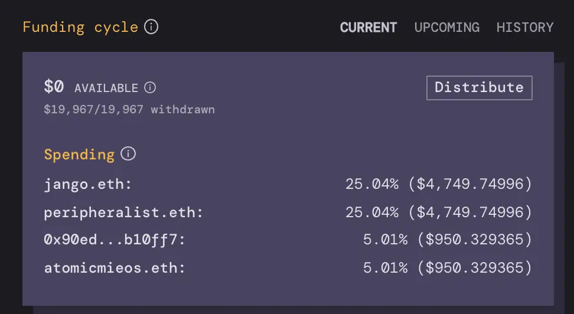

JuiceboxDAO 的第一个 Juicebox 配置历时 30 天，里面包含了预设的各项支出如下：

### 人员

- Jango 管理合约及领导开发及设计工作，获得 5000 美元。
- Peripheralist 领导前端开发工作及改进 Juicebox 来满足在 TileDAO 发现的需求，获得 5000 美元。
- AtomicMieos 进行内容试验及帮助形成构思，获得 1000 美元。
- Sage 从事设计及插图工作，获得 1000 美元。

### 运营

（这些资金全部交由 JuiceboxDAO 治理来进行分配）

- 返还 Jango 垫付购买 juicebox.eth、jbx.eth 及 jbox.eth 的费用。这些 ENS 名称将转到 JuiceboxDAO 的治理。
- 1000 美元用于内容或艺术创作物料，由 Futurenate 和 Sage 进行管理。
- Figma 费用每月 75 美元。
- Infura 费用每月 50 美元。
- Gitbook 费用每月 32 美元。
- Fleek 费用每月 10 美元。

合计总额为 19967 美元。

人员支出总额与市场上同等技术的薪酬相比偏低。我们决定第一个筹款周期把预算定低一点以便获得更长的运营时间，待第一个筹款周期展开后可以再来重新评估实际需要。

请继续关注第一个筹款周期的支出报告，以及下一周期的支出提案。