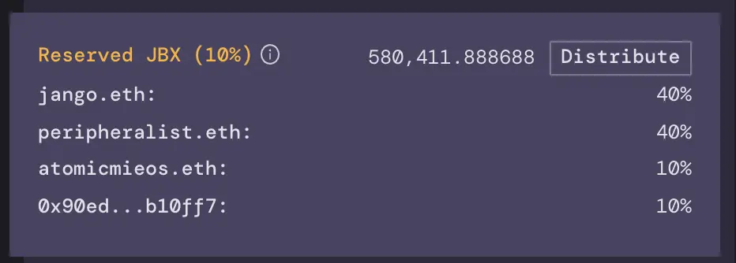

JuiceboxDAO 的第一个周期配置包含了一个10% 的预设 JBX 保留比率，分配给预定的接收方。

项目每收到一笔捐款，就会铸造一批新的 JBX。这些 JBX 会发送到捐款人指定的接收地址（通常是他们自己），保留代币除外。10% 的保留比率意味着新铸造代币的 10% 会分配给预设的接收方。

因此，这些设置的接收人按项目的发展速度，而不是按某个带最短生效期或锁定机制的计划，来获得他们的 JBX 授予。

图片截取自 https://juicebox.money/#/p/juicebox

### 投资人

- Jango 获得 40% 的保留代币，他的工作包括构建机制、编写合约、全面生态测试、主导项目启动后的设计及开发工作，及领导项目关系。
- Peripheralist 获得 40%，他的工作是构建前端代码库、搭建 [juicebox.money](http://juicebox.money) 网站以及主导项目启动后的前端开发工作。
- AtomicMieos 获得 10%，他的工作是进行内容的试验，以及项目启动前后帮助形成各种构想。
- Sage 因她在项目启动前后的设计及插图工作获得 10%。

这些数字都是有点随意的。我们决定从小按平均原则做起 — 当时还不清楚，启动前开发工作与启动后的发展及改进工作相比风险度如何，以及 Juicebox 的各个激励机制在实行运营时表现如何。随着第一个筹款周期的开展，我们会建议对这些数字重新评价以便更好地反映各个风险指标和激励措施。
