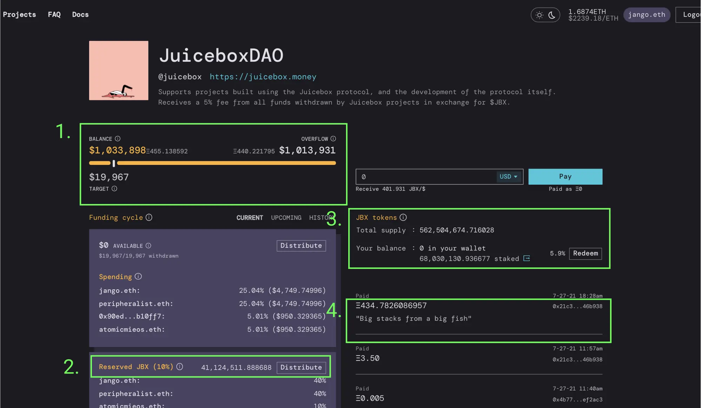

今天早些时候，[@jessewldn](https://twitter.com/jessewldn) 在 [Juicebox 的 Discord 频道](https://discord.gg/2K5Cs7e76K)里提了个问题：

> 我很好奇，你有没有想过一个问题，Juicebox 里的这些项目会不会，或者说怎么样与风投融资产生交集，这些融资有大量的“永久性”跑道[(注1)](#注1)一次性冻结起来无法回收。你觉得这就仅仅是资产溢出，还是可以在设置上微调一下，从而满足项目同时从流动社区和长期投资方融资的需求？

**TLDR 的回答：** 你只管把钱投到协议的某个项目里，这个系统对所有人都是一视同仁的。

*但其实这个问题值得给出一个更为出彩的答案。*

- *我接下来要讲的内容都是理论上的。我很想在实践中尝试这些想法，不断地调整各种参数设置，直到我们能够在不同的人群之间找到一个平衡点，不管他们是资本鲸、投资猿、建设朋克、创作家、开发侠，还是其他每一个以太星人。*

*还要提醒一句，Juicebox 是一个试验性的软件。我已经竭尽所能地去暴力测试这个协议，包括使用常规案例、边缘案例以及各种随机条件去考验它。但正式地来说，它目前仍然未经审计。在这些合约里的投资行为，需自行承担风险。*

***

## 初步介绍

Juicebox 协议不但支持有大梦想的小项目，同时也满足大项目希望用户或社区参与日常发展和分享成果的需求。同时，也让资助项目的人以及不同风险偏好的投资者都能对项目的支出和财务状况做到心里有数。

项目可以逐步调整筹款周期的参数设置，来校正各种激励措施和投资回报，让项目可以不断地进化。具体来说，一个项目可以使用的参数包括了`筹款目标`、`筹款周期时长`、`代币保留率`、`联合曲线比率`，还有`折扣率`。这些参数会随时间推移通过一个选票合约的批准来作出调整，这个选票合约可以按项目及其社区选择的管治或代治架构来实现。

`筹款目标`限定了每个筹款周期内项目可以提取的资金量，筹款周期的长短则由`筹款周期时长`决定。

支付给项目的每一笔付款都会铸造及分发项目代币给付款人，同时按保留的百分比（`代币保留比率`）把其余代币分配给项目方预设的一组钱包地址。每笔付款铸造出来的代币数量随时间推移受项目设置的`折扣率`复合影响，这是对早期捐款人的一种激励机制，因为他们承担了更大的风险。项目募集到的资金，超过`筹款目标`的部分就是溢出。这个溢出既是项目的长期跑道，也是社区的资产金库。每个代币持有人对溢出都有主张的权利，他们可以通过赎回（销毁）代币来行使这个权利。

项目可以设置`联合曲线比率`，它会影响每个代币能够得到多少份额的溢出。联合曲线率在 100% 的时候，x% 的代币就可以赎回 x% 的溢出；但 50% 的联合曲线率的情况下，x% 代币就只能赎回约（0.5 * x)% 的溢出，剩下的资产溢出由其余持币人分享。

最后，项目设置第一个筹款周期或者收到第一笔付款之前，可以提前铸造一定数量的代币的。

请浏览[juicebox.money](https://juicebox.money), [图文技术文档](https://www.figma.com/file/dHsQ7Bt3ryXbZ2sRBAfBq5/Fluid-Dynamics?node-id=0%3A1)和其他博客内容，来深入认识这些控制参数 🎛。

## 场景

回到最初的那个问题：大资金应怎样参与 Juicebox 的项目？

答案是他们只管把资金投入到协议的特定项目里。我们的系统对所有人都是一视同仁的。

让我们来推演一个案例，看看如果有人一下子把大量资金注入 [JuiceboxDAO](https://juicebox.money/#/p/juicebox), 会发生什么情况。

上图是撰写本文时从 Jango 的视角看到 JuiceboxDAO。
假设现在有人投了100万美金进来，那么我屏幕上的显示会大致会变成下图这样。

有人投了100万美金（约434个ETH）进来之后，从 Jango 的视角看到的JuiceboxDAO。
变动如下：

1. 溢出更多了。
2. 铸造了更多的代币，增发代币的 10% 待分配给保留代币受益人。
3. 增发的代币加大了总供应量，我的持币比例因此从 42%下 降到 5.9%。图上未揭露的情况：这个付款人现在持有的 JBX 代币占总供应量的71%。
4. 这笔付款会显示在活动记录里。

关于我们所处新状态的几点事实：

- 项目金库现在有更多资金可供支配，这意味着我们的跑道【注1】（可持续时间）变长了，也意味着更大更多元化的支出或者投资的机会（更大影响力）。
- 目前的联合曲线比率是60%，这个付款人如果马上赎回他手上这 71% 的代币的话，会拿回大概 644,000 美金（280ETH）。如果有其他付款陆续按不同的折扣率流入项目，又或者有其他持币人决定先行赎回代币，那么他能赎回的金额会更多一些。但是，如果项目后面筹款周期的烧钱速度比溢出增长要快的话，他的赎回金额则会变少。这有个[工具](https://www.desmos.com/calculator/sp9ru6zbpk)可以用来模拟 Juicebox 的联合曲线。`o`代表当前的溢出金额，`s`代表当前代币总供应量，还有`r`代表联合曲线比率。`x轴`表示赎回的代币数量，`y轴`表示的是赎回`x轴`数量的代币可以得到的溢出金额。
- 这个付款人手上持有占压倒性优势的代币（71%）。如果 JuiceboxDAO 沿用的投票机制是简单多数且仅以 JBX 代币作为投票方式的话，那么该付款人的意见将左右 DAO 的所有决定。倒是可以设计投票机制来避免出现这样的情况，但涉及到分配这 100 万美金的任何设置参数的修改都应得到捐这笔款的人同意，也算是说得过去。

## 战略

如果你是巨鲸，我想你希望押注整个 Juicebox 生态多于单个项目。多几个有前景的想法落地成为 Juicebox 配置设计体系下的集资项目来发展他们的社区，整个生态的价值就会得到提高。

一个项目在 Juicebox 协议中能做的配置是多种多样的。折扣率 0%、联合曲线率 10%、代币保留率10% 以及筹资目标50ETH的一个项目，跟折扣率20%、联合曲线率100%、代币保留率 50% 及 10ETH 筹款目标的项目，他们的玩法会截然不同。这种多元函数的梯度带来了许多有趣设置组合的可能性，项目事前没有办法知道哪一个多元组合会输出一个最佳值。目前还很少先例或者数据可供参考，所以每个项目／社区都将必须去试验最适合其需要的配置组合。

作为一名投资者，这就是高风险试错的依据。你要是觉得某个项目很有前景，想给它投100万美金，你可能应该：

- 留意项目设置的代币保留率。
- 搞清楚这个项目的折扣率是多少以及项目启动以来这个数值是怎么演变的。这样你会对你的持仓在总供应量中的占比变怎样变化心里更有数。
- 弄明白项目的联合曲线比率，就会知道你的持仓流动性高低。
- 还要了解项目是如何配置它的筹款周期选票合约的，因为这个合约决定了谁有权实施对筹期周期配置的变更（项目方跑路不是不可能的）。

以上这些对投机猿们🦧也是适用的，但他们可能会先冲进去再来读这篇东西。

在这样一个人们和项目相互扶持的透明网络上，建设朋克们👾可以发展文化和建立社区，并得到他们应得的回报。

创作家🎨和开发侠⌨️可以为他们喜欢的项目工作，又或者直接发起自己的项目。他们从社区获得自己应得的报酬。

每个以太星人🇪🇹在通过 web3 协议进行交易时基本上都会得到回报，并（无意地）在那个特定时间节点对该协议下项目社区的金库发展做出了贡献。

## 结语

如果有人现在给 JuiceboxDAO 的金库捐了一大笔钱，然后我们可以提高月度预算来支撑更多支出的话，我能想出很多很多事情值得我们去投入资金。首先一个，我们可以请个人来帮忙撰写技术文档，这些文档得支持搜索、通俗易懂还得引人入胜。我们还是要请人来帮助我们写文档。我觉得我们甚至应该考虑重金请人来负责文档的编写。

***

 **【注1】**：“跑道”指的是你的项目在耗尽资金之前可以运行几个月，企业家或 VC 通常会尝试估计项目的“跑道”来作为初始投资参考。跑道的长度对于飞机是否能够安全起飞和降落是至关重要的。如果跑道太短，飞机起飞或降落都不安全。如果跑道太长，你则浪费了资金或者资源。在创业的世界里，你会经常听到企业家或 VC 们谈论创业或融资跑道。

