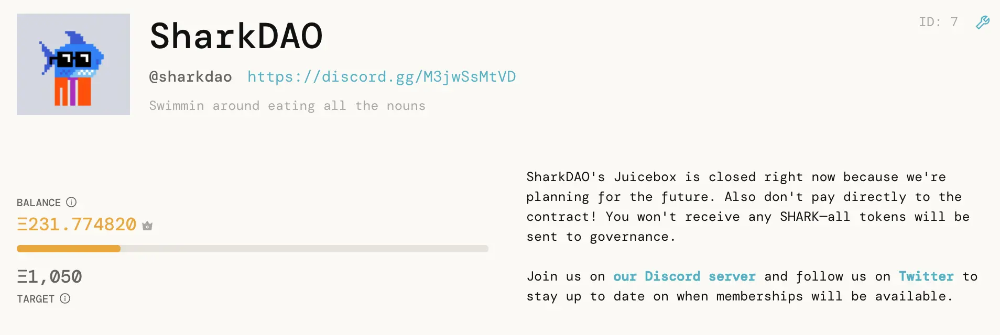
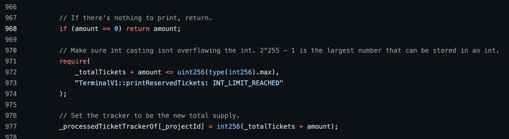
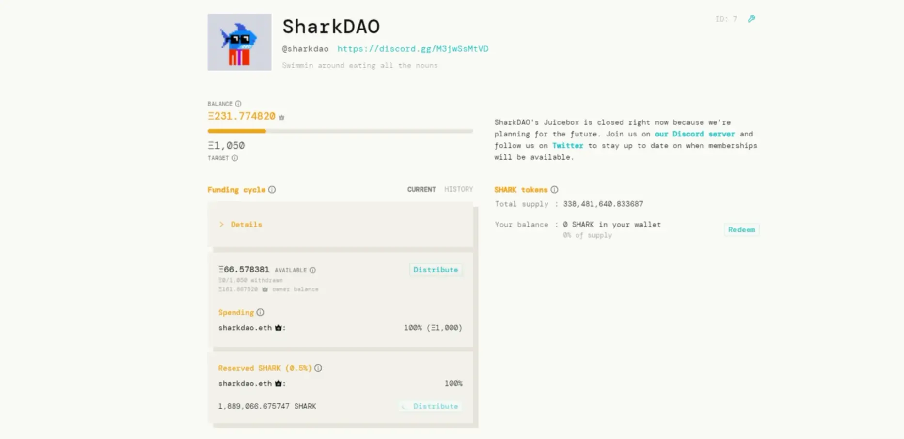
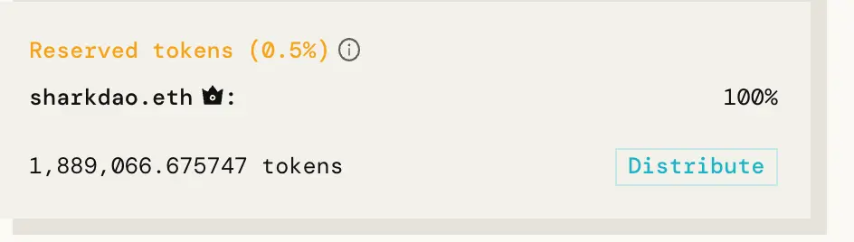
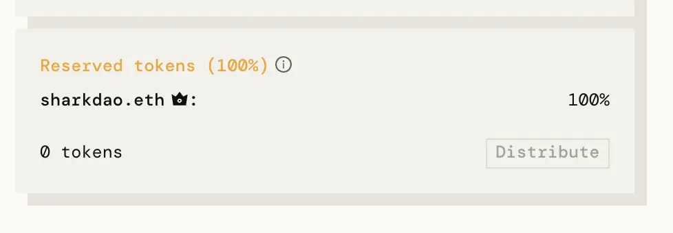

我昨晚发现了一个 Juicebox 协议的低严重度 bug, 如果项目之前曾把代币保留比率设置为 0% 且接收过付款，之后又把这个保留比率调整为大于 0% 的任意值的话，就会受到这个 bug 的影响。

临时解决方案已经确定，从系统中删除这个 bug 的工作计划正在拟定中。

为降低发布补丁前被恶意利用的风险，防漏洞利用小组决定把相当于总发行量 0.5% 的 SHARK 代币（共 1,889,066.675747 个 SHARK 代币）铸造到多签钱包内。采取这一措施是为了防止进一步发生问题。必要时可以对这些代币进行销毁。

以下是关于我发现这个 bug 的前因后果、这个 bug 的技术细节和我们接下来的工作安排。

TLDR：**如果项目近期打算调高保留比率的话，在收到进一步的通知前不建议把保留比率设置为 0%。**

## 背景

为了争取计划下一步工作的时间，SharkDAO 需要找到一个办法来暂停通过 Juicebox 接受付款及吸纳新成员。Juicebox 的 [TerminalV1 合约](https://etherscan.io/address/0xd569D3CCE55b71a8a3f3C418c329A66e5f714431)并不支持`暂停`功能，所以我和 Peripheralist 只能跟 SharkDAO 社区一起见机行事。

第一步就是要删掉网站 UI 的支付表单。这可以阻止大多数人支付捐款，但是执意捐款的人仍将发现，通过其他类似 Etherscan 这样的接口还是可以直接与 Juicebox 合约进行交互。

为了保障公平，我想到将 SharkDAO 的保留比率提高到 100%，这意味着所有通过合约支付的款项铸造出来的 SHARK 代币将不会分发给付款的地址，而是会 100% 分发给预设的保留代币受益人。没有了捐款获得 SHARK 代币的激励，社区的人们将不再有动力去通过后门的方式来付款，变相地实现了我们想要的`暂停`功能。即使有人还是付了款，我们也很容易把钱退还给他们。

SharkDAO 在 Sharktank 社区会议上试演过这一计划之后，我们决定将其付诸实施。我们将把暂停付款期间铸造的所有 SHARK 代币都分配给多签钱包，必要的时候可以把这些代币销毁掉。

需要注意的一些细节：
- SharkDAO 的保留代币率从最开始就一直设置为 0%。
- SharkDAO 的筹款周期没有预设周期时长，也就是说所有变更可以随时执行。
- SharkDAO 的 Juicebox 项目由一个执行 3/5 签名政策的 Gnosis 多签钱包拥有。我是其中一个多签成员。

会议之后，我和其他多签成员立刻一起执行这个计划。向 TerminalV1 的 `configure` 函数发送一个交易之后，保留比率就更新成功了。我马上检查 UI 看是否已经处置妥当 - 这时我才发现把保留比率配置为 100% 之后，项目会再铸造出 100% 的当前代币供应量并分配给预设的接收方（多签钱包）。由于这个分配代币的交易是公开的，任何触发这个交易的人都会使 SHARK 代币的供应量翻一番，这样的话我们会需要从多签钱包销毁这些计划外的代币供应量及向社区解释这个问题，带来许多不必要的工作。

我马上通知多签小组发送另一个 `configure` 交易到 TerminalV1，把保留比率改回 0%，并向他们解释，要等我核实清楚情况才能继续执行计划。这时我们又回到了之前的状态，通过直接向合约支付就可以绕过删除 UI 表单实现的暂停付款。

## 技术细节

当我注意到 UI 上的可分配代币时，问题的根源就昭然若揭了。返回到一个稍为安全的状态后，我就开始验证我的假设并测试解决方案。

Juicebox 机制的许多设计都是考虑了 gas 优化的，这意味着最常调用的交易比不经常调用的交易更少涉及状态的改变。`支付`交易是迄今为止调用频率最高的，所以这个函数内极少发生状态的改变：收到付款，相应数量的金库代币以托管的形式铸造给付款人。

有一点很重要，付款期间并不会铸造保留代币。保留代币数量在以后调用 `printReservedTickets` 交易时才会进行计算。计算是通过获取当前代币总供应量并向预设的保留代币受益人铸造适当数量的新代币，确保遵照设定的保留比率。最重要的是，这个机制会记录已为当前的代币供应量铸造保留代币的这个情况，以免日后再额外铸造保留代币。没有信息差的理想状态下，如果计划提高保留比率，提高之后再调用 `printReservedTickets` 对项目最为有利，而提高前调用则对社区有利。反之亦然。这种动态允许协议把耗费 gas 的存储操作从频繁调用的支付函数中剥离出来，嵌入到较少被调用的操作中去。

糟糕的是，但保留比率为 0% 时，`printReservedTickets` 调用会假定没有工作需要处理，还没来得及更新 tracker 就执行返回。这使得保留比率在未调高之前无法锁定。在 [TerminalV1 文件](https://github.com/jbx-protocol/juicehouse/blob/3555d7baf7fa8ba4bc350140201805c740e3df4e/packages/hardhat/contracts/TerminalV1.sol#L968)里，解决办法就是把第 968 行代码放到第 977 行代码下面。

当前 TermnalV1 的 `printReservedTickets` 实现

## 执行

我立即向 SharkDAO 的管理员提出了两个解决方案：

- 保持合约开放。
- 将保留比率设置为最低的可设定值（0.5%），把分配的保留代币分发到多签钱包，然后按原计划把保留比率提高到 100%。

我们决定采取第二种方案，因为我们要为打算捐款的社区成员营造一个公平的环境，同时铸造给多签钱包的 SHARK 代币相对较少，我们可以稍后把它们销毁掉。

之后我又花了几个小时在集成测试套件中重建最初的这个 bug，再编写了一个集成测试来确认建议的方案是否按预想那样切实可行（晚上的写这篇记录的同时我正在再三确认每个细节）。确定一切就绪之后，我和其他多签成员一起执行了以下三个交易：

1. 把保留比率调整为 0.5%。
2. 把保留金库代币分配到多签钱包（所有人都可以触发交易，所以 Xaix 用他的个人钱包来发起交易。）
3. 把保留比率调整为 100%。

这么做的后果就是铸造了 1,889,066.675747 个 SHARK 代币到多签钱包。下面是第一步完成之后的 UI 情况截图：

这是现在的情况：

全部完成总耗时 2.5 小时。

## 感悟

尽量我们编写了广泛的单元、集成和负载测试，这个情况还是未能覆盖到。我会不断地向社区强调，Juicebox 仍属于高风险的试验性软件。我对它的构建方式很有信心，并致力于不断地改进它，但我不会假装它就是完美的。

好消息是，TerminalV1 有一个内建的机制，允许项目选择迁移到经 JuiceboxDAO 治理批准的新终端合约上去，所以像这样的 bug 是可以修复的。

我们正夜以继日地工作，以期能安全设置 TerminalV1_1 供项目进行迁移，并对它进行广泛的测试。

**同时，如果项目近期打算调高保留比率，不建议现在把保留比率设置为 0%。**

接下来要做的工作：

- 部署 TerminalV1_1，这个版本已经修复了这个 bug。
- 考虑构建一个支持暂停付款的 Juicebox 终端合约版本。
- 寻求更多代码审查和审计，同时向愿意帮忙的黑客提供 bug 赏金。