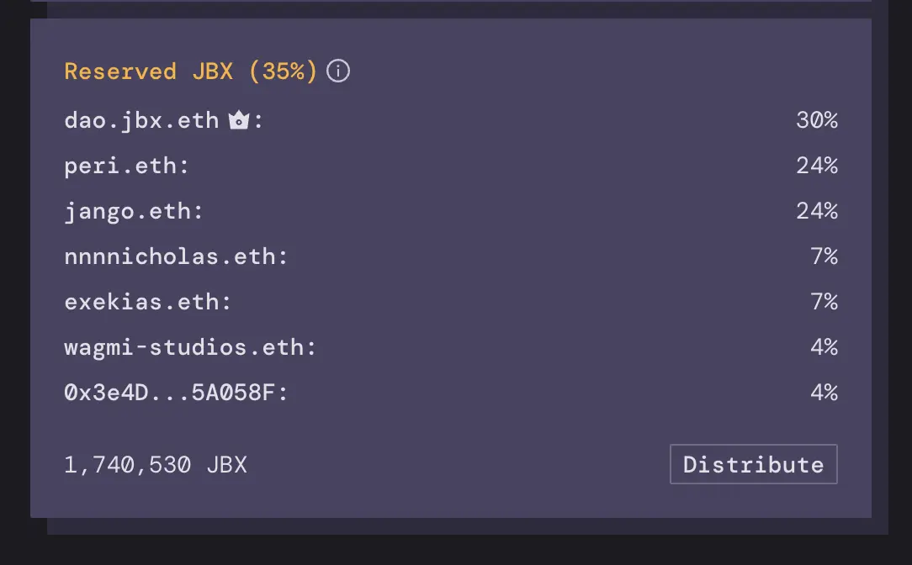

资金捐献到 JuiceboxDAO 的金库里 ， 不管是直接付款还是支付费用的形式，就会铸造及分发 JBX 代币。目前来说，铸造出来的 JBX 代币有 35% 保留并分配给预设的地址，剩余的 65% 则分发给付款人。

JuiceboxDAO 保留代币当前的分配情况如下：

JBX 代币的发行数量是没有上限的：捐赠的 ETH 越多，创造出来的 JBX 也会越多，虽然创造的速度会由于折扣率的存在而渐次递减（目前每个 ETH 铸造的 JBX 代币数量每两周递减 10%）。每次付款过后，可供分享的蛋糕都会变大，但同时每个人的蛋糕份额却会轻微地收缩。

.….. 除了那些保留代币名单上的人。在任何特定时间节点，他们的整体 JBX 持有量都会按照金库的增长速度向预设分配给他们的保留代币百分比靠近。这也意味着当前 DAO 总体价值的 35% 集中在这些保留代币持有人手上，而剩下的 65% 则在捐赠或付费那个群体之间逐渐进行长尾分配，先到的受惠更多。

迄今为止，JuiceboxDAO 的保留代币主要分配给那些肩负 DAO 各项运营责任的少数贡献者。最近，DAO 也开始为多签钱包保留代币，用于流动性质押奖励和其他项目的再分配。

展望未来，DAO 协调社区内激励措施的最佳途径可能是来自扩大保留代币池来涵括许多新成员和承诺助力 DAO 走向成功的各项活动，还有一些较小范围的试验性分配。

做好类似 [DAO 治理文件](https://juiceboxdao.notion.site/Governance-f0ff06c503914500acb9bd646cc4ed65)中概述的一些基本的预防措施和行动指引，DAO 就应该准备好公平高效地吸收一些有用的贡献者，同时清除那些混吃等死或毫无建树的人。这个流程应当把 DAO 所创造的价值传递给那些积极推动项目发展使命的人，以及那些构建于协议之上并持续支付平台费用的项目。

我非常希望接下来的几个月能看到更多保留代币的分配[提案](https://juiceboxdao.notion.site/Governance-f0ff06c503914500acb9bd646cc4ed65)，并期待保留代币受益人的数量能够大幅增加。

### 题外话

保留率还会大幅提高恶意并购的成本。 JuiceboxDAO 目前的 JBX 代币的总供应量是 577,516,588 个。当前每捐赠一个 ETH 会新铸造 544,320 个JBX 代币（355,808 个分发给付款人，190,512 个流向保留代币池）。如果今天某人要给自己铸造总供应量 51% 的代币，他就必须往项目金库里投入 3,865 个 ETH。时间越往后，这个代价就会越高，因为代币的总供应量持续在增加而捐赠一个 ETH 能铸造代币数量却持续在减少。