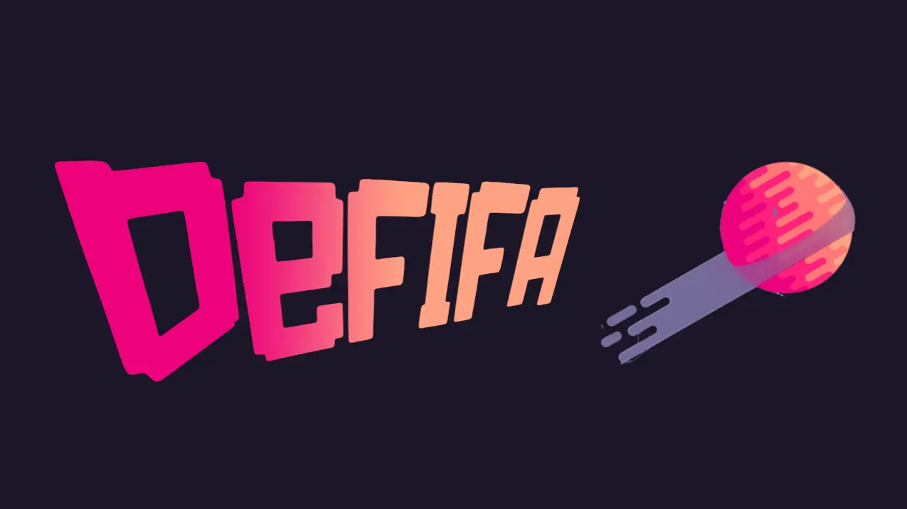
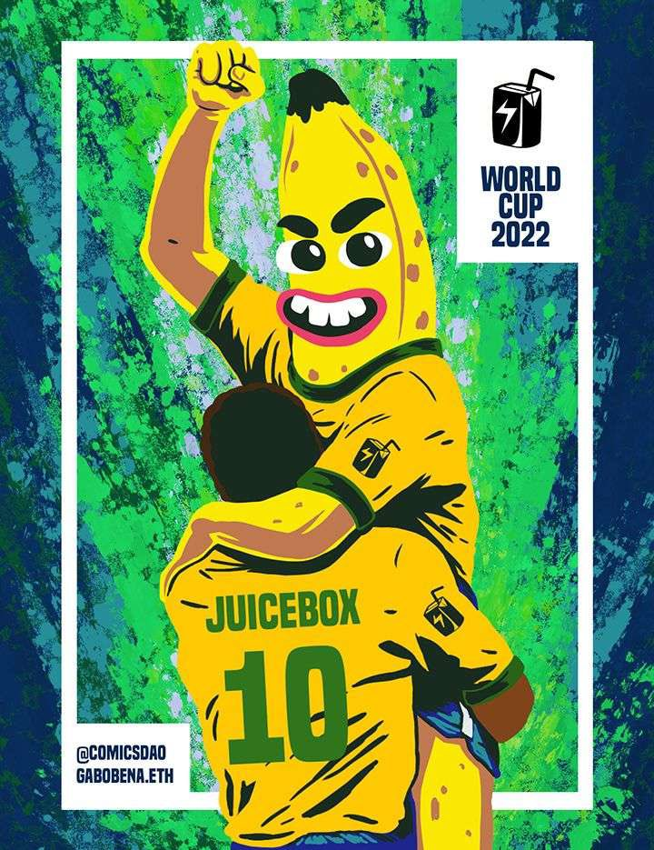

[Defifa](https://juicebox.money/v2/p/305) 是一个应 2022 年国际足联世界杯而生的试验性 NFT 小游戏。NFT 铸造 从 11 月 8 日开始，至 11 月 21 日世界杯揭幕战开始前截止。游戏定于 12 月 25 日结束 — 世界杯闭幕后 7 天 — 届时项目所有的金库资金将向 NFT 持有者开放赎回。

以下是让 Defifa 成为可能的 3 个值得关注的新颖构想：

### NFT 分配

过去的 5 个月以来，JuiceboxDAO 的技术员贡献者们一直在开发一个 NFT 分配机制，让项目方可以配置并附加到项目的任何筹款周期里。附加上这个 NFT 功能之后，项目收取的款项如果满足某些条件便有机会从一个 ERC-721 合约铸造出代币。这个 ERC-721 合约可以包含任意个付款等级，这些付款等级又可以定义各自的图像及描述元数据、最低捐款门槛、最大供应量、保留给预定受益人的代币比率、投票权重以及其他的属性，以确保项目方和社区双方的信心。

Defifa 使用这一机制定义了 32 个等级，分别对应世界杯的 32 支参赛队伍。所有等级都包含在同一个 NFT 系列之内。每个等级均不设供应量上限，捐款 0.022 ETH 至 Defifa 金库即可获得。所有向金库的捐款都有资格获取，同时必须注明想要铸造的队伍。客户端可以注明付款价值是否必须全部用于铸造 — 如果付款金额不是 0.022 ETH 整倍数，交易就会撤回。

:::info

这里可以查阅完整的部署脚本： [https://github.com/jbx-protocol/juice-defifa/blob/main/contracts/scripts/Deploy.s.sol](https://github.com/jbx-protocol/juice-defifa/blob/main/contracts/scripts/Deploy.s.sol)

:::

### 项目所有权

项目方拥有配置一个项目未来筹款周期的专属权限。迄今为止创建的大部分 Juicebox 项目都是由个人或者多签钱包所拥有。与此不同，Defifa 项目的所有者是一个合约，这个合约会自动发起交易来配置四个硬编码的筹款周期，分别来对应游戏的四个不同阶段。这四个筹款周期分先后次序，并由游戏实例化时定义的时间戳所约束。

第一个筹款周期是铸造阶段：

- 允许付款给金库并按上述标准来铸造各个球队的 NFT。
- 赎回可以获得铸造价格的全额退款。
- 这一阶段不会铸造保留代币。

第二个筹款周期在世界杯揭幕战开场的那一刻开始：

- 付款暂停以避免任何后续代币铸造。
- 赎回暂停以防止动用金库资金。
- 每个等级铸造保留代币，铸造方式为每 10 个代币里有 1 个分给 Defifa 球童，即开发这个游戏并支持其顺畅运行的工作团队。

第三个筹款周期与世界杯四分一决赛开始时间一致：

- 所有队伍所有 NFT 的转移全部锁定，暂时变成灵魂绑定代币。
- 其他规则与第二个筹款周期一致。

第四个筹款周期在世界杯总决赛结束 7 天后开始：

- 解锁所有 NFT 的转让或交易。
- 付款保持暂停，保证不会出现新的铸造代币。
- 开放赎回，可以销毁 NFT 来领取其内含的金库份额。更多详情见以下记分卡部分。
- 这个阶段会永远延续下去。

每个阶段的启动都必须在当前阶段结束前排队交易。任何玩家都可以发送这个交易。

插图作者： <a href="https://twitter.com/soypulpob">gabobena.eth</a>

### 记分卡

游戏完全自主裁定结果，也就是说不依赖链上预言机来传递现实世界的结果。相反地，NFT 持有人全权负责认证正确的记分卡来反映现实发生的情况。“正确”的记分卡仅通过社会共识来决定。

这个版本的游戏按证明正确性如下：

- 总共有 100,000 分可供分配。世界杯的 5 轮比赛每轮各分配 20,000 分，由该轮比赛中的获胜方平分。
- 世界杯赛事总有 48 场小组赛、8 场十六强赛、4 场四分之一决赛、2 场半决赛和 1 场总决赛。因此每场小组赛事值 416 分、每场十六强赛事值 2,500 分、每场四分之一决赛值 5,000 分、每场半决赛值 10,000 分，剩下的 20,032 分全部归总决赛。正确的记分卡应该反映每支队伍的累积得分除以总分数 100,000 得出的数值。
- 每支队伍有 1 票投票权，在该队伍的所有 NFT 持有人之间平分。任何人都可以提交不同的记分卡，对记分卡的投票将于世界杯决赛时开始。第四个阶段期间，一旦有 50% 的队伍就正确的金库分配达成共识，该记分卡就可以获得批准。记分卡确定以后，每个 NFT 按照该记分卡的分配比例获得金库的份额。每一个 NFT 都可以通过赎回按比例来获取其队伍的价值。这个是唯一获取金库资产的途径。
- 第四个筹款周期永不落幕，也就是说可以随时赎回（销毁）NFT 来获得金库里的 ETH。这些 NFT 也可以永久收藏及交易。

[Defifa](https://juicebox.money/v2/p/305)  是一个实验，只要配置无误就能正常运行，但是玩家们要自行承担参与的风险。它的代码是开源的，欢迎玩家们分叉这个框架，继续用以后的锦标赛赛事做类似的试验。祝你好运！

插图作者： <a href="https://twitter.com/sagekellyn">Sage Kellyn</a>

