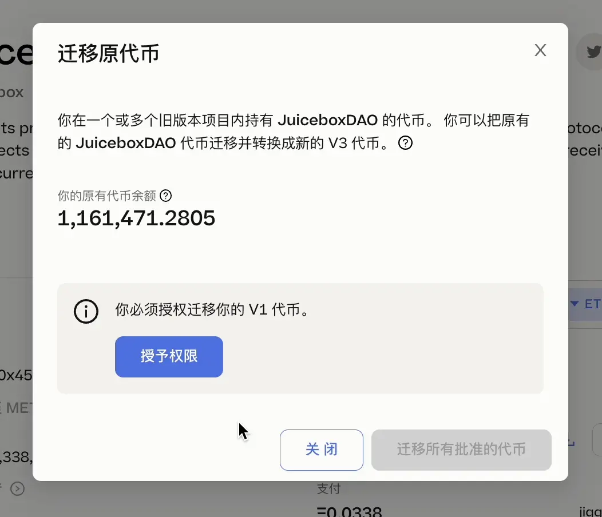
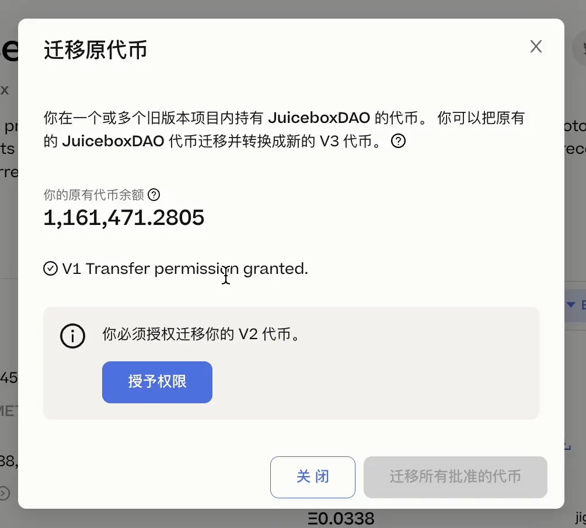
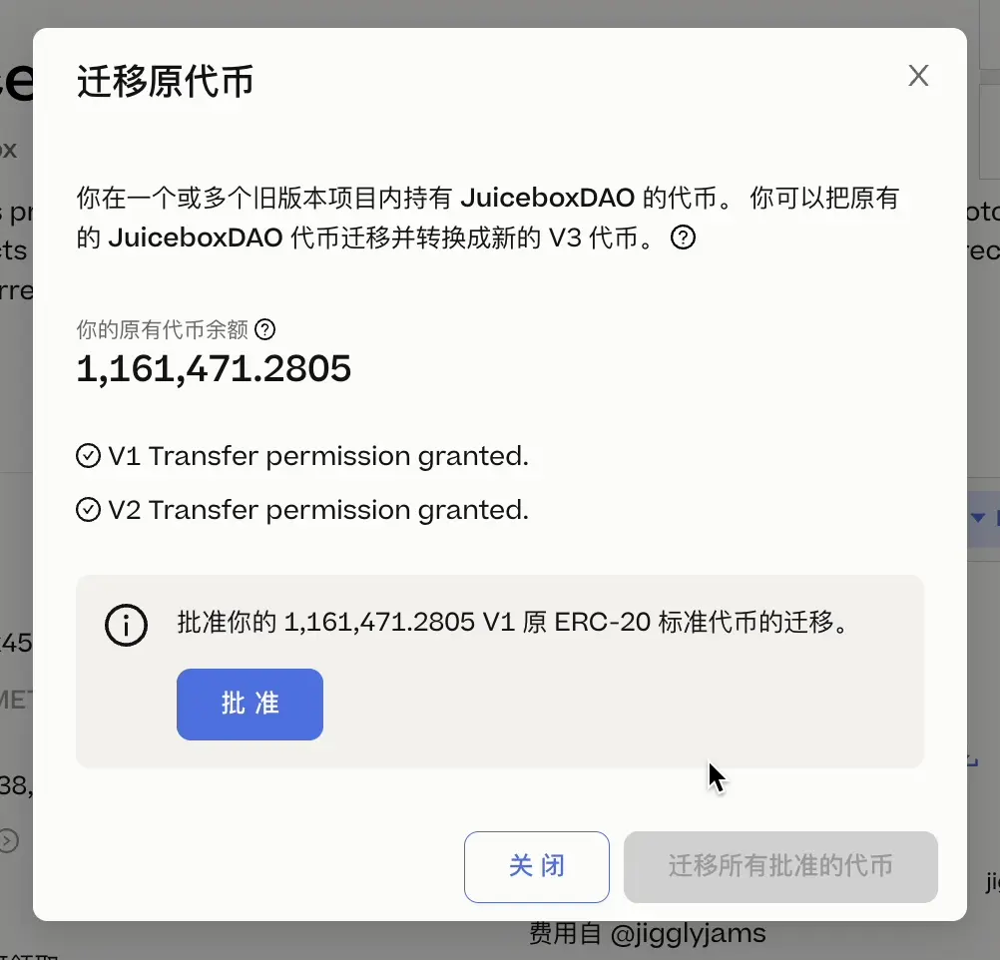
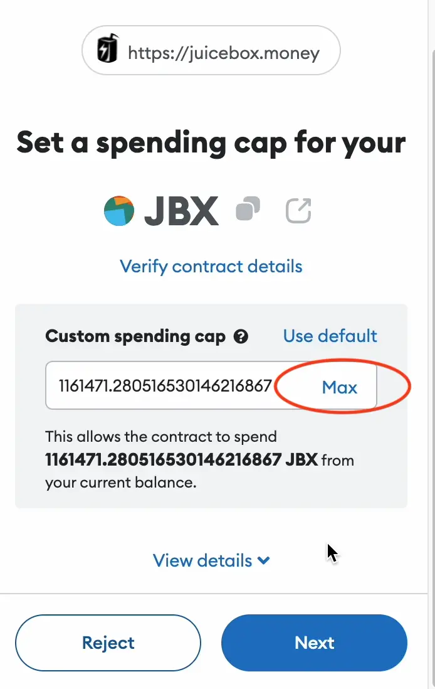
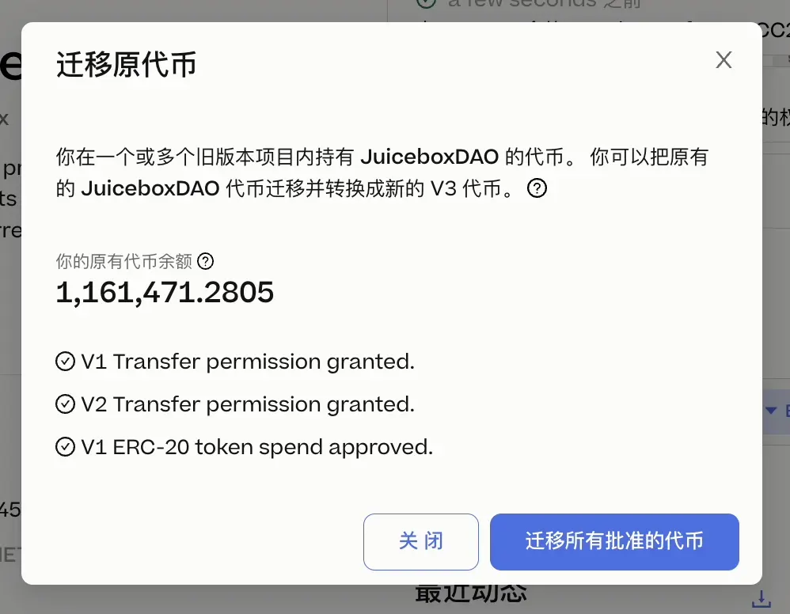
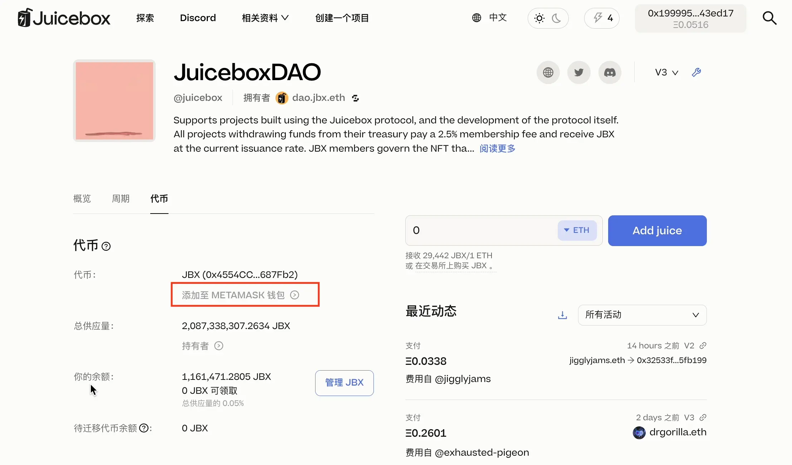

## 背景介绍

目前大家持有的 JBX 代币是 JuiceboxDAO V1 金库的项目代币。Juicebox 协议从最开始的 V1版本，到 V2，再到目前的 V3，经历了几次迭代升级。为了方便管理协议及收取平台费用，JuiceboxDAO 在每个协议版本都创建了 DAO 的项目金库，也就相应有了 V1 JBX、V2 和 V3 JBX 三个代币版本。其中 V1 和 V3 代币都是 ERC-20 标准代币，V2 则由于是过渡性质，并没有签发 ERC-20 标准代币。我们持有的绝大部分都是 V1 JBX 代币。

目前 V3 的版本控制工作已接近尾声，协议经过几次审计之后也渐趋稳定，相比前几个版本也增加了很多功能和提高了安全性。现在我们平台上的新项目已经全部是基于 V3 协议来创建的了。出于协议的日常管理工作的考虑、JuiceboxDAO 治理的需要以及 JBX 代币赎回价值的正确体现，就需要把 V1 JBX 代币和 V2 代币迁移到 V3 JBX 代币。

## 相关链接

JuiceboxDAO V1 项目金库：https://juicebox.money/p/juicebox

JuiceboxDAO V2 项目金库：https://juicebox.money/@juicebox?cv=2

JuiceboxDAO V3 项目金库：https://juicebox.money/@juicebox

旧的 V1 JBX 代币地址：0x3abF2A4f8452cCC2CF7b4C1e4663147600646f66

新的 V3 JBX 代币地址：0x4554CC10898f92D45378b98D6D6c2dD54c687Fb2

## 迁移须知

以下是迁移前一些大概的情况：

1. 可以在语言菜单选择中文，翻译目前基本都同步上了；
2. 会有三至四个交易需要确认（如果你有 V2 代币，会多一个交易），分别是授权迁移、批准使用旧代币和确认迁移；
3. 整个迁移大概耗时五分钟左右。
4. 迁移暂时没有时间限制，可以挑选 gas 比较低的时间或者其他自己合适的时机来操作。
5. 迁移指引的视频中文版也已经完成，不想看文字版本的，请直接去到本页面最下方。

## 迁移步骤

### 1. 操作页面

迁移操作在 JuiceboxDAO 的 V3 项目页面进行：https://juicebox.money/@juicebox.

在右上角的语言菜单栏选择“中文”，并点击连接钱包。

### 2. 代币标签

点击页面红圈处的 `代币` 标签，在最下方可以看到你的待迁移代币总余额。（请注意，如果你持有 V2 的未领取代币，这里会显示你 V1 JBX 和 V2 代币的总数量。） 然后点击 `迁移代币` 。

### 3. 授权迁移 V1 代币

接下来，会弹出一个窗口，提示我们要进行迁移授权，授权 V3 JBX 合约迁移你的 V1 JBX。点击 `授予权限` 并在钱包弹窗确认交易。

### 4. 授权迁移 V2 代币

继续授权 V2 代币，同样是点击 `授予权限` 并在钱包弹窗确认交易。

### 5. 批准使用

授权完成之后，还需要批准 V3 JBX 合约使用你的旧代币。因为迁移其实就是把旧代币发送到新代币合约地址，再由新代币合约相应地发行出来新代币，因此就需要批准新代币合约使用旧代币。点击 “批准”。

设置批准使用的限额，这里可以点击 “Max”，也就是你持有旧代币的最大数量。如果要分批迁移，这里填入具体迁移的数量就可以了。然后点击 “NEXT（下一步）” ，再在下一步点击 “ Approve（批准）”。

### 6. 迁移批准的代币

弹窗会变成这个样子，分别是显示的是 ”授权迁移 V1 代币“、”授权迁移 V2 代币“ 和 ”批准使用 V1 ERC-20 代币“ 都已经完成。然后就是迁移的最后一步，点击 `迁移所有批准的代币`，并在钱包的弹窗确认交易。

### 7. 迁移完成

然后会出现 ”交易进行中“ 的界面，再稍等片刻，弹窗消失回到项目页面。再点击`代币` 标签，可以看到，待迁移代币余额变成 0， 而你的余额中已经正确显示出 V3 JBX 代币的余额。

恭喜你！现在 JBX 代币的迁移工作就完成了。

### 8. 其他

你现在点击上图的红框处 ” 添加至 METAMASK 钱包“ 把 V3 JBX 的合约地址添加到 Metamask 钱包，这样在钱包内就可以正常显示我们的代币余额了。

JBX 代币迁移流程的中文视频：

<iframe width="560" height="315" src="https://www.youtube.com/embed/lYZPzrmNEWk" title="YouTube video player" frameborder="0" allow="accelerometer; autoplay; clipboard-write; encrypted-media; gyroscope; picture-in-picture; web-share" allowfullscreen></iframe>