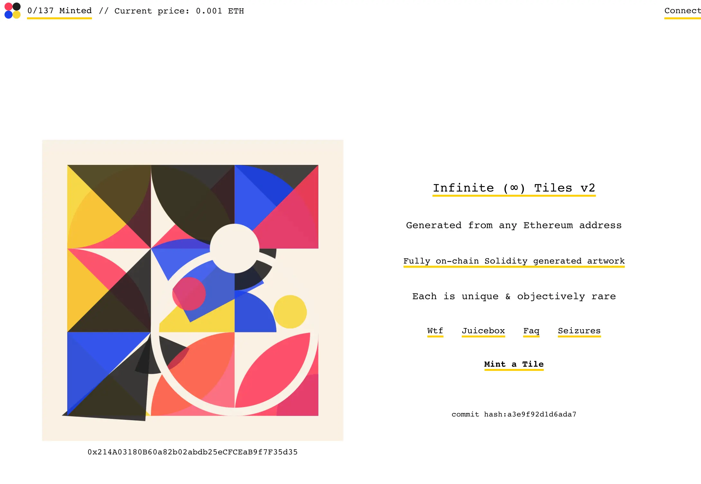

## StudioDAO updates with @kenbot

**kenbot**: How can the audience finances the movies they want to watch? How can we really put the audience in charge?

StudioDAO is defining in a different way what a DAO can be.

### Problems in the traditional filmmaking industry

The traditional financing for filmmaking is more or less like this:

1. you go and sell the movie to investors,
2. investors take the equity, the rights to distribute the film,
3. investors make 120% on their money and get 50% of everything that the film makes after that.
4. This is not so great for filmmakers.

The problems that we're think about is:

- Why is financing a film so hard?
- Can we make this easier, simpler, more fluid?

The current difficulties are:

- Filmmaking is a risky market, people are afraid of risk;
- It's hard to invest in this industry;
- Film distribution is a mess;
- Movie theaters are a mess.

These above problems have contricted the people who can actually buy films or TV shows to big streaming companies, which is not great because there're only limited buyers in the market, and will lead to:

- Filmmakers are not in control of what they're making;
- Fans essentially become bag holders that are just getting dumped on at the end of the process instead of actually being at the beginning of it.

### The solution of StudioDAO

The solution of StudioDAO to these problems and the way it should be at some point in the future, is to turn itself into a new kind of social network that solves the problem of financing premium contents.

- Members pay to join the DAO;
- Members get to green-light the films;
- Members get to be on the inside of this process.

So this is going to create unprecedented freedom and opportunities for filmmakers and fans. It's a new voice at the table in terms of how things get made and a more direct relationship with all the talent they might care about.

The way that this business works right now and what StudioDAO can do in the future, can be really harmonizing. StudioDAO is going to build a system where we can partner flexibly with projects, whether they're just starting or they're finishing and just need a littile more money to get over to their green light.

The relationship between the community and the filmmakers, no matter where the filmmakers might sell the films, to Netflix or to theaters, the community participates in that and gets 30% of the revenue that the film generates downstream. So the community is not just green-lighting movies for their own consumption and enjoyment, they are essentially building the films into a part of the bigger community of StudioDAO.

By this way, it basically leads us to 3 different ways to finance:

- Sales of the retail NFTs;
- A community wallet that we're going to be funding at the beginning;
- Revenues from previous projects.

### The film financing fund

When we think about how the business works here in terms of the traditional piece, there's a way for us to actually create a more traditional fund that wants to play nicely with the rest of what we're creating.

You can imagine, if you had a US$5,000,000 film and you can sell $1,000,000 worth of NFTs, that should be a really good signal to people who want to put other money into the project, because it's appealing and there's people who are behind it. So we're trying to create leverage beyond where the retail market is for NFT's right now, because it's still early and the market is small.

There's a 2 trillion dollar entertainment market out there, we think that there's a clear scenario for decentralized studio that can do a billion dollars of production per year in three to four years from now. we're actually talking with some of the people who funded Kickstarter at the beginning and they shared that Kickstarter actually funded 500 million dollars worth of films in the 10 years that they've been in business. We all agreed that with Kickstarter not being focused on films and not having the benefits of everything that on-chain applications might be able to give us, I think we can shoot for 10x that in the next 10 years. Our target is five billion dollars over the next 10 years worth of films and content.

### Legal struture of StudioDAO

*Disclaimer: This is not legal advice, I'm not a lawyer. This is what we're doing, but I don't guarantee that they won't get you in trouble if you do the same thing.*

We have 3 legal entities in the US, two of them are Delaware LLCs and one of them is an Unincoroporated Nonprofit Association(UNA) in Nevada.

The StudioDAO UNA is the nonprofit that will become the million-people-green-light committee. This is the true DAO of StudioDAO, the membership of the community. It's the committee that is picking films, working on financing of films, managing the green-light fund and voting in the governance over the protocol. It's also the recipient of 30% of the participation of the contracts that we are sourcing for the UNA right now and we're sort of creating a legal structure to do that.

StudioDAO Genesis is the legal entity that belongs to StudioDAO UNA so that it can have certain kinds of bank accounts that UNA may not be able to have on their own.

The StudioDAO Backlot is a for-profit services company, it mirrors sort of the structure of Uniswap, in terms of Uniswap Labs, and then the protocol being a separate piece. Obviously we're completely different in almost every other direction, but the process of where you do the product development(the StudioDAO UNA), how do you do the things that have to happen in the real world (the StudioDAO Backlot), is how we're splitting at.

### Projects on Juicebox

1. The StudioDAO Backlot.

For the Backlot, the token issuance is 1,000,000 / ETH, while 700,000 goes to the contributor, and 300,000 is reserved for the projects owner.

2. The Unlikely Love Stories:

This is a real project, and it will probably be the first juice box that goes live when we're ready to go.

The issuance rate is 840,000 tokens / ETH with 50% reserved rate, so contributors will get 420,000 token per ETH.

The funds distribution will be 90/10, 90% of the funds will go to the project itself, and 10% will go to the StudioDAO Backlot juice box and generate more green-light power tokens that go back to the filmmaker in exchange for a 10% fee.

The tokens distribution will be 50% for filmmaker, 40% for the UNA and 10% for the Backlot.

3. The other two projects are all for educational purposes.

## Juice newsletter

**matthewbrooks**: So this is a really quick preview of the newsletter.

- Recap by @0xSTVG,
- Governance cycle recap by @matthewbrooks,
- Podcast episode by @matthewbrooks and @brileigh (if there's a new one),
- Tutorials by @nicholas or @filipv or someone else (if there's a new one),
- Recent articles on the blog,
- Town Hall recap by @zhape,
- Some links at the bottom.

So yeah, that's pretty much simple. It's just an easy way to recap everything happening on the content side and also giving everyone a chance to catch up with the basic goings-on. It's just to keep everyone informed and to also repurpose the content that we're making so that we can get more people to see it and hopefully get a better engagement with the content that we're making.

**brileigh**: Shout at @nicholas for all the feedback as well as @Felixander and @Sage for all the help for putting this together. And just echo as @Matthewbrooks said, a quick easy way to figure out everything that's going on within Juicebox without having to do the manual work to pull all the information together.

**nicholas**: I think this is gonna be great for getting better distribution or increasing distribution of stuff we're already producing, because I think a lot of people are consuming the Juicebox content that several members of the DAO are producing via Twitter and Discord. But to try to reach people who maybe  not on Twitter or not in the Discord regularly, you can imagine, if there was a newsletter sign-up link on the website during ConstitutionDAO or AssangeDAO periods, some number of the people who participated in those fundraisings might have stuck around for the newsletter. So I think a newsletter is a really good experiment to see if it engages people. I really love what you did with the layout and everything, it looks great.

## Legal stuff with @filipv

**filipv**: I can give a brief update on some of the legal stuff that I've been working on with @tankbottoms.

In short, we set up some structures for MovementDAO, PeaceDAO and a few other entities that are building things related to the Juicebox protocol.

We created a number of structures that are similar to what StudioDAO did. We have two different Unincorporated Nonprofit Associations(UNA), one in Delaware and one in Nevada, as well as a few LLCs in Delaware and Washington for different intellectual property. We also put together a number of intellectual property agreements and things like that.

For the short term, we're just using these for these DAOs. If you want to check out these documents you can find where they are now on this website [gov.move.xyz](https://gov.move.xyz/).

But what we're working at is templatizing a lot of the things for common use cases for Juicebox projects, and then letting people put in metadata about their projects and then having it spit out nice looking PDFs. There's like a lot of interesting stuff in here if you're interested in this sort of thing that we're hoping to to roll out to more people pretty soon.

## Tiles.wtf by @filipv and @peri

**filipv**: I also want to do an update on [Tiles.wtf](tiles.wtf)

For those of you who didn't see it, it's a rewrite of [tiles.art](https://tiles.art/#/) but completely on-chain, so the algorithm to render the Tiles is completely in Solidity. The website is written in Svelte which is super cool because it lets people compile the components and use it with different frameworks if they'd like to. It's also a little bit more portable, so you could imagine someone setting up an npm package using different components or something else.

This website has NFT minting and mint pages as well as a fully featured Juicebox treasury, it doesn't have configuration yet. So you still need to configure on juicebox.money or another website, but for people who come here to contribute to the project, it's all working on this website. This is all open source and available [on GitHub](https://github.com/tankbottoms/tiles-wtf-gallery).

**peri**: I can talk on the Tiles project for a second. Tiles is an NFT art project that I put out about a year ago. It was actually launched on day 1 of Juicebox lifetime, it was Juicebox project No.2, next to JuiceboxDAO. The artwork is rendered using a server, so you can basically buy these NFTs but their artwork is rendered off-chain, which is not as cool as rendering artwork on-chain.

A few months ago @tankbottoms came in and decided to try putting the artwork on chain, and he did. It's amazing amount of work that he did to get that working. I don't even know why he wanted to, he just did. So big shout out to @tankbottoms, I wish he was here now.

And @tankbottoms went ahead and deployed a new V2 of the Tiles NFT contract a couple days ago. So it's live now at the Tiles.wtf website. There's still some things that are up in the air right now. The main thing that I'm concerned about is that I really want everybody who has the original V1 Tiles tokens can get the same Tiles. Tiles are denoted by a wallet address, a 40 character hexadecimal string. I basically want to make sure that everybody can get the same matching Tiles, and the V2 token that they have for their V1 token. There's a chance that the contract will get redeployed to make sure that we can settle those balances, airdrop tokens to people or make them claimable as needed. So there'll probably be somemore updates coming in the next few days, @tankbottoms and I are chatting on some of that stuff.

**filipv**: There's a seizing functionality on Tiles.wtf, so someone mints the Tile that corresponds to your wallet, you can mint that Tile and take it from them. And the same is true for the V1 TILE token. If you own a V1 TILE and someone mints a TILE with the same address, you can mint that TILE and claim it from them, for free. @tankbottoms and @peri are thinking about a new price revolver for the contract, so there might be a new contract soon. Maybe chill out for a few days before minting.

**peri**: Yeah, I would say hold off on minting any Tiles in the website for now.

**filipv**: One last thing, the Tiles.wtf repo has a new license on it which basically says that people can only use it if they're pointing revenues at a Juicebox project. It's a little experimental license, but we're trying out some funky stuff to make licenses for a code to do interesting things.

## Protocol data by @twodam

### Dune dashboard update

**twodam**: Here is the [main dashboard](https://dune.com/twodam/Juicebox-Protocol-Overview) for the Juicebox protocol.

If you scroll down a little bit, you can see the section called `period` so you can select different periods.

After you select the period, scroll back up and click `apply all parameters`, and all the stats will refresh using this new period.

Basically we are using the page to do the weekly reporting,  so you can see there is a value `new projects` and `active projects` in this period.

There is the trending projects:

You can see many links in blue, if you click the `See more`, it will take you to the related dashboard of that project, with the overview data, like how much total raise, how many tokens and how many token holders in that project.

And on the right bottom of that project page, there's a small logbook where you can see all the actions taken by people there and all the payment Memos if there is any. And you can click all the links, they will take you to the relevant Etherscan pages of those transactions.

**Zeugh**: What's the meaning of Fully Diluted Valuation here?

**twodam**: It's the value that equals to total token supply multiplied by market price.

**nicholas**: By market price, do you mean AMM price or which price?

**twodam**: If they have an AMM price then it will be used, if not, redemption price on Juicebox protocol will be used instead.

And back to the protocol overview payge, there is this `All users`

If you click the `See more` after an ENS/Address, it will take you to the dedicated page of that person/address. Let's take @jango's as an example:

**jango**: Man, I feel this is full-fledged superpowered graph interface for projects. I wonder if we need to build a documentation on how to navigate this into the [info site](docs.juicebox.money) or Juicebox High or something? maybe in a more tucked away Data section or something?

**twodam**: Yes! I would love to.

One more thing, if you scroll down to the bottom of the [protocol overview dashboard](https://dune.com/twodam/Juicebox-Protocol-Overview), you can see the the current trend of the ETH in the whole protocol.

**Twodam's complete Dune dashboards are [here](https://dune.com/twodam).**

### Juicetool update

**nicholas**: Can we also look at [Juicetool](https://juicetool.xyz/)?

**twodam**: On the front page, we click the Snapshot Plus at the bottom, we can go to the voting info page. In the middle of this page you can see the `Status`. That's where you can filter by `active`, `Haven't voted`, or `Under quorum`.

**jango**: @twodam, the frontend chops are fantastic, this is looking great. You've been constrained by the Dune UI just writing queries, and now actually refactoring the interface elements is a huge unlock, this looks fantastic.

**twodam**: Thank you, I'm still learning.

On the bottom left of each block, you can see the "jump to" symbol, which is basically the place you can click and do a quick jump to that specific Snapshot page from here. 

**jango**: We need to figure out how to make sure that people starting their projects know this is here, and that they feel good about it. It's obviously useful, but I think most projects starting up need to orient governance around and all the things. What a luxury.

**nicholas**: You can vote from within this interface also.

**Zeugh**: Oh and it shows a green `active` if there is a proposal up. 

**nicholas**:So to clarify, is that the list of spaces to which you are eligible to vote that you have voting tokens?

**Zeugh**: No, to which I joined. The ones I really enjoyed. I can't vote on Gitcoin, but I follow it to see what's going on, so I get to see it.

**twodam**: If you hover above `active`, you can see how many time left for you to vote. And if you have voted for this proposal, you can hover above `voted`, It will show which option you have voted.

**nicholas**: There's a feature for whether proposals are have met quorum yet or not, next to where  `closed`. If there were active ones, you can sort, for instance, by `haven't voted` which means that the connected wallet has not yet voted on, and add `Under quorum` to see all the proposals that you have not voted on and they have not met quorum yet.

So I think if we zoom out a little bit, like this Juicetool plus what @jigglyjams is doing with Nance and some other initiatives altogether are like a suite of tools. Also think of the on-chaining stuff that we use for multisig. These are like a suite of tools that all the projects on Juicebox probably gonna need, given at least the most popular configuration for multisig, snapshot, DAOs. So I think this kind of stuff would be great in Juicebox High on how to set up. Possibly also build a version of Juicetool that the people down the road could deploy specifically for their project, so it has a dedicated URL and only covers their DAO's needs. It's really cool to see you do this. @twodam, when did you start doing front-end dev? When is your first line of HTML?

**twodam**: Oh. Maybe a month ago.

**jango**: The user experience of tying all these tools together, making it easy and obvious for people, giving them the understanding of standard and safe tools that should be used, it's fun to figure that out once all the pieces are in place and work our way to something more optimal over time. But you can just pass around links and they are hosted in all kinds of places for now, it's a good start and so useful, especially for weekly multisig stuff all the way through.

**JohnnyD**: Yeah, definitely came to figure out how we can to streamline this and connect them all together, so if someone new to start a project, they can have access to all these tools in a seamless environment. But yeah, as you said, it's gonna be interesting to figure out the users experience side of that.

**jigglyjams**: Yeah, totally. That's been on my mind lately, too. I could imagine, as long as we're still relying on Snapshot, in the project creation UI, you could just check a box and create a snapshot space, and we could send a transaction to create that. Along with that, we can add Nance instance once it's at that level. I'm working on submitting transactions for @twodam's Gnosis Safe payout changes. I want to work with @twodam to have Juicetool be the frontend. if possible. I can see that being really beautiful. It looks amazing, @twodam. It's been super cool. I watch you develop it and excited to see more.

## The One Hundred Thousand Million Contest by @Zeugh

Yesterday there was a Hundred Thousand Million project of sustainable City based in DAO structure in Chile in Latin America, reached out to me to do a partnership with Juicebox.

They're trying to get attention of nice projects around web3. Because they're building a city and they think that building a city of the future is supposed to have creative people creating awesome stuff and they see Juicebox as one of those spaces, so they wanted to do a contest for giving a prize for a Juicebox project. They reached out to me to help organize that and we put out [a JokeDAO contest](https://www.jokedao.io/contest/polygon/0xbDe2bca1AC56640C69514DA86e55ce0Eb75968EF) which is going to start tomorrow，giving out 1 ETH to a Juicebox project that gets more votes. They're opening the contest tomorrow. Everyone is welcome to submit a Juicebox project and go to [their Discord server](https://t.co/Oi0PiA9p6B) to get tokens to vote.

## Two truths and a lie by @Felixander

The correct answer is ... Zom_Bae
The lie is the one about an albino rat.

