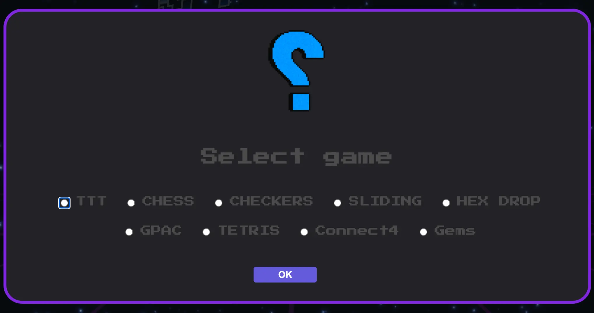
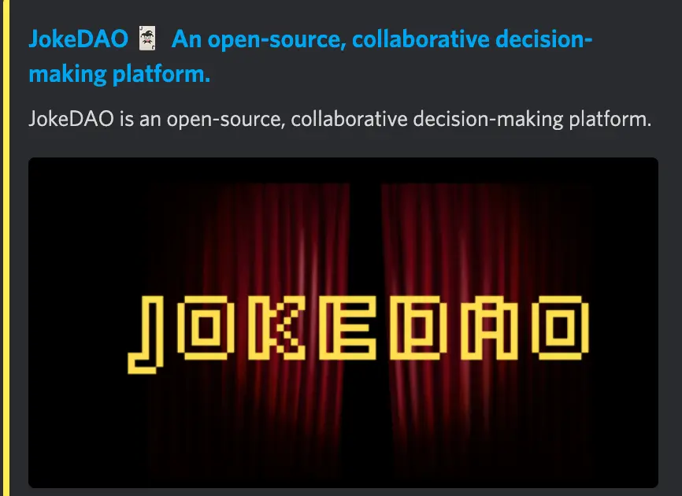
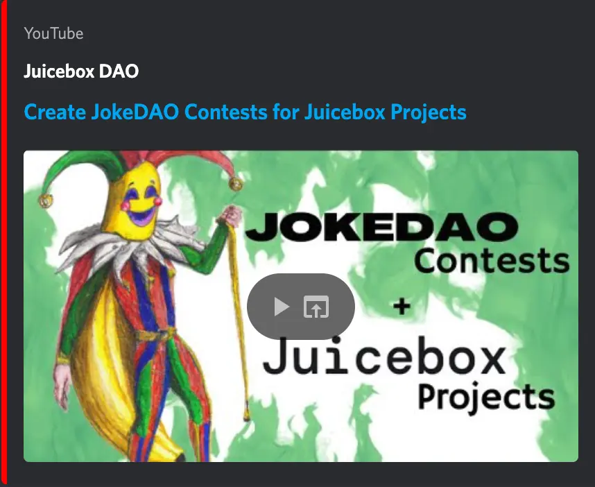
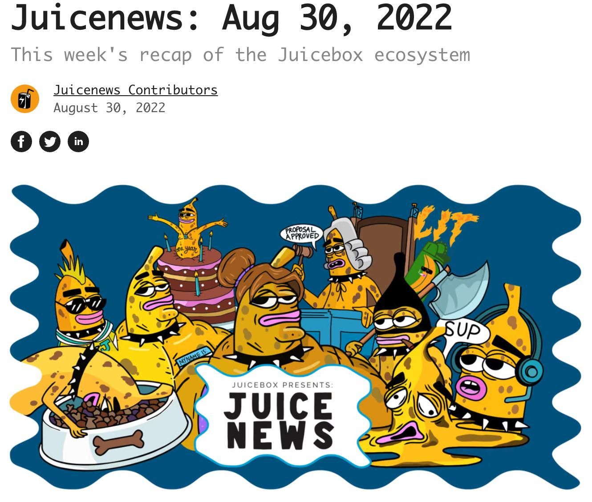
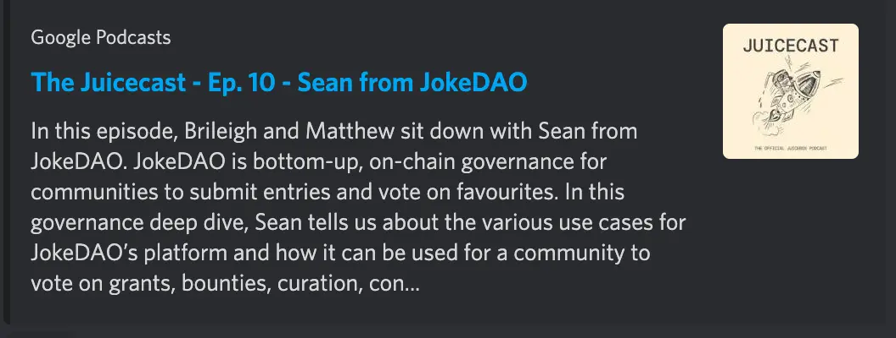
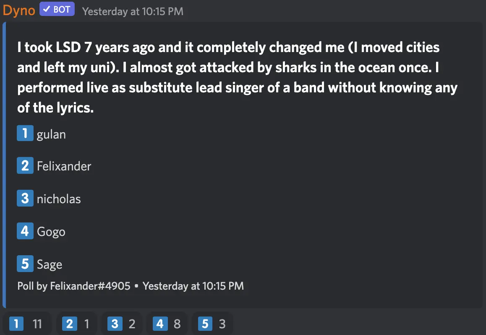

Art by [Sage Kellyn](https://twitter.com/SageKellyn)

## Business dev with @0xSTVG

0xSTVG has been actively reaching out to some blockchain and web3 clubs at universities. The responses were quite warm, and they have been setting up talks with Juicebox, as well as having some in-person presentations and possible hackathons.

He plans to submit some proposals in the upcoming months, trying to help onboarding students and web3 enthusiasts in colleges and universities. He is gearing some of his efforts towards recruiting those types of builders.

## Gplay studios with @Sayid

@Sayid came to the Town Hall 3 weeks ago, did a demo with some preliminary designs of his platform. He founded this P2E(Play To Earn) arcade platform called [Gplay Studios](https://gplaystudios.live/) where uses can make profit by staking $Matic and wagering against each other in classical games on Polygon.

Except for the Tic-Tac-Toe he showed last time, recently he has added another 9 games to the platform.

New features developed:
- Game invitation link, which can automatically connect the person to a game someone else created,
- Rematch function, which player can use to request a reset of game and changing the opponent

The Discord server of Gplay is [here](https://discord.gg/yBcrh3HnaQ), anyone who is interested in his project can join and have fun over there. @Sayid also said he would be hosting some gaming nights once all the bugs were fixed.

## Nance Funding cycle configuration demo with @jigglyjams

@jigglyjams did a demo on how he runs the Nance script to query from a Notion database of payouts and use those data to submit a Gnosis transaction to reconfigure the parameters of a new funding cycle.

His next step is to query payout addresses and payout amounts from proposals that have been approved and get them merged into those databases for reconfiguration of funding cycles.

Also he is going to work with @twodam to set up a frontend to configure Nance the Gov Bot in a [Juicetool](juicetool.xyz) page. But he's also a bit concerned about where to store all the configs of Nance at this stage.

## Banny drawing contest on JokeDAO with @nicholas

@nicholas was hosting a [Banny drawing contest](https://www.jokedao.io/contest/polygon/0x5165B4a0b7A49601Ec588196B5c83D04E70E58B2) using the JokeDAO voting machenism, in order to help showcasing the JokeDAO V2 new feature of uploading images as contest submissions. Everyone could submit a Banny/Bannyverse drawing in a submission period for others to vote, and the voting would be open once the preset submission period was up.

@nicholas minted the voting tokens and distributed them by airdropping to whoever has taken part in the JuiceboxDAO governance voting on [Snapshot](https://snapshot.org/#/jbdao.eth) before. People receiving this token can vote for whatever images they like, and the image that gets highest votes win the contest.

And @nicholas also made a tutorial about how to create JokeDAO contests for Juicebox projects, which can be found [here.](https://www.youtube.com/watch?v=KIL8MpcqpVY)

The winner of this contest was @brileigh, and the image that got the highest votes is:

Another upcoming new feature that JokeDAO will be developing, which is also funded by JuiceboxDAO, is the executable contest, in which projects can signify winning conditions so that the winner can be executed on-chain after the contest.

@filipv suggested that JokeDAO can also set up some thresholds, such as top 3 or top 4 in the contests win. This can be useful in application scenarios such as different prizes to Top X winners, or Top X winners get to be  qualified as a member of a multisig, etc.

And @seanmc also said that they're talking with IPFS about image uploads within the website, which will be an amazing integration to it if implemented.

## PeelDAO updates with @Aeolian

PeelDAO recently onboarded 2 very awesome designers, @Strath and @Lawrence, respectively working on the redesign of the project creation UX and an update to the homepage. Hopefully these two efforts will reduce our currently high bounce rate for the website.

And other big frontend projects underway are:
- NFT rewards, this is already on Rinkeby so people can play with it already.
- Settings page, which @Jmill is currently working on and hopefully will be ready by the end of this week.
- Versioning, a strategy to manage multiple versions on the frontend.

Some features that have been shipped:
- CSV imports for payouts;
- CSV exports for payouts and reserved tokens;
- Juice SDK, which is a toolkit that makes it easier for people to set up frontends on Juicebox protocol.

Also they have been finetuning a lot of dev performance security work, running through all the dependencies and upgrading them.

One thing they are planning to implement is the Twitter verification, currently people can put anyone's Twitter into their Juicebox projects.

## Juicenews newsletter new release and Juicecast new episode by @matthewbrooks and @brileigh

A new release of the [Juicenews newletters on Aug. 30.](https://juicenews.beehiiv.com/p/juicenews-aug-30)

And a [new episode of Juicecast](https://podcasts.google.com/feed/aHR0cHM6Ly9hbmNob3IuZm0vcy83OGQ1ZDlhMC9wb2RjYXN0L3Jzcw/episode/YmRmMDFlYmItNDg5NC00MjNjLWExMzctMTJmMDM0ZDEzYzdi?sa=X&ved=0CAUQkfYCahcKEwiYvrT3je_5AhUAAAAAHQAAAAAQAQ) featuring @seanmc of JokeDAO. And @matthewbrooks urged us to at the very least listen to the first 10mins, which should be very great!

## Two truths and a lie with @Felixander

The correct answer is @Gogo, and he's a great story teller, try to tune in to his story of being surrounded by "Shark DAO" in Australia at 35'37" of the [Town Hall recording](https://www.notion.so/juicebox/FC-29-Town-Hall-A-1fc041a5539d4d7ca79072ad599b81dc).
