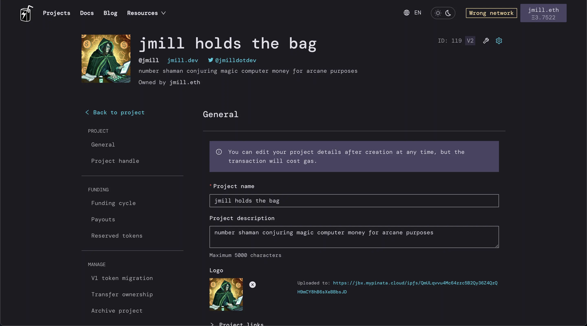
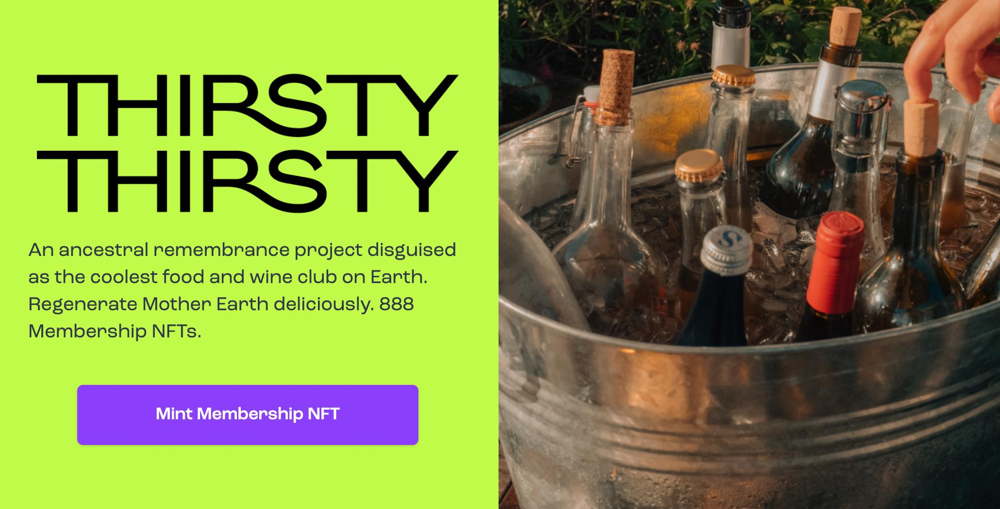
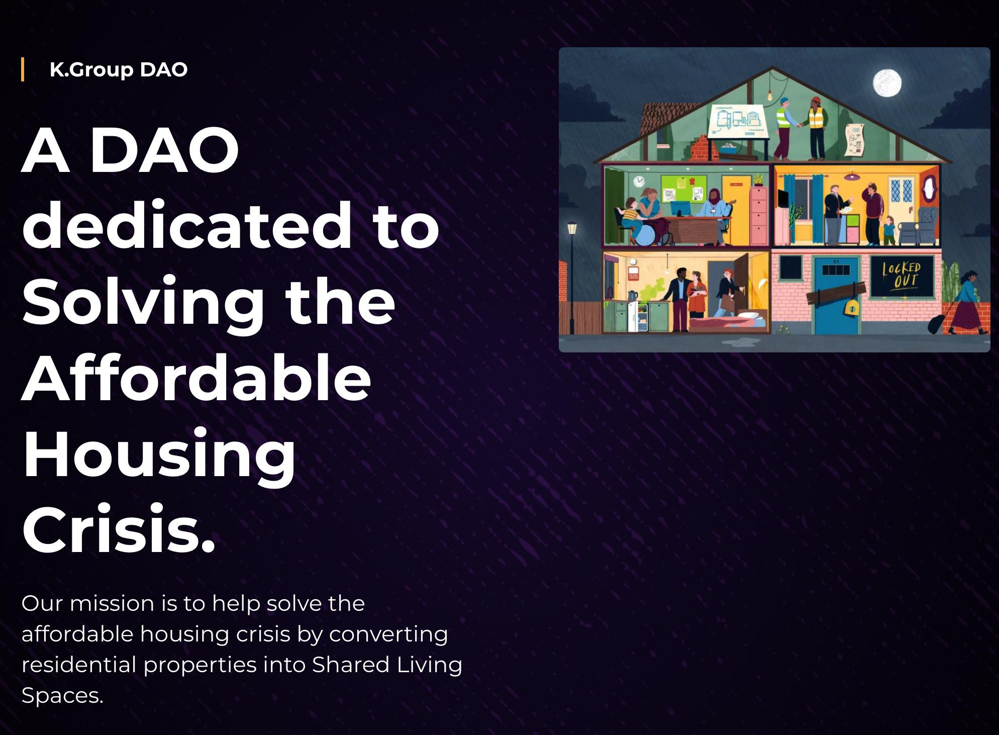
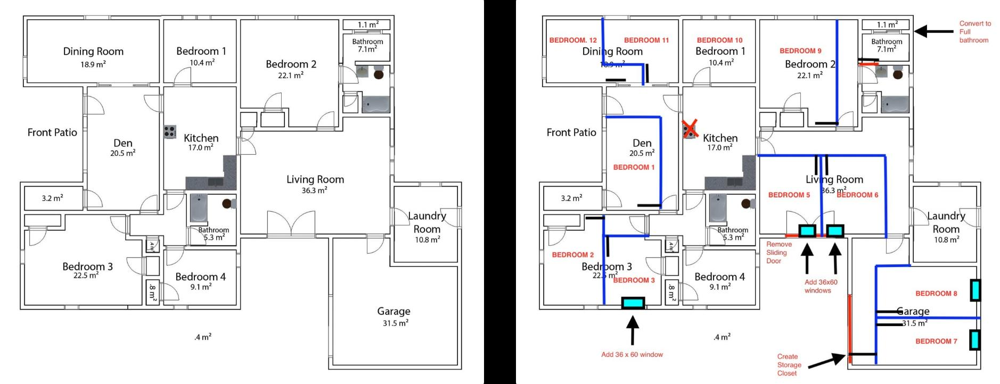
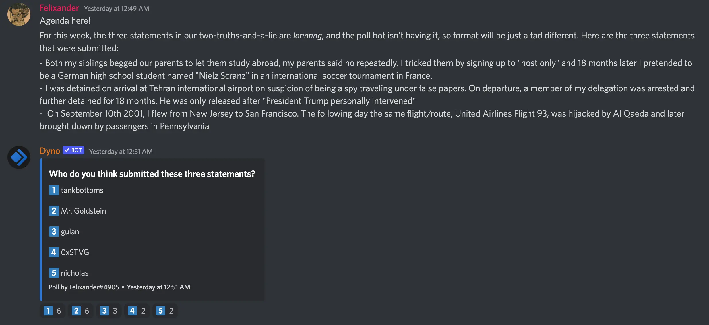
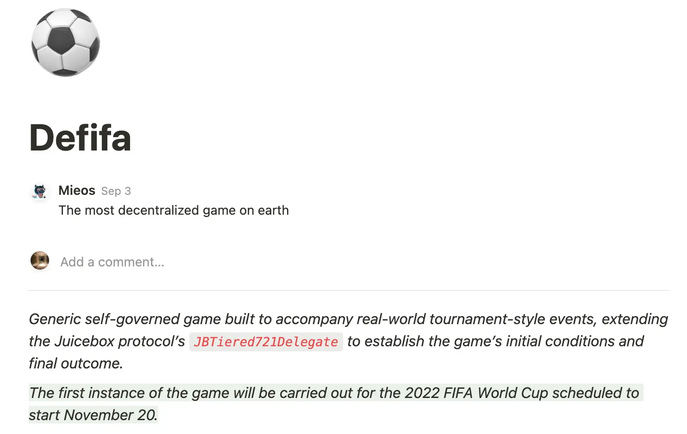

Art by [Sage Kellyn](https://twitter.com/SageKellyn)

## Versioning with @jango

This versioning project is a prerequisite for almost all the other protocol things, and mostly everything of it is complete now.

After the Code4rena auditing contest, there're a few changes need to be made to the protocol to ensure the protocol's risk aversion and longevity. Jango is leading the work now instead of waiting and patching problems that might rise later. A lot of the changes don't really affect the V2 features set, and everything is pretty much finalized at this moment.

The next step is to run another Code4rena contest on the updated repo. Jango is trying to get a mitigation review for the past Code4rena audit, which is to check the changes to the codes from the results of that audit, hopefully by same group of wardens from Code4rena.

The Juicebox projects contract won't be changed. This version won't be a requirement for all existing projects, which mostly won't ever run into some of the inefficiencies discovered. But new projects going to be build will use this new version.

Frontend has deployed a new settings page, a revamped and powerful settings page for Juicebox projects in the juicebox.money site last week, we'll leverage that to give project owners some confidence over how they're managing their treasuries across versions.

In our chats, we're calling this contracts update V3 but it shouldn't be taken as another major version as V2 was to V1.

@nicholas has been exploring, with as @trebien our main contact to Code4rena, a longer term cooperation with them, by which we can get preferable rates and more flexible contests.

Nicholas has put up a proposal for a larger budget for six months or a year for Code4rena contests, if passed, we can do many smaller contests as necessary for things like the NFT Rewards or small updates to the protocol.

The draft of this proposal can be found [here](https://juicebox.notion.site/Allocate-500k-to-Long-Term-Code4Rena-Auditing-Budget-9a37e3e7ec3c4a309c997284efe060fc), and the Discord discussion happens [here](https://discord.com/channels/775859454780244028/1012540289774268416).

NFT Rewards might also be rolled out at the same time, unless the community insists on having it go through Code4rena as well. The NFT Rewards is something that the devs can propose new ones at any time and projects can use updated version for their subsequent funding cycles.

### Immunefi bug bounty

@filipv wondered if we have a timeline for the Immunefi auditing and testing for the updated contracts. @jango thinks the Immunefi is less about auditing and testing, but more about bounties for hackers to choose to report vulnerabilities instead of exploiting them. He thinks what we offer most projects to build using Juicebox is the infrastructure as a service with the security model coming with it, but as the protocol grows and our day-to-day operations decreases, there might be a need to designate someone as an insurance mechanism.

@nicholas explained that the proposal we approved before to create a $100,000 Immunefi bounty has expired, for the reason of not implementing it within the contraints of that proposal which had a deadline. He also thinks we might consider change a service provider other than Immunefi, because they charge a 10% fee even though we are the one to custody the funds and triage the bug reports and payouts. He also suggested that the timing for a possible bug bounty should be after the mitigation review and deployment of the updated contracts to Mainnet, for we might need to make any bugs outstanding out of scope thereafter.

## Devcon programming with @bruxa and ThirstyThirsty

"Thirsty Thirsty is an ancestral remembrance project disguised as the coolest food and wine club on Earth. "

@bruxa is the founder of Thirsty Thirsty DAO, this community has been in existing since 2014 and set foot into Web3 in November 2021. They are a community of food and natural wine lovers, enthusiasts, experts and Earth stewards focusing on the cultural restoration and ancestral agricultural practices which they see as a really critical component to mitigate climate crisis.

Last week, @jango talked with @bruxa, @Zom_Bae and a few other folks about how we could partner with other communities who already have a leg up on creating events and bringing people together, and how we actually could partner from a funding perspective to do things like during the Devcon Bogota.

Oct. 10th, during the Devcon week (Oct.7-16) in Bogota, will be the indigeous people's day of the Thirsty Thirsty community, @jango and @bruxa are having the idea of creating an event that's Dev focused and bringing people together in an open-ended forum just similar to how JuiceboxDAO did on NFT NYC where people can come together and share ideas and be inspired by whatever happens. Also projects running on Juicebox or leveraging Juicebox can use this space to create a space for their own community to come together, while the JuiceboxDAO can partner with Thirsty Thirsty to provide food and dirnks to accompany this event.

### Thirsty Thirsty NFT membership

The Thirsty Thirsty is a 501(c)(3) entity that can accpet crypto donations.

Currently Thirsty Thirsty has their own membership NFT minting, with which on one hand they are trying to bring people together to experience the power of nature through food and wine in the cities and land, on the other to empower and share what this tooling is with their community some of which have been left out of financial sovereignty.

They're pretty interested in how Web3 tooling can help remedy a lot of issues with the labor chain and create equity in their communities all along.

They're also very excited to play with some smaller limited edition airdrops through Juicebox as a fundraising mechanism, especially tethered to some event that they're planning.

## K.Group DAO with @Jermaine.A

[K.Group DAO](https://kgroupdao.finance/) is an affordable housing DAO, they have a unique solution to solving a housing shortage and trying to combat the affordable housing crisis in the U.S.

### Solutions to housing for low-income

The house below is an actual one in Houston, Texas, which was 4 bedroom house origially (left), and they converted it into a 12 bedroom one and added another bathroom. By this moment, there are 12 people staying there already.

You can also take a look at what the house is and its renovation by scrolling down to the bottom of their homepage and explore their first home.

What they are doing right now for this solution to house low-income individuals are:

- rents are between $650(small room) and $800(large room)
- all the rooms come fully furnished
- free internet, free laundry and all the utilities taken care of
- no first month's and last month's rent and no security deposit
- leases are on monthly basis so tenants can move if they wish

@Jermaine also said this housing model could be used for anything anywhere in the world, for the conversion that was done is just unversal.

### Goals of the DAO

The reason why they set up a DAO is that they think the DAO will be better to upsolve this housing issue with affordable housing.

When it comes to the project token $KDAO, they try to keep it as simple as possible, just strictly a governance token. Decisions to purchase any house or pull equities back into the project treasury will need to follow a governance procedure and be voted on with governance tokens.

They are an LLC entity licensed in Wyoming, so they can purchase physical assets and have bank accounts, etc.

The governance of this DAO will not only be about real estate, it might include the following according to @Jermaine:
- house purchasing
- renovaton
- marketing (local churches, community centers, online housing platforms)
- management
- maintenance

Eventually they want to create an online platform to where those rooms are listed and anyone can access them anywhere in the world.

Their ultimate goal is to house at least 10,000 migrant families within 2 years, and be the first DAO to sign a government contract as a contractor for Department of Homeland Security to help and house people.

## Two truths and a lie with @Felixander

The correct answer is @gulan

## Defifa with @jango

With the World Cup Qatar 2022 upcoming in November this year, and being one of the first global events after Covid, @jango thinks this could be a meme shilling point in some way. And he landed on a mechanism, a self-governed game system, facilitating the incoming NFT Rewards and the NFT voting system. (If you are interested in this project, you can read the Defifa specs [here](https://www.notion.so/juicebox/Defifa-8644f449958e4d9bb632cb5a46708fb6), and join the discussion in this [Discord thread](https://discord.com/channels/775859454780244028/1012501341626699896))

Essentially it'll be a bit hard to really wrap your head around it, unless you really know how the NFT Rewards system works and how it can be extended to support this. A surface perspective the community understands the NFT Rewards contract is just 3 NFT tiers that project owners can put up on the juicebox.money site, and the price thresholds that contributions need to cross so as to get the NFTs minted to contributors' wallets. That's very much the basic case of this contract.

But this contract can do a lot more.

### A winner-takes-all scenario as an example

Imagine like two weeks prior to the first day of World Cup, November 20th, someone deploys a treasury that doesn't have an owner. He can preprogram the rules upfront and the game will play itself out and end in a certain date. There is no funds in the treasury to start out, and there's zero tokens minted.

There will be 32 NFT tiers representing each of the teams in the competiton. It's a open mint, so anybody can mint any number of any of the tiers.

After two weeks when the first game starts out, minting will be closed. So everyone has their NFTs, which are all transferable and regular type of NFTs.

Let's say, we have 100 Brazil's NFTs minted and 10 Japan's minted, which will give you a sense of people's confidence of which team is going to win the competition. Now we have these outstanding NFT tokens and a loaded treasury which is the funds of the game.

At the end of the game, let's say Japan wins the competition, there'll be a self-governing process to submit a scorecard on the contract. Then all the NFT holders attest to the scorecard which they deem is correct, via a mechanism that will hopefully keep the result honest. Let's say someone submits the Japan scorecard and someone submits the Spain one, it'll be all the participants' responsibility to attest to the correct result.

Essentially all the scorecard at the end is a redistribution of the game's total funds. During the first two weeks open mint window, anyone can burn their token and get their funds back. The redemption rate is 100%, all NFTs are worth what was put in. But at the end of game, all the scorecards are the redistribution of this redemption rate. So basically a redemption delegate can be created to make all of the treasury now back the Japan NFTs instead of all other NFTs. The funds don't need to be distributed to the winners, instead they are reorganized to back the winning NFTs. Although now you can burn 1 Japan NFT to get 10% of treasury, but that'll be just the floor price of that NFT at the very least.

### More complesx version for intra competition game

You can also extend this mechanism to take into account intra competition matches.

Let's say if your team makes it out of the group matches, your NFT will be backed by 5% of the treasury，if you make it to the Top 3, it can be like 3rd place gets 15%, 2nd place gets 20% and 1st place 40% of the redemption.

All the scorecards at the end are basically the resulting redistribution of what back each NFT, then everyone holding the NFTs has on-chain vote from each tier to attest those results. And you should create the value of each vote so that people can't game the system in an obvious way. Let's say 51% of all NFTs minted are Spain, if you do 1 NFT 1 vote for attestations, Spain can just say it won and then vote itself in. So you have to spread out the weight of each tier's vote across the teams based on team's total supply, or something like that.

Actually this NFT Rewards contract that we built is a version of a governor contract that lets each tier have independent voting utilities, you can create votes that recognize a particular voting weight of tier, as opposed to just one NFT in the context of the whole system. All NFTs of all teams are in the same contract, but they often have different voting capacity for attestation, they can be backed by different redemption values given the end state of that scorecard.

### Other thoughts

You can also pre-allocate like 10% of the game's treasury to be shared by people who voted for or attested to the correct results, giving people an incentive to participate.

@jango thinks we should play it really simply here at first, and if it works out, it could be a cool thing that scales, you can have this play itself out in different athletic competitions and etc.

This is something that's been on his mind, and it's an extension of the NFT Rewards work that's slated to come out soon.

And there's for sure some cool game theory to tease out. Let's create something that encourages an honest attestation process. Everyone knows the real result and it's black and white, but will anyone defect? or is everyone incentivized to report correctly?

**Sayid**: Concerning the attestation, couldn't we bpass it by making some kind of API or using existing API to check the scores of the games?

**jango**: You could maybe pull in an oracle that's attesting to that result, but I don't think that's necessarily the goal here though. It will also be really interesting for the purposes of this being a generalizable Juicebox project that we can create a mechanism where the game theory works itself out, and the participants are encouraged to report correctly. That way, anyone can deploy a treasury in a game and it can load itself up and then be resovled all in a self-contained format.

I think this is also maybe an invitation to brainstorm other World Cup related shindigs that people want to stand up. I think this is maybe something worth doubling down on, and also we can get other Web3 projects in on it. I don't think this is a Juicebox specific thing that we do and try to get an edge on other protocol. This is a pretty cool coming-together celebration of the world through sport.
