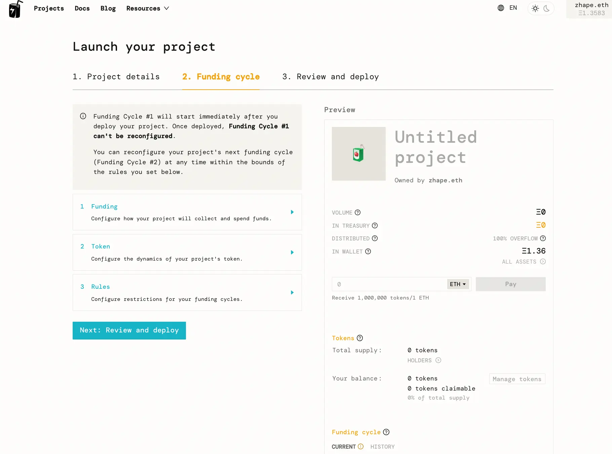
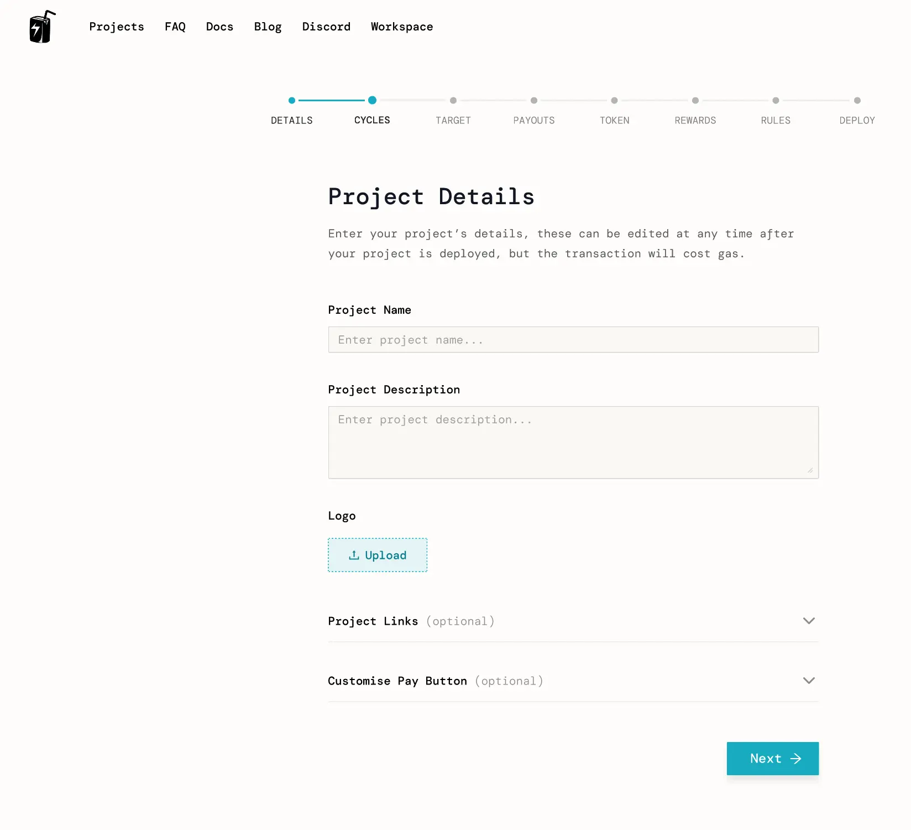
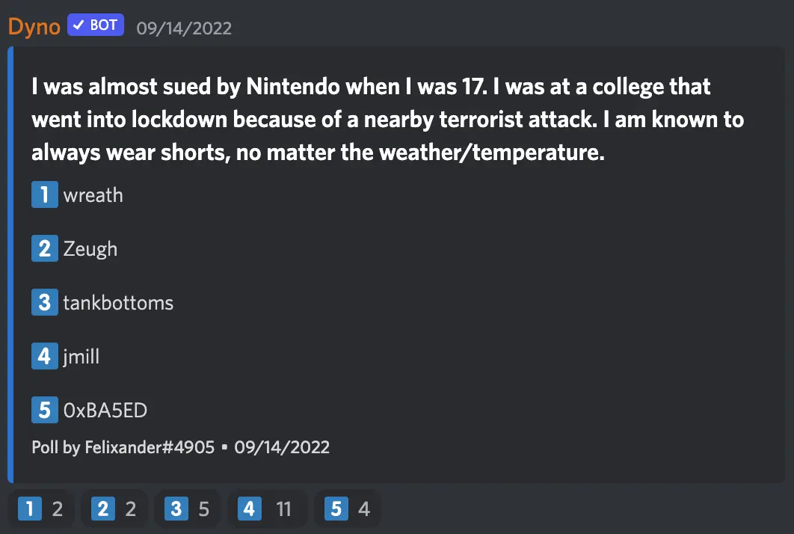

Art by [Sage Kellyn](https://twitter.com/SageKellyn)

## versioning with jango

Contract crew has finished the versioning project, created the Juicebox contracts V3 repository and merged everying inside, before the repo was passed onto some wardens in Code4rena to implement a mitigation review for updates made with findings from last Code4rena audit contest.

Jango said the mitigation review will probably last for a week, and encouraged our community to stay tuned and help out with any questions or feedback that externat auditors might have.

A big work now will be working together with Peel to finalized what UX we should use to get new projects to use the V3 conract.

Projects that are currently operating under V2 will have the choice of deploying a V3 funding cycle and synchronizing, then deprecating their v2 version funding cycle. We will provide instructions for that process. But in this case, the communities of these projects will have to go through a token swap transaction, which isn't entirely ideal. If there are projects that don't want to go through this trouble, we'll deploy an ETH payment terminal and a JBController for them to migrate their current payment terminal and controller to.

For those who want to stay on V2, they're welcome to do so, it'll just be a little bit more follow-on work from contract crew.

Huge shoutout to Dr.Gorilla and 0xBA5ED for coming through and helping out in the last serveral weeks, and big shoutout to 0xBA5ED for a really intuitive solution to a little rounding error that we were dealing with last week.

## juicebox.money Next Gen UI with Strath

The frontend team found out that the biggest pain point for our users, which impacts Juicebox most and make it suffer from a very high dropoff rate, is the project creation flow. After some user testing and behavior analytics, our team finally went through the way to simplify this process and make it a more enjoyable experience to get people launch their project on Mainnet.

*Strath was sharing his screen and showcasing the improved UI design*

The biggest feedback they had was the step 2 of the 3 steps in the current creation flow, the Funding cycles which is some kind of tiered approach and has a lot to go through.

They are trying to break it down to simplify everything, get rid of the cognitive load and give people the ability to make one big decision per page.

Here's what the improved UI looks like:

And Strath was explaining the tabs in the new UI one by one.

Here is [the Figma page](https://www.figma.com/file/EN7CZTekcSo3sHyaGt6cC0/JBX---Project-Creation-Flow---High-Fidelity---Sep-2022-(WIP)?node-id=0%3A1) if people want to leave their comments on this work.

This is not 100% complete and there're some small elements still being worked on. They will do some user testing, so there'll probably be iterations on it down the line.

There will also be some templates, so people can select the template and just go from there, instead of needing to jump into the creation flow.

**Q**: Do you have any plans or any prototype for allowing a user to launch terminals from there, like custom ERC-20 terminals?

**Aeolian**: It's quite an easy thing to create, but the main issue is what do we do on the project page, which still need to be conceptualized what it looks like for a project to have multiple terminals. That's probably the next big design project.

**Jango**: I even wonder if that's in the purview of juicebox.money to experiment with, because there're a lot of ways to go about this. It seems all this stuff is best to serve as an experiment with a juicebox.money fork or something that specifically tailored towards those use cases, and finding out how to fold that in nicely will be interesting.

It gets a little complicated, but it does provide particular accounting niceties if you really want those terminals. I think, from a protocol perspective we can make sense of these logically, but from a UX perspective it will take some work really figuring out what the priorities are.

## Two truths and a lie with Felixander

The correct answer is 0xBA5ED.

No.3 about the socks is a lie.

## MTOTM AMA with epowell101 and Michaelmaher

### Background and concept

**Epowell101**:
This concept of MTOTM started with some lived experience and some conversations they had with some early DAOs and DAOs founders, in a sense that there's a need for additional diversification early on instead of waiting untils much later and needing an OTC desk to do the swaps or to negotiate for over months.

What if we, a bunch of DAOs at their very earliest stages, pitch in to a shared pool(Juicebox in this case) and get back a token that represents percentage of the meta DAO that we have just created. So you get some diversification and also some meta governance in which you get certain number of other DAOs who are care about how you're doing and potentially could be an independent voice in your Discord or in your governance to provide an independent perspective.

As we all know, there're a lot of launchpads out there and maybe lots of use cases, but we realized that we should focus on the primitive of DAOs pitching in and getting back while referring to an oracle to get the ratio. That's where we needed a name for this concept and we came up with MTOTM( \ˈemˈtō-təm\ ), which is supposed to stand for Many To One To Many Swap.

**jango**:
To add a little context, we're leveraging these custom payment terminals to basically accept project tokens back into them and issue another project token outwardly, and that's kind of how it ties into the infrastructure that we're working on, the protocol developers are working on. It's cool that it's scoped into its own project and has its own application, but from the primitive perspective, as everyone was saying, it's nice to use these familiar `pay` functions in token issuance practices.

**nicholas**:
If I'm getting part of the ideas, it's like token swaps between DAOs and also potentially collecting token for many different DAOs and generating one token that is the representation of all those different tokens in one index fund, which allow you to do interesting things and mutually incent each other. Is that the idea?

**epowell101**:
Yeah, that's exactly it.

### Explanation of mechanism

*michaelmaher shared a GIF file in the town hall channel:*

**michaelmaher**:
At the base of everything is the extensive use, if we all are using ERC-20 terminals to facilitate this process because what the DAOs pitching in will most likely be ERC-20 tokens, we'll have to navigate the use of these terminals to facilitake DAOs coming into an index, creating that index and spitting tokens back out to them.

With that, there's the ability to use different price feeds, using the Juicebox protocol. If a DAO's ERC-20 tokens coming in and they don't have a current price feed, probably because they are not traded on a DEX, we can set up custom price feeds as well.

But we also want to encompass it in the tradtional Juicebox project architecture, by using a regular project that can receive ETH and manipulate some different split data to send it out to other addresses.

Investors want to come in and spend their ETH to get an index token in the initial raise, and DAOs will also come in and get their DAO tokens in the swap. So all the swap needs to happen under the same umbrella, and that's really what MTOTM is about.

We also don't want to dilute the initial investors either. When they're coming in with ETH expecting some amount of tokens back, we want to make sure that's kept true till when the DAOs are coming in.

We're looking forward to developing some other terminals especially for this use. When you've got multiple projects coming in, you have to launch a terminal per project. Of course, that's not the most gas efficient thing, so we're also looking to help build some multi-token terminals , where you have one terminal and a bunch of tokens can come into it and help facilitate the whole process.

And the final part will be how to distribute everything. ETH will be distributed in a traditional way most Juicebox projects do and routed to the DAOs because it's a way of fundraising.

When you look at that GIF image, the whole point is to make it very simple for the users, and to have all the complexity under the hood.

### Community support

**jango**:
Shoutout to you all for really figuring out how all these interfaces work and getting a sense that this can be pulled off with the network's treasuries that we've got going here.

I think there hasn't been full time attention from a lot of the folks that really know the protocol intimately well and have built it, you all really are carrying the load and understanding how things work and prototyping and asking really good questions very frequently, much appreciate it. Hopefully as we wrap up some of the work that we've already committed to, such as versioning, NFT Rewards and stuff over the next few months, we'll be able to be more hands-on and take this through the finish line to some MVP so that we can actually see this animation play out on a website.

**michaelmaher**:
If anyone is interested in the project, you can check out [our GitHub repo](https://github.com/The-Funding-Cooperative-DAO/MTOTM). And also welcome to join our [Discord server](https://discord.gg/u5zRFdHz) and let us know what you think.

**jango**:
There was a grant proposal to help sustain and fund those research this past round, which didn't meet the quorum in temperature check. A lot of this type of research work is more in the background and not really in everyone's face frequently, we are trying to figure out better ways to really highlight developers from around the ecosystem who have been working on it consistently.

I think this is one of the cases that we may not have a full thing ready to go in the near future. There's been a lot of understanding of how things work and prototyping how to really push the limits of how things might work, which is exciting to me. I would love to see it supported, and obviously the best way to support is just being around and helping to answer question and prototype and actually pull the thing off. It does take time and attention, we know that it's hard to prioritize things, but be on the lookout for grants of this nature going forward.

### Further discussions

**nicholas**:
Let me run through this once more to make sure I got it clear. So the impetus is twofold:

1. to allow DAOs to swap tokens with one another, by making contributions of their own DAO's token to another DAO's Juicebox project and receiving that DAO's tokens in exchange
2. to enable the creation of an index fund and the fundraising for all of the DAOs that contributed their project tokens to this index fund so they can collect ETH.

Is that a good summary of the motivation?

**epowell101**:
The DAOs and investors will all get back the same tokens that created by the meta DAO, but the DAOs will also get the ETH.

**jango**:
I think the main thing from my perspective that is important to note is that right now we have an ETH payment terminal and a generic ERC-20 payment terminal. The ETH payment terminal is deployed and leveraged by juicebox.money. The other one is an ERC-20 payment terminal, let's say DAI, and that would work the same way.

You would issue a rate at which project tokens are issued out when one DAI comes in. If you run both an ETH terminal and a DAI terminal, you want to have the project token issuance rate be only correlated to one of these assets. Let's say 1 ETH comes in 1,000,000 tokens go out, and 1 ETH worth of DAI comes in 1,000,000 tokens go out. Now you can imagine a project token version of the ERC-20 terminal. One project's tokens get issued at some rate of the external project tokens coming in.

The interesting part is the price feeds. At what rate tokens get issued out when something comes in, and how does that relates to other terminals you are also using? That requires you to write price feeds and payment terminals. And then how do you write multiple payment terminals that can generalize this so that you don't have to deploy a new payment terminal for every project that wants to use this? You don't deploy a DAI terminal and then a SHARK, PEOPLE and JBX terminal each time. You can just have a generalized version of this, which is also an interesting problem here.

**nicholas**:
So let's say you have a multi-token terminal that accepts SHARK, PEEL, CANU and WAGMI to create a Juicebox ecosystem index, it would not just have static rates for each of those versus the project's own token, but instead variable rates depending on the value of thos project tokens, right?

**michaelmaher**:
Depending on the value of thos tokens, but some projects might be in their super early stage and we might negotiate a price to start, so maybe they all will have the same price. There're a lot of different ways in basically working with the prices contract set up in Juicebox.

**nicholas**:
So the first step on the roadmap is this multi-token payment terminal to enable some of those ideas we talked about.

**jango**:
I think the multi terminal is how you automate a lot of the operation overhead to set this up manually. I think the manual first step is to have one terminal per project token that's facilitating this, and to have prices feeds and everything plugged in, and the expectations are all set and things are well tested. And then the next step is to automate the operation overhead.

**michaelmaher**: Yes, we've been trying to develop the multi-token termianl and that's still in progress, so that's more of a future what this can be.

**epowell101**: We have stood up on testnet versions of this using the single token terminal, it's going to be very simple, because we just want to get to the MVP, but there's some UX work got starting as well.

**Kmac**: Isn't it an index built on token set?

**michaelmaher**: Okay, they kind of do this, but the reason that we're trying to be different from them is that they have these certain stipulations within a token set. One is that you have to be listed on a DEX platform or have some type of liquidity, so you have to have a pretty well launched token. Early stage projects are not going to pass that set protocol if they want to join. Also there is no real governance built in with that, you get this kind of index token per se, but the governance of that doesn't really work well. So to us, this is a different niche product that can facilitate a lot more projects out there.

**jango**: Lastly, just to emphasize is that this is an experiment, and there's a lot of unknowns, a lot of open questions. So let's ask those and let's hypothesize and talk about them. Who knows if it has longevity, but I think it's worth. I think there's definitely applications of this or derivatives of this concept that can be quite powerful.

