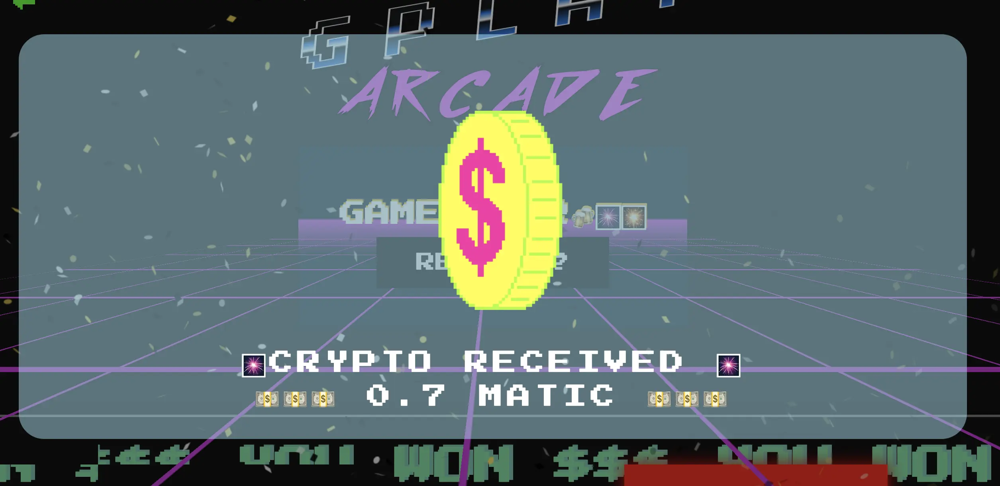

Art by [Sage Kellyn](https://twitter.com/SageKellyn)

## Capsules project with peri

The [Capsules](https://cpsls.app/) is peri's latest project of on-chain typeface that he launched just one day before this town hall.

This project of on-chain typeface introduces a standard to make it easy to store fonts on-chain. There're a lot of projects that use text in on-chain rendered SVGs these days, but if they want to use a custom font in an on-chain rendered SVG, they need to find a way to store that font on-chain. Also storing fonts on-chain is expensive and complicated, and there isn't a standard way to do it. For this reason, Capsules project introduces a new typeface contract interface in order to standardize storing fonts and make it easier to access.

Together with the launch of this project, peri also put out some NFTs as a Proof of Concept experiment for fonts, by which he tried to educate users how to load fonts from a typeface using this contract and throw them into an SVG which in turn gets rendered on-chain. There're altogether 7,957 Capsules NFTs with each one of them having a unique color, while users can only mint each color once. Users can edit the text of the NFTs and it gets rendered in the Capsules typeface.

People can also download the typeface [here](https://cpsls.app/#/typeface) for free if they want, together with its variable fonts, which is pretty cool.

The typeface contract allows you to define the typefaces even when you deploy a contract without storing all the data for them, which means anybody else can just come and store the data, provided it matches what you define in the first place.

For this project, there are 7 special pure color NFTs that goes to people who store the 7 fonts 100 to 700. Folks from around the Juicebox ecosystem got news of this launch and stored all of them in just couple of minutes, which is a very decentralized effort to get some new infrasturcture onto the blockchain.

Definitely follow [peri on Twitter](https://twitter.com/peripheralist) to get more first hand info and all his genius ideas!

Nicholas also managed to make a prototype using the Capsules typeface to render some active data of a Juicebox project.

And filipv downloaded the Capsules fonts and set his terminal font to them, which is super super cool.

## Versioning update with jango

Jango and his team launched the V3 contracts in the morning of this town hall.

In the past week, we had another Code4rena audit contest of mitigation review over the updated V3 contracts. After this contest, the team deployed all the contracts again except for the `JBProjects` and `JBOperatorStotre`, which means projects currently have their project NFTs will keep their project IDs and they can choose whether or not to deploy a V3 funding cycle and token that syncs to their V2 versions, while all new projects will be built on V3 contracts.

Dr.Gorilla and 0xBA5ED have done a lot of work for testing and solving some very complicated problems along the way.

V3 contracts are essentially a mitigation of a few bugs discovered in the previous Code4rena audit contest in V2 contracts. The most impactful one of these bugs was that project owners can set a start time of their funding cycle in a certain way to overflow the storage of that piece of data, essentially allowing them to create a funding cycle at arbitrary points of time and mess up the schedule of things. With the assumption that community relies on project owner to be honest, we try to create as many levers as possible to at least give project owners the ability to lock themselves into things, but this bug would in a sense allow some unforseen reconfigurations if for some reason project owner and the community were no longer aligned in interest.

It is just a fringe case, either it could have been patched with a new payment terminal controller, or contract crew could have made edit in the JBFundingCycleStore to fix it. But it makes a lot more sense that people about to build projects on Juicebox want to be building on the best version of contracts possible, so the team did the V3 contracts and made changes in the `JBFundingCycleStore`.

The next move is to extend what was previously a V1 to V2 token migration terminal to be more generalized, so that projects can deploy a new funding cycle and toke if needed and make the move across as they wish. But the V2 contract will keep working and all the stuff there is solid.

It's really nice to have a versioning pattern ahead of time when things are still pretty slow these days. Both contract and frontend teams were taking this opportunity to create decent standards for projects to use to implement major-version migration in the future if any problem arises.

**nicholas**: If people have their V2 projects right now, should they be worried about it sitting on V2?

**jango**: No. We've talked to all projects willing to communicate about it and make them aware that the audit contest has been wrapping up, and the broad base of projects has already had trust vectors established between project owners and the communities, so it should be fine.

**nicholas**: Is there a timeline for the feature of token swap?

**jango**: We current have this mental model that people paying ETH and they will receive project tokens, so projects might also use it to receive the old version of their project tokens and then issue a current version of token back out at a rate of 1:1. Under the hood, it looks like a payment terminal, and also in the frontend there's going to be a settings module to make the process easier for projects to do it.

Stay tuned for updates on all the work of the versioning stuff. The next thing for us will be to figure out how to deliver effectively. We have a lot of prototypes of this at the finish line, but given this V3 deployment, we want to make it work from V1 to V3, and from V2 to V3.

And there's some cool stuff we can do with extensions in V3. You can make pay delegates that receive part of the funds before they go into the treasury. This is a new feature that no one has used yet, and we're building the first one with the NFT Rewards, because we found that it would be really useful if some of the payment could be routed directly to a delegate. You can run arbitrary contracts that actually receive parts of the funds paid in, and the same with redemption, in which you can run delegates that receive part of the reclaimed funds automatically.

The GitHub repository of V3 contracts can be found [here](https://github.com/jbx-protocol/juice-contracts-v3)

## Visibility updates with brileigh and matthewbrooks

### Juicenews newsletter

The new release of Juicebox newsletter can be found [here](https://newsletter.juicebox.money/)

### Config articles

The config articles are going to run through how a project is configured and some of reasons for those decisions made, to help new project creators understand why certain projects are using a different configurations and why they're making those decisions. So if new project creators want to build a similar project, they can look to that article as a reference point for their own project.

Brileigh and Matthew just launched their first config article [here](https://docs.juicebox.money/blog/2022-09-20-studiodao-config/).

### Juicecast (Juicebox Podcast)

They recorded a new [Juicecast](http://podcast.juicebox.money/) episode with 0xSTVG about his project [Marin Swim County Association](https://juicebox.money/@mcsa), this episode will be released later this week.

They also made a video interview with [David Phelps](https://twitter.com/divine_economy), the founder of JokeDAO, which they plan to upload to [Juicebox Youtube channel](https://www.youtube.com/c/JuiceboxDAO) later.

### Work Plans

- Another video interview with Robin from [Defiant](https://www.youtube.com/c/TheDefiant) about creator economy.
- A retrospective deepdive on [ConstitutionDAO](https://juicebox.money/p/constitutiondao).

They also have the plan of making a series of podcast featuring some famous/symbolic projects of Juicebox such as ConstitutionDAO or MoonDAO, coupled with some long articles that go through the history of them, as well as some config articles about how these projects were set up which will certainly be reference points for new project creators.

## Interface with sunnndayyy

[Interface](https://www.interface.social/) is a mobile APP that allows you to follow your friend's wallet, lays out all the information in the feed like a social Etherscan and lets you surf Web3 with a better UI.

Interface community has recently transitioned to a DAO, with a hybrid model between the Labs and the DAO. And they want to start doing some interviews and learning about progressive decentralization publicly. So they're looking to hold a series of Twitter Space on the challenges of decentralized coordination and stuff like that over the next few month.

They feel there will be no better community to talk to about these topics than Juicebox, so they want to invite the core contributors of JuiceboxDAO as their first guests to discuss on how to activate participation in governance in the early stage in a project's lifespan.

sunnndayyy also introduced that this APP is still in a closed beta version, so if people want to download it to try using it, they have to go to their website to sign up for early access.

## G-Play updates with Sayid

G-Play is a [Juicebox project](https://juicebox.money/v2/p/153) of P2E gaming platform where users can stake $Matics to play with each other on Polygon.

Recently they started their beta testing and onboarded their first users to the platform.

One of the new features they have, is a statistics page that shows how much the users have unclaimed $Matic they can withdraw.

Sayid and Mieos played a game to demostrate how the game goes on the town hall.

As now it seems a little troublesome to buy $Matic on exchanges and bridge it to the Polygon Mainnet, Sayid also announced a 500 $Matic scholarship so that users can use the built-in request function to ask for $Matic from them.

## Two Truths And A Lie with Felixander

The correct answer is ... Viraz.

## Forming event Vol III with darbytrash

Lexicon Devils are going to host a new [Forming](http://forming.lexicondevils.xyz/) Vol. III event, FLOPPY x FORMING, on Sept. 24th 3pm PST, which will have 3 musical performaces and a [FLOPPY](https://twitter.com/FloppyDigital) walkthrough, at the [Juicebox HQ](juicebox.lexicondevils.xyz) in VOXELS.

The stage is set, welcome to join us then!

