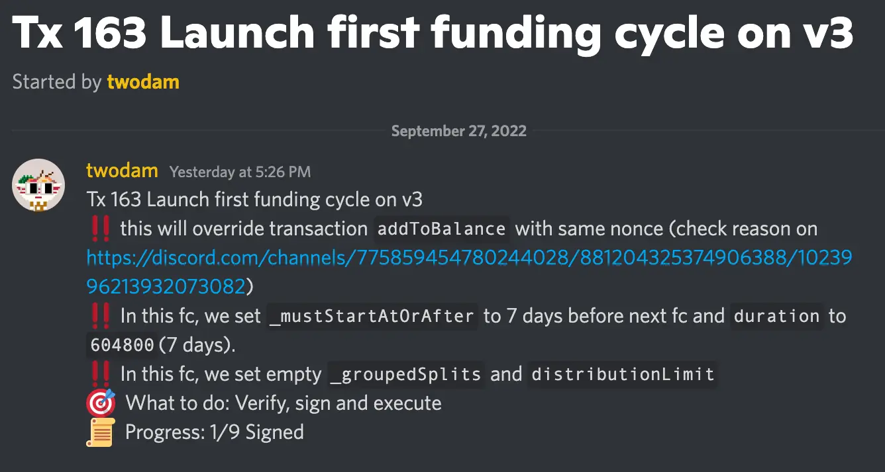
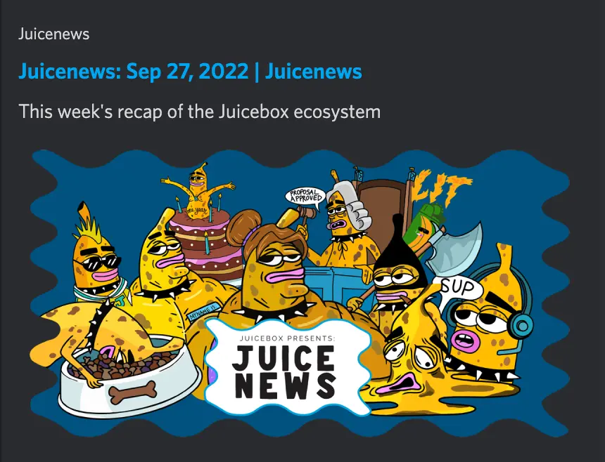
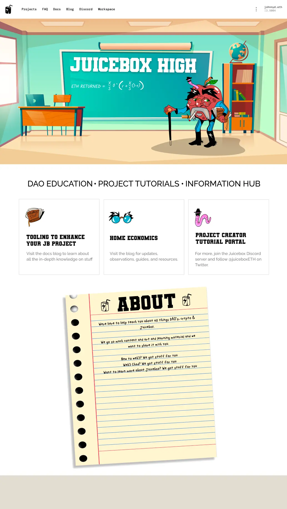
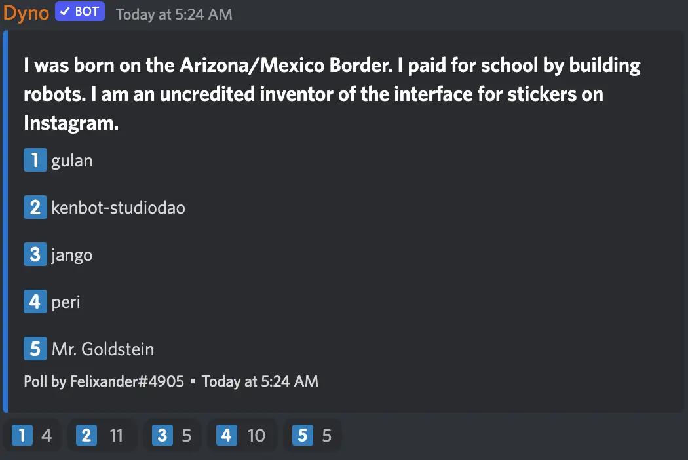

Art by [Sage Kellyn](https://twitter.com/SageKellyn)

## Tech update with jango

### V3 Contracts Update
**jango:**
A week ago, we deployed the V3 contracts. We need to set up the juiceboxDAO funding cycles on V3, which will be a transaction that all the multi-signers have to sign for, and we have to synchronize it with the V2 and V1 funding cycles. So we're going to queue up this transaction to kick off V3 funding cycles this Saturday, run a quick 7-day funding cycle and then reconfigure it to align with the 14-day cycles of V2 and V1.

The V3 cycle won't have any payouts from it, nor have any redemptions. It'll basically just be a place for fees to come into from projects operating there. All is looking good.

And then we toss the ball back over to frontend to help with the user journey of versioning, and there's some subgraph related work that peri's working on. Maybe Aeolian can give a few updates on how versioning is going on your end.

**Aeolian:**
Yeah, the codebase is ready for V3, or at least it's being reviewed without something to get merged yet. And peri's working on adding V3 support to the subgraph. Once that's done, we'll merge those two together and then we've got V3 on the frontend. Getting that out of the door, we'll then go full steam ahead on the upgrade path.

**jango:**
Cool! Once the basic stuff is done, we should be able to start launching projects on V3, and then, as Aeolian said, move onto the upgrade paths for v2 projects and V1 projects to move over to V3, which is a pretty big deal. It feels good to finally have this end state of V3 that feels very stable. We've gone through iterations in production the past 3 months or so on V2, and we're looking forward to helping projects make the move over to V3 and helping V3 projects launch.

I spent the last week re-calibrating the NFT Rewards contracts, which were done prior to this versioning PR and just needs a slight API change to how the datasources are being called.

I've been also working on the Defifa game leveraging NFT Rewards contracts, which have been really useful to stress test some concepts that we are incorporating into the base contracts. NFT Rewards redemption is not a feature currently available in [rinkeby.juicebox.money](https://rinkeby.juicebox.money/), but the NFT Rewards can be used as a redemption token, so that you can mint them and then redeem them to get overflow back, as opposed to your project tokens. We'll just add a few more properties in there to make sure that the tracking of token IDs and burn count of tokens etc. is going through cleanly, which enables the first phase of the Defifa game.

And it's always been useful building on top of the contracts at the time you're rolling them out or you're crossing the finish line, to make sure APIs are tight and some concept steps are extensible enough. But in any case, the NFT rewards contracts will be easier to iterate on than the core protocol, since they're just attached to any funding cycles.

To even prevent the need for that iteration, we're also trying to stand up a [Code4rena](https://code4rena.com/) audit contest for the NFT rewards contracts. There's a pretty cool plan with regards to this in the works stewarded by Nicholas. Maybe nicholas wants to give an update or some insight on what we're thinking there.

### Code4rena Audit Contest Game Plan

**nicholas:**
So a couple weeks ago some people from C4A got in touch and suggested that they were interested in creating a Juicebox project for each protocol potentially out there on Ethereum, or at least ones that have created pages with C4A, so that anybody could drop funds into another project dedicated to doing C4A audit contests for other people, because they've observed that DAOs and companies often pay for auditing other software that they depend upon for their contracts or services.

We also feel that maybe individuals would be interested in doing that, too.

It's a little bit slow going trying to figure out how to do that integration with them, so we're thinking of just dangling the carrot by doing it ourselves first. Jango came up with a cool idea to just create a Juicebox project that anybody can contribute to and that will be dedicated to an audit of the NFT Rewards contracts with Code4rena. In the future, we will create a proposal to help fund that. If the DAO decides to support and is willing to pay for the whole amount of the audit, which would be the distribution limit for that project, everybody could potentially be refunded their initial contribution.

This is a little experiment of us and hopefully it'll get C4A to start thinking in terms of how they can receive funds from Juicebox projects.

**jango:**
That's pretty cool if you take into account open source codes that no one is technically responsible for. Although I guess in the sense of Juicebox the JuiceboxDAO has somewhat claimed stewardship over the repo, there are many projects could be more open-ended. So creating a treasury where anyone from the public or anyone who's depending on that piece of infrastructure can contribute to, will help fund the wardens to look over a code, which would be pretty cool. Obviously if an organization wants to sponsor it instead, as Nicholas has said, then the original donors can just redeem their tokens for the proportional overflow which might be the full amount they paid.

**nicholas:**
It's cool, and the partnership potential is actually really exciting because it's basically a win for everybody:
- New projects could be created if C4A goes forward with this.
- Code4rena would have all this money essentially captive for their contest audits.

I think this integration has a good chance of happening, even though it's a little bit complicated to imagine getting it rolling at scale permissionlessly for potentially any contract. I'm excited to try it with this audit.

**jango:**
I feel pretty comfortable rolling the NFT Rewards contracts without the audit contest, but since we've already been on this tightening game for so long, it feels worth the extra week to move it past the finish line, and have it looked over by third party wardens as well. So If you see a project in the next couple days that's devoted to funding the audit contest, I may throw in there and others are welcome too. That way, when JuiceboxDAO does come in later, we don't have to do this whole retroactive compensation stuff that we've been doing in the past governance cycles. Let's get this thing through the finish line, we are very close.

## Visibility update with brileigh and matthewbrooks

**brileigh:**
[New release](https://juicenews.beehiiv.com/p/juicenews-sep-27) of Juicenews is out.

We also released a [new Juicecast episode](https://anchor.fm/thejuicecast/episodes/Ep--11---Steve-from-Marin-County-Swim-Association-e1oet1l) today with JuiceboxDAO contributor [0xSTVG](https://twitter.com/0xSTVG), to talk about the [Marin County Swim Association](https://juicebox.money/@mcsa), a Non-profit project he created on Juicebox.

And a config article for [Lexicon Devils](https://juicebox.money/p/lexicondevils), with another one for [FORMING](https://juicebox.money/v2/p/66) project that Lexicon Devils created incoming later this week.

**matthewbrooks:**
We're making a multi-part deep dive podcast on ConstitutionDAO, so if any of you are able to connect us with people who were closely involved with constitutionDAO or important to that project, that would be awesome.

**0xSTVG:**
It would be interesting to get the perspective of the Chinese Community when it comes to ConstitutionDAO. Maybe somebody can help connect some of those influencers from that side, because I know that was a huge push in the DAO and the Discord when that happened.

**matthewbrooks:**
Absolutely. We're looking to have a very robust overview of ConstitutionDAO, from a lot of different perspectives. It's not going to be one narrative, but we will be pooling together a lot of different folks who will be speaking to all the events that unfolded. We would be super down to talk to folks from that side of things as well.

## Update on JB high and new article with Felixander

**Felixander:**
Regarding JB High, I think it will actually be live this week, though still in its very nascent stage. Huge thanks to the Peel team particularly Blaz who has taken the lead on that.

The idea is to create something where project creators can jump in and immediately get a really quick and good understanding for how to launch a project, as well as the different tooling options available in this space. We're going to make the JB high into a educational hub and put in a lot of this leveraging content that we've made.

Regarding the article, I am also working on a config style article that's going to start with ComicsDAO, next probably with SharkDAO. And that's really also going to take a little bit of a signal for what JB high is trying to do and almost be like a Frequently Asked Question for how to deal with projects from a different project's perspective every time. So for ComicsDAO, why did they set their particular configs? when did they change that discount rate? why did they do it? I'll probably publish this article in a form of interview with questions and answers, so that it will be easy for project creators to quickly get the information they want.

## Two truths and a lie with Felixander

The correct answer this time is ... **kenbot** of StudioDao

