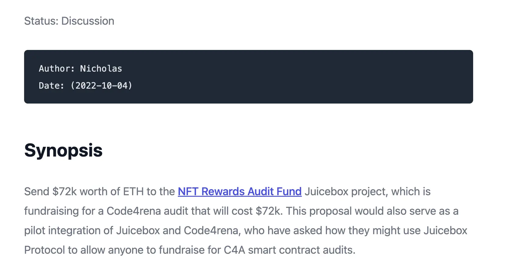

Art by [Sage Kellyn](https://twitter.com/SageKellyn)

## NFT Rewards Strategy with jango

We've been in touch with Code4rena this past week to schedule the review for NFT Rewards contracts.

Since our next governance cycles will only be able to put out funds in two and a half weeks, Nicholas launched a Juicebox project, [NFT Rewards Audit Fund](https://juicebox.money/@auditfund) to help crowdfunding so that maybe we can get the review started earlier.

- Jango has been fronting funds for the previous two Code4rena audit contests, it's not sustainable to do it in this way. This project could be an interesting alternative;
- This will be the first experiment that we do with the Code4rena audit contest, hopefully we will have some model to share with them and they can use it for other projects as well;
-  If we can put the funds down, theoretically we could start the audit contest on Oct. 7th, at the end of this week, although it's not very easy to get some steam up and running for this project in a short period of time.

But there might be another approach to handle this Code4rena audit contest a bit later:

- A lot of devs who tend to participate in this audit contest are going to be at Devcon Bogotá this next week and a half, and probably on their computer less often than normal, or at least less focused on problem solving;
- Given that contest will cost us about $70k, and the governance process takes about the same interval of time as Devcon, it seems a decent option to spend this period of time to tighten up some things and keep running more tests before the audit contest;
- We should be aware of the fact that there are quite a few moving peices right now. So it seems smart to take the next week and a half to make sure everything is in place, so that when we put out the NFT Rewards contract, it has been looked at by as many devs as possible;
- Once NFT Rewards contracts are out, we'll be working with a new piece of infrastructure which at its core is very crafty in its potential and has pretty compelling customization features, we might want to start to put weight on this one step at a time.

If we take the more prudent approach, we're probably aiming for the Code4rena audit contest starting mid of Oct, and a pretty fixed launch date for contract deployment synchronized with the frontend deploy since there're some Subgraph dependencies. It will be a matter of plugging in the contract addresses and shipping it for the frontend experience also, around Nov. 1st.

No decisions have been made on these time frames yet, but Jango is leaning towards taking the more patient approach. We've been sprinting a lot in the past month and frontend has been doing a lot of stuff with subgraph and frontend versioing. Maybe we should take it easy this month in a sense that everyone feels very good and all the moving pieces are very much in place. We will have all loose ends tied and ready to go by the time we launch.

The NFT Rewards contracts are chunky, which is a design choice in contrast to having many smaller contracts that each has scoped feature specifications. These contracts have serveral flags that project owners can turn on and off on deploy, so it's a little chunkier at the convenience of project owners. Over time if there's a demand for any particular version of these considerations, folks can add similar NFT-Rewards-style contracts to get ride of unused flags they may not want. But at first, similar to Juicebox protocol, we are going to deploy this highly customizable and feature-rich NFT Rewards contracts.

The versioning work in frontend seems to follow along and might be available soon. In that case, we'll do the frontend V3 deploy and flip the project creation to use V3 contracts. We will give the V3 project creation some time on its own before introducing the NFT Rewards as part of the creation flow. So if we take the prudent approach on audit contest, it will allow frontend to deal with any bugs or anything that happens in this period of time, since the NFT Rewards contracts will probably be around end of this month anyways.

## NFT Reward Audit Fund by Nicholas and Jango

The [NFT Rewards Audit Fund](https://juicebox.money/@auditfund) is a Juicebox project that Nicholas created to help funding a Code4rena audit contest for the NFT Rewards contracts. Folks can decide to contribute to it so as to speed things up, even before the DAO decides to support.

Also Nicholas submitted a [proposal](https://juicetool.xyz/nance/juicebox/proposal/6bb92c83571245949ecf1e495793e66b) for JuiceboxDAO to support and fund this audit contest. Once approved, funds will be distributed into the treasury of the Audit Fund project, to be paid to Code4rena later on.

If JuiceboxDAO does decide to fully support the expense of this Code4rena audit, folks who donated to this project before could possibly get their full refund through redemption. This proposal will serve on both edges:
- paying for NFT Rewards audit contest;
- pushing forward the partnership petential will Code4rena;

But even if this propoal gets approved, the earliest that the funds can be distributed will be the start of JuiceboxDAO Funding Cycle #33, around Oct. 22nd.

jango thought that it would be more ideal for the audit contest to start on Oct. 17th, but to achieve this goal, we might need to:
- encourage folks to contribute more funds into the treasury of the Audit Fund project when the proposal has not yet been approved;
- talk to Code4rena about the precedant that JuiceboxDAO has set funding the previous audit contests, and see if they're comfortable with having the funding proposal in motion and approved, or on pace to be aprroved by the time the contest starts, while the funds will only be available by the time the contest ends.

For context, recently Code4rena is interested in creating some Juicebox projects for any smart contracts or protocols so that anybody can crowdfund and start the audits for them. Hopefully, this Audit Fund project and proposal can help to push forward the JuiceboxDAO X Code4rena integration partnership by discovering a typical JuiceboxDAO dogfooding solution first.

Dr.Gorilla is working on an allocator which would allow projects including this NFT Rewards Audit Fund project to pay out funds in DAI, for the sake of convenience so that projects don't need to distribute ETH to multisig or any other address and then swap on exchanges for DAI. Instead, this allocator will take in the ETH from the treasury, check a few exchanges for the best price, and then swap the ETH into DAI before sending to the beneficiaries.

Concerning the question whether or not early donors of the Audit Fund project can get their 100% refund, Jango thought that it will be very probable, as long as JuiceboxDAO fill ETH in the Audit Fund treasury without minting tokens for itself and the redemption rate is set at 100%, as well as that the Juicebox fees are compensated by JBDAO. Jango also express his interest in seeing if the DAO is willing to put some JBX behind it as well, so that folks contributing and taking on the marginal risk can have a little bit of upside in so doing. Also from a membership perspective, it's another initiative to spread the JBX around from the treasury.

## Broader JBX Strategy by Jango

In the past couple months, we've been trying to figure out how to create a system where we can spin up a subsequent version of the contracts, accommodate them in the frontend, feel good about them in the documentation throughout all the contract interactions, which gives us some advantage later on if we were to encounter a situation where we need to move quickly to offer projects a way out of the current version.

But this is a temporary measure, eventually we want to converge our processes on our funds on the V3 treasury. Once everything is in place and we feel good about it, we want to create processes for folks that are currently upgrading from V1 to V2 to go over to V3 and make use of the tools there, and then we can start to build extensions further for projects on V3.

Eventually the JBX token should find some redemption value again on V3, for the time being the funds are somewhat scattered across the multisig and all these versions, although to some extent they'll always be since we might still collect fees on V1 and V2. But the goal, from the perspective of JBX, is to converge on the V3 treasury and allow the frontend to make some cleanup choices that we can re-focus on V3 going forward and be creative there without burdening ourselves with compatibility for V1 and V2 forever. It would take us back to the place where we were maybe 4 or 5 months ago when JBX was more frequently redeemed in the treasury, which is a really cool prove of concept of how all this works in principle and will tend to work in the future. Also it will be where the VE tokens can have their floor value against the treasury. Then the decisions we make spending on treasury directly affect the redemption value of JBX.

As a result, we can then move forward with some of the prototypes that we've been following along with. Extensions such as the JBX fee module would then reference the best price of JBX when someone contributes to the JuiceboxDAO treasury either through fees or whatnot, it would look to the market and swap there if the price is better than issuance, other it will add to our treasury and mint new JBX as it currently does.

That's part of the longer term JBX strategy. Jango hoped that we can find some stability again by the end of this year across all this expansion across versions, and then can start to reduce again and converge on V3 in this dirty JBX mechanism.

## Defifa project by Jango

A few governance cycles ago, we got some support to start building this really sick game that is gonna accompany the World Cup that's kicking off on Nov. 20th, and leveraging the NFT Rewards contract and scoping it down to a very narrow specific use case.

Essentially this game is a Juicebox project that's divided into 4 funding cycles enumerated as phases for the game's sake. 

### Phase I: Mint
There's going to be 32 NFTs which are each different tiers in the NFT tiered reward contract. In the two weeks leading up to the tournament, anyone can mint any team for the same price (currently saying 0.022 ETH). As the mints increase, so does the game's treasury. The NFTs are in turn a claim on the treasury. During these first 2 weeks, you can burn your NFT to get your funds back, with 1:1 redemption.

*So you can basically mint at will and then along the way if you no longer like the token distribution, let's say you minted England and then a ton of people also did, you can burn your England NFT and get your funds back.*

At the end of the day, we're playing the game by taking the competitions outcome and trying to reflect the results onto this game and then recalibrate what each NFT is backed by, given the IRL outcome.

### Phase II: Start
Once the games starts, the treasury is locked and minting ends. There's no more new NFTs, and you can't redeem or refund, the distribution of all tokens are set.

What happens in between the game is open-ended, we can bring whatever rules we want. We can say it's a winner-takes-all situation where the whole treasury will belong to the NFTs of the winner of the last game; or we can do something more interactive, let's say there's a preset amount of the treasury allocated to one specific stage game and the winner of the prediction ends up with those funds or at least has their NFTs backed by those funds.

We're probably going to lean towards doing it in a simpler way at first. Each game of the tournament will have a preset portion of the total treasury:

- 0.416% for each of the 48 group stage games.
- 2.5% for each of the 8 first knockout round games.
- 5% for each quarterfinal game.
- 10% for each semifinal game.
- 20% for the final game.

For example, if England beats the U.S., then whoever holds the England NFTs will get 0.416% of the treasury during that group stage game, so on and so forth.

### Phase III: Trade Deadline
There will be a trade deadline after the group stage, all the NFTs will be non-transferrable from the trade deadline till the game's end. We don't really know how the game will play out from a bribery perspective, and the bribery certainly is an interesting component that we're not trying to dissuade entirely. We just want to create a mechanism that reflects as much of an expected outcome as we can, which means folks can feel pretty confident that whatever happens in real life will be reported on-chain.

### Phase IV: End
Once the game ends, the game is self referee'd.

Someone will upload a scorecard that basically tells the contract how the treasury should be distributed, which is going to take into account every outcome that happened in between from the start to the end. Let's say like England only won that one game and nothing else, then 0.416% of the treasury is going to England NFTs as per the scorecard.

The scorecard can say anything, but then each NFT holders across all teams have to attest to the correct scorecard to ratify it. Each NFT vote is weighted against the total supply of their team, and each team will have collectively 1 vote to attest to the scorecard.

Once the quorum is reached, the treasury is unlocked and anyone at that point can burn their NFT to reclaim ETH from the treasury according to the value determined by the scorecard. No funds will be distributed, just every NFT is now backed by the funds in the treasury in accordance with the team's result and also spreaded across the distribution of all token holders.

***

The coolest thing is that, you can fork this to run your own version of this whole thing, you can basically repeat this experiment for any tournament or anything you want, where you just basically mint a distribution to fund the game and have the same pieces that you minted also as a function of the outcome.

Roadmap of this Defifa game:

- We're going to start with the quick website by the end of the week, which just has this header and the rule section;
- We'll ship it on defifa.net;
- We'll add the mint section hopefully by next week;
- We'll kick off the game two weeks before World Cup openning games, which will be Nov. 05;

The only new contractual component is the attestation scorecard piece, which we've come to terms with the parameters and how it's built, so all is good.

The art is phenomenal, shoutout to Mieos for tuning together each of these teams, all of them have a little aesthetic feel, which is very delicious.

## Juice accounting by filipv

Filipv did a demonstration of Juice accounting app, which he made originally for JuiceboxDAO but ended up making it generic for all Juicebox projects.

If you want to get accounting for a certain project on Juicebox, you can input the required parameters and get some information for this project in return, which can be pretty useful for some project creators looking to deal with taxes etc. in a given jurisdiction.

Let's say we want to get accounting for TilesDAO, we put in the project ID, the protocol version and put in the fiat currency that we're using, it will touch things and write to the folders. For example, if we open up `payments` folder, it gives us the time stamp, ETH amounts, fiat conversion at the time of payment, and the caller.

You can download [here](https://github.com/filipv-eth/juice-accountant) and try to run the app if you want.

And also [another app](https://github.com/filipv-eth/jb-fees) to calulate fees in the Juicebox protocol, which is only meant for JuiceboxDAO at this moment.

## Juicetool nance update by jigglyjams

If you go to the [Juicetool Nance page](https://juicetool.xyz/nance/juicebox), it will load the proposals that are currently tagged.

（*Here it shows # TBD, becuase we don't give the proposals any proposal ID until it passes the temperature check.* ）

By clicking the `New Proposal`, you can have this proposal template:

This template allows you to select a payout that goes to an address or a project, and specify the amount and number of cycles. And also it will resolve ENS name in the `Receiver address`.

Once you finish filling the fields and hit `Submit`, we get a proposal created. When you submit a new proposal, we'll still push it to Notion at this point.

Longer term roadmap for Nance:

- migrating JuiceboxDAO off of Notion to [Dolt](https://github.com/dolthub/dolt) (a SQL database).
- figuring out the way to host on IPFS.
- getting version controls for our governance batabase.

## Says who？ with Felixander

And the correct answer is ... **Sage**.

## MCSA update by 0xSTVG

MCSA(Marin County Swim Association) is a nonprofit providing opportunities for people who can't afford to be in some high level tournaments, camps or clinics. On Oct. 16, 2022, MCSA will be hosting a Shooting Academy with Gold Medalist/NCAA Champion Jamie Neushul and 2020 Olympian/NCAA Champion Hannes Daube. This event will only charge $45 per person and MCSA will cover the balance of around $2,000 total.

OxSTVG would like to thank all the people who have donated and support the [MCSA Juiceobx project](https://juicebox.money/@mcsa) and want them to know that the funds are being used in a positive way. A lot of people who would not have exposure to this type of high-level talent coaching can get their oppoutuity through the help of MCSA.

## Bonus: Juicy Treasure with Nicholas

Nicholas set up a Juicebox project called [Juicy Treasure](https://juicebox.money/@juicytreasure) and put the project ownership NFT on [auction on Zora](https://t.co/zS3ksasZdi), as a nice little experiment to get more people thinking about the different mechanisms of Juicebox.

