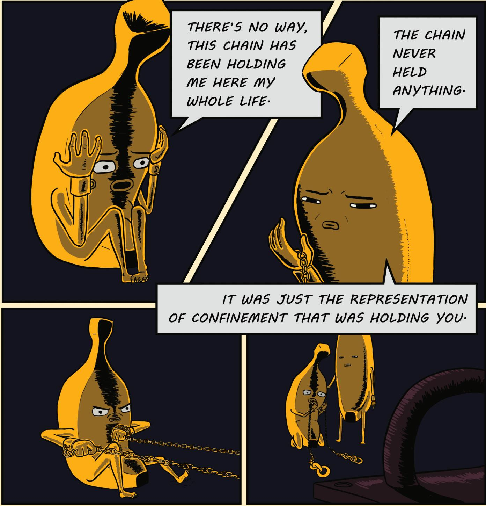
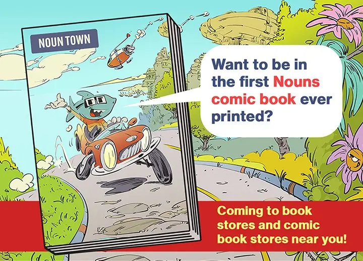
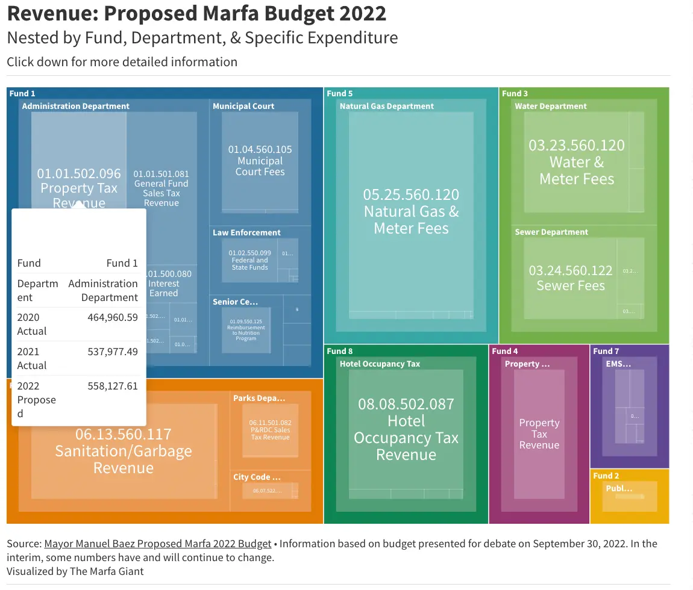
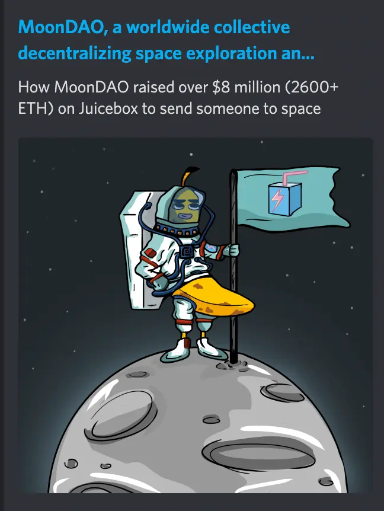
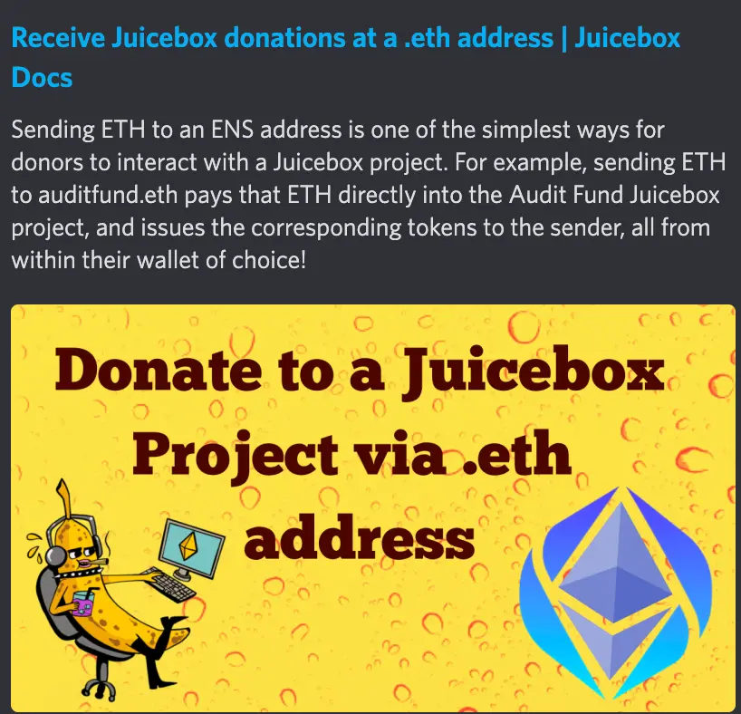

Art by [Sage Kellyn](https://twitter.com/SageKellyn)

## Tech update with Jango

- Code4rena audit contest for NFT Rewards contracts is scheduled for next week.
- NFT Rewards contracts will be finished and deployed on Goerli testnet this Friday.
- After that, attention will be turned to v1=>v3 and v2=>v3 token migration paths. Hoping to get this done and shipped with full frontend support by December.
- At the end of the year, there will be some cleanup efforts and supporting the finalization of any loose ends, prepping to make JBX moves in January with publishing the Fee Module and veBanny collection.

## L'art pour 'lart with Felixander

Felixander and Burtula made the [Banny graphic novel](https://drive.google.com/file/d/1dvpGwf5Yh4aasmhq97fJc1nXMrbQJb-h/view), which he thinks to be a fun little testament to art for its own sake and we should really highlight the artistic endeavors in our community.

## Nouns comics Ad page by Gogo

ComicsDAO is going to publish Nouns comics these days, which will be distributed off-chain and be available in bookstores around the U.S.

They have 8 pages in this comic book that going to be used as Ad pages for DAOs or projects related to the Nouns community, and now they want to give 1 page to JuiceboxDAO so that we can promote ourselves by graphic story telling like Felixander just did.

Gogo said ComicsDAO want to do this for gratitude of the supports that JuiceboxDAO has been giving them, which he thinks might help Juicebox reach out to more folks in real life.

## NFT Rewards Audit Fund by Nicholas

As our upcoming NFT Rewards contract is pretty complex and full featured, we want it to go through a Code4rena audit contest just like our V2 protocol did couple months ago. We're fundraising for this audit on [the Audit Fund project](https://juicebox.money/@auditfund) so that people interested in it can pitch in some funds to support.

We are now looking at starting the audit contest on Oct. 18th, in order to do that, we'll need $73,800(Juicebox fees included) in the Audit Fund project by Oct. 17th. Nicholas has submitted a proposal currently for the JuiceboxDAO to fully support the expenses of this audit. If this proposal gets approved, $73,800 will be added to the balance of the Audit Fund project without minting any tokens, which means all the contributors to that project can basically get their full refund minus gas fees.

As the funds from the DAO won't be available until Oct. 22nd, it will be more ideal to crowdfund the whole amount with folks first to get the audit start earlier. So Nicholas also suggested in the proposal that the DAO allocate 3m JBX tokens to reward those support this audit effort. There'll be 3 tiers of donations, i.e. >0.1ETH, >1ETH and >10ETH, and each tier of donations will share 1m JBX. And Nicholas also mentioned that he might want to propose a retroactive NFT Rewards for these 3 tiers of donations in the future.

This Audit Fund project also serves as proof of concept for Code4rena team, as they are exploring the possibility to create projects on Juicebox for smart contract or protocols out in web 3, so that people can sponsor each other's audits permissionlessly.

Finally Nicholas thinks this Audit Fund project might live on to fund future audits, such as that for the VE NFT, and others to come.

## Marfa Giant with ONNI

The [Marfa Giant project](https://juicebox.money/@marfagiant) was created with the intent of rolling out a print publication nationwide in U.S., which was thought to be a pretty cool use case of web3 protocols. Since his last update in the JuiceboxDAO Town Hall, ONNI have been faced with a lot of hurdles in their growth in trust and mentality of the community.

So the project began to organically evolve somehow. They built their own website [marfagiant.com](https://marfagiant.com/) and started reaching out to invite people to write columns, covering real time local news, posting contents and trying to figure out the needs of the community. This is a big shift from their print publication model, though that is still their final goal.

From there they managed to identify a few different objectives.

1. Buiding a following within the community
2. Trying to acclimate the community to digital news on websites.

To produce contents for their website, they went to city council covering events in real time, and reached out to artists, poets, writers for their works and published them.

Also ONNI created a data visualiation tool for city budget on the website so that people in town could look at it and click around to check all the details.

They now have a plan to distribute project tokens to every people in the town and make this publication project truly a community-owned one. But in a rural town without web3 or even web2 mentality according to ONNI, they still need to find ways to educate people to adopt this new way of paying or getting paid. And they are also exploring the possibility of issue some NFT with contents like poems or chef's recipes so that the sales of NFT can flow back into Marfa giant and be paid to the content creators.

What they need of help right now is:

- All contributions are super helpful
- A lot of design help in their website frontend
- Tech expertise like system architecture, backend dev, data visualization, etc.

## Visibility updates by Nicholas and Matthewbrooks

Matthew and Brileigh have just released their latest episode of Juicenew [here](https://juicenews.beehiiv.com/p/juicenews-oct-11)

And they also wrote [an article about Moondao](https://docs.juicebox.money/blog/2022-10-11-moondao/
), with details about the backgroud, the development history, as well as the most recent updates of this community.

In the course of creating the Audit Fund project, Nicholas came up with a cool model to use an ENS name to work with the Juicebox project payer, so that funds like ETH sent to the ENS will be forwarded to this project payer and go into the treasury of that Juicebox project, with project tokens minted to the original contributor in return. Nicholas wrote a blog post as a tutorial in details [here](https://docs.juicebox.money/blog/juicebox-donate-with-ens/).

## FORMING updates by Wackozacco and darbytrash from Lexicon Devils

Their next FORMING event will be on the Saturday leading up to Halloween, i.e. Oct. 29th, and the theme for this event will be a little spooky.

Submissions are open at the moment, if anybody wants to do a 10 - 15 mins recording of some live performances, feel free to submit in the [Forming webisite](http://forming.lexicondevils.xyz/). Submission will be closed on Oct. 25th.

Also, Lexicon Devils is going to make a whole new overhaul to the Lexicon Devil's website, as well as that of Forming, to make it very clear what their target is, what their vision is and what they are after with Forming as an entity.

