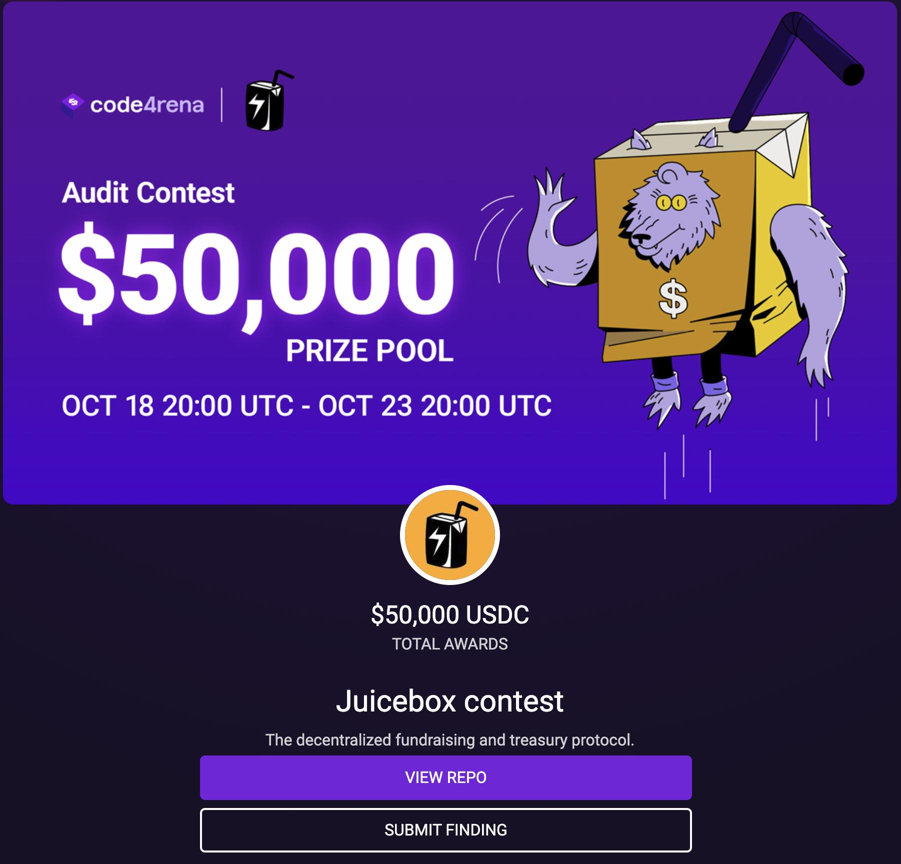
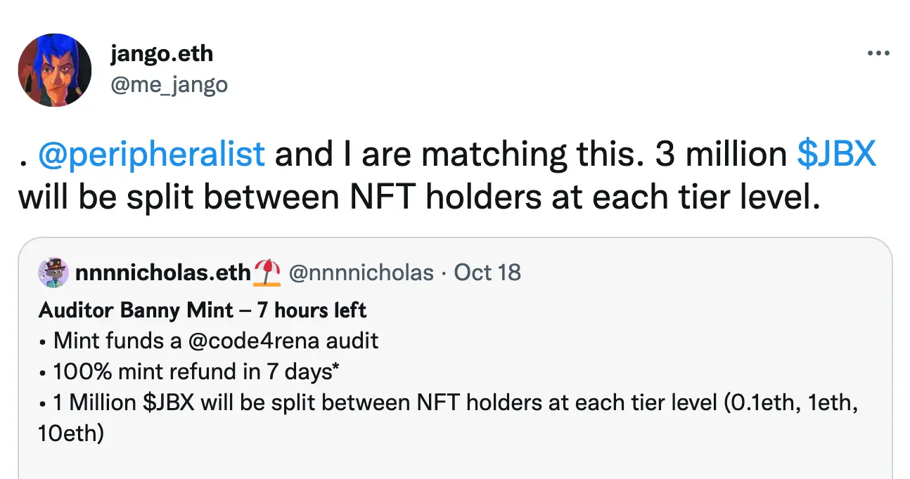
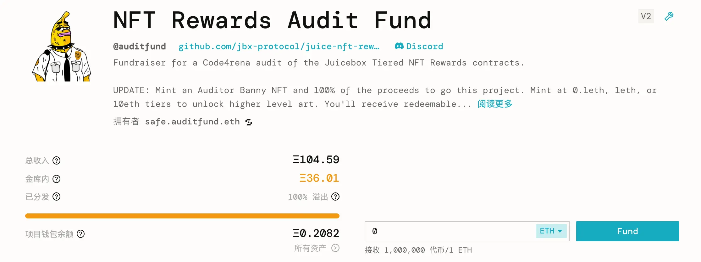
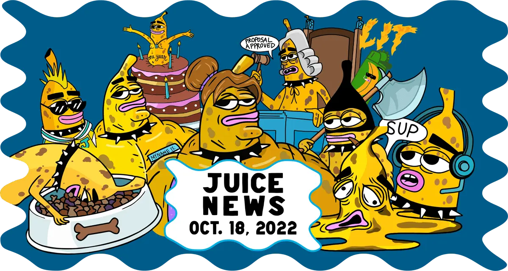
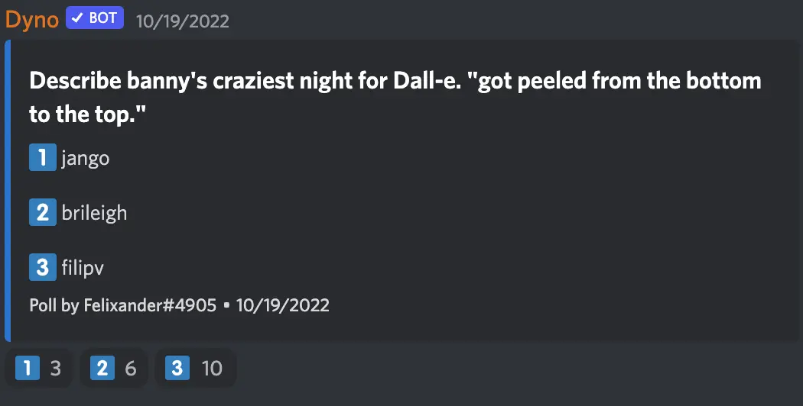

Art by [Sage Kellyn](https://twitter.com/SageKellyn)

## Code4rena Audit and Audit Fund Project with Nicholas

The Code4rena audit contest for our NFT Rewards Contract has begun earlier today.

This is a $50,000 audit contest which will last 5 days until Oct. 23rd, 2022.  After that, the NFT Rewards contracts will be deployed on Mainnet and attached to [juicebox.money](https://juicebox.money) around the end of this month.

Although a proposal for the JuiceboxDAO to fund this audit contest has been approved, the grants will not be available until Oct. 23rd due to governance process arrangement, which is at odds with our original plan of starting the audit on Oct. 18th.

So Nicholas created the [Audit Fund project](https://juicebox.money/@auditfund) to help  raising funds for this contest first, the donors to this project can have their full refund by the time the grant from the DAO is added to balance of the Audit Fund project.

Nicholas also launch a 3-tiered (0.1 ETH / 1 ETH / 10 ETH) NFT collection to help boosting the fundraising, with the proceeds of its minting directly routed to the Audit Fund project, so that minters can later on redeem their project tokens to get their refund and get to keep this NFT.

Also the DAO agrees to allocate 3,000,000 JBX rewards to the contributors of the Audit Fund project, which is to be divided into 1,000,000 JBX for each tier of NFT respectively and  evenly split between NFT holders of the same tier.  Because Jango and Peri decided to match the rewards of the DAO, the rewards finally reached 3,000,000 JBX for each tier of contribution. And the NFTs serve as a ticket to the airdrop of these JBX.

The Audit Fund project turned out to be a huge success, with total funds raised far more than needed to pay the audit contest.

This project may serve as a proof of concept for a possible JuiceboxDAO x Code4rena partnership, to help permissionlessly sponsoring audits for other protocols.

## DevCon Casa Update by Jango

The context of this event is as follows:

[The proposal of this event](https://juicetool.xyz/snapshot/jbdao.eth/proposal/0xbb9be15ce8a231861218fc907a0068bfbf289d3dbd49cfd85f10ae4ca56afa81) by Jango was approved by JuiceboxDAO a little while ago.

*“As JuiceboxDAO looks to encourage and support game-changing projects and capital formation schemas to form leveraging the Juicebox protocol, it should consider sponsoring accessible in-real-life gatherings hosted by contributors intimately familiar with the protocol and its potential applications to big-picture ideas, and attended by passionate builders, designers, and capital allocators.*

*The Thirsty Thirsty community and I are curating programming in a house in Bogota for ceremony, celebration of our agricultural lineage, and design sprints focused around how we might sustainably fund land-based projects using Web3 primitives, around the time of DevCon.“*

- Abstract from this proposal 

**Jango's first-day-back reflections:**

- Our ability to pull multi-disciplinary passionate people together was key to unlocking new creative avenues. Ahead of time, I was less sold on the need for a videographer as a value add to the experience. Turns out the budget wasn't just spent on getting a videographer there, they were spent on a Fernando. Same goes for Juanda, everyone who brought +1's, and everyone folks invited to our space for deliberate design/learning sessions and casual moments. Next time we need to double down on this. It's all about the people, the work orders are just an excuse.

- Having a few focused scheduled moments around food and ceremony were grounding and set a perfect tone. It wasn't a greasy hacker house, it was a welcoming space where we could be caring, curious, and warm towards one another.

- It would be nice to have a few more optional excursions planned for people to take part if their schedules allowed, though it seemed most people were happy sitting around the house with laptops out together, exchanging ideas out loud and on notebooks.

- It was great having an extra house in Guasca. Though we didn't use it to its full capacity each day and had some trouble accessing it at times (dirt roads, annoying hosts), the times we did use it were monumental. The dinner we threw with our friends from Mochi was epic, and it was great to have extra bedrooms for folks who wanted more space for themselves.

- Epic having Pablo, Alejandro, Thomas, Mark, Steve, Juanda, Fernando and Bruxa there alongside more day-to-day JuiceboxDAO contributors. It was a focused enough group of people where I felt I could build relationships with everyone. I'm more of an intimate 1-on-1, small group, few real friends kind of person, the cadence of this event catered well towards that. Epic group of big-brain big-heart people.

- Despite spending loads of time online together, getting time to hang and bullshit with peri, zeugh, nicholas, filip, and jmill was necessary to gluing new ideas together. The whole week was high-bandwidth communication with a bias towards doing. big love to the family.

- One of our super powers is empowering creative and passionate people to pronounce their creative muscle through their own projects, in the way they feel most comfortable, encouraging them to push against discomforts their curious to explore, while helping make connections within our expanding ecosystem of builders who might offer support and specialization to round out a project's needs. It'll be difficult to measure this event's immediate value add to the broader JuiceboxDAO community, but seeds were sown and I look forward to referencing this Bogota week as an origin story for many projects/partnerships that may sprout over the next several months.

- We need to be aware of people's financial circumstances when inviting multi-disciplinary friends. We did a good job in helping Fernando, Juanda, Bruxa, and Zacharias (didn't make it but we did what we could) arrive by compensating their airline fees, while all others were responsible for sourcing flights themselves. We each have our own accesses and constraints, we have to be comfortable talking about them so we can help one another make stuff happen and leverage what each of us can bring to the table. This is tricky to scale, but important to get right.

- We could've used more help sourcing ingredients and planning foods. We had this in place with Zacharias, fell apart last minute. Stoked with how we all came together and made it work, but we all spent a grain too much time throughout the offsite week planning meals.

- I liked over-indexing on supporting Thirsty Thirsty. It allowed us all to problem solve with confidence as the weeks went on. I'm excited to see how we can continue working together to help them raise and sustain funds used to power land-and-people-based experiences, and how they can help JuiceboxDAO bring it's community together around earnest moments alongside neighboring communities.

## Frontend Update by Aeolian

- The rinkeby.juicebox.money site has been deprecated;
- V3 version of Juicebox contracts have been deployed on Goerli testnet;
- Mainnet launch of V3 contracts is underway, but the timeline is still TBA due to some recently found complexities with Subgraph.

## Visibility Update by Matthewbrooks and Brileigh

A [new edition of Juiciness newsletter](https://juicenews.beehiiv.com/p/juicenews-oct-18) is released today, covering:

- Weely recap by 0xSTVG
- An article by Nicholas about routing funds from an ENS to a JB project
- An article by Felixander about the history and configuration behind SharkDAO
- Articles by Matthew and Brileigh about MoonDAO and its project configurations respectively
- First video interview released on Youtube, with David Phelps from JokeDAO
- Defifa teaser by WAGMI Studios
- Town Hall summary for Oct. 11 by zhape

Also they are trying re-render all the past Juicecast episodes with custom 4k waveform visualization and upload them onto the account of [JuiceboxDAO in Youtube](https://www.youtube.com/c/JuiceboxDAO), in the hope of repurposing the contents and improving the seachability of them, so as to expand the influence of JuiceboxDAO.

## Art Apprisal Contest by Felixander

Felixander asked 3 peolple to decribe ''Banny's craziest night" and use those descriptions for purpose of AI drawing on Dall-E. He showed on the town hall one of the drawings and ask people to guess whose description makes this picture.

And the correct answer is ... **Jango**.

## Quick Update of Defifa by Jango

Folks have been pushing stuff out one chapter at a time in this Defifa project.

From a frontend perspective, big shoutout to Blaz and Deviant for getting the site up and hosted, and also starting to prototype the sections. Later on, we can start pointing people to the page, to improve the styling and some final touch-ups towards the end.

From a contract perspective, we have the redemption mechanism working, thanks to Viraz and 0xBA5ED for prototyping some different options we have for the redemption calculation and attestation processes, which are feeling tight right now.

The next step on the contract side is to encode 4 funding cycles into publicly queueable transactions. The project owner will be a contract and it'll initialize rules passed in with the start date of tournament, minting period, trade deadline and the end date. When one funding cycle is in progress, anyone can queue the subsequent funding cycle from these rules.

Shoutout to Mieos for stitching together these artworks for every country, which requires a big chunk of focused time and effort. And thanks to Sage for the iconic Banny design, relentless and incredible as always.

Also shoutout to Tankbottoms for helping out last week, wrapping these in metadata and getting it pushed to IFPS so that we can leverage in the NFTs.

Next week we'll be wiring everything up on Goerli, while Jango has yet to decide whether we will try out minting on Goerli, all the components are coming together and feeling quite good.

Once the game is over, we'll think about how to expand the framework and interface to accommodate a generalized version of the game, so others can play with their own intent.

## Question about NFT Rewards from ComicsDAO

Defaulteduser, the founder of ComicsDAO, explained that these days comic books have become a collectible instead of something to enjoy, which is quite annoying for the lovers of comic books. So he thought of taking comic books and putting them onchain, so that they can preserve the books while at the same time allowing more people to enjoy the content.  They've been looking at scanning individual pages of rare comic books and essentially putting these pages on chain.

He was wondering if  it's possible to scan pages of rare comic books and give them away as NFT rewards in a fashion of randomized distribution to people who will receive them.

Jango thought the randomization would probably be a tricky part of it, because the NFT rewards are designed  to be choices that are deterministically made. He suggest that ComicDAO might  try  to distribute the NFT rewards first, but would then reveal which comic pages are in those NFTs respectively later on with some other randomization process. They can use a specialized URI resolver contract which will actually resolve the image of each NFT in metadata after the distribution. After that, as the owner of that contract, they can eventually renounce their ownership so everything will be fixed in place. And this should be a cool idea to work towards.

