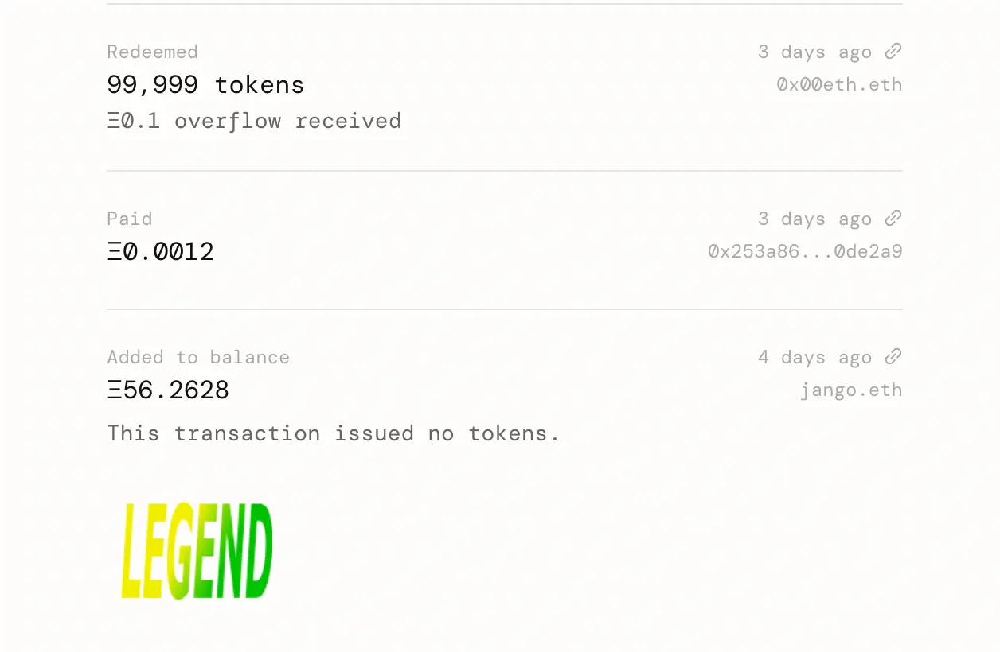
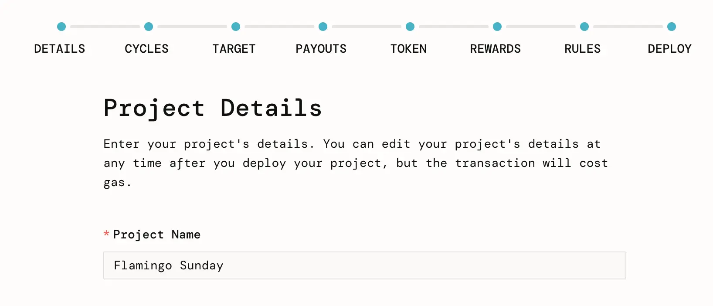
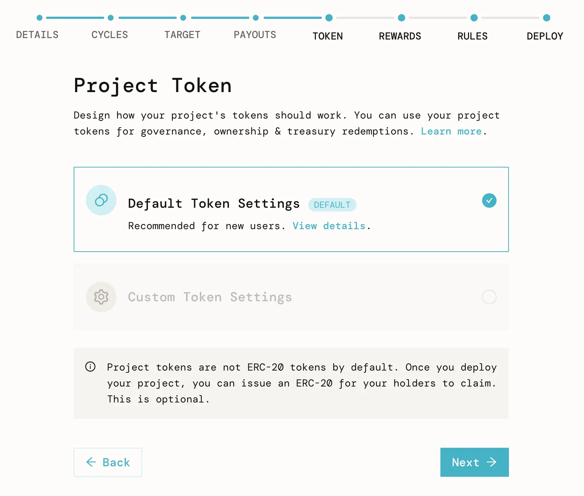
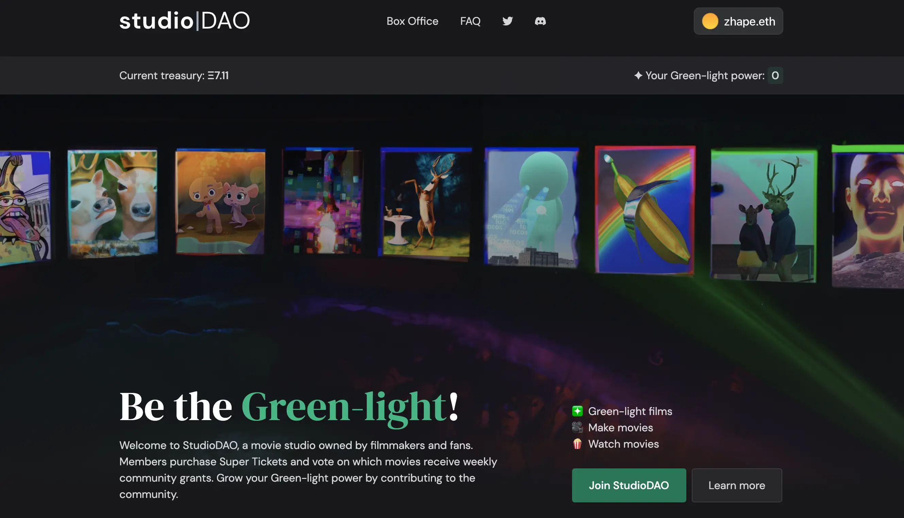
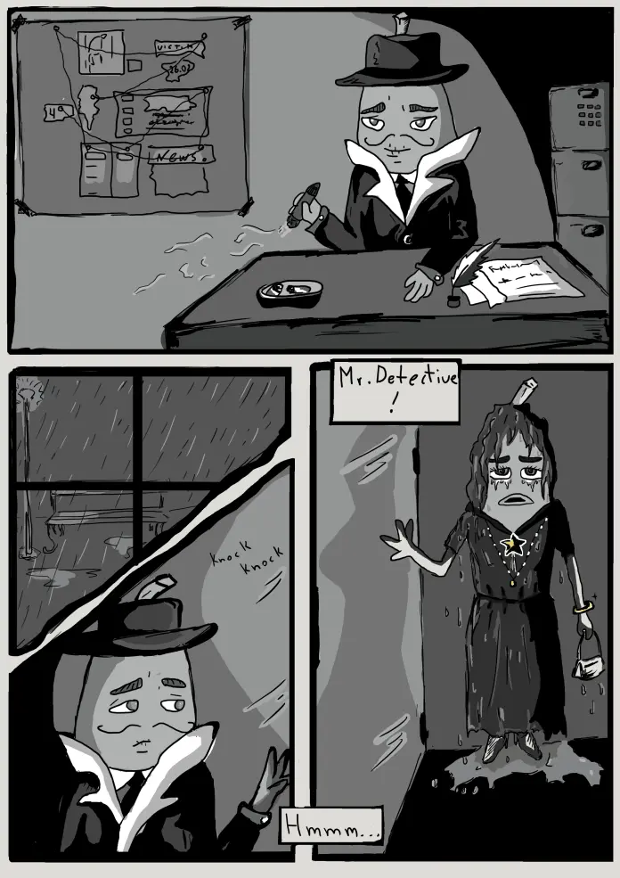
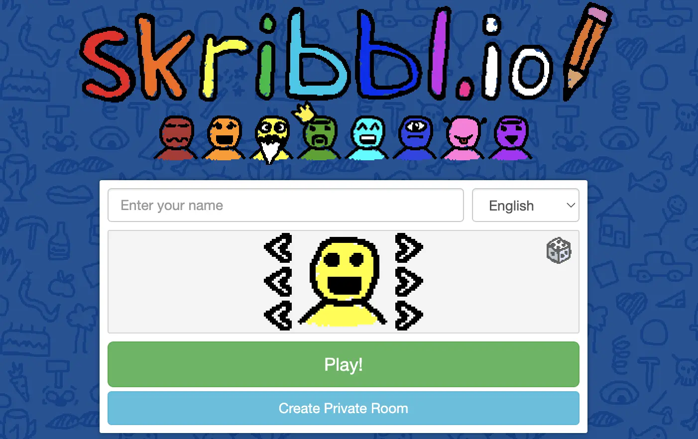
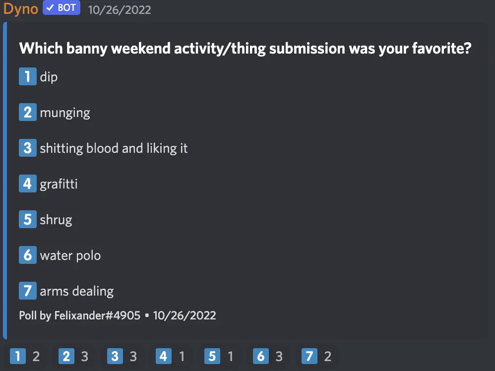

Art by [Sage Kellyn](https://twitter.com/SageKellyn)

## Audit Fund Recap by Nicholas

icholas created the Audit Fund project to raise funds from our community members to pay Code4rena for the NFT Rewards contract audit contest, before the funds were distributed from the DAO. For more details about this project, please refer the [summary of Town Hall last week](https://docs.juicebox.money/blog/2022-10-18-town-hall).

On Oct. 22nd, after the grants from the DAO was added to the balance of the treasury of Audit Fund (`Add to balance` is a method to pay a Juicebox treasury without invoking minting of tokens, which in this case is to make sure the donors can have their full refund), people started to redeem their project tokens to get the ETH they donated a few days ago back in full amount.

Also a total of 9,000,000 JBX rewards (3m JBX by the DAO, and 3m JBX matched by Jango and Peri respectively) for donors to this Audit Fund project have been airdropped by Nicholas today.

It seems that the Code4rena found this crowdfunding project  very interesting, which maybe would lead to a future partnership between JuiceboxDAO and Code4rena.

According to Nicholas, this project will probably stay open later on, as there will be future audits, such as  the one for veNFT at some point in the future, or even audits of smaller scales in between.

## NFT Rewards Audit Update by Jango

The Code4rena Audit contest for our NFT Rewards has finished.

Everything went quite smoothly, we've got a report with close to 200 line items of the findings from Code4rena that catalogued as high severity, medium severity, gas optimization, etc. JuiceboxDAO Devs have spent several days triaging problems found, reading through and getting the gist of issues, while been in touch with a few wardens throughout the week.

The good new is that it looks like no critical timeline-busting issues were found, so we will still be on track of deploying it to the mainnet next week as planned.

Jango thinks the audit is a better process prior to deploying. We've learned from the audit of V2 protocol that even though a project seems like it has been a long while coming and feels ready and well tested, sometimes it still can lead to more annoying stuff later on. So we'd better take the final step of looking at things closely and sharing it with the world and incentivizing folks to poke around.

The next couple days, our contract squad will be getting their test suite up to date with the changes included. If all goes well, we'll probably be aiming for deployment on Mainnet on Monday or early next week. Projects will be able to attach it into their funding cycles and deploy NFT Rewards in less than a week.

## New Project Create Flow by Wraeth

Frontend team, especially Strath and Wraeth, has been working on this new create flow for nearly two months. The whole idea is to make this process a lot more simple than what we currently have, in order to make the experience of project creation more enjoyable for users.

Strath has come to the [Town Hall on  Sept. 13, 2022](https://docs.juicebox.money/blog/2022-09-13-town-hall) and given a preliminary introduction to this project.

Today, this new create flow has been deployed on [goerli.juicebox.money](https://goerli.juicebox.money/create). Wraeth walked us through every steps of the create flow by demonstrating the creation of a project [Flamingo Sunday](https://goerli.juicebox.money/v2/p/72).

Some characteristics of this create flow:

- This create flow breaks down our current creation process into different steps, so that project creators basically only need to make one big decision every step, so as to alleviate their cognitive load in this process.

- This new flow tries to simplify the UI and make interface neat and clean, by folding some optional choices or hiding some unselected information away, so that project creators don't need to be bombarded with too much information in their project creation.
- The create flow supplies some default templates such as `Automated Funding Cycle`, `Default Token Settings`, etc., so that project creators can just choose the frequently used configurations instead of having to customize their own every step of the way.

-  It integrates the new NFT Rewards contract, project creators now have more choices to incentive their supporters, though the contract is expansive so a lot of functionalities might need to be added in future iterations.

This product is not yet finished and might need some iterations to improve it a little bit more. Try it out, and if you have feed back, please come to share with us in the [Project Creation Feedback](https://discord.com/channels/775859454780244028/1034595089374257192) thread under the Frontend channel of JuiceboxDAO Discord.

## StudioDAO Sesh by Kenbot

Kenbot was very grateful for Jango's encouragement to build in public, which has changed their way to build this project. They have set up a dedicated channel in JuiceboxDAO's Discord to incubate this project, from where it got traction and really moved out into the real world. And Kenbot also expressed his gratitude towards Aeolian especially who heroically helped building some very key feature and energized the whole process.

Kenbot also made a demo on the Town Hall to showcase all the items on the [webpage of StudioDAO](https://www.studiodao.xyz/), which he hoped would become a dashboard of fun things to do and be related to the NFT collection of community members. He thinks that crazy ideas will start from here and will be able to have more and more funding so that things will grow from the bottom up to their brilliant success.

## DevCon Casa Event Recap by Bruxa

Bruxa came to the Town Hall, and shared her deep gratitude for what this project has helped bringing forward, both as a personal transformative experience and as a transforming opportunity for the Thirsty Thirsty community.

She also wanted to share that the grant from JuiceboxDAO has not only obviously helped make such a beautiful experience, but also already generated really serious impact for their community. On one hand, some of that grant provides fantastic runway for Thirsty Thirsty as a nonprofit to continue operating, on the other, it also helps individual community memebers in some realistic ways, such as improving their personal life, and renewing their enthusiasm for what's possible in the community.

Jango also expressed appreciation for what Bruxa and the Thirsty Thirsty community have pulled together on this event. He thinks a lot of our community members are pretty narrowly focused and collaborative with folks who share a high bandwidth JuiceboxDAO perspective. And It is very awesome to come together with all kinds of brilliant people in all kinds of brilliant places with different themes.

Bruxa also invited Juicebox community members who happen to attend the SF Blockchain Week 2022 to join the activities by Thirsty Thirsty community in that interval. They are planning to arrange some casual vineyard visit, and would love to meet more Juicebox folks over there.

## Bannyverse Comic 2 Teaser and Defifa Press with Felixander

Felixander said he would be putting more effort into the Bannyverse and working on building out Banny with more zany/crazy memes.

Also he is going to work on the Ad page that ComicsDAO provides us in their NounsDAO comic book. He will work with Brutula and set up a thread in the Discord to have more discussion on this matter.

The 2nd edition of Banny comic is coming out soon, here is the teaser of the story of detective Banny.

And about the Defifa press, Felixander has been reaching out to get some press to cover our Defifa project before its launch. He invited any kind of help to that matter and was open to any ideas on getting the ball rolling over there.

## Depraved Pictionary with Felixander

On the meeting Felixander asked some DAO members to give him a one-word activity or an item that Banny gets up to on a wild weekend. And he invited some of the members to play a game at skribble.io, in which one person is to draw a picture from their word while the rest of member are supposed to guess what that word it.

After the game, Felixander set up a poll to see what is the most favorite word/item in the game.

