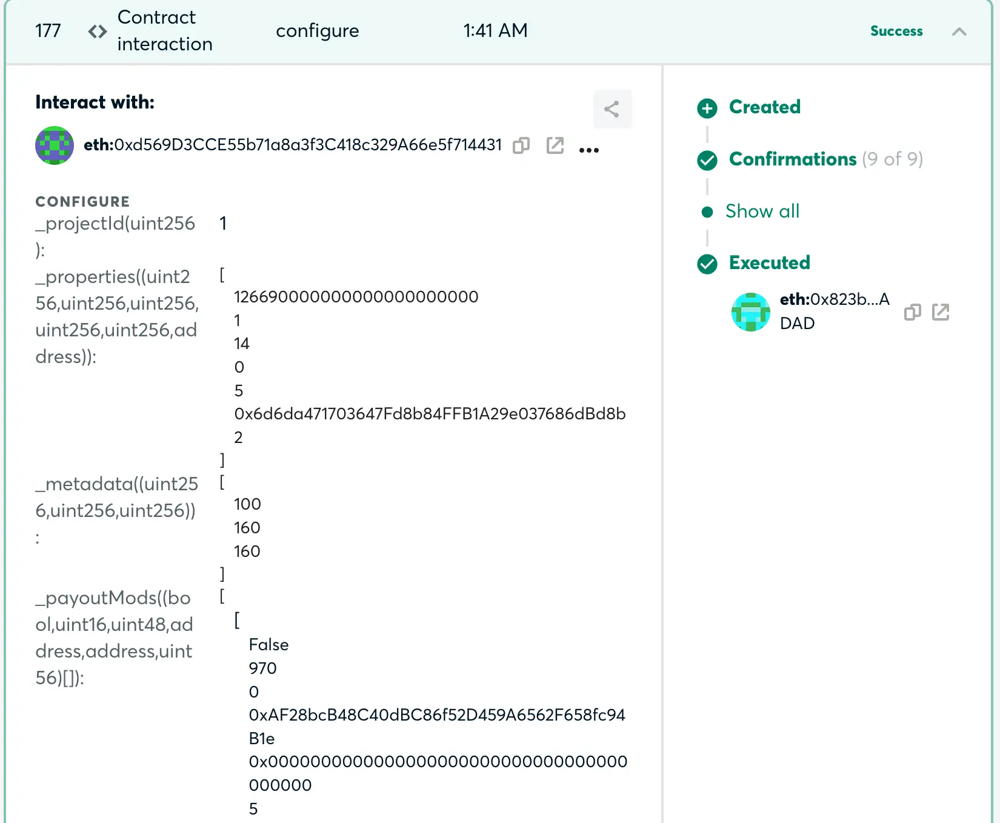
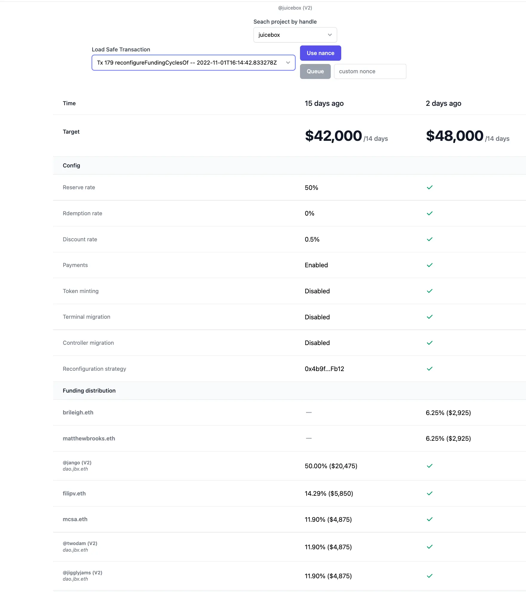
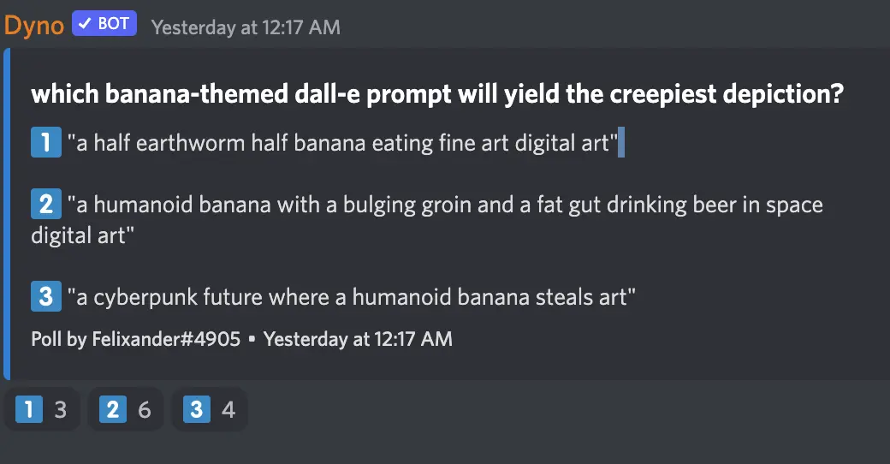

Art by [Sage Kellyn](https://twitter.com/SageKellyn)

## Reconfiguration Helper Updates with Jigglyjams

This [reconfiguration helper](https://juicetool.xyz/juicebox) tool was developed under the collaboration of Twodam and Jigglyjams.

### Context reading:

Submission of transactions for Gnosis safe multisig used to be a very tedious process:

- After governance process, someone will have to sort out differences in payouts (new splits or removal) according to proposals passed, and compile the new list into a spreadsheet;
- Someone will have to review the new payouts and then revise them one by one on the reconfiguration interface, ofter times involving some calculation of percentages; (if it's a funding cycle with dozens payout proposal, it can be a very back breaking effort. We should shout out to Jango and Twodam for handling these in the past.)
- The transaction details on Gnosis safe is very complicated and not at all friendly for a  non-Dev to read,  let alone tell the rights or wrongs.

### How this tool works

So Twodam and Jigglyjams worked together to solve this pain point, by retrieving data from the Ongoing contributor payouts table in Notion after each governance process and display them properly next to those of last funding cycle, so that operators or multisig members can easily compare if the differences are complying with our governance results.

This reconfiguration helper will line up two adjacent funding cycles reconfiguration parameters, one being of the current funding cycle, and the other one being the upcoming funding cycle, so that an operator can compare  and decide if the differences between them are consistent with governance voting results. If yes, then the operator can sign and submit the new reconfiguration transaction to the Gnosis safe, where the multisig signatories can sign to queue the transaction onto the blockchain. Also, multisig member can use this to confirm transactions are correct or not before they proceed to sign. After the transaction is executed, the reconfiguration will be finished.

As the data are fetched from our Notion database,  the operator don't need to manually calculate on the interface of Juicebox.money before submitting the transaction any longer. Especially when JuiceboxDAO will potentially have 3 reconfigurations (V1, V2 and V3) to update every funding cycle in the future, this helper will definitely make life a lot easier for mutisig signatories and the operators.

## Notes from Jango

- NFT Rewards 721 delegate has been deployed to mainnet
- Defifa project is coming down to the wire. All the pieces are looking good but will need to stitch them together.
- Multisig members please review and sign transactions.

## Front end timeline of NFT create flow deployment and Versioning deployment by JohnnyD

As far as launching new project with NFT, That's all covered on the front end. It's basically just a flag we need to switch on, and we are just working up to the news that the contracts have been deployed. And then that will enable new projects to be launched with NFT rewards on mainnet.

The next step in the frontend's timeline will be releasing the reconfiguration functionality which is aimed for projects that already have NFTs and want to reconfigure those NFTs.

The step after that is to make it possible for projects without NFTs now to reconfigure their funding cycles to have NFTs attached, which will be last piece of the puzzle on the frontend side.

## Juice RSS by Filipv

Filipv made a Deno script that provides an RSS feed for Juicebox projects. When new Juicebox projects are created, the information can be retrieved with a RSS reader.

If people are interested in getting the most up-to-date info about new projects on Juicebox, they can add this link to their RSS reader: https://juice-rss.deno.dev/.

And the repo to this script is [here](https://github.com/filipvvv/juice-rss).

## Bannyverse updates with Felixander

Felixander build a rudimentary and simple website for Bannyverse [here](https://felixanderfelixand.wixsite.com/bannyverse), where he thinks we might curate some arts or maybe organize some art contests.

In visibility, he was trying to establish some kind of baseline of the situation of current visibility. And he also mentioned that September was the best month in this concern on the blogs since we started.

And he created a Juicebox project called [JB Eyeball Collection Fund](https://juicebox.money/v2/p/293) to raise funds for the marketing budget, which stemmed from the discussion we had about the possibility of some different forms of marketing. The initiatives that Felixander was currently looking at putting the marketing budget would be:

- To hold some kind of press release for projects like Defifa,
- To run art contests or Banny meme contests, collaborating with other Web3 artists
- To hold a treasure hunt related to Bannyverse culture.

 ## AI Drawing Connoisseur with Felixander

Fexliander prepared 3 prompts in a poll and ask community member to guess which one of them was going to generated the most creepy image when thrown upon Dall-E the AI drawing.

## ConstitutionDAO Podcast Series Update with Matthewbrooks and Brileigh

They managed to arrange an interview with Brooke Lampley, the chairman of Sotheby's who were on the auction floor bidding on behalf of  ConstitutionDAO last year.

Also they will talk with Julian Weisser and Will Papper, core contributors to the ConstitutionDAO as part of the ConstitutionDAO podcast.

They are going to make several episodes for this ConstitutionDAO podcast, and probably will release the first episode around the mid of November, hopefully on the actual day of the anniversary of ConstitutionDAO.

