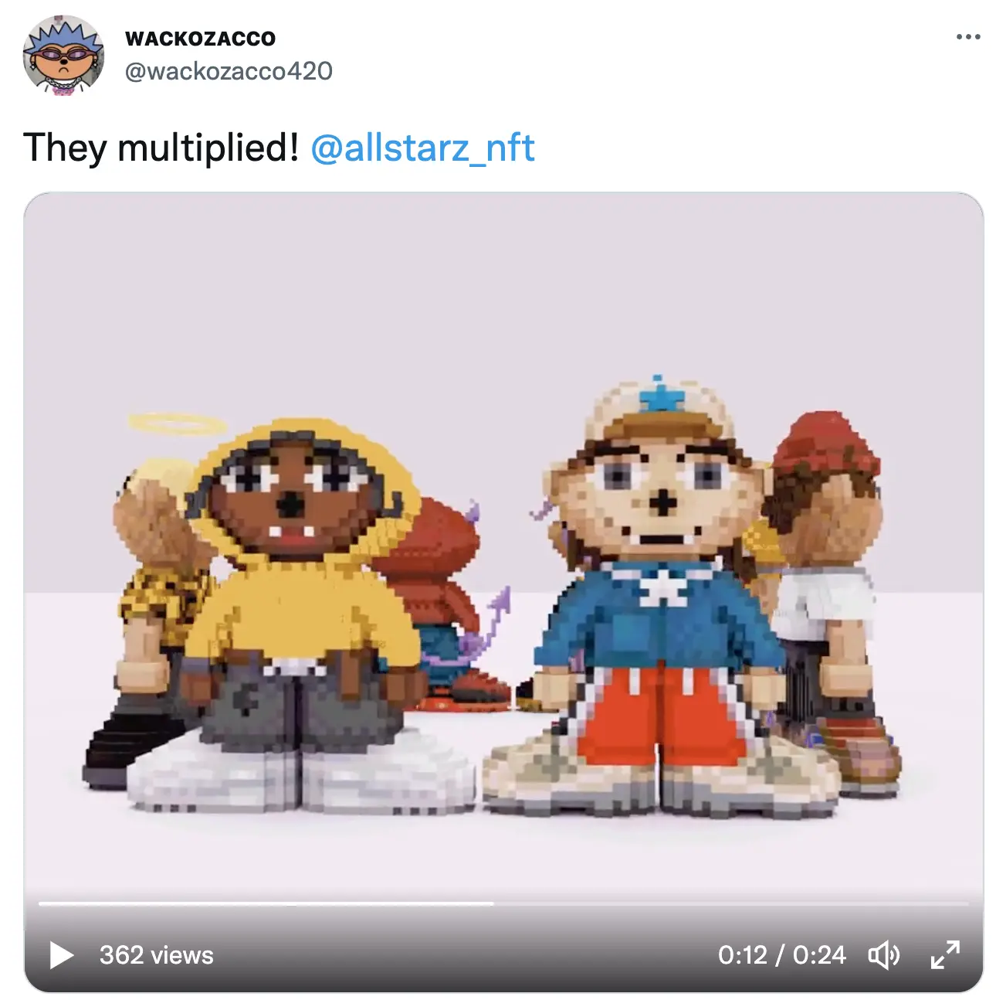
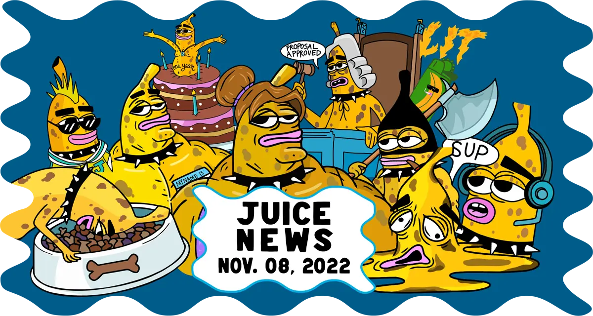
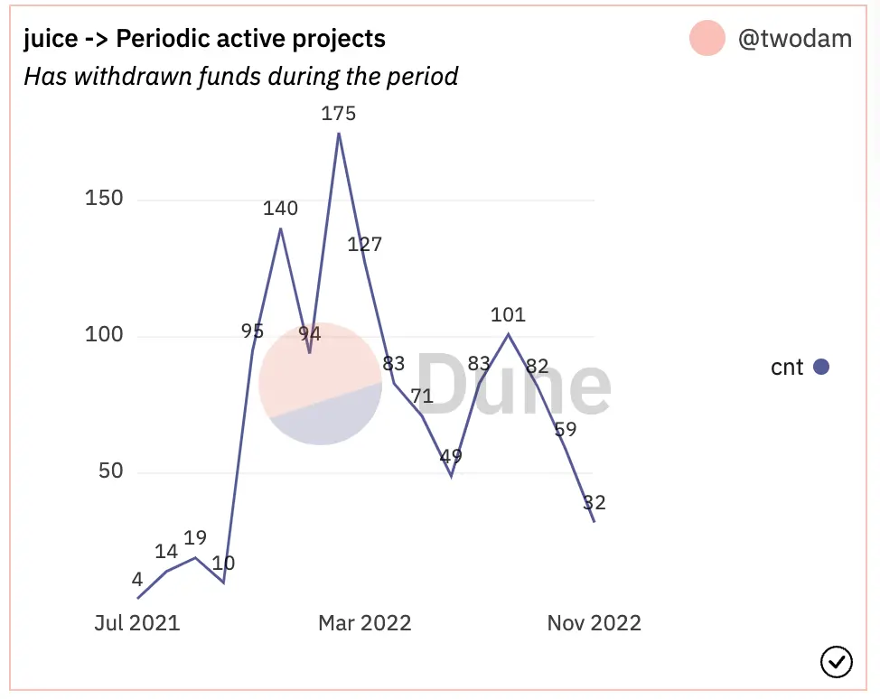

Art by [Sage Kellyn](https://twitter.com/SageKellyn)

## Defifa Update by Jango

The Defifa project was first launched on Nov. 06.  It has been a pretty huge week tying all the parts together to the last minute. Folks in the frontend had to cope with some contracts that came in within 48 hours and did a great job of creating a very slick website at [defifa.net](https://www.defifa.net/).  The project was put on Goerli testnet for some testing runs before it was launched officially on mainnet.

We should give a huge shoutout to 0xBA5ED for calling out a bug in the ownership of the contract, which was relatively ideal with only about 1.8 ETH put into the treasury.  The team decided to temporarily pause the minting and put up a new project for it after cleaning up the bug in the past 24 hours, as well as making progress in the frontend for other features.

Everyone who minted in the previous version can get their full refund [here](https://take1.defifa.net/) and we will  use the project's budget to refund gas to them later.

 We are now having a new version ready and tests are feeling very complete along the way.  The Defifa project is a little decorative thing on top of the NFT Rewards, but it still has some tricky things to get right, especially when it comes to making sure things have access to their funds and correct amount throughtout.

But so far so good, it has been a good process, we're  excited to see this experiment play out. This project might be a bit slow for the first week, we'll use that time to explain it better, write about it, refine it if needed. Hopefully towards the start of the kickoff, the whole world will be reminded that the World Cup is just around the corner and there's a cool Defifa game that might be trending here and there.

## V3 Frontend Update by Aeolian

V3 protocol has been enabled on Juicebox.money right now.

- For new project creators.

  If project creators are creating a new project on juicebox.money right now using the new create flow, it will be launched with the Juicebox V3 contracts.

- For existing project owner.

  We will be releasing tools and probably some documentation on how to upgrade the existing projects to V3 protocol. That's totally optional. The existing V2 projects will be working as normal, and we're definitely planning on maintaining backwards compatibility.

But importantly, new projects that are launched on V3 will have access to NFT Rewards when it goes live, which is about to happen quite soon. Later on, projects migrating from V2 will also be able to make use of this functionality also.

Strath and Wraeth, the developers who created and implemented the new create flow, invite people to give some feedback and report bugs.

## $Joke Airdrop by Seanmc

Firstly, Seanmc extended their gratitude towards the Juicebox community for the continuing support to JokeDAO, and for the grants by JuiceboxDAO which has been very helpful to their development.

The day before this town hall, they sent $Joke tokens to people who have contributed to the [JokeDAO Juicebox project](https://juicebox.money/@jokedao), at a rate of 5,000 $Joke per ETH. The multisig of JuiceboxDAO also received 27,096.482 $Joke tokens for the grants distributed to the JokeDAO project.

The proposal that approved the grants to JokeDAO is [JBP-211-Sponsor Development of JokeDAO V2](https://juicetool.xyz/snapshot/jbdao.eth/proposal/0xecb6ba5ca205acb63cb430d6e94cb48e8b0ff8f1e83a0d1478d35f729ab1532f) which was divided into 3 milestones. JokeDAO has completed the 1st milestone and demonstrated its results to JuiceboxDAO in the town hall of Aug. 16, 2022. Now they are still working on delivering the 2nd milestone of the grants.

Seanmc also introduced that the $Joke is the governance token of JokeDAO, which is used to determine the direction of JokeDAO and what they will be working on. Also JokeDAO holds jokerace every week, people will receive a voting token every week proportionate to the amount of $Joke they are holding, so that they can participate in the jokerace. Jokerace is either their MVP or the game they play with the platform that they're building at JokeDAO, which is a bottom-up governance platform made to be community centric for more emergent and fun governance, instead of a top-down governance that core team submitting proposals to the community like a board of directors.

The primary thing that they are working on right now is delivering the 2nd milestone for the Juicebox grants, which will be the executable contracts. These contracts will allow people to deploy a module to reward different amounts to different ranks in a certain contest, where you can customize whatever ranks  and whatever amount of arbitrary ERC-20 token to reward. Anyone can make their own rewards module based on given contests.

## Bookkeeping Demo by Gulan

Gulan came to the town hall and introduced his new tool for bookkeeping in JuiceboxDAO. This tool is supposed to unify all the payout information of proposals in one place and show what the liabilities of the DAO will be conclusively in the future funding cycles. Also it can acutomatically import data from the blockchain in real time, so anything that is happening on our multisig will be fetched and stored. Finally it will be able to export all the values into Notion where Jigglyjams will be able to read them automatically into Nance, to keep a continuity of data between defferent parts of the work flow.

Also Gulan explained about the CogniDAO he has been working on lately. The main purpose of CogniDAO is that, instead of him asking individuals for receipts in order to submit the expenses into bookkeeping process, CogniDAO acutally is a way to get the payment rails all aligned so that he can get the invoices, debit card info automatically and those will be plug and play into the system themselves. The whole point of using CogniDAO, according to Gulan, is to just have a passive entity in order to execute actual transactions so that payment-wise things can happen as soon as possible.

## Forming Update by Darbytrash

Later this month, on Nov. 27, Lexicon Devils will be doing a Forming and [AllSTARZ](https://twitter.com/allstarz_nft) collab. Wackozacco has made a bunch of Voxels models for the ALLSTARZ collection and will make them wearables in Cryptovoxels.

They are going to make a mixtape for all the previous Forming events, and use that to build hype around Forming and share more culture amongst more communities. They had a productive meeting yesterday and discussed some game plans and what other NFT communities they want to reach out, so as to keep moving forward with Forming.

## Governance Cycle Update by Matthewbrooks

Matthew gave a brief summary to all the proposals in the current governance cycle. He also posted a threaded tweet on this matter, which can be found [here](https://twitter.com/0xmatthewb/status/1590084862647578625?s=20&t=7gwlDDa9s27MUA6NNWP6-g).

Also Matthew and Brileigh released a [new edition of Juicenews](https://juicenews.beehiiv.com/p/juicenews-nov-08), summing up all major activities happened in Juicebox ecosystem last week.

## Juicebox Metrics by Filipv

From Nov. 01 to the day of this town hall, we had 266 ETH in raised volume with an average contribution size of 1.26 ETH. There were 11 new projects and 21 active projects in this period of time.

And periodic active projects on the protocol are on a down trend.

## Alien to Me Demo by Connor & Kenbot

 [Alien to Me](https://twitter.com/Alien_to_Me) is a show that is going to launch on either [StudioDAO](https://www.studiodao.xyz/) and Juicebox. As the creator of this show, Connor came to the town hall and introduced what they've been doing on StudioDAO. He shared his screen to reveal the page they are working on by introducing all the items on that page. He also explained specifically what their super ticket options or NFT Rewards tiers would be.

And [here](https://www.youtube.com/watch?v=SOE7Uw7y8H4) is the trailer video of Alien to Me. Enjoy!

Kenbot praised Connor for his great job pulling this together and they are going to make this show a real project on StudioDAO. And the whole point is to create a context for more creators to launch Juicebox projects that can become a part of the network. As people are looking for ways to incubate and help new artists get started, Kenbot thought they will get the platform operational very soon so that they can open up the funnel to onboard more creators, which is definitely a critical part of building the StudioDAO network.

Kenbot also said that StudioDAO is going to launch their Greenlight Treasury first and open up the DAO for early membership, before going into a phase of establishing the governance, launching the first lot of projects and opening up a way for people to pitch to the StudioDAO for projects to get admitted.

## University Blockchain Club Initiative by 0xSTVG

0xSTVG has recently been working very hard to connect with some university blockchain clubs.  Jango, Nicholas and 0xSTVG presented a technical overview for Stanford blockchain club earlier last month.

Today he was going to meet with cryto club of University of Michigan, which is one of the most crypto friendly universities in the world, together with Nicholas and Filipe, to give a general overview of Juicebox, and then they are going to have a Q&A session with the members of the student body.

And at the invitation of UCI (University of California, Irvine), he is going to join them on Nov. 21st to introduce more about Juicebox.

