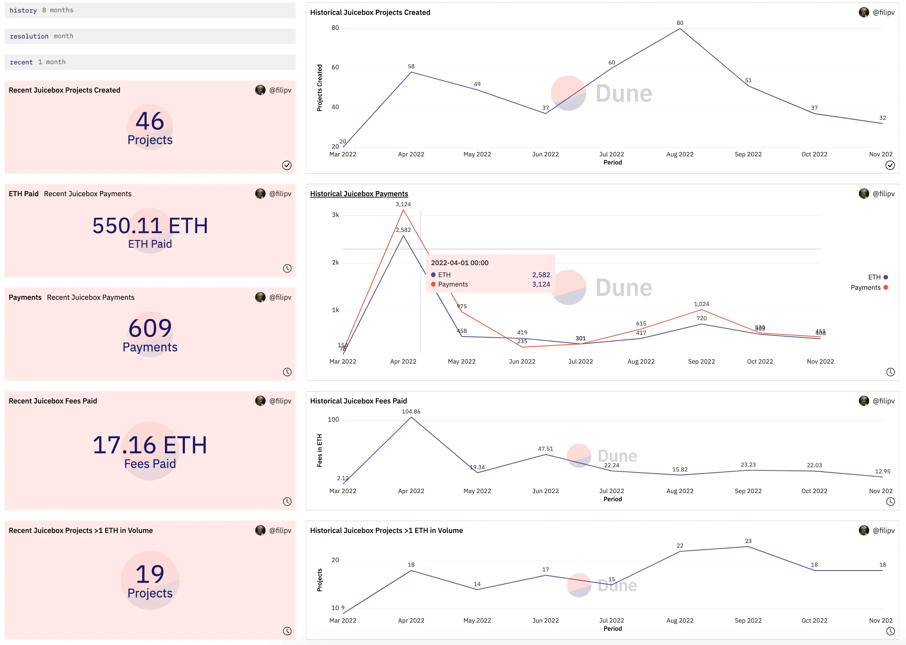
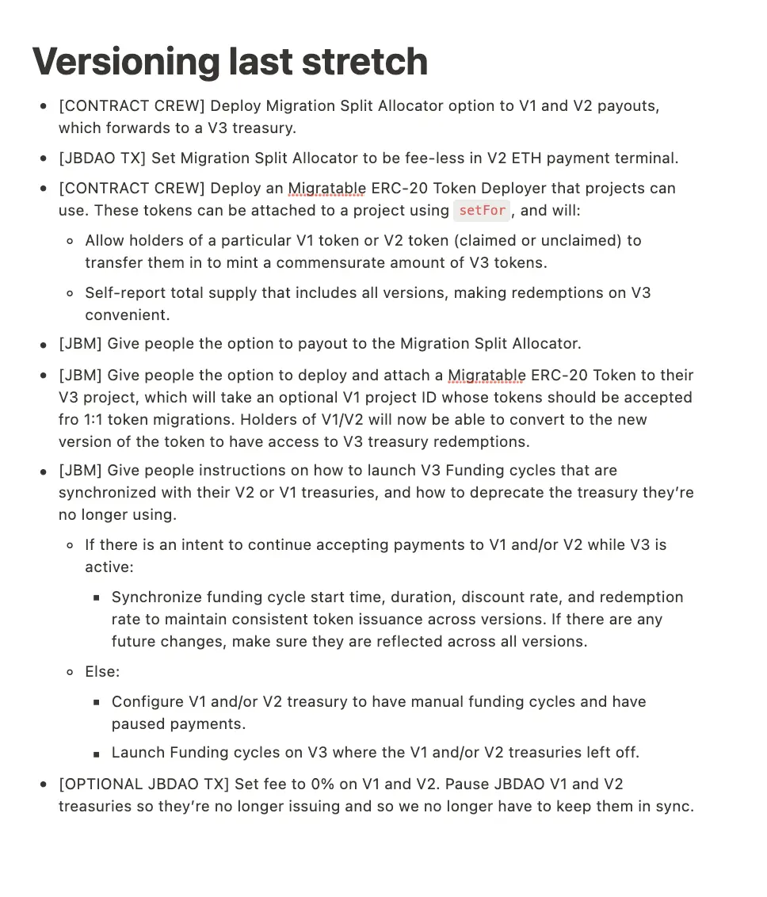
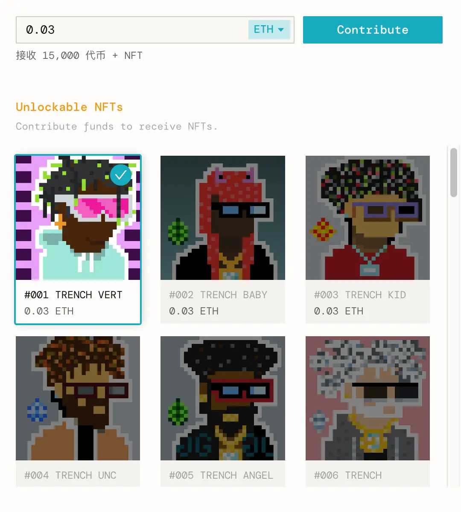
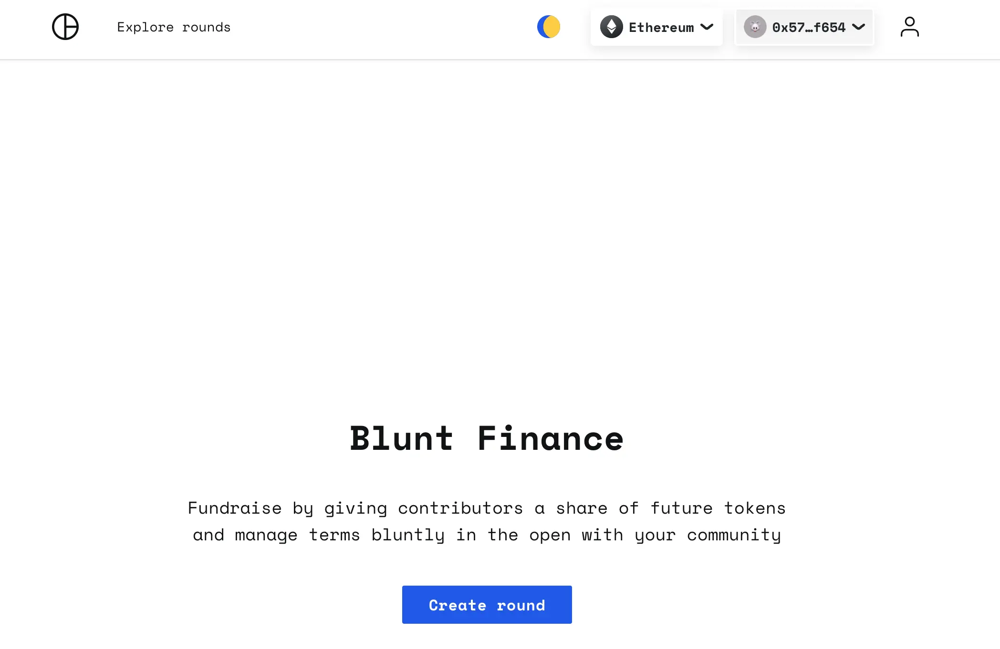
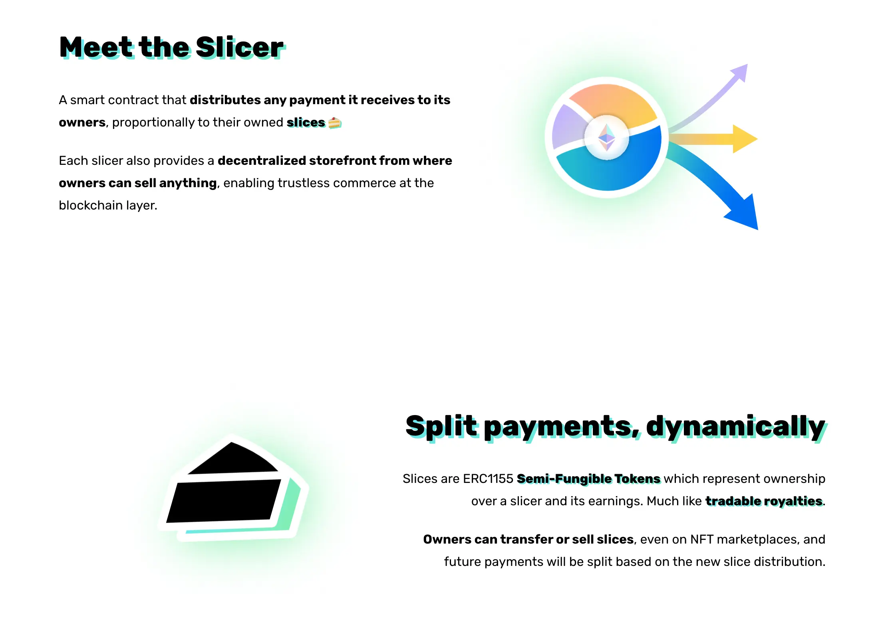
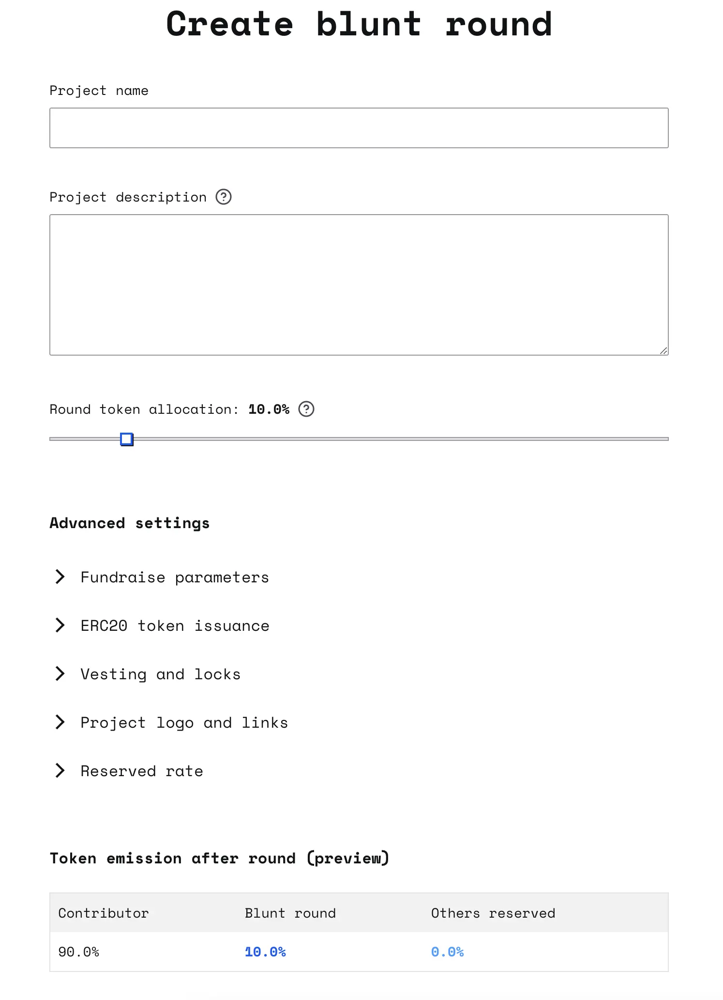
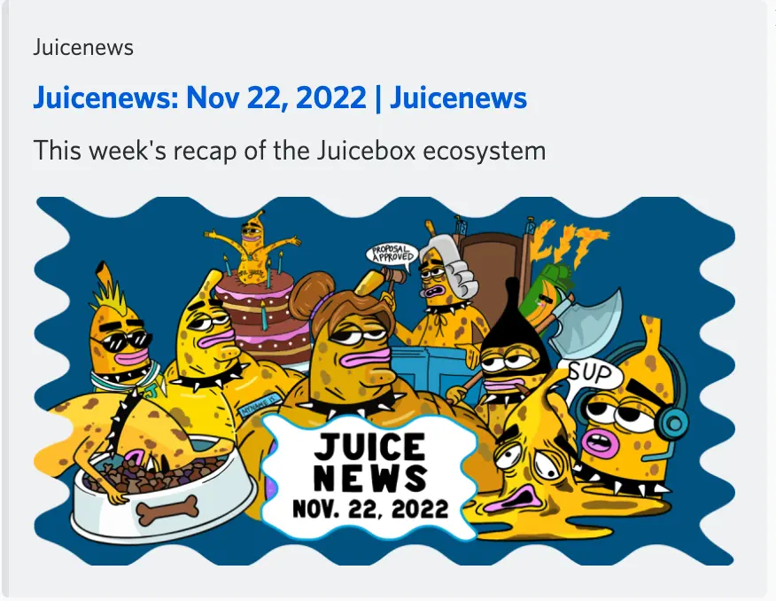
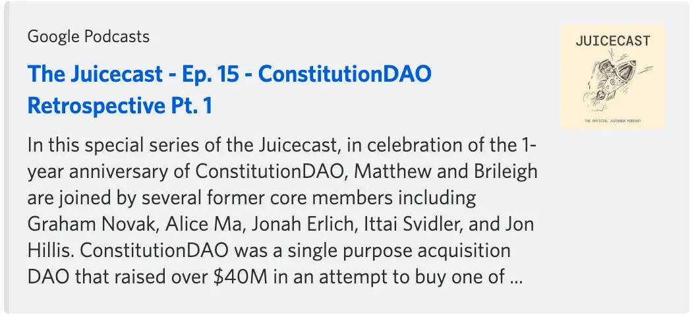
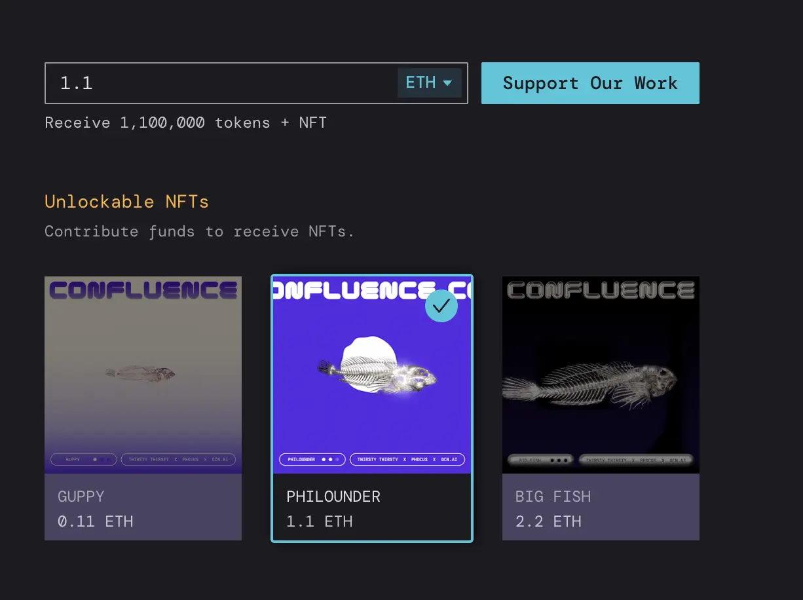
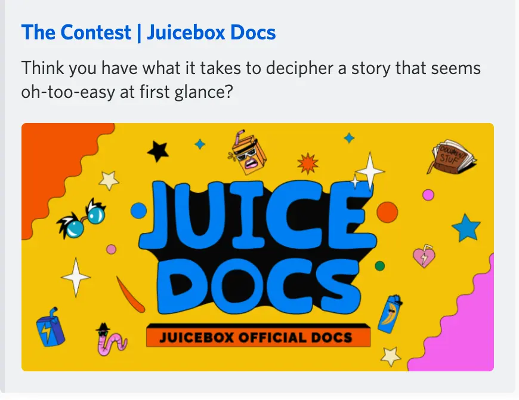

Art by [Sage Kellyn](https://twitter.com/SageKellyn)

## Protocol Analytics by Filipv

Our project creations and payments in the past 30 days are both well above historical averages.

## V3 Versioning by Jango

ONNI's project [The Marfa Giant](https://juicebox.money/@marfagiant) managed to get on V3 earlier today with an NFT collection, it is our first project deployed on V2 that managed to launch a new V3 treasury. We're working through that UX with Peel frontend team, and any small inconsistencies are getting ironed out pretty quickly. It feels good to be on the tailend of using the stuff we've been building and getting projects through the finish line.

Next stop for versioning will be making use of the splits allocator components that Viraz has been working on, for projects that want to keep their V1 and V2 treasuries online to just basically forward any received funds into their V3 treasury. Those split allocators are written, tested and up for review right now, and probably will be  deployed in the coming weeks.

And also projects migrating to V3 should be able to use a V3 ERC-20 token if they choose to, by accepting V1 and V2 tokens through a migrate function and sending back out the V3 ERC-20 tokens, so as to maintain the total supply balance across all versions. This is also written and in reviews, thanks to the great work by Viraz again.

Currently V2 projects can launch their V3 funding cycles with the new NFT rewards functionality. Also they can choose to reconfigure their V2 treasury to be paused and converge onto V3 protocol, or operate both treasuries at the same time, which is what JuiceboxDAO is going to do.

As per Jango, here are the final steps folks will need to take in order for communities on V1 and/or V2 to safely launch on V3:

Finally, there're two pending projects that were prototyped in the summer but put on hold as we proceeded to build out V3 and the NFT extension, they are more oriented towards strengthening the JBX mechanism.

- JBX fee module. This is a pay delegate. When payments are made into the JuiceboxDAO treasury, this delegate can make a decision whether to issue new tokens at a particular mint rate, or to go to the AMMs and swap the funds for JBX,  and then issue them to the beneficiaries.

    This will help projects who pay fees to our treasury to get the best rate for JBX, but the tradeoff is we might not be receiving ETH into the treasury any more. We're just supporting the distribution of JBX.

    It's a component that has been researched and prototyped, but we'll have to come together and figure out if that's indeed the move in the form of a proposal, which will probably be the first thing in 2023 once we finish the process of migrating JBX over to V3.
- veNFT. This is an NFT minted with locked project token, which can be used as either another accounting or governance primitive. Obviously the V3 token is what we will use here, so we will need to finish some of this prerequisite versioning work metioned above first.

## Update by Lexicon Devils

Lexocon Devils will be hosting the Forming and ALLSTARZ collab on November 27th, 3pm PST, at the [Juicebox headquarter in Cryptovoxels](http://juicebox.lexicondevils.xyz/).

Lexicon Devils' Youtube channel is [here](https://www.youtube.com/channel/UCdVQneduBYdjgHngd5zR79A), where you can check all the past Forming events.

## YouniDAO Launch with Brenna and Saiko

YouniDAO is a DAO that amed at finding a way for local independent musicians to make a living off their creativity. They just launched their crowdfunding [Juicebox project](https://juicebox.money/@younidao) lately, with a Trench Family collection of 33 NFTs for their contributors. YouniDAO is one of the first projects on Juicebox to make use of our NFT rewards functionality.

They are currently doing an onboarding crowdfund campaign for Uni Fest Summers 2023, with the goal of making it the first web3 backed tour for independent musicians.

Also Saiko said there's a gigantic aspect of mindfulness around YouniDAO, which literally means you and I DAO, and they want to have a way to make everyone harmoniously assimilate in a certain way, because they feel strong being together, while at the same time valuing the personalities that they already got to interact with on a day-to-day basis.

They extended their gratitude towards Jango and folks in the Juicebox community, for supporting them to create and launch this project. They are very excited to be alongside Juicebox and for what is to come in the future.

## Blunt Finance with Jacopo and Jango

Basically [Blunt Finance](https://blunt.finance/) is a Juicebox project funding cycle that has some additional features and follows some special rules. The way they are presenting right now is that it allows "Fundraise by giving contributors a share of future tokens and manage terms bluntly in the open with your community".

There are a few perks that Blunt Finance has, one of them is that you are able to allocate a percentage of what is actually the reserve rate of a Juicebox project to those who have contributed. The way it achieves this is because it actually uses both Juicebox and [Slice](https://slice.so/) under the hood.

Context: <a href="https://slice.so/">Slicer and Slice</a>

Once a blunt round is completed, there will be a slicer, which is another smart contract developed by Jacopo, assigned to the reserved rate of the Juicebox funding cycle and take care of all the complexity by basically giving all the contributors a share depending on the amount they contributed and putting that automatically in the reserve rate.

These are some of the advanced settings that one can make use of when they are setting up a blunt project.

A blunt round is basically a funding cycle that has some special rules, and it's divided in two different stages:

1. The first stage is a fundrasing stage where people can contribute like they do to a Juicebox project. The difference here is that a blunt round has both a target and a hardcap, which a typical Juicebox project doen't has.

1. When the contributions reach the target or eventually the hardcap, the project owner is able to close the round, and it allows the owners to claim their slices of the slicer and the project becomes a typical Juicebox project.

On the other hand, if the round doesn't close successfully which means the target of the fundraise hasn't been reached, the project owners will never receive the ownership of the actual Juicebox project. And the project winds up and contributors can get full refund of what they contributed.

Blunt finance is to give everyone who contributed during one funding cycle a share of issuance in future funding cycles, in a way like funding cycle #1 being a fundraise round, and during the subsequent funding cycles you can give everyone who participated in the fundraise round special incentives like product rounds where you just route some other fee/income into it.

Basically a blunt round lets you create a slicer which acts like an address representing all the participants in the first round and then you can just include that address in subsequent funding cycles on the reserve list. If someone wants to make an investment in a project but not be diluted by subsequent token issuance, this would be a mechanism to achieve that, which is also one of the reasons that Jacopo came up with this idea so as to make it possible to raise funds from private investors or institutions.

Although you could achieve the same thing by just collecting all the addresses of participants and manually include them in the reserve list, but with blunt round you could theorectically program the owners to be others than you, and the whole project will automate everything, or you can send it directly to governance contracts that's run by anything. Also it add a few funding cycle specific parameters such as hardcap and refund and a few more mental modeling things around fundraising that get hardcoded into the funding cycle #1.

Jacopo also introduced that currently the contracts are mostly done, there might be some tuning and maybe some last minute addtional features, but they're basically finalized. People will be able to play with all this stuff on Goerli testnet in a few days.

## Visibility by Matthewbrooks and Brileigh

They just published the new edition of Juicenews [here](https://juicenews.beehiiv.com/p/juicenews-nov-22), you can also subscribe to this newsletter which will be sent to your email on a weekly basis.

Matthew and Brileigh have also released a new episode of Juicecast, which is the first episode of ConstitutionDAO deepdive series they are producing for the ConstitutionDAO anniversary. The full Juicecast episodes can be found [here](https://anchor.fm/thejuicecast).

## Confluence Miami by Bruxa

Bruxa and friends are going to hold a very wonderful event called [Confluence](https://www.confluencetalks.xyz/) during Art Basel 2022.

Confluence, with the theme of "The Intersection of Cryptocurrency and Climate Change", is aimed at bringing together innovators in the climate and web3 spaces to discuss wins and fears around emergent blockchain infrastructure. And there will be an art auction to raise funds for Thirsty Thirsty (regenerative agriculture) and [OCN.ai](http://ocn.ai/) (regenerative ocean metrics) on this event.

They created a [Confluence @Art Basel 2022](https://juicebox.money/v2/p/315) project on Juicebox to raise funds for this event, making use of the new NFT rewards of Juicebox, to experiment a way to support this kind of activities in the future.

## A Contest by Felixander

Felixander created a contest, the details of which he has put into a blog [here](https://docs.juicebox.money/blog/the-contest-part-1/),  for the purpose of attracting more new members or Non-crypto native people into our Juicebox community.

This contest is actually a treasure hunt, and the treasure lies in an [Ethereum wallet address](https://etherscan.io/address/0xf9d30330af73687cda29dfe51479d0eaa05a30fe) that Felixander and WAGMI Studio have thrown some funds inside. Currenty there is 1.29 ETH in it and most importantly there are another 4 Defifa NFTs (Brazil, Argentine, France and Portugal) which might be very valuable if those teams turn out to be in the winning category on the World Cup 2022.

The hints to get the 12 seed phrases of this Ethererum wallet address will be in the story Felixander is going to tell. The story comes in 5 parts, the first part of which will be dropped on Thanksgiving , and the rest will be released every Monday afterwards until December 19th. Read throught the whole story and you will have the chance to solve this puzzle by Felixander and get that treasure!

