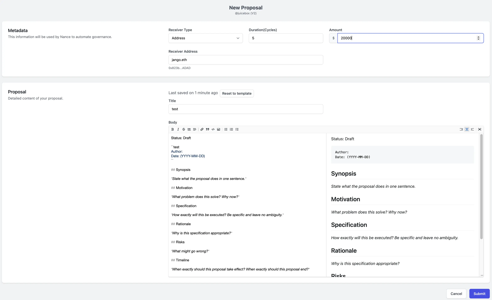
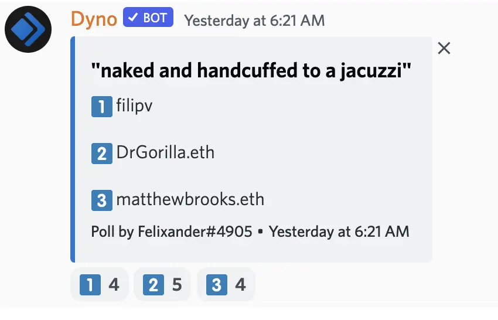
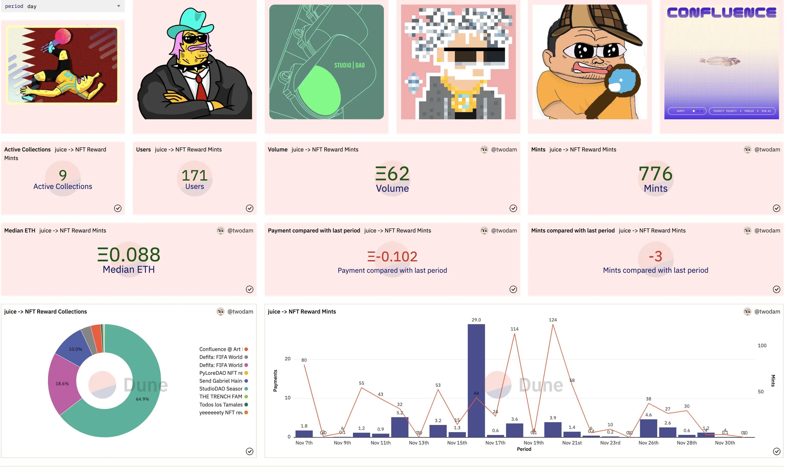

Art by [Sage Kellyn](https://twitter.com/SageKellyn)

## Infura gate postmortem by Peri and Filipv

On November 25th, the Juicebox.money website suffered a downtime of about 40 minutes. This came from the increased traffic from [the Gabriel project](https://juicebox.money/v2/p/327), which attracted a lot of attention and ended up pushing us over a request quota in the Infura services we are using. We shouldn't have had a request quota with Infura, so something might went wrong in this matter.

We havn't really reached a conclusion yet on what happened, but as now Infura is taking steps to remove all rate limits on our accounts, at least in the perceivable future, we don't expect this problem to happen again.

The upside of this problem is that it helped us to figure out some inefficiencies in the App. Big shoutout to Aeolian who has already implemented some very quick optimization in the App for that matter. In the future if we do have an even bigger project than the ConstitutionDAO, we should be even better equipped to avoid any outage. Also great thanks to Filipv for helping us to resolve this problem really quicklly on a Saturday, and to everyone in the Peel team for jumping in for a quick fix.

## Juicetool Proposal Submission Demo by Jigglyjams

Jigglyjam was doing a short demo of submitting a JuiceboxDAO proposal. He introduced the proposal interface in [juicetool](https://juiccetool.xyz) and showcased how to fill and submit a proposal.

And he also introduced that after the proposal is submitted, a discussion thread will be created in our Discord server. In addtion to that, a new branch is going to be created in the [dolthub page of Juicebox governance](https://www.dolthub.com/repositories/jigglyjams/juicebox-governance), and the proposal will also be pushed to the database. All of these are in the process of slowly migrating off Notion to this open mySQL database.

## JokeDAO Update by Seanmc

Seanmc came to our town hall to demo their 2nd milestone implementation for the grants in the proposal of [JBP-211-Sponsor Development of JokeDAO V2](https://juicetool.xyz/snapshot/jbdao.eth/proposal/0xecb6ba5ca205acb63cb430d6e94cb48e8b0ff8f1e83a0d1478d35f729ab1532f). As their 1st milestone was finished and demonstrated on the Aug. 16 JuiceboxDAO town hall,  this 2nd milestone has taken a bit longer to implement than previously expected.

In this 2nd milestone, they  are trying to develop a rewards module, which can be used to reward different ranks with proportionate amounts in a contest. All funds will be sent to the contest and split by a rewards module, which is basically a contract attached to the contest and does everything onchain.

The rewards can be paid in multiple different types of native tokens or ERC-20 tokens of whatever chain on which the contest is deployed. Seanmc is very exited to see what people will use this module for,  and they think hackthathons could be a really cool usecase where people can submit their hackathon entries and get paid out with a pre-funded rewards module for that contest.

## Quiz Poll with Felixander

Felixander asked a question of "How Gabriel Haines will find SBF?" to Filipv, Dr.Gorilla and Matthewbrooks. And he asked attendants on the town hall to guess who was one that gave the answer "naked and handcuffed to a jacuzzi". For the backgound of this question, please refer to the project description of the [the Gabriel Haines project](https://juicebox.money/v2/p/327).

The correct answer is **Matthewbrooks**.

## Forming Update with Darbytrash

On last Sunday, the ALLSTARZ collab. with Forming was held at the [Juicebox headquarter in Cryptovoxels](http://juicebox.lexicondevils.xyz/).

This event was a wild success. It was many people's first interaction with Juicebox and it seemed very well received. One of the ALLSTARZ DJ to this event, L444U, also came to the town hall today, out of the curiosity to explore more about Juicebox from this Forming event.

Lexicon Devils published the [performance content on Youtube](https://www.youtube.com/watch?v=zNxjgpl3fp8), as well as released [the mixtape](https://soundcloud.com/lexicondevils/forming-mixtape-vol-5) for it.

Also Lexicon Devils have planned a few Forming collabs with other communities later:

- Collab with [Songcamp](https://twitter.com/songcamp_), a very cool NFT community.
- Collab with [LowEffortPunk](https://twitter.com/LowEffortPunks).

## NFT Rewards Dune Dashboard by Twodam

Twodam made [a very cool Dune dashboard](https://dune.com/twodam/juicebox-nft-rewards) that shows NFT rewards statistics across the Juicebox protocol.

