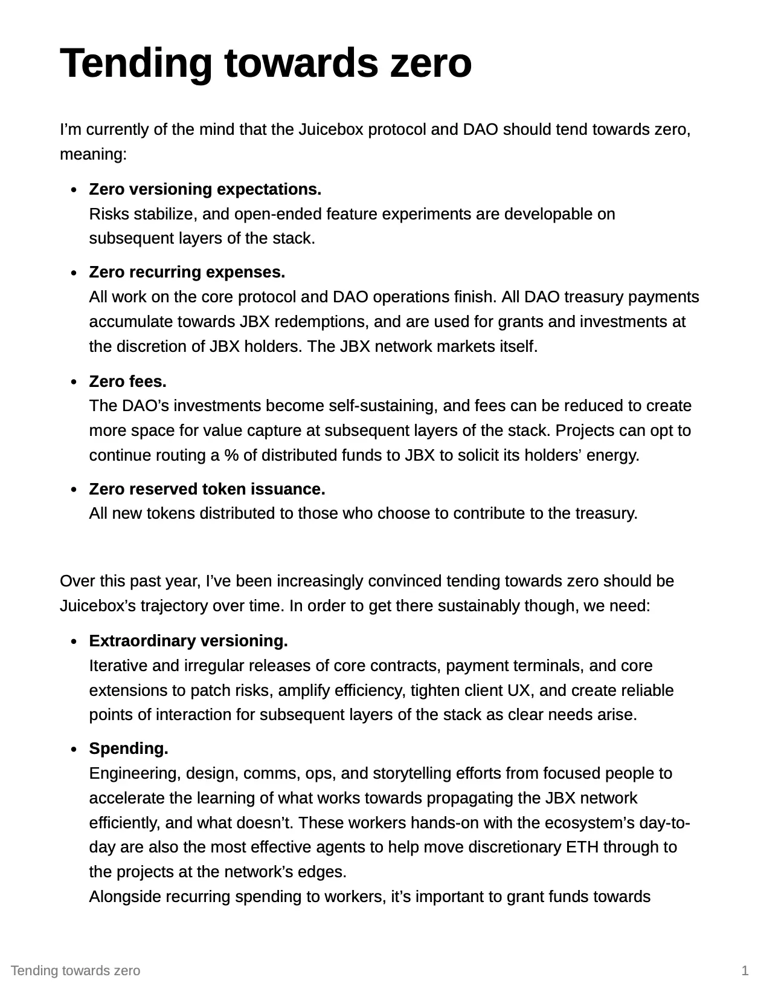

Art by [Sage Kellyn](https://twitter.com/SageKellyn)

## Tending towards zero by Jango

This is something Jango has been thinking about for a while, seeing it in different context, and something he has been trying to take as a lens to view through proposal in previous funding cycles. It's the idea about our current decisions in spending, in versioning the protocol to different improved contracts, in suggesting front end to also follow suit in other clients, as well as the protocol fees and the JBX token issuance.

There seem to be a pressure to expand them in one direction to grow it out and accomodate more thing, more people, more expenditures and more commitments. But on the other side, there is also a pressure to reduce it down towards zero, which means to shrink it and to essentially create few points of governance fragility and JBX decision making, and instead to have a techologically more stable treasury that projects aren't expecting changes while their fees are consistently tending downwards, neither do they have any real working party commitments to it.

Both these two pressures make sense.  It's just piecing together where we already are in the progress of this development effort and operation effort as of JuiceboxDAO and Juicebox protocol, and where we want to go. And ackonwledging that if we want to go towards zero, sometimes we have to think about how to get there sustainably. In a network's context, sustainability means the network should work and has properties to support new members or new projects to learn how to help something flourish.

And here is the thoughts that Jango posted in the strategy channel, which is just some kind of thoughts in progress, to invite feedback, critique and other points of view. It kind of proposes a lens from which we can view maybe operations for the next year or so or into the future, while reflecting on our habits over the past year.

Jango also reckoned that we should get there one proposal at a time.  The goal is to really find a sustainability model. There is a point where the core protocol needs to dwindle, and it's stablized because of having addressed risks and created enough pockets where people can create oppoutunities for themselves in subsequent layer stack. And there's less need to preemptively spend on JuiceboxDAO oriented things, JuiceboxDAO becomes a substrate and a lot of work can be done on expanding things like Defifa and expanding out clients at Peel, while also finding ways that those can sustain themselves. We have a substate that can structure those opportunities and risks. Then ideally JBX, as the energy of the ecosystem, serves to market itself as the network and a lot of more strategic storytelling components move to these other layers of this stack as well.

Jango thinks that given the nature of the treasury, assuming it kind of stays where it is, it makes sense for us to recognize that this isn't endless as well. That's going to keep moving funds out to the edge of the network, rather like we need to make there expenditures encouraging a point of self-sustainability and creating tools that are generalizable across projects. He also thinks, if we can create enough of these components and create that foundations as the principle, it will empower all these other projects around us to take on the responsibility of risk and opportunity on their own.

##  Migration Utilities Update by Jango

We are going to get the split allocators of V1 and V2, which will be published by the end of this week. We will have the V3 token that projects will be able to launch and migrate to from their V1 or V2 token stores. That is still being passed around since it's still making suggestion and edits, but it'll coming up soon. Jango is hoping that we can get it out there by the end of the year for front end to make use of.

## Statistics Demo by Twodam

Twodam created a new Dune dashboard following all the NFTs created on the Juicebox protocol.

Also, he made a dashboard to summarize the metrics relevant to Snapshot voting, which is also usable for all the DAOs in the Snapshot space.

## Blec Report Project by Chris Blec

[Chris Blec](https://twitter.com/chrisblec) introduced himself to be a analyst in the DEFI space, and he spent a lot of time on Twitter poking around in DEFI projects and decentralization, trying to strengthen the space through critique by picking out spots that he feels users should. be aware of concerning trust issues and centralization issues, etc.

Recently he has launched a website [blec.report](https://blec.report/) to post his opinions about DEFI and crypto.

And after figuring out the mechanisms of Juicebox through the help of Jango, he also created a Juicebox project called [Blec Report](https://juicebox.money/@blecreport), in order to get some support to work on it full time.

And Chris Blec shared his experience and some obstacles in getting to understand Juicebox, which was very helpful in our understanding how we should communicate with potential users. He also expressed his willingness to play a role in clarifying to the community how Juicebox works, and hopefully acquiring more users to Juicebox, because he thinks Juicebox is a very useful tool and will be a great alternative to other sources of crowdfunding.

## JokeDAO Rewards Module Demo by Seanmc

Last week Seanmc came to our town hall and gave a preview of their rewards module, which was shipped with the grant from JuiceboxDAO as the Milestone II of it. Now that they had this rewards module in production, they came to the town hall again and tried to do a contest to show the way this product actually works.

Seanmc set up [the contest](https://www.jokedao.io/contest/polygon/0x177D12eFe658CCADAacf4F735aa14F18d4Df3645/rules) with a prompt of "If Juicebox had a conference, where should it take place and why?".  People can submit proposals according to this prompt or vote on the submitted proposals with a dedicated voting toke. And the winners will get paid out proportionately according to the rules set with funds sent in the rewards module. In this case, Rank 1 gets 50%, Rank 2 gets 33% and Rank 3 gets 16% respectively.

Also the thing they are looking at doing in the future, is to allow anyone to deploy their own rewards module. If done, there might be multiple rewards modules all looking at the same contest and having different parameters for different ranks to pay them out with.

## Planetable Demo by Livid

[Livid](https://twitter.com/Livid) came to our town hall to introduce a native MacOs App for building and hosting decentralized websites.

Normally, if you want to host a website on the ENS domains, the process will involve static website generators and IPFS.  As currently there aren't many products available, you will probably need to use a centralized service like Fleek, or run an IPFS node which is your own computer. Apart from that, there will even be some command lines required, so many people who want to build on their own might just stop there.

The team has been developing this App called Planet, which helps users to build a block and publish it to IPFS. It has a built-in IPFS node and allow users to host websites from their Mac and no CRI is needed. Go check their [website](https://www.planetable.xyz/).

On the town hall, Livid demonstrated how to generate a website with ENS domain and then host it to IPFS. And he also showcased the new functionality recently added to this app, which allows users to tip a content creator with ETH by ENS domains, while at the same time attaches the URLs of the articles to the data field so that content creators can back check where the funds come from later.

Livid also brought up the thought that maybe we can add a Juicebox icon into the App where it works like the current Juicebox project's `pay`button, so that content creators can get paid into the Juicebox projects they set up.  All a content creator needs to do is to just add a Juicebox contract address to their Planet settings, which would be very cool.  He has been learning the technical details about Juicebox and hoped he would be able to implement the integration soon.

Planet is an open source App, its repo can be found [here]( https://github.com/Planetable/Planet).

## TokenURI Resolver Demo by Nichoas

The ownership of Juicebox projects is represented by NFTs, which allows whoever holding those NFTs to change the funding cycle configurations of relevant Juicebox projects. Currently the project NFTs on both V1 and V2 protocol have no metadata, so Nicholas has been working on a tokenURI resolver, which is like an extra contract to deploy, to make some of the project details visible on the NFT. JuiceboxDAO has given the permisson to do so until the end of December in [this proposal](https://juicetool.xyz/snapshot/jbdao.eth/proposal/0x44ca6ed9c0ea0bcaac4a6cc96127de3185e2eac2cf1a8b47c2f026680a6c6c4c).

Nicholas shared some of the images on the town hall, which are generated entirely onchain with orange as the default color.

Project owners in Juicebox will not have to do anything to get the standard orange one if they choose, and will also be able to set a different theme to the NFT.

Nicholas is expecting that a V1 of this product will be up for this Christmas.

