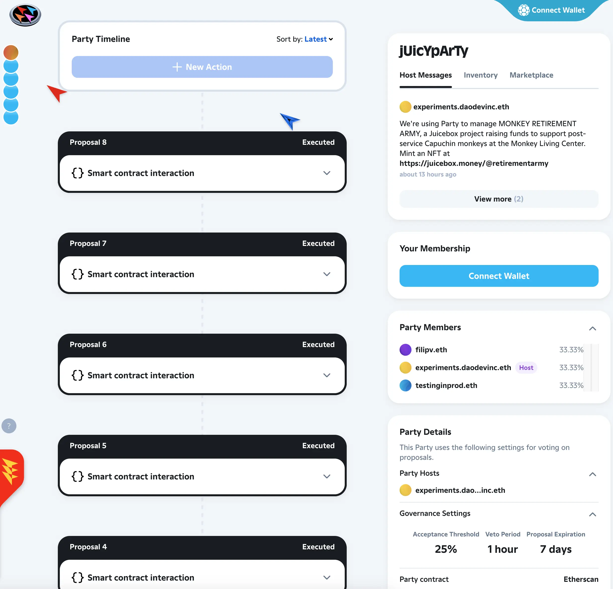
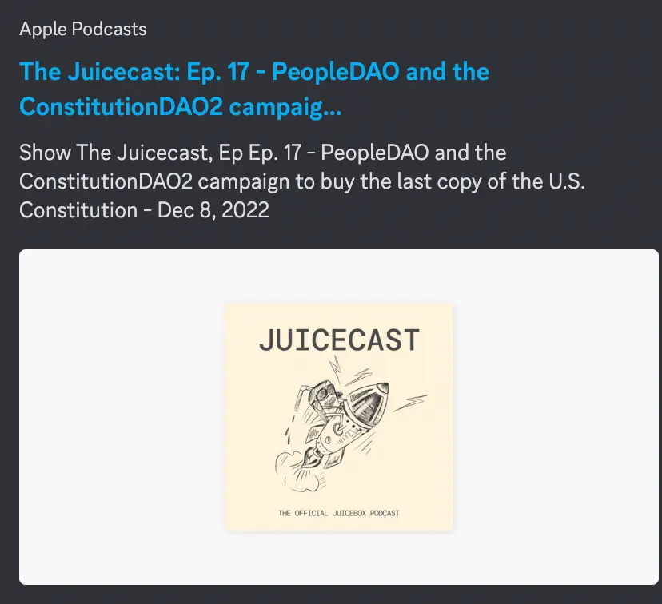

Art by [Sage Kellyn](https://twitter.com/SageKellyn)

## Juicebox Overview and Opportunities Going into 2023 by Jango

Jango started by sharing [a list of opportunities](https://jango.eth.limo/A7C5927A-08F1-425F-B440-8DF4BCF00DEE/#contracts) that he sees in the ecosystem, and said he was thinking through some end-of-the-year reflections and survey of everything that's going on, both for sake of his own thinking and hopefully for purpose of inspiring others as well. As he gets involved in a lot of projects throughout the ecosystem, it could be very useful for him to aggregate things in one place, when we're assessing what to focus as a community in the upcoming year, and what worked well or not so much in the past year.

### Products

##### Multi-asset treasuries
This comes with the goal to allow projects to hold the ERC-20 tokens and then receive payments in those tokens,  schedule that distributions of those ERC-20 tokens and offer redemptions in those ERC-20 tokens alongside ETH, and for viewers of projects to see all the assets that those projects hold in their treasury. And then allow projects to swap between assets like ETH to DAI just through payouts, so the redemptions of the tokens remain intact even through these swaps. I think there's a lot of projects in the sidelines right now waiting on DAI interaction or stablecoin interaction, especially as they're thinking about larger scale treasuries. So I think there's a pretty big opportunity here. There's nothing we're not aware of.
##### veNFT
We worked on this veNFT project a lot ealier this year. And I think this is almost entirely in place both from the contract perspective and front end perspective on JBM. This gives a new accounting primitive that allows folks to lock the project token and receive an NFT representing this locked chunk of time, but then can be used in governance and anything else folks have in mind.
##### Product discovery
This product discovery has been talked about a lot, especially lately. So, how can we help people find better projects through curation mechanisms and UI choices? And we've also talked about veNFTs, these like time vested tokens might be a good way to kind of influence its curation carousels of some sort,  stuff to experiment perhaps.
##### NFT content type
We did this big NFT rewards project this year, which was sweet. I think it has found some really cool usecases lately, shoutout to the ConstitutionDAO project for actually pushing us to do the redemption mechanism out loud. That's a really cool way to experiment with the stuff, but i think the cool would be entertaining new content type,  right now it's images and gifs. how can we allow product to support audio video in the future?
##### NFT marketplace
This  is an idea of allowing people to browse NFTs across all JB projects along various curation filter and sort patterns, which kind of gives more more visual or character life to projects and allows projects to start painting their own picture in the project page and throughout the ecosystem.
##### Template
We talked a lot about templates the latter part of this year. I guess we'll continue to do so of how we can make it easier for people to kick off special purpose treasuries with a minimal addtional overhead. A note here, I think what I've learned at the end of this year is that this might be better solved in contract form first, like the Defifas of the world, the Blunt Finances of the world that are actually hardcoded some of these special purposes in them to allow frontend to forgive a lot of the extra normal JB properties. It might be a great preconditioned for building experiences around and so it might not be something that we rush into from a frontend perspective, because It's kind of hard to solve without the contractual assurances behind that added simplicity.
##### OAuth, burner wallet, debit cards
we've talked about a lot OAuth, burner wallet, debit cards, so making the products more accessible to non web3 folks or folks that we want to help get into web3 safely.
##### Feature parity with contracts
There's a lot of stuff that the contracts do, the NFTs do, aren't yet exposed in any products, and those would be nice to knock out. Things like NFT governance options come to mind, things like NFT reserved rate stuff come to mind, some flags in funding cycles come to mind. But then again, it's also been nice adding things as needed, so as the constitutionDAO project needed redemption of NFTs, we prioritized filling out some of that contract parity, which was really nice, but it might be something to think about actually surfacing those preemptively when going forward.

### Contract work
The goal of contract work is really to finish creating these reliable core components that project can leverage to operate more efficiently. So these are tools that are generalized to be useful across projects to solve different efficiency needs.

##### Audit the veNFT
We should probably audit the veNFT accounting primitive if it's done. Shoutout to Viraz, 0xBA5ED working on that project. But we should probably audit it before making it useful for projects.
##### Buyback delegate.
Right now Juicebox treasuries emit tokens into existence, i.e. issue new tokens as funds come into the treasury. But if there is a market price for that token being issued and then our project should be able to opt for providing that swap facility instead of issuing new tokens,  to allow the payer to get the best rate for the token.
##### V3 token
There's the V3 tokens, which projects can deploy and it makes use of V1 and V2 token balances. There will be a proposal to deploy a V3 JBX tokens. When that's in effect, it will know the total supply of all V1, V2 and V3 tokens in itself, so it keeps redemptions intact. All of our funds can be in V3 and can be redeemable correctly. And then all V1 and V2 token holders, either claimed or unclaimed, can send their tokens to the V3 token and the V3 token will mint itself back out to whoever sent it. The goal is that V3 token should accumulate all their tokens and issue itself continuously using the regular v3 Treasury.
##### Delegate registry
We launched NFT reward which leverages this delegate pattern, which Defifa and Blunt Finance also leverages it, so there'll be other emerging projects that build opinionated treasuries need to too. So how can we create a trusted registry of all these, which can make it easy for projects to plug and play with them into their funding cycles? We can have a blunt round, NFT rewards, as well as some other constraint that someone might provide, and make them easy to access by clients who want to provide that to project creators.
##### Funding cycle sequencer
This is to generalize the Defifa idea where you can basically hardcode a sequence of funding cycles that make up the game. Defifa has an opinionated version of that game, but theoretically on deployment, you can say, here are the five funding cycles I want to run. You need to deploy the project, set it to be owned by the contract that enumerates those funding cycles that you configured. And then the project will operate according to the cycles. It's kind of like a way to play out multiple funding cycles planned in advance.
##### 721 delegate
A couple of iterations we want to do to 721 delegate, so the 721 delegate is the NFTrewards. We have a v 1.1 of it,  that really improves some reliability of this like credit system, and changes a few ways our clients interact with the expectations from clients and interact with them to make it more in line with what we've observed in practice as folks have started using NFTs. I'll talk more about this after doing this whole spiel.
##### Swap allocator
Swap allocator is something Dr. Gorilla has been working on, which allows you to pay out from your treasury through a swap. So basically from an ETH treasury I can pay out DAI to a beneficiary. It'll first go and swap the assets and then send it out. And that same concept can be used to swap the asset and then put it back into a payment terminal belonging to the project to swap between things that the project owns.
##### Client incentivization
This is something we've talked about for a while. It came up every now and then this year, but we never really tried to aggregate a pile of data to prove this point out or how feasible this is, about incentivizing clients to keep facilitating growth of the network and increasing network traffic.  There is something here, but we haven't yet quite nailed down with those strategies. They probably won't be contractual, but something to systematize in a sense.

### Projects
There's so much cool shit happening just in the project world of taking the core protocol and the core pieces and extending them to provide bits of functionality for for the world, for the project creators.

These are all opportunities that should be respected and pursued in and of themselves. The cool thing is they tend to have the self-contained risk profiles, so we could put money in them, we can try to manage that money effectively towards the goal. But if the project disbands for whatever reason, we're able to learn from it and kind of point to it as like an experiment. So it's useful in many ways and I think a lot of what we've seen over the past year is initiatives start from within the protocol incubator in a sense.

Contributors are playing with ideas and actually solving direct problems, but also creating systems to generalize the solutions, and start their own treasuries over time and get to move the burden away from juiceboxDAO as of the filler of payments.

All these are no particular order. This document isn't at all talking about priorities, It's just kind of like opportunities I think it's our collective responsibility to figure out how to prioritize them based on what we see the opportunities are as well as what people are excited to work on.

##### Bannyverse and WAGMI
I think we all recognize what that with the power of Banny and the power Sage and Mieos and all the folks who have do do it the project and the character and the narrative. It's awesome. It's freaking awesome. So many good moments and characters and ideas and I think we've used them really creatively throughout and there's so much to do there. That's just like a world of imagination that's possible there. and the goal of that is just kind of how can this character in this world continue to thrive.
##### Peel
Peel obviously is a huge conduit of of the protocol to the world, but I see its goal is allowed trusted and useful interactions with the Juicebox protocol and its history of activity. That's like so so important and it's really cool that we managed to kind of create a treasury and ecosystem and community around that goal around that product. That's a huge shoutout to the Peel team for doing this thing so creatively and effectively this past year, and obviously so much to do going forward, and other frontend can can borrow from and learn from that too.
##### Juicetool
There's Juicecool, shoutouts to twodam for allowing really convenient interactions with one-off utilities and information across the ecosystem. There's been a lot of the smaller needs to patch really important problems, and things that you wanted to pay attention to,  that Juicetool has come through for this past year. Especially in the versioning effort the past couple of months, which a lot of these tools really helped keep us in check as  we slightly expanded to accommodate ths kind of versioning matrix to then consolidate again going forward, while still being really comfortable with the idea of expanding in the future, if needed, to solve certain problems.
##### Nance
Nance as an API for organizing data from this opinionated bi-weekly or repetitive governance system of proposals and outcomes, they're stored and scheduled and viewed, and then made folks like Peel and Juicetool and Cogni and others make use of that information. So there's a lot of work to do there, to kind of continue playing mining governance treasuries and from API level.
##### Cogni
Cogni is a concept,  it's very interesting as well with the goal of creating kind of reliable future oriented project accounting insights. So how much are we on the look for spending in five funding cycles. What are the commitments that we've made that are waiting like a certain criteria to be met before issuing that payout. And then that be used with Nance, just make it easy to reconfigure funding cycles because a lot of project owners going forward in general may want more of this like governance tied into funding cycles operations. so It's a little more hands off.
##### Merch
A lot of discussion about merch lately, but I think merch is something that was experimented with by STVG early on and made a lot of fun with that, and I'm excited to see how NFTs can be  used to make that a more compelling point of interaction. So yeah that combo is ongoing. I haven't followed it closely, I think there's an update later on in town hall i'm excited for.
##### Lexicon Devils and Forming
Huge shouts to this this group of like incredibly energetic and talented and artistic folks who have been putting together this architecture and experiences. And there're folks around who want to build off of that. You know, how can we provide other experiences alongside Forming in a similar space to really leverage this moment when folks coming together in a shared digital space to experience  a particular sequence of music, artwork, vibeage, costumes etc. This super expanded my mind this year. So thank you for all that y'all do, Lexicon Devils.
##### Text-based NFT metadata URI resolvers
I think there're lots of cool opportunity in the tech space nft metadata that Nicholas has been working on for showing projects NFTs. This idea of NFTs displaying useful information is huge, can be useful to Defifa, can be useful in project data here and throughout. And really cool that uses the capsules font Peri wrote as well. I think as we expander to NFTs as utility, it'll be great if we have a really clean system for getting up NFTs that have aesthetics and also communicate information. And then we can always fill it out with more compelling artwork or more like unique artwork as that comes about. It's hard to have the opportunity to have a Defifa like artwork from Sage and from WAGMI, It's cool to show something that represents the project.
##### Juicecast
This dope project humanizes everything we do, allows us to tell stories, talk to people, broadcast project's intent, follow up and and really gives the project a voice. So huge shoutout to Matthew and Brileigh for continuing that effort, really curious to see what you all have in mind and in store for next year.
##### Defifa
I think Defifa has a lot of legs for sure as a project in and of itself. Folks already in the Discord scheming point systems for all the tournaments that we could do next year. I'm excited to pour a lot of my experimental time into there next year. I will be really happy with how that turn out.
##### StudioDAO
I think we're gonna talk a little more later today as to where they are, but huge opportunity for a project of projects, like networks of projects that are more refined and purposed. And also the legal framework that y'all came up with is super cool, experimental and cool. and I think as we proves that out, it can be really useful to other projects.
##### Bananapus
There's a project I'm calling bananaspus i haven't convinced anyone of it yet, but so i am calling it it's kind of the L2 initiatives. How can we have juicebox operating across many EVM chains?  There's a lot of complexity in that operation. So it will probably live on its own, not be a juiceboxDAO endeavor. But stay tuned on our making moves there. It's interesting whenever we do these cloning another EVM, we have kind of moved in everything we've already established over, sometimes it feels like we have more to do on mainnet before we then copy it around. So we don't want the burden of versioning and management all over, but there's certainly a lot of opportunities on non-mainnet chains.
##### Blunt Finance
The idea of Blunt Finance, I think it's pretty compelling, just a better first funding cycle for projects that are more fundraising oriented, and then you can leverage future funding cycles to reward contributors to your first funding cycle. And also in that first funding cycle it's running with tighter constraints such that if you don't meet a target,  the blunt contract owner will automatically schedule funds to funding cycle 2 that's for refunds. If it does meet a target, you can transfer projects to a project owner and then operate regularly. I think just like a simple onboarding experience contractually can go a long way for us.
##### Group purchases delegates
Similarly, this can be kind of like what ConstitutionDAO2 just tried but automated and maybe included an auction house as a facilitator oracle type entity in the mix.
##### Events and ticketing
There's a lot of stuff you could do in the event world where you're loading a treasury to pull off the event. We can use the assets to load the treasury and distribute, which can then be used for ticketing and for airdropping of artifacts from the events, like videos, music, audio or what happened at the event. It's like keeping everyone who was a part of the project benefiting from the contribution and the attendance.

***

These are the bunch of things that's been on my mind. Hopefully this serves some purpose for folks thinking about where we are, and where we might go from here and maybe give some insights as to what we're working on together.

## 721 Delegate V1.1

We have a PR open on the NFT rewards repository for a 1.1 version of the NFT rewards, and it simplifies the  flag structure a bit, removes the `MintBestAvailable`function, basically requires users to be explicit about what they want to mint.

It also improrves the credit system that's useful for projects paying each other without having the ability to explicitly state what want to mint. Currently, if there's nothing explicit, the contract will try to mint the best available. But what we're going to push for is, if you are not in a position to specify what you want to mint, you can accumulate credits from payments and later on use them to mint stuff.

These are a few small refinements based on the user experience contraints that we've identified from working with Peel and making some of these recent campaigns possible.

Jango said he would circle around with Peel on the specifics, but all in all that's on the pipeline and ready to be deployed.

## Governance Process Quorum Update by Nicholas and Filipv

Nicholas told us that, in the last one or two funding cycles, there has been some discussion about criteria of quorum in our Snapshot voting. The quorum currently is set at 80m JBX tokens, but to the surprise of some DAO members, abstentions have not been counted towards total quorum.

Nicholas just put up a proposal [here](https://juicetool.xyz/nance/juicebox/proposal/6490892f6e934011b9915152db873ace), suggesting to increase the quorum from 80m to 100 m JBX, which is about 4.7% fo all token supply, and also to count abstentions towards the total quorum.

By counting the abstentions into total quorum, essentially people who are voting `Abstain`are actually delegating their votes to other people who have voted either `For` or `Against`.

## Project Search by Filipv

Filipv introduced that we have been added to a closed Beta for Sapana which is the service that does backend search management for Lens and Mirror currently. Their team implemented a new feature to their API to allow us to use this search for juicebox.money. And also it's goinng to allow us to do full text search for project titles, descriptions and things like that.

Juicebox has also been added to closed Beta programs for the Dune APIs upon search and a few other services. Anyone, who is interested in getting API keys or access to that, can contact Filipv for the setup.

Filipv spoke with Nucleus, who does virtual card issuance for a credit card backed by USDC basically. Nucleus set up a card for us while taking care of KYC and everything on their ends.

## WAGMI Update with Mieos

WAGMI is currently doing a little bit of soul searching and think about how they should step into 2023. Mieos would love to have people gather together, on a different occasion, to discuss people's ideas, thoughts and consideration towards WAGMI.

## Banny Warhol with Jmill and Genekogan

Jmill and Genekogan are working on a project called Eden which is basically working with generative AI, just like the Dall-E, Stable Diffusion and things like that.

They had the idea a while back to try fine-tuning AI art model on Banny pictures, which is basically a version of Stable Diffusion adapted with or trained on some of the Banny art.

Genekogan said that this is basically DreamBooth, the technique which lets people inject a new concept, a character or a style in the Stable Diffusion vocabulary. It's a fine-tuned Stable Diffusion that optimized towards making pictures of Banny.

When asked upon by Nicholas whether this is something on the path to developing a produce that they can sell as a service, Genekogan said that it's basically the base. But they're still trying to discover different ways to either turn it into a service catering for customers, or just exploring with the techniques and trying to get people to use and experiment for the most part.

## StudioDAO Update by Kenbot

The first funding cycle of StudioDAO has finished recently, they successfully raised over 40 ETH including the grants from JuiceboxDAO.

Their priority these days has been trying to onboard more members to their community, by making it super easy for non-web3 people to buy their membership NFTs. They are now focusing on working with Peel to create a really minimized flow so that people come to their web page can easily create a wallet and get that NFT.

StudioDAO will also be making a documentary for MoonDAO. A proposal to partner with StudioDAO to finance the film has been passed in MoonDAO, and they also put up $100,000 to get the project started. They are now finishing the relationship with the filmmakers and will create a dedicated Juicebox project so that MoonDAO can contribute the funds into. Kenbot thought that'll be great to kick start the ecosystem.

 On the other side, StudioDAO has also been working towards onboarding more filmmakers into the ecosystem. Kenbot was quite ambitious about how many filmmaker projects they can incubate in the upcoming 6 months.

## Party Owned Juicebox Project Demo by Nicholas

Nicholas introduced that PartyBid is a tool for collectively purchasing NFTs, which can be used to raise funds together and then buy the targeted NFTs after. But he is more interested in the possibility to use it as an alternative to Gnosis Safe for managing Juicebox projects, so he decided to create a Juicebox project to demonstrate how to use PartyBid as a governance tool.

Nicholas got the early access to the PartyBid V2, which allows us not only to own an NFT with it, but also to execute transactions from it. So Peri, Filipv and Nicholas created [a JuicyParty on PartyBid](https://www.partybid.app/party/0x56bc9de3dc9556a3282ed4e7ba8f86d5cb7d8cd8) and used it to acquire the Juicebox project that Nicholas created before. After owning this Juicebox project with the JuicyParty, they tried to execute from it a bunch of different proposals reconfiguring funding cycles and metadata of the Juicebox project.

Also with a stroke of genius from Filipv, they turned the experimental Juicebox project into the [Monkey Retirement Army project](https://juicebox.money/@retirementarmy) to support post-service monkeys at the Monkey Living Center, by donating 100% of raised funds to those monkeys. Also, they tried to set up a couple of NFT tiers in this project.

What's cool is, all these configurations of this orginally empty Juicebox project were done using PartyBid, including project metadata, NFT tiers and project handle etc. As PartyBid is entirely onchain, there's no Snapshot kind of offchain voting involved. All the configuration proposals are voted and then executed accordingly onchain, which was a very good experiment for light weight governance. They are also having discussion with people at PartyBid around potentially improving different aspects of the PartyBid user interface to work with Juicebox better for small groups to govern their Juicebox projects.

Filipv and Nicholas are also looking for the possibility of using the Juicebox project tokens in the governance of this PartyBid Party, instead of using their Party card.

## Juicebox Protocol Analytics Browse by Nicholas

Nicholas highlighted some projects he thought that might be interesting.

- [TanlentDAO - Research Guild](https://juicebox.money/@researchguild)
- [The project](https://juicebox.money/v2/p/352) that STVG created recently to raise funds to give students new headphones.
- As Sotheby's today announced they're delaying the auction of 2nd private copy of Constitution, so ConstituionDAO2, aka. WAGBTC, are considering if they're going to wind down, or continue fundraising but allow refunds at the same time.

## Juicecast And Blog Update by Matthewbrooks and Brileigh

Matthew and Brileigh just released the [new Juicecast episode](https://podcasts.apple.com/ca/podcast/the-juicecast/id1623504302?i=1000589496263), the epilogue of the ConstitutionDAO retrospective series podcast, which is about PeopleDAO and ConstitutionDAO2 campaign.

Also they posted a comprehensive article about ConstitutionDAO on our blog [here](https://docs.juicebox.money/blog/2022-12-13-constitutiondao/).

## Forming New Event by Lexicon Devils

Darbytrash from Lexicon Devils announced that they would be holding a Forming [Songcamp](https://twitter.com/songcamp_) collab with winter break vibes on January 6th.

