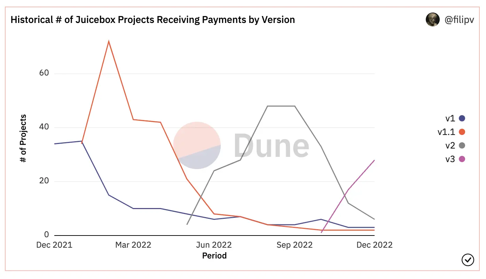
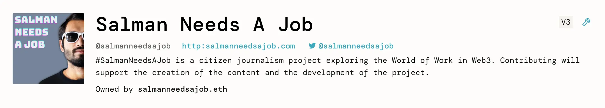
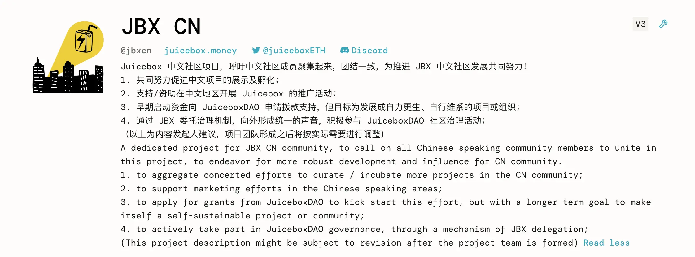
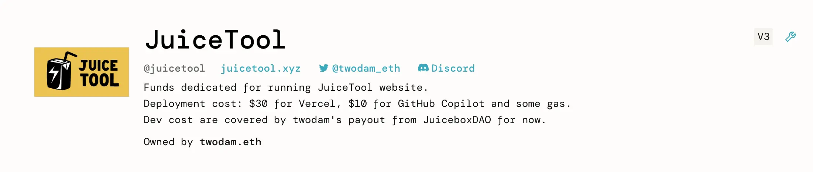

Art by [Sage Kellyn](https://twitter.com/SageKellyn)

## Reserved Rate Discussion Callout by Nicholas

This conversation started around the beginning of Dec, when Jango had thoughts on the ways to redistribute some JBX to contributors on the reserved token list.

And Nicholas put up a proposal, [Distribute 15M JBX to Reserved List addresses](https://juicetool.xyz/nance/juicebox/proposal/0562102b96224ba1b7fb820d2ca5e4ec), in a hope to suggest a way to distribute some amount of JBX to JuiceboxDAO contributors. This proposal came under [very heated discussion](https://discord.com/channels/775859454780244028/1052301913879744552) in the temperature check stage of JuiceboxDAO's #38 Governance Cycle. Commuinity members expressed their different ideas on this topic. The discussions evolved from whether or not it would make sense to distribute JBX tokens to contributors on the reserved list uniformly, to if we should even reconsider the meaning or purpose of a reserved rate.

Nicholas called on community members to join the discussion that will be expected to follow after the New Year, when we are looking at having a proper discussion about how we want to think about the reserve rate.

Jango said this discussio of how to get JBX outward to both incoming members or folks who have been contributing, is somewhat a macro question which is solved well by reserve rate at least in the beginning of the treasury operations. But at a certain time, we also do have to be reflective over the tools we're using, not only for ourselves, but also for the broader Juicebox ecosystem, because we are offering these tools to others, to both solve their community initialization process, and their scalability as well.

## Juicebox Analytic Roundup by Nicholas

 Using the [dashboard created by Filipv](https://dune.com/filipv/recent-recipients) to compare projects that are receiving payments between different version of Juicebox protocols, we can see that V3 protocol is having a very healthy trend of adoption, while V1 and V1.1 is tending towards zero, espcially as projects like Lexicon Devils which are some of the last active ones on V1 have already moved to V3.

Talking about different versions of protocol, Jango said that the versioning nomenclature discussions had been very interesting for him this week, which was brought up by Nicholas and Peri about the usefulness of scoping down how the juicebox.money website references versions of protocol because it can be confusing sometimes. Jango also said he was grateful to the versioning effort for getting us to a place where we feel comfortable iterating on otherwise fixed smart contracts, while giving other communities the option to move over as well. He thought that if we could do this versioning efforts over again, there may have been some nomenclature things that we could improve. This definitely encourages us to be open-minded abou how we go from here. A lot of treasuries have evolved over to V3, but we might still want a lot of that versioning infrastructure to create some path forward, given the risks or features that we find compelling enough to do.

### Highlights on new projects

- [Salman Needs A Job](https://juicebox.money/@salmanneedsajob) is a citizen journalism project exploring the World of Work in Web3.

  

- [The Chinese Juicebox project](https://juicebox.money/@jbxcn) created by Zhape, in an effort to extend more support to projects in the Chinese community inside the Juicebox ecosystem.

  

- [The Juicetool project](https://juicebox.money/@juicetool) that Twodam launched to fund the running of Juicetool website.

  

- [zhougsoft](https://juicebox.money/@zhougsoft) created by zhoug who is a member of the mfers community.

  

### Current status of some projects waiting for V3 before

1. Abraham Eden project that Jmill and Genekogan have been working to spin up a custom NFT strategy. They have been waiting on V3 to be able to sell NFTs which would act like batter packs that users can use for AI generation events on their machine learning service.
2. The Thirsty Thirsty, a community of wine and food enthusiasts, is actually going to implement governance on a weekly / bi-weekly cadence to broaden the decision making in its current NFT holders. Folks that starting to empower the community are thinking about proposal for the community to deploy a Juicebox treasury to orchestrate its sense of purpose. This is a pretty cool, long-term oriented project that's trying to play with a more sustainable regenerative business model alongside the governance and treasury dynamic.
3. [The Shiba and the Whale - A Doge Anime](https://juicebox.money/@mecenia),  a project that dedicated to making a film. It is really cool model for other artists to complete things like this through Juicebox projects.

## Status of Defifa by Jango

World Cup is over and the Defifa tournament turned out pretty fun and encouraging. Now we're planning the next step of this Defifa experiment, to run some competitions in  2023, iterate on something that seemed to work well and reassess some opponents that didn't work well.

Meanwhile, we're wrapping up the current instance of Defifa. From now until December 25th, folks can start submitting scorecards of what happened. Then from Dec. 25th, people who are holding the NFTs can vote and attest a correct scorecard. After the attestation, the treasury will unlock and folks can burn their NFTs to get their portion of the winnings depending on how their team did over the tournament and how many folks have the same NFTs.

There's a lot of stuff that we can make up for it to iterate on  for experience in this upcoming year. We can basically play any points distribution game between mint and attestation of the scorecard.

We will try one for NFL playoffs, which starts mid January of next year, to iterate on a few parameters. And we also are sketching out 5 or 6 tournaments next year across domains, like League of Legends, March Madness or Women's World Cup, etc.

It will be cool to start digging ahead for some of these. We can really try experimental point systems and things within the Defifa structure. Then hopefully, we'll soon have a pattern that feels good and safe enough to make a Defifa create flow for folks to create and run their own competitions.

Another cool callout for Defifa this time around is that the ball kids minted one of every 10 NFTs for the ball kids treasury. Give the amount of tokens minted and the fact that the tokens are redeemable in the treasury, it ended up being a pretty successful experiment even monetarily for actually being able to support this next wave of development.

We need to reassess the model for continuing the sustainability of the project and make sure that we keep things tight. But this has a chance of being very scalable and can be applied as a fundraiser for other arbitrary projects.

There're all kinds of ideas we can iterate on. We should definitely dream big, but it's also exciting to stand on some solid ground and be able to iterate one thing at a time from here on out.

## Demo of GasWoman and Juicy Spider by Filipv

### GasWoman

Currently when members of multisig execute multisig transactions on Gnosis Safe, there might be some gas fees incurred in those executions. There are needs to refund those members who executed for the multisig. GasWoman is a generic tool Filipv created that fetches all of the Gnosis Safe transactions and build the transaction to do the refunds. This is a pretty simple tool but it might be useful for some people and projects.

Next, Filipv is thinking of doing the same thing for project taps, which can be triggered by anyone as a public transaction to distribute payouts from Juicebox projects. It will be cool to also find a way to make reimbursements to people who triggered those project taps for those gas fees paid.

Jango also reminded that there's also a functionality in the contracts for payouts, which allows people to route some of the payouts to the person who clicks "Distribute" and triggers that distribution transaction. So actually projects can bake that into the payout directly to incentivize people or [MEV](https://www.blocknative.com/blog/what-is-mev) bots to click and trigger that transaction.

### Juicy Spider Project Search

Up till now,  Juicebox.money only suppors searching with project handles, which is not very convenient. Recently Filipv has been in contact with Sapana to find a better solution to it.

[Sapana](https://sepana.io/) is a service that does backend search management for Dapps. Juicebox was recently added to the closed beta of Sapana, so Filipv used it to build a simple indexer and a client for it, allowing us to search metadata and other aspects of projects on Juicebox. The repo of it can be found [here](https://github.com/jbx-protocol/juicy-spider).

This Juicy Spider project search tool that Filipv created  basically crawl the projects on Juicebox and generate the API for search, and Peri is now working to integrate it into Juicebox.money website, so that there will be an open access API endpoint on juicebox.money for folks to use later on.

