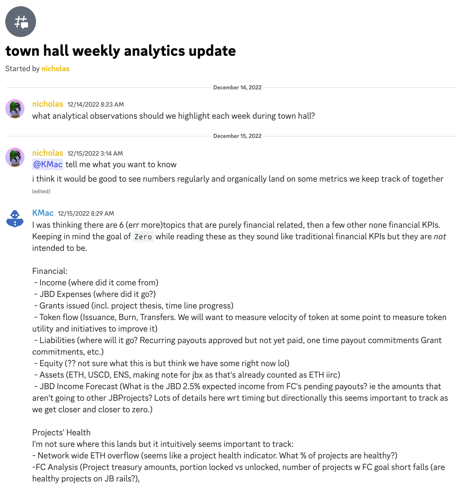
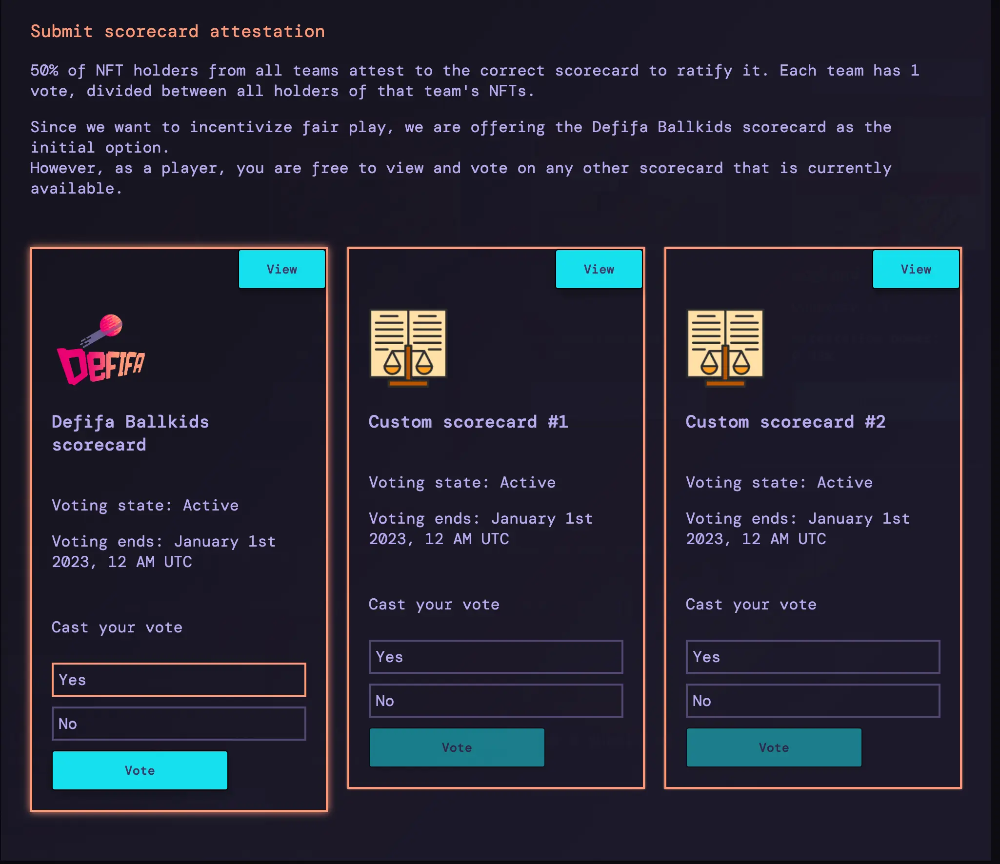
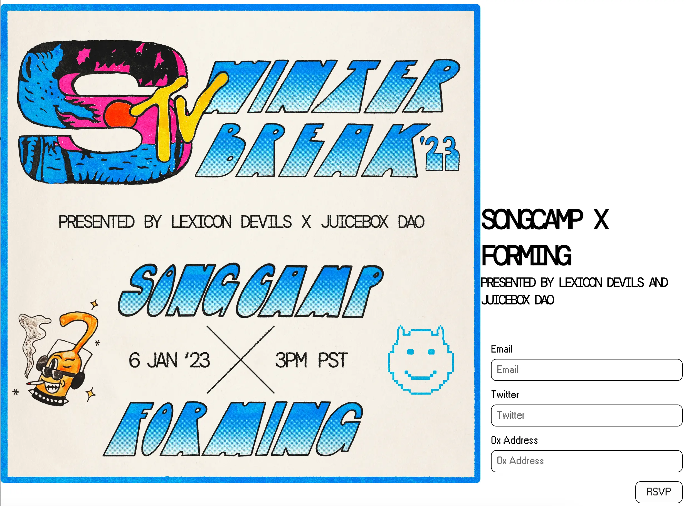
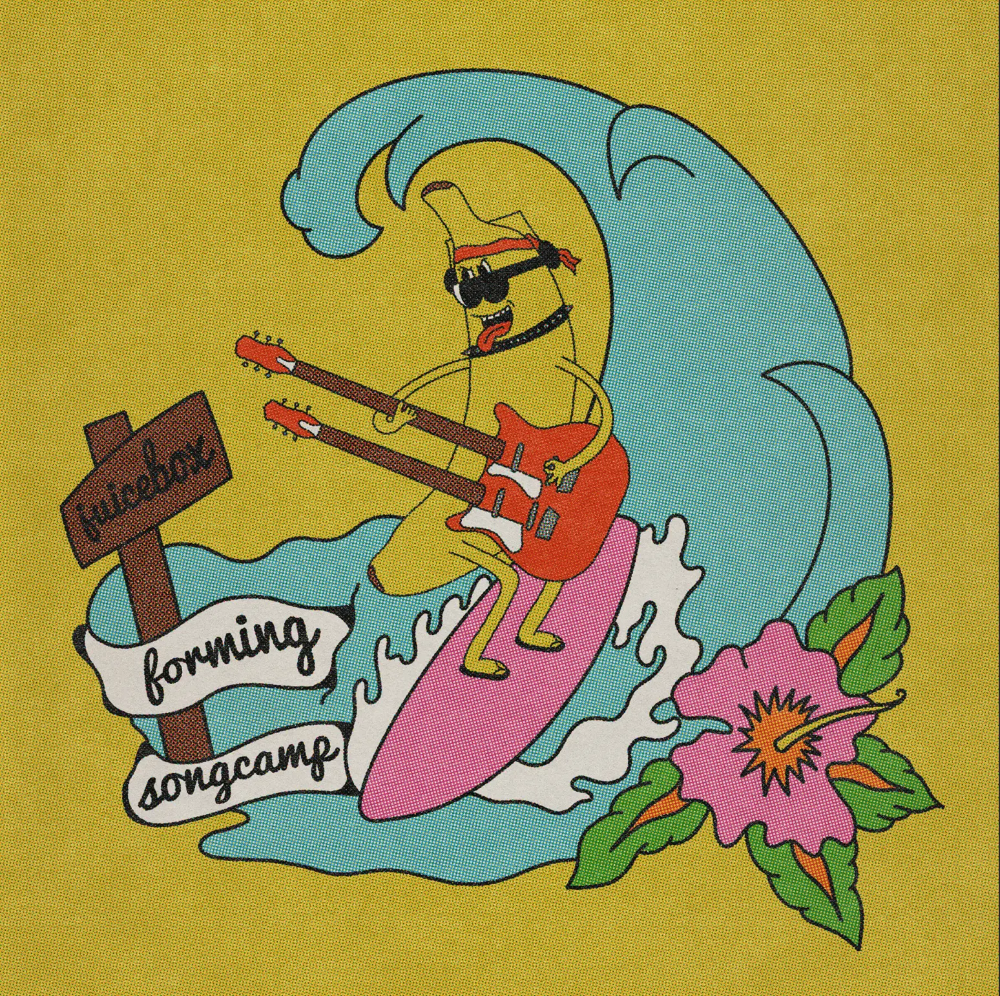
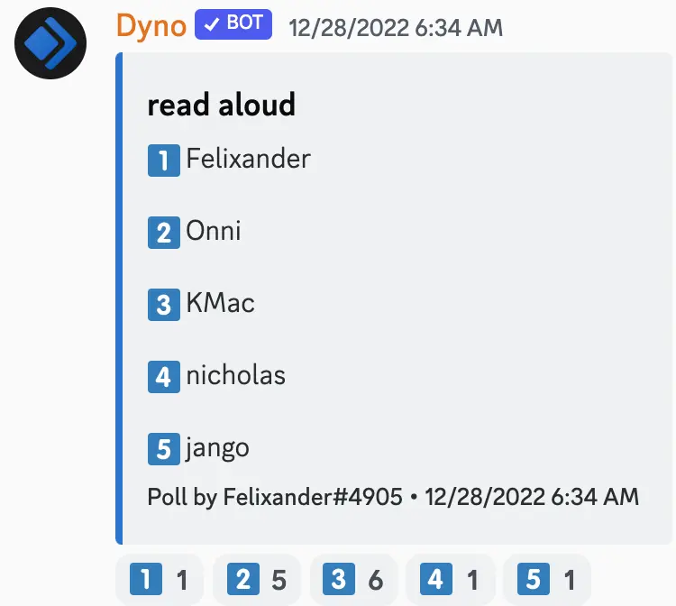

Art by [Sage Kellyn](https://twitter.com/SageKellyn)

## Juicebox Analytics Update with Nicholas

Last week we had 15 new projects, and 5 ETH paid into the protocol. And the number of projects with more than 1 ETH in volume in last 30 days is at the highest level since April this year. The number of projects created wthin last month is the highest in the past three months.

One of our community members KMac suggested that there are some statistics we can track on a regular basis. Nicholas also proposed that maybe we should make a segment of our town hall to figure out the healthiness of Juicebox protocol by looking into these metrics frequently.

Filipv thought that we can pin down some of the focused areas so that they can be consolidated into certain dashboards dedicated to be used towards Juicebox analytics on the town hall.

## Defifa Attestation with Jango

We're wrapping up this Defifa game and learning a lot as we do it. We inherited a lot of properties from the governor voting system from the Governor Bravo contract.

Users can start voting one week after the last World Cup game, and the voting duration set in the contract is one week, so once a scorecard is uploaded, there'll be a week's time for folks to vote on that scorecard and ratify it. So the next week if we can get up to 50% of NFT holders in the attestation of scorecards, we could end the game in a few days and get this thing finalized and behind us, then we can focus on iterating for the next round.

And Filipv helped to demo how to attest the scorecards on [defifa.net](https://defifa.net).

The next plan for Defifa is to create a game for the NFL playoffs in January next year. The idea isn't to iterate too much stuff into the NFL game, it might need some new arts but will keep using the contracts and frontend as much as possible along the lines of defifa.net/nfl2023 or something like that.

It will be good to have another go-around and make some small improvements under our belt, while also planning ahead for other competitions later on in the next year, where we can experiment with some more new things along the way.

We currently have some interesting ideas with regard to how we might improve inter-game play or how to build minter confidence, but we'll first see how that plays out this time around for the NFL playoffs.

## Updates on Gnosis Safe, project search and SEO by Filipv

Juicebox has been not been a default APP on the new Gnosis Safe app because of some problems with auto connection. Filipv has created a PR to the front end, and once that gets approved and merged, we'll auto connect to Safe and be a default APP on Gnosis Safe again.

For the project search feature based on [Sapana](https://sapana.io) that Filipv demonstrated last town hall, there's an outstanding PR for it that put together by Peri and added with some final things. Hopefully this project search will be implemented in the front end soon as well.

We have a local PR for some of the SEO stuff we've been discussing, thanks to the works of Acidicsantana and Filipv. With that, the SEO on docs.juicebox.money should be improving slowly, so should that of our main Juicebox.money website.

## Forming update by Darbytrash

Lexicon Devils will be hosting a Forming event with [Songcamp](https://twitter.com/songcamp_) on Jan. 6th, 2023, with the performance lineup of Songcamp OGs announced yesterday .

Also they are doing RSVP on [Forming homepage](https://forming.lexicondevils.xyz/), and the applicants will be eligible for the wearables airdrops by Lexicon Devils.

Jango wondered how many submission were made for this event and what was the process to choose the artists that will perform on Forming, and Darby said they received 8 - 9 submissions,  the Songcamp community made the final decisions in choosing performers, with Lexicon Devils being responsible for editing and curating the contents as usual.  Also there's a criteria for applying for a Forming performance, which requires the contents to be filmed exclusively for premiering at the Forming events.

Lexicon Devils' [Forming project on Juicebox](https://juicebox.money/@forming) has also migrated to the V3 protocol lately. They will be putting up some different tiers of NFTs on this project later this month.

## Two truths and a lie with Felixander

Felixander gave 3 clues on the town hall and asked the audience to pick from the list of persons who is the one telling those clues.

Clues:

1. I raised money from a former chairman of FASB, a former SEC commissioner and an electronic spreadsheet pioneer, and then lost it all;
2. I played basketball against Isaiah Babyface Thomas;
3. A book I wrote sold over 1 million copies.

The correct answer was ... KMac.

And the one lie is No. 3.

## End of Year Thoughts and Reflections

**Jango:**
I think a lot of new amazing contributors lingered throughout the year, and that's a long time to be contributing to something and figuring out new ways to participate as things that were messy continued to become a mess only maybe with a little bit more organization over time. That's certainly worth celebrating.

I am looking forward to finding out how the community exists in the  next year. It's been a cool year and I've had a lot of fun and been very grateful. I am stoked for so many things that might fall into place in the next year.

Also shoutout to Jigglyjams for making the Nance in this year, which will be super exciting for the next year especially to really stabilize it and make it the governance backend that will be tied to a lot of Juicebox processes.

The podcasts made by Matthew and Brileigh gets better and better in quality, too. It's cool to have this cadence of publishing, while tweaking the style and gear as it's moving forward.

**Nicholas:**
Also Matthew and Brileigh have been doing a great work in Juicenews which is a great resource for keeping people up to date about the Juicebox ecosystem.

Shoutout to ONNI who created the [Marfa Giant project](https://juicebox.money/@marfagiant) in a small town and tried to figure out how to bring the people there onto web3 verse and accomplish the value of Juicebox. Recently he also has been involving in the marketing efforts of JuiceboxDAO.

**Jango:**
Huge shoutouts to everyone who worked on the versioning stuff this year, from writing and testing the V2 contracts, then finding some small issues through Code4rena audit, to developing this V3 new contracts instead of patching the V2, and figuring out some interoperability standards. So next year, we'll get to build all these really fun and flexible toolings on top of it. For all the contract folks, yes, it's been a heck of a year, wild and frustrating many times, but with so much fun.

It's pretty wild. This is like everyone is on some significant spectrum of foundership of Juicebox. It's amorphous and defined just by what folks want to do, build and try to make these regenerative moments happen. I'm curious how to maintain a Discord in a governance system, or in the next a few years, given the potential of thing. I'm very excited about it.

There're some really good ongoing conversations happening, which are open, complicated and requiring our coordination ability and potential. Myabe we have a lot more answers than we had last year, but also have probably disproportionately more questions now open for exploration.

**Darbytrash:**
I just want echo that this year has been so much fun and crazy that it's one of the most creative and rewarding years in my life. I owe a lot to Juicebox and I am really grateful to be a part of this community, be here with you all. Thank you!

