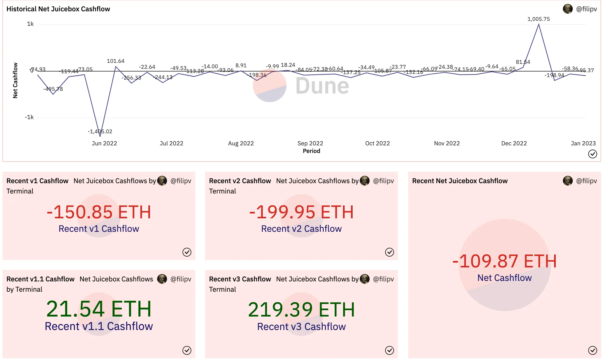
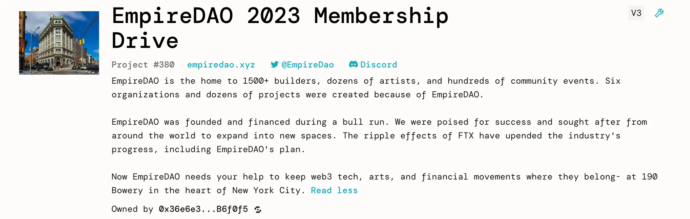
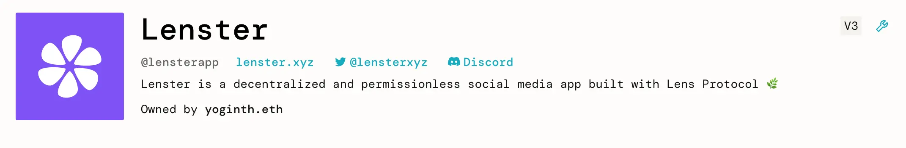
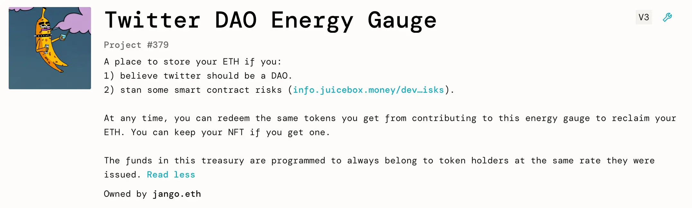
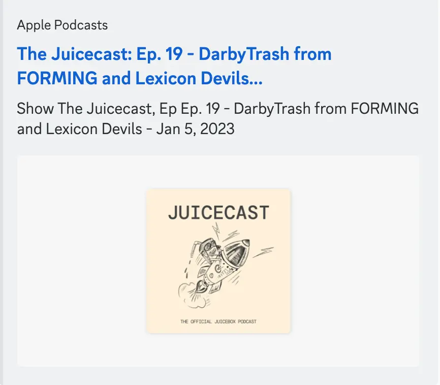

Art by [Sage Kellyn](https://twitter.com/SageKellyn)

## Protocol Analytics And New Projects by Nicholas

There is not much activity in the last week. We have 62 ETH in payment on the protocol, but this includes the payouts to projects like Peel, which are only inter-project payments. And we only have 2 new projects created last week, mabye due to holiday season.

History cashflows of Juicebox:

Highlights of some projects:

- [The EmpireDAO 2023 Membership Drive](https://juicebox.money/v2/p/380)

    EmpireDAO is a co-working space in New York and they are now having a bit problem with their lease. This project is fundraising to help them stay in their current space and avoid personal bankrupt of the founder.

    

- [Lenster](https://juicebox.money/@lensterapp)

    Lenster is one of the front ends for the Lens protocol. This might be a project they're using to experiment with Juicebox.

    

- [Twitter DAO Energy Gauge](https://juicebox.money/v2/p/379)

    This is a project created by Jango. The idea came from recent discussions around whether Twitter should tend towards more Dao-ish, so Jango created a treasury where people can safely deposit their funds in and get the funds back any time they want easily.

    

## TokenURI Resolver Update by Nicholas

Basically, the tokenURI resolver V1 is ready to go. Once [the proposal](https://juicetool.xyz/snapshot/jbdao.eth/proposal/0x4d1f6e8576fbdd5c61f1b3bebd775e153fa49ee70e0cbee53561ba75bb4ac381) put up by Nicholas to extend the permission to the multisig for setting TokenRriResolver is approved by the DAO,  we will be able to implement something without having to wait until the delay period. So maybe next week, we will be able to set up the first version of this token resolver.

## DAO Foundation Reflection by Jango

The Juicebox DAO foundation document can be found [here](https://www.notion.so/juicebox/Juicebox-DAO-Foundation-7bd59d35f08443b18e83e710df49ee3b)

Jango though that now we have a cool opportunity to reflect on the commitments that we ratified a long time ago, and he was planning to put up a proposal in the upcoming governance cycle to update this document.

Jango has started to write and share some of his train of thoughts since the past month, and ultimately got to a few pieces that outline where we are with the [many little pockets of opportunities](https://jango.eth.limo/A7C5927A-08F1-425F-B440-8DF4BCF00DEE/).

Obviously everything all unfolds and it's a reflection of what's happening in the Discord and commitment we've been making in the proposals up until now. So this refelction is nothing new or far reaching, it's more just a way to find the right metaphors that can easily encapsulate what people are getting themselves into when they are thinking about launching projects, allocating money to projects or contributing to the DAO in various ways.

### Mission statement

What we currently set out to do is to "helps people confidently run programmable and community funded treasuries from startup to scale, openly on Ethereum".

There have been a lot of stress on the protocol evolution and security to make sure that it gets deployed and adjusted, and takes into account the risks that people are exposed to in interacting with these contracts.

Towards the end of last year, we've realized a more important need than "community funded", which is that we need to figure out how to increase the distribution of projects or help projects do that for themselves. And there is a need to help basically funding money through the system and give capital allocators more confidence when engaging with Juicebox projects. Although it will be easy for us to allocate a little bit of ETH here and there to projects that have potentials, it will be a lot harder for capital allocators, either as individuals, as VCs or whoever they might be, to make a confident bet that can prevail over time.

So maybe there is something that incorporated in our current mission statement, but that seems to have been more pronounced at the end of last year, and into this year.

There's been really cool research done last year about the potentials of L2s, but every time we tried to push an idea forward, either a bridge or token choreography, we ended up coming into roadblocks that become familiar. Jango suggested that we move forward with the cool ideas we have, while being at peace with the fact that there might be roadblocks and things could emerge, and with less perfection in mind and more expermentation encouraging attitudes.

### Values

Jango suggested to leave this part to the proposal thread discussion.

### Focus Areas

Filipv thought that our way of operating had changed a little bit since there were originally written. He felt that we're operating less on a per focus area basis and more on a per project basis these days. In Discord, for example, we've moved conversations from these general focus area channels into specific project channels.

Jango agreed that it'd be a really cool idea in this next draft. There was a trend in the past year when Peel, WAGMI and several other projects emerged, some of them were never really incubated as individual focus area contributions to JuiceboxDAO, but more in a way that people started working on a certain direction and then developed systems that could have some self-sustaining future.

Jango thought maybe some of the items on Focuse area are no longer something we want to emphasize in line with others, so might be worth reducing from this list. It is also good to recognize what we are actually focused on, or if there is anything to be added here, or how to reframe some of these items.

The governance, for instance, it's something that DAO is still focusing its resources on. It will be up to us, as the DAO stewards of the treasury, to really figure out: " Are we spending on governance for our own sake, or because we're trying to make some bet on some projects that maybe have a life outside of JuiceboxDAO?" And if so, how are we structuring and thinking about that?

Talking about projects, Jango thought maybe the biggest assets of JuiceboxDAO don't lie in its ETH or JBX holdings, maybe are instead Peel tokens, WAGMI tokens or Lexicon Devils tokens, those of every project that we have started to put resources into. He wondered how we might actually think about those and create tools to really structure them and reflect on how those bets are going, not only in terms of them providing services to JuiceboxDAO, but also us all the individuals helping to support them to really thrive on their own.

And for the protocol, Jango felt that we're in the final bits of defining what we need to be responsible for in the protocol level. There has been a lot in this regard this past year, we definitely don't want to keep doing a lot of that over time. It's cool to offload that responsibility to stuff like Defifa, some other projects that can expand to other L2s, Nance and etc.. But at the same time, monitoring and documentation might be something that's worth attending to, although it's not clear whether they will be individual contributions or a collective JBX responsibility. There won't be payouts for these work, so the DAO is not focusing its resources on the protocol anymore. It's just something we care about and maybe it's not best expressed in this format here.

Even if the proposal to update this document doesn't get ratified or even go to Snapshot stage this first time around, it would be cool to have a few versions of this information that we can really reflect on. It will be probably less useful going through each of them and more interesting to talk high level that anyone can have other things to offer.

KMac suggested that we should pay more attention to the security of the protocol, which is something really important in terms of having it audited and deciding who can maintain and what to be maintained, as well as how permissionless that process will be.

Filipv thought that along with developing front ends and good clients for the protocol, it would be a good focus to work on various integrations for the protocol, such as what can we do to make Juicebox work well with WordPress or with Lens, do we have rpm packages, do we have PHP library to interact with Juicebox, so as to make it as easy as possible to use Juicebox in as many different places.

Filipv also suggested that maybe we should include discoverability and curation in the focus area.

Nicholas said we can really make sure that when we do things in any of these focus areas, the areas are just to help us think about all the various things we should be doing. We are not doing them because they're on that list, but doing them to achieve that mission statement.

Jango thought the cool thing for JuiceboxDAO is we have been pretty steady in the way we are thinking about our infrastructure, about our mission, about what projects we probably care about and why we care about them. It in some sense pierces throught a lot of the momentary noise and created these more longer term trends. Jango hoped that we can keep continuing it, while at the same time listening to our intuition along the way.

### Membership

The last one of the list we have membership, which is JBX and voting. Jango said he was really excited about expanding in this respect later on this year. We will bring ve tokens back into conversation, get all the way through to V3 and reactivate redemption value. So we'll revisit membership with stuff to add this time around.

It has been cool to have governance process evolved around this membership structure, and it feels pretty sturdy and we can offer it to other Juicebox treasuries. It's all decent to consider it a membership to the treasury where we all have collective ownership resposibility over the treasury that we're working to figure out how to better create opportunities for other folks contributing both to JuiceboxDAO and other projects.

Jango thought that our mission statement going foward is not the DAO's mission statement only, but from the product perspective, instead of just providing programmable treasuries, whether Juicebox would be really strong suit to provide money and membership coordination for projects, whereas the tokens are some means towards some sort of membership, such as membership to the treasury, to a club, to some obligation, to a game like Defifa, to a non-profit. We have a lot of examples and a lot of case studies that we can pull from to make clear Juicebox projects, money and membership coordination for all these different types of organization, either on-chain or off-chain.

## Forming Update by Darbytrash

Darby urged us to do the RSVP on [Forming homepage](https://forming.lexicondevils.xyz/) for the Fomring X Songcamp collab event, so that we can be eligible for wearables airdrops by Lexicon Devils.

Also, as [Forming project](https://juicebox.money/@forming) has migrated to our V3 protocol, they have deployed the Forming official Juicebox unlockable NFTs. All the funds raised throught these NFTs are going to be allocated to the artists selected for this Forming X Songcamp performance. For each Forming event, all performers will be set as distribution beneficiaries on the Forming project, so that when the event ends, they will all be automatically distributed proportionatly with the funds raised in that period of time.

Darby was so excited about the NFT functionality of Juicebox that he wanted to give hats-off to the devs and everyone who made that possible, as he felt this could be a game changer in this world.

Jango suggested that we put up the tutorial video made by Matthew and Brileigh about [how to create NFT on Juicebox](https://youtu.be/pgpK3LofDSU) in our lounge in the Voxels, so that folks attending the Forming events can learn how to set up their own NFTs on Juicebox also.

Darby also announced that Lexicon Devils had the plan to hold a live Forming event in New York for the NFTNYC this year, they are willing to discuss with folks in the Juicebox community to brainstorm the details on making this real.

Matthew and Brileigh has also released [a new episode of Juicecast featuring Darbytrash](https://podcasts.apple.com/ca/podcast/ep-19-darbytrash-from-forming/id1623504302?i=1000592726192), covering how Forming got started and its past and future events.

## DAOPlanet Update by DAOofSteve

Steve from DAOPlanet said they were moving their project from Juicebox V2 to V3 protocol with the help of STVG,  and was hopeful that they can get the project up and running by the end of the week.

Steve also said that they are going to hold the DAODenver event this year, along side the ETHDenver build week. This time they are moving to free tickets for everybody going to DAODenver, so they anticipated having a lot more people to attend their event this year.  Steve also introduced their hotel accommodation  packages and the partnership with CityDAO etc.

Jango thought it would be great idea to make the length of the week more accessible to folks, and maybe folks in our community could help to build some momentum for the DAOPlanet project.

## Defifa NFL Update by Jango

The first version of Defifa has finished successfully, which is super exciting.

We are going to bring along with a few folks contributed to the first round and some new folks interested in going forward, to do another iteation of Defifa on the upcoming NFL playoffs.

Jango said we were almost at the point where we had the artwork all done and only some last minute things on the contract with smalll adjustments, and he felt pretty good about this new game.

FIlipv suggested that we make a concerted marketing effort for the Defifa NFL playoffs, with Discord servers, Twitter, Telegram to maximize the engagement, or possibly run ads as well.

KMac responded that we will have a very short mint window for this iterated game for NFL playoffs, which is only less than a week between the announcement of playoffs participants and the kickoff of the playoffs, especially taking into consideration of things like contract deployment etc.  But he was very willing to try some actions of ads together.  He thought that it would be easy to figure out what the breakeven might be on ads. If we treat ballkids' mints as revenue, we can figure out if that makes sense. It feels right from a mechanics perspective.

