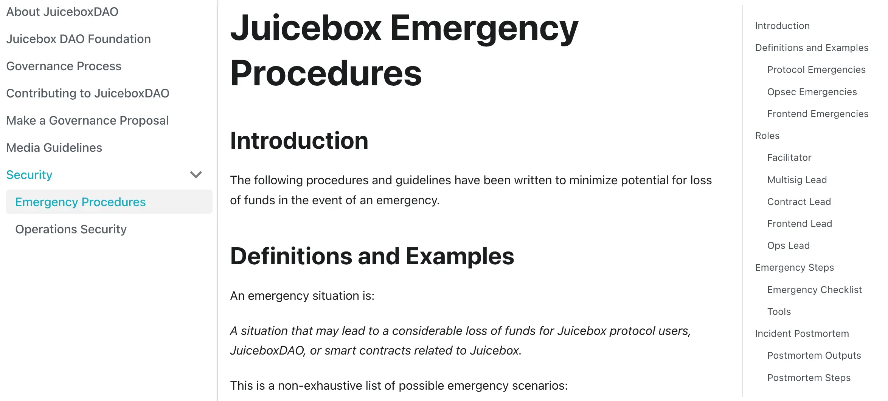
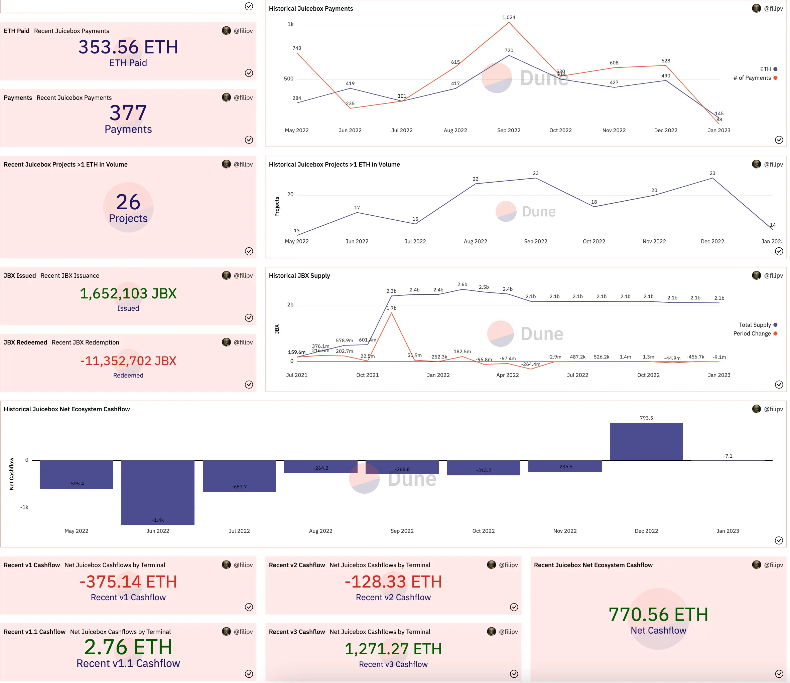
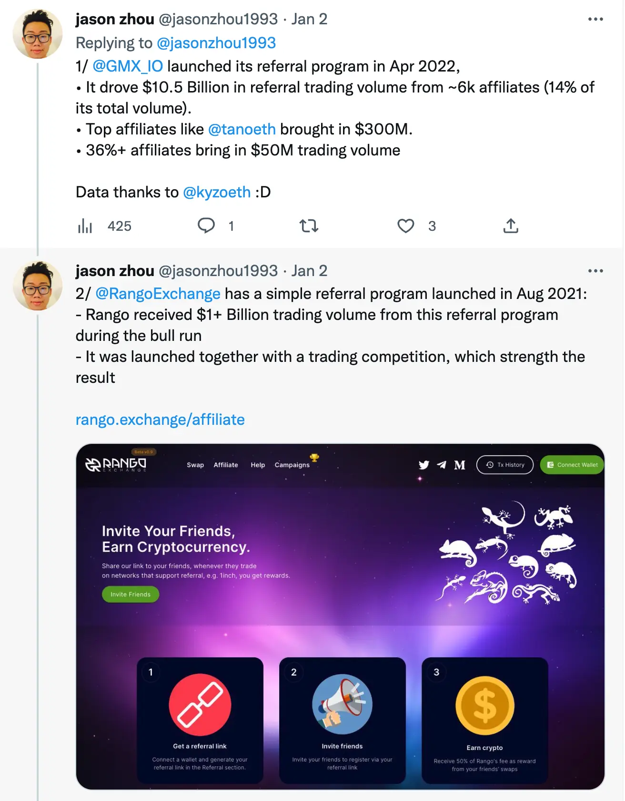
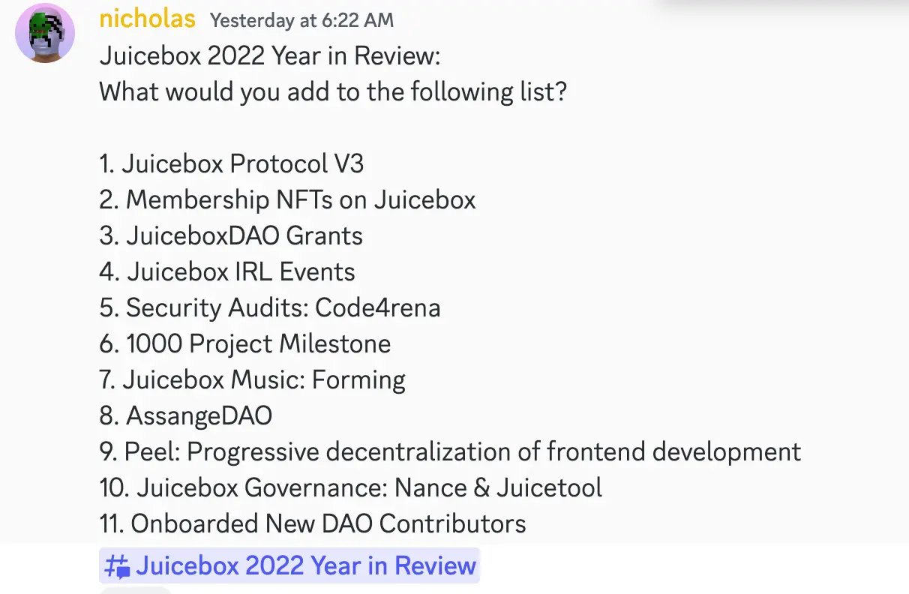
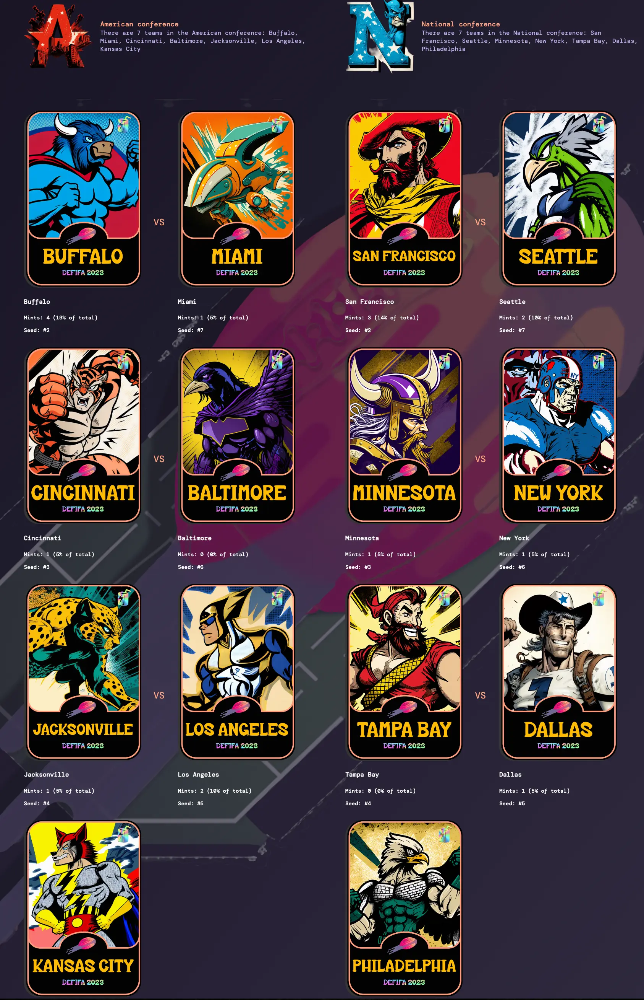
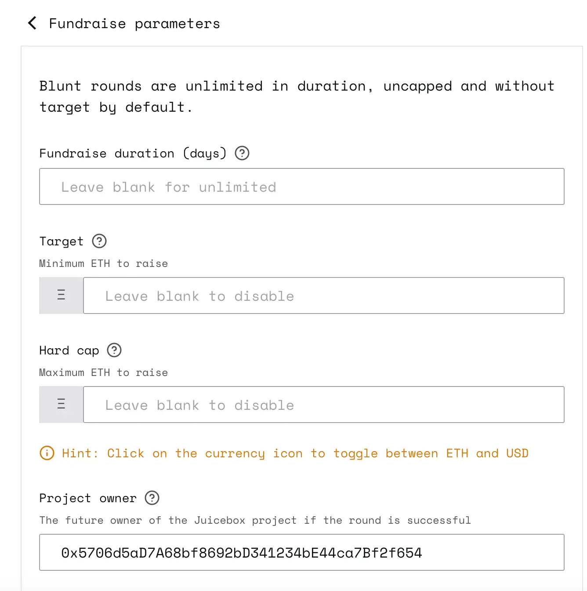

Art by [Sage Kellyn](https://twitter.com/SageKellyn)

## Emergency Procedure, Opsec & Security by Filipv

[Filipv](https://twitter.com/filipvvvvvv) recently wrote two documents concerning the emergency procedures that we may want to set up in advance, so that if anything does happen, we will know what we should be doing.

The first document is [the Juicebox Emergency Procedures](https://docs.juicebox.money/dao/security/emergency/#definitions-and-examples), which covers what we should do if something does go wrong.

The second one, [Contributor Operations Security](https://docs.juicebox.money/dao/security/opsec/) is more a general security guid for DAO contributors

Any feedback to these documents will be warmly welcome. And Filipv was planning to put up a proposal in the next governance cycle to ask the DAO for permission to use these procedures if something does go wrong in the future, so that our multisig can have the ability to make necessary updates and changes in that situation.

## Protocol Analytics by Filipv

Filipv made a dedicated version of dashboard for purpose of protocol analytics in the town hall [here](https://dune.com/juicebox/townhall).

He went over and introduced all the items on the dashboard, which covers things like number of projects created, fees paid, payments by projects, recent Juicebox payments, number of active projects(with volume > 1 ETH), and recent issuance and redemption(burn) of JBX, as well as the cashflows of various JuiceboxDAO terminals, etc.

## Qwestive Referral Program Demo with JZ

[JZ](https://twitter.com/jasonzhou1993) used to be a contributor in JuiceboxDAO, and he is now working in a team called [Qwestive](https://www.qwestive.io/) which is a dedicated referral platform in Web3. He came to our town hall with the thoughts that a referral system might be useful for Juicebox ecosystem and he wanted to give some explanations to that by doing a demo in the town hall.

### Why referral?

According to JZ, referral has been a proven process for acquiring users in web3 these days, letting people who believe in a project help driving in more users.

He tried to prove his point by making two examples of  Web3 projects which have made a huge success in using their referral programs to drive in new users and funds, GMX.io and Rango Exchange, respectively.

In conclusion, he thought that the referral system can actually drive in quite significant volume.

### Why Juicebox?

Since December last year, JZ has been in touch with STVG who has spent a lot of time onboarding projects and driving project growth in Juicebox. From his former experience as a contributor here in Juicebox, JZ thought that there would be a really good case for Juicebox to do the referral program, either for being a very strong community and a great product in the Web3 world. He also thought that there would be a huge amount of growth that can be unlocked if we set up a right program to incentivize community members and partners to drive traffic.

Also JZ pointed out that the role of Juicebox is not only about getting projects onboard, but also helping them to get successful, which requires quite a big amount of work to get things running. If we could put the right incentive structure aournd it, it could probably help making people who are onboarding projects more responsible and more incentivized to help those projects really get successful.

### How?

JZ also did a demo showing how Juicebox can make use of the Qwestive platform to set up a referral program.  [Here](https://www.loom.com/share/00259b4eeaed47fba64be81a186c667e) is the demo video JZ made for a Juicebox referral program.

As a choice, we can let anyone create their referral links, or if we choose to, we can scope down to a specific list of people who either holds a certain amount of JBX tokens or is on a whitelist for partners.

And the reward structure can be pretty flexible, either by a fixed amount reward in ETH, JBX or NFT, or by a tier-based with different reward amounts for various referral outcome, or even by a dynamic standard where the referer can get a certain percentage of fees that Juciebox collects from projects created.

And also the program can be defined to allocate rewards to the referee, people who click the referral link and create a project in this case.

### Discussion in town hall

Filipv thought a referral progam would be a great way to encourage more people to get involved with onboarding, and also a good way to align incentives with people who are working on content creation, visibility and project onboarding, etc.

For Jango's question of whether the events tracked are on-chain ones or just website activities, JZ explained that they actually tracked the on-chain data by capturing the wallet addresses of people who click on the referral link and create a project.

Nicholas agreed that this referral program makes a lot of sense, especially for project creation. Also we could set up a different referral program or maybe a tool that can be offered to project creators for use in their own projects.

At the end of the discussion, [Jango](https://twitter.com/me_jango) brought up a quick thought about allocating a chunk of the reseved rate towards referrals and then sending it to a contract or a responsible entity to manage the JBX distribution. That way folks have a token that's backed by the treasury, as JBX gets issued when payments come in. We can fit the referral payout to the reserved rate structure, start with someone who is willing to be responsible for dispersing, and work towards some automated structure in the future.

## Juicebox 2022 Year in Review with Nicholas

[Nicholas](https://twitter.com/nnnnicholas) was collaborating with Matthew and other members on the Juicebox 2022 year in review. He made a list of important events happened in our ecosystem during the past year, and called on people who have suggestions come forth with them.

## Defifa Update by Jango

On the day of this town hall, the Defifa Ballkids team just deployed a new Defifa game that accompanies the NFL Playoffs this year. The team is trying to iterate as quickly as they can, so that they can study the games and play with different ideas.

They are also trying a couple of new things this time. Firstly, a better attestation process. The timing of the last Defifa World Cup was a little bit awkward, so this time they will try to start the voting for the attestation of a scorecard when the Super Bowl happens.

Secondly, there will be short redemption time window between the end of mints and kickoff of games, so that if people are unhappy with the distribution of all the NFTs, they can get refund by burning some of the NFTs they have, while no one will be able to mint extra NFT to form an outsized arbitrage value at the last minute.

Thirdly, there will be no trade deadline this time. All the NFTs will be normal tradable items all the time.

KMac gave some shoutouts to people who have been involved in the work for this new version of Defifa. Mieos and Sage did a great job in art work, Blaz did most the thing in front end, and Jango, Viraz, 0xBA5ED and Dr. Gorilla were the contract crew who makes this game happen.

Jango said we were also brainstorming how to leverage this tournament style mechanism to actually help other communities fundraise. For example, in the case of StudioDAO, they can frame a competition around some category of the Oscars or some movie festival where folks can play. We are definitely looking forward to the vision of how we can really use this formed factor to add an auxiliary component to any fundraise in art and cultural alongside.

Jango also mentioned that the team is planning to do the Defifa for March Madness. We created this concept of Defifa Ballkids who write the games, but Defifa is an open DAO, and our thesis is that those who play a game are probably going to be encouraged to join and take responsibility for organizing next game. The organization of Defifa is really meant to be open and we're trying to decentralize it with on-chain governance as soon as possible.

## Blunt Finance by Jango

[Blunt Finance](https://blunt.finance/) is another project [supported by JuiceboxDAO](https://juicetool.xyz/snapshot/jbdao.eth/proposal/0x3346171415210d0523079ccde7af7e4f417e45ec7daabb9f037bbaba0c69a550), and it has seen some really fascinating evolution in the past several weeks. [Jacopo](https://twitter.com/jj_ranalli) has been the main dev both in the front end and contracts for this product.

We've simplified it quite a bit to really narrow in on a specific use case, which is to set the target of fundraising ahead of time at the stage of creating a funding round.

A project creator, blunt round creator in this case, can set the fundraise parameters such as fundraise duration, funding target, hard cap and project owner, etc. If the funding duration ends and the fundrasing reaches its target, the project ownership will be passed to the preset project owner and runs just like a normal Juicebox project thereafter. If the target is not met when the campaign is over, the contracts will automatically schedule a funding cycle #2 with refunds to donors.

It's lower risk in onboarding when it's way more simpler with just one prompt. Hopefull we will see a lot more projects spinning up and trying to meet a goal. Folks can contribute to these project with less risk, without having to worry about changes around here and there.

We'll see this project playing out as an experiment. If it works, Jango was pretty sure that Juicebox.moeny would want to incorporate it into the create flow to provide as an option for folks who maybe looking for a similiar mechanism .

We're just playing with these ideas of contract owned projects that can really narrow down what a project should or can be to start off, both in the front end which anyone can do, and also in the contracts which actually reduces risks dramatically.

Nicholas was pretty excited about the blunt mechanic, especially this stripped down version. It is quite similiar to the mechanics of Kickstarter where contributors can get a refund until the crowdfund reaches its goal. He thought that this could be super powerful.

In Jango's point of view, if you get a contract that owns the first funding cycle, you can then pass ownership, in the case of successful fundraise, to a contract that will manage how a second funding cycle goes. You can then create this chain of passing along projects to acutally fulfill a life cycle and maybe even have a conclusion, without any individual or multisig or on-chain governance contract ever really touching them, which is basically what Defifa does. He hoped that it opened up our minds to other opportunities and definitely wanted to encourage everyone to play with those ideas.

Jango really liked the idea of smaller chunks of responsibility that run smaller codebases to try things out, so that as they bubble up to place where people are, the risk is at least known a little bit better.

## NFT Tokenomics by Nicholas

NFTs have dropped with great success on Juicebox, and we have many interesting projects coming into existence. But so far we haven't really seen very hot NFTs, or any obvious secondary market activity for any NFTs originating from Juicebox ecosystem.

For this reason, Nicholas had the idea of helping projects create mechanisms around their tokens. He thought that for the majority of projects, membership tokens or other kinds of tokens that they can sell directly inside of Juicebox ecosystem are with huge opportunity and under exploited. So far, we haven't yet witnessed any mechanism that has really taken off in a wild way, like for instance an NFT collection born on Juicebox getting really popular outside of Juicebox ecosystem. Nicholas has been talking with folks about other models for doing more than just popping up a JPEG and hoping that people will contribute for it.

One idea that Nicholas has benn thinking about for the past couple of weeks, is that low cost NFTs can have a single use voting purpose. NFTs that are really cheap or at least affordable give everyone who purchases them an opportunity to vote in a single proposal round to decide how to distribute some or all of the funds,  while a subsequent round starts with similar mechanics and entirely new NFTs which will be used to vote in this new round.

Basically, Nicholas hoped to establish mechanisms that can work as play books for Juicebox projects to generate recurring revenues.

Jango declared that we still have a few contracts that NFT controls yet to be exposed in the front end, which he had been working with JohnnyD and Strath to make sure those become available to folks in an elegant way.  These new functionalities include reserved NFTs, NFTs as governance tokens in the format of tier based governance, on-demand minting of NFTs by project owners, etc.

## ComicsDAO Promotion with Gogo

Gogo announced that finally they had the arts made ready by Sage, which are some amazing masks, and they are going to start new funding cycle with the new NFTs deployed which will help a lot to achieve what they've been planning.

Last year has been an amazing for ComicsDAO. For this year, they are planning with some really big things, such as starting some AI comics and some other things. The development of ComicsDAO is a fun way to reward people that funds them.

