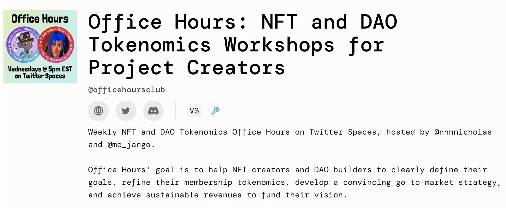
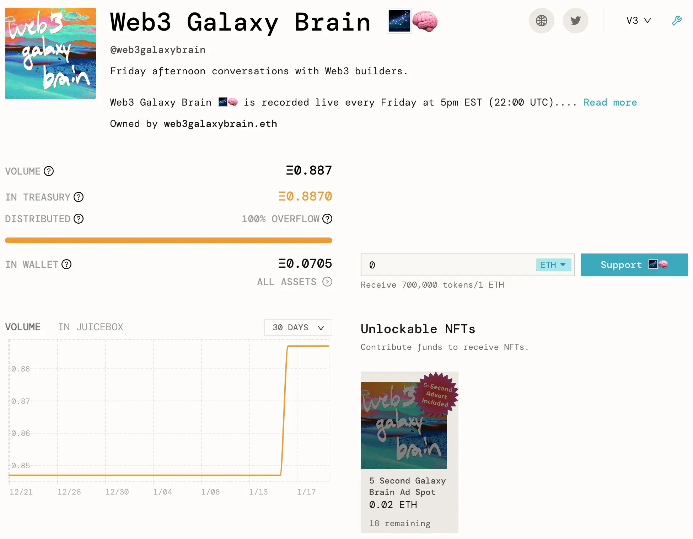
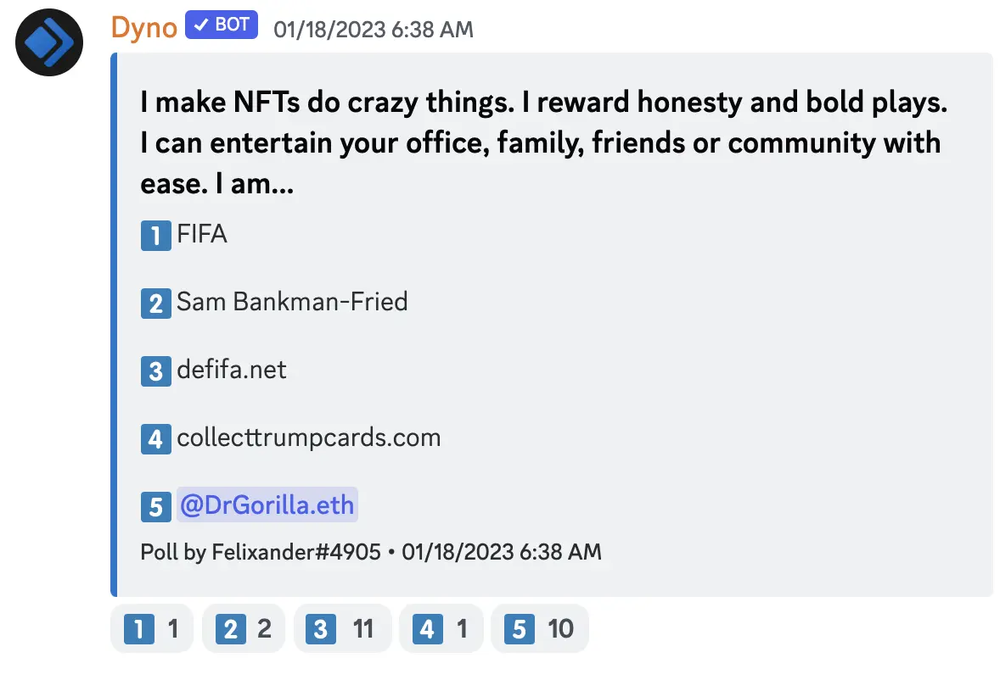
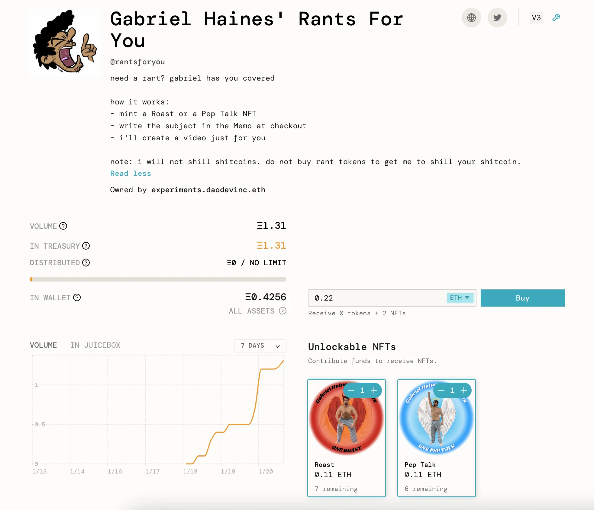
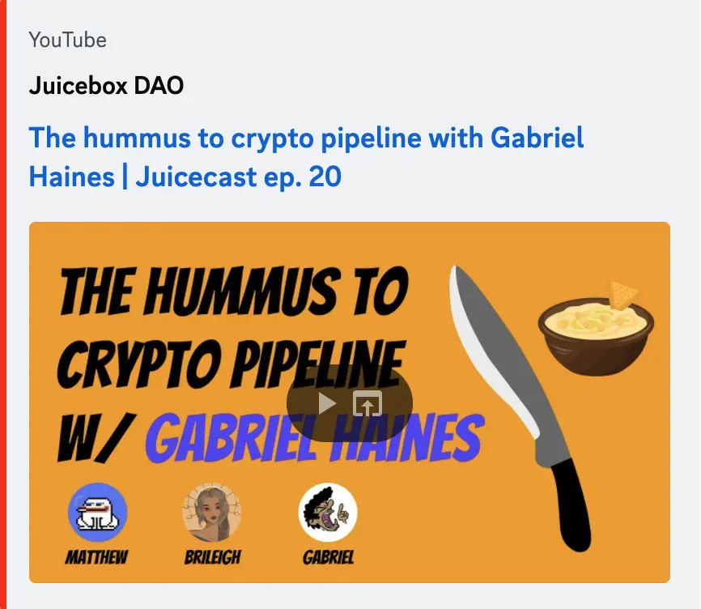
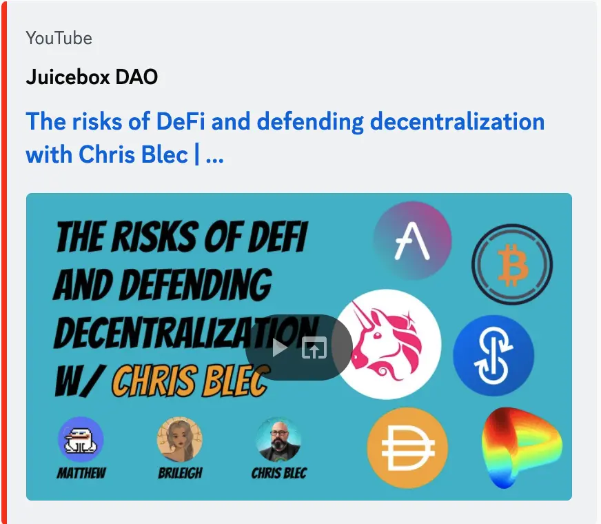
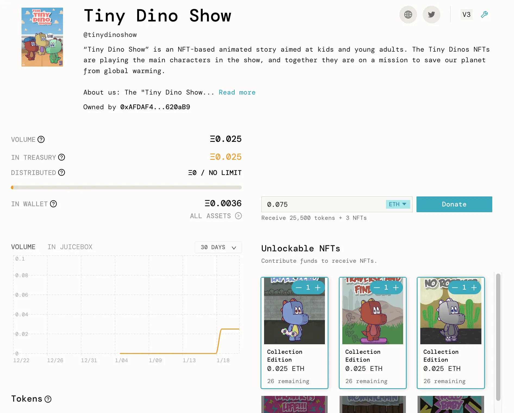

Art by [Sage Kellyn](https://twitter.com/SageKellyn)

## Office Hours Plug by Nichoas

Nicholas would be hosting an NFT Tokenomics Office Hours together with Jango in [ Twitter Space](https://twitter.com/nnnnicholas/status/1614985966548094977). They would be talking to [jin](https://twitter.com/dankvr), one of the metaverse OGs, about [openvoxels](https://twitter.com/openvoxels), and to [Ibn Inglor](https://twitter.com/IbnInglor) from [DangerZoneDAO](https://twitter.com/DangerZoneDAO), a musician who has toyed around with the idea of creating a Juicebox project.

Also Nicholas was experimenting the idea of letting folks to reserve a priority spot to talk about their projects by minting an NFT on the [Office Hours project](https://juicebox.money/@officehoursclub).

The purpose of this Office Hours is to discuss about NFT tokenomics or membership tokenomics to help people create projects with great membership dynamics.

Jango also said that we had been wtinessing treasuries that are more fundrasing oriented in the past year and a half, and also there was this impression that the same might continue and be our bread and butter, but it would be very interesting to pose the question of how we might create stronger and more sustainable business models for organization that aren't just asking to pitch in for the sake of governance or collective actions.

Also Nicholas had launched a Juicebox project [Web3 Galzxy Brain](https://juicebox.money/@web3galaxybrain) for his Twitter Space and podcast, selling 5 seconds worth of advertising on his show for 1 NFT minted on this project. This is also one the experiments to hopefully find something interesting that people can make use of in the future.

## Merch Demo with STVG

STVG had been working on some merch stuff, trying to create an opportunity for people to sell merchandise and route the income to their Juicebox projects.

The way he managed to achieve this is to set up a slice on [Slice.so](https://slice.so/), which connect to an API of Printful, an on-demand printing service provider, then products purchased will be made and shipped from Printful to buyers, while some of funds getting sent to [The Brigade projoect](https://juicebox.money/v2/p/390) on Juicebox.  He did a quick demo of buying one OG Juicebox hoodie on the town hall.

STVG was also working on another option of making the purchase same as minting an NFT on ordinary Juicebox projects, where  a pop-up window will come up after the purchasing for buyer to put in their information, so that seller can pick up the information and put order in Printful.

Filipv suggested that he put together a guide for the project creators to do this themselves.

STVG said he was working on that right now. And he was also working with SharkDAO and Bankless project management guild on how they can make use of this model.

Jango was a bit skeptical about the needs to hop around between Slice and Juicebox, and thought that we might need to find a way to improve this experience.

STVG said if the model tried on Slice is working, maybe Juicebox can also integrate with some on-demand API to provide for project creators to also sell merchandise, which may be helpful to build those communities or fan base.

## DAODenver Discussion with Steve from DAOPlanet

Steve shared [a draft of proposal](https://www.notion.so/juicebox/Juicebox-DAODenver-ETHDenver-BUIDL-Week-Side-Event-Sponsorship-5b117e82d6b745449204a099275235f4) in the town hall, proposing Juicebox sponsorship of DAOPlanet's DAODenver.org, a ETHDenver side event. He hoped to get some feedback from our community, so as to make sure what they were doing was something folks would be interested in.

He also said that they were going to move their legacy V2 project to V3, mint their native tokens and distribute them to people who have supported them in the past.

## Abraham Eden Demo by Jmill

Jmill was working on a project called Eden with his friends Gene and Alexander. This project acts as a generative art API for Stable Diffusion and other models. They're trying to build the Eden project into a generative art social community, while using NFTs as API credits.

In the town hall, Jmill did a demo with his Juicebox project on Goerli testnet, where he paid the project and minted the NFT on Juicebox, and get a corresponding API credits in their ecosystem.

But right now, the actual credit record isn't on-chain yet, which he would be hoping to hack on in ETHDenver, building a truely on-chain credit system with some layer 2 claim on L1 NFTs and  a relayer to pay the gas.

Also their project is open source, so anyone wants to use Juicebox NFTs as payment for their APIs also, their [GitHub repository](https://github.com/abraham-ai) will be available to be used.

Jango thought the Banny AI generator in our Banny Warhol channel made by them is working great, and he was excited to figure out how to play with business models in this respect.  Jmill suggested that maybe we could integrate Banny Warhol AI generator into Juicebox's create flow, so that when project creators want to deploy an NFT but they don't have a JPEG, they can describe something and get a Banny version of it throught the AI generator.

Jmill and Genekogan came to our town hall introducing Banny Warhol last December, read [here](https://docs.juicebox.money/town-hall/22-12-13/#banny-warhol-with-jmill-and-genekogan).

## Contest by Felixander

 And the correct answer is ... defifa.net.

## Gabriel Haines Project Plug by Nicholas

[Gabriel Haines](https://twitter.com/gabrielhaines) is a KOL on Twitter with 43.9k followers. He has been famous for making videos of himself shirtless yelling and waving a machete in his backyard.

Nicholas was working with him to create a new Juicebox project, where Gabriel Haines will be selling NFTs and doing roast or pep talk for the minters of those NFTs. By the time of this town hall summary, this project has been created successfully and has recieved quite a few payments.

And Gabriel is no stranger to Juicebox either, he was sent to the Bahamas to search for SBF in a cowdfunding in [another Juicebox project](https://juicebox.money/v2/p/327) last year.

## Visibility by Matthew and Brileigh

Matthew and Brileigh had an video interview with the above-mentioned Gabriel Haines [here](https://www.youtube.com/watch?v=nBi49fBHaeo)

And they also just released an [Juicecast episode featuring Chris Blec](https://www.youtube.com/watch?v=mJ5CKcW4GsQ), who is basically doing research and writing really critical articles about some DEFI protocols, and publishing those articles on his website [blec.report](https://blec.report/). Chris Blec also created a [Blec Report project](https://juicebox.money/@blecreport) on Juicebox to support his work.

## Tiny Dino Show by Cheugy

[Cheugy](https://twitter.com/hollowcapital) is one of the founders of a project recently created on Juicebox.  Their project is called [Tiny Dino Show](https://juicebox.money/@tinydinoshow), which is an NFT project and one of those CC0 (Creative Commons Zero) licensing projects that had recently emerged, and is dedicated to making a show with the free IP Tiny Dinos.

They decided to use this Juicebox project to make a campaign for donations to support the production of the show. Also they have just won [the prop house round](https://prop.house/tiny-dinos/round-1) in their own Tiny Dino community and will receive 2 ETH of grants to support the show. The grants will also be routed in this Juicebox project that they're currently running, to get validation from their community.

The Tiny Dino Show is an educational show for kids and young adults. They plan on making some scientific contents about climate change, preserving the planet and new ways to create and store green energy, etc.

Cheugy thought the model of Juicebox is very suitable for projects that may want to implement their governance at some point. He would be looking forward to learning what implementations Juicebox will have later on when it comes to governance.

