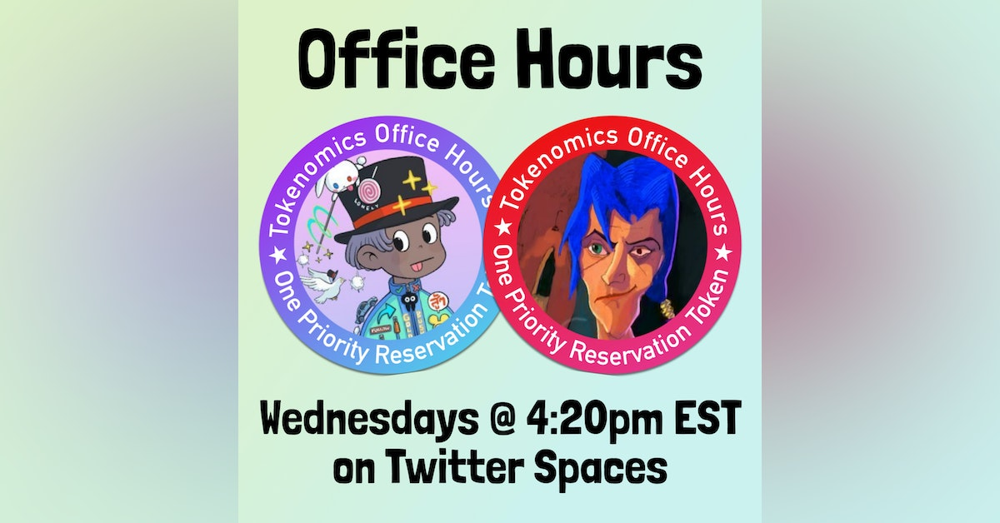

Art by [Sage Kellyn](https://twitter.com/SageKellyn)

## JBX: January 2023 by Jango

Jango posted an article on his [personal ENS address](https://jango.eth.limo/E202254A-5CB0-4213-9486-C63615B26E52/), where he goes through some observations and ideas that we've collectively been talking about passively and loosely through proposals or other forms for a while.

Jango put up [a proposal to update and re-ratify the foundation of JuiceboxDAO](https://juicetool.xyz/snapshot/jbdao.eth/proposal/0x32764c1e75e71fffcd6b3b048cea1ae2eeac23fa8d22ce99de720973970102c7) last week, encouraging how we might create a sturdier DAO ecosystem so that we can tend away from more day-to-day responsibilities. This proposal has been approved by the DAO lately.

At this moment, we are about to deploy the V3 JBX on V3 treasury and start the migrations from V1 and V2, which is a really exciting milestone for us and also the last step on our versioning journey. From the contract perspective, holders of legacy V1 and V2 JBX tokens can send them to the V3 token address, which will mint V3 JBX in turn while holding the legacy versions inside of it, and report the total supply across all three version.

So the redemptions should be working again in a short period of time, which is very exciting. Redemption was a huge experiment we did earlier last year and before to test how redemption manage to keep a steady grasp on the treasury, so that JBX has some sort of floor and folks can choose to exit if they wish.

Jango thought it a great point to reflect more big picture about what's been working well with JBX, what are the points of fragility and how we can start workshopping what to do next. This is also coming off the back of a lot of product focus we've had lately, such as NFT work, versioning work, fixing bugs, to create a better experience for project creators and project funders.

### Current Strengths

- Prevents capture by speculators.

  When AMM price goes up, people would rather mint from the treasury, such that the recipients on the reserved token list can retain leverage.

- Aggregate scheduled decision making.

  We only have to make decisions and execute them every two weeks, as all spending and treasury dynamics are expressed in funding cycles.

- Cost-free voting

  A huge plus to get participation up in proposals.

- Redemption

  There's constant productive tension between the urge to spend on network proliferation and to conserve. Because JBX is in fact backed by the tokens that we spend, members can exit when they're losing trust in how this tension is playing out.

### Current Fragilities

- We depend on 9/14 multisig for execution.

  Presence and loyalty of delegates are required.

- Voting tokens are fully liquid.

  Decision can be made to appease momentary price swings.

- Issuance price to fee payers and reserved rate beneficiaries is mucn lower than the open market price.

  Projects are overpaying for their JBX and reserved rate beneficiaries are receiving less-than-ideal issuance, and the market demand to sell JBX at a certain price is unmet.

- Reserved token distribution prioritization.

  It's impossible to determine the fairness of reserved rate distribution as the network grows, yet the reserved rate is a key piece of the DAO's immune systems against speculative capture.

- JBX governance process.

  Currently there are relatively few holders with over 10m JBX who participate in governance, and proposals often require explicit support by a subset of these members to pass a voting quorum.

We're at a good place but these fragilities still have risk and they hold us back from our maximum productivity.

So we should probably consider this upcoming time budgeting some time and resources to create a less fragile and more catalyzing JBX foundation.

### 3 Proposals To Address Fragilities

#### Progress towards artful veNFT JBX on-chain governance of the Juicebox project ownership NFT

This means that JBX should control the treasury directly and it should also be backed by the treasury directly, in a sense preventing some of the multisig fragilities that we have seen.

There's still some questions around the specifics of the ve mechanism with regard to voting weight and time periods, etc, there's still more research to do.

- How it works:

  - You would lock JBX for certain amount of time to mint an NFT that represents that locked JBX. So JBX is taken off of your wallets, off of the market, off of where is used to be and lock into the contract, instead you have this NFT. As prototyped, we have an incredible Banny collection to visualized these NFTs.

  - The NFT and its underlying JBX could still be redeemed against the treasury any time at its current redemption rate.

  - NFTs are transferable.

- Reasons

  - We want a situation where treasury decisions are biased by those who hold assets aligned with the network's long term financial and cultural value, as opposed to more shorter term myopic reason.

  - It's more automated and it allows participation to distribute with relying on multisig.

  - It signifies confidence in the current JBX token version, which falls on the shoulder of Jango and contract crew to really make this version of the treasury dependable and create confidence for experiments to live on top.
  - Despite being liquid, transferable NFTs don't contribute to a price-chart meme, and instead you can have value correlated to other cultural phenomenon such as provenance, voting history and art. Non-transferable NFTs would have too big of tradeoffs, so Jango has not found a good reason to start the conversation in earnest.
  - It allows proposals to begin leveraging these staked positions to distribute, while reducing the risk of JBX distribution being dumped on the market, and actually incentivizing participation and the culture.
  - We can ship it in parts, so we can do the veNFT and still use Snapshot governance with it. We don't have to go to on-chain right away.
  - The artwork is really interesting. Just reflecting on how Nouns has benn working, there's a massive potential to make governance more engaging and give it more character. If JBX holders get to choose their character, their artwork to participate in governance, there's a lot we can do and that will just happen automatically without any necessary product intervention.
  - Most day-to-day activities in smaller scoped experimental projects will move to cheaper execution layers, while main net JuiceboxDAO will manage less frequent and more consequential decision, making the on-chain transaction fees more worth it.(Not ve specific)
  - On-chain operations will likely broaden the interest in the JBX mechanisms and its governance. It will be way more interesting to get involved in the community that has its rules, opportunities and decision baked in to the chain.

- Tradeoffs

  - Like lower voter turnout, mores steps in the UX to get JBX, then call another transaction to lock it and mint an NFT. Part of the heuristic designing is to make this not a big mental obstacle to understand what's going on. It's a balance between that and trying to find a decent mechanism that incentivizes the behavior we are trying to achieve.
  - Voting will no longer be free.

- Risks

  Subsequent token migration are much more difficult since we're locking the JBX.

Jango thinks that we have talked about it a lot and the contracts had been done. We need to review and audit it and probably make some changes. But it's someting we talked about and built last year, Jango thinks that it's time to revisit it as we go into this next chapter as a DAO.

#### Use buyback delegate on JuiceboxDAO treasury funding cycles

- How it works

  When the ETH / JBX exchange rate on an AMM is significantly better than the JuiceboxDAO V3 issuance, if someone is paying a fee into the treasury or just sticking funds through the pay function, route that ETH to the AMM, buy back the JBX and distribute to the payment beneficiary and reserved rate allocation, instead of taking the ETH into treasury and issuing new JBX.

- Reasons

  The reasons here are pretty straightforward, mainly to get JBX away from those looking to sell and into those who are currently adding value to the ecosystem.

- Tradeoffs

  We won't be taking the ETH into the treasury as often, but we also have a lot of JBX held by the DAO, so issuing new JBX isn't in our best interest either. There's a more efficient way to move it to better holders.

#### Revised reserved rate allocation strategy

 Let's imagine we are sending 60% to the DAO, 30% to individual contributors with day-to-day responsibilities, and 10% towards a fee module  where JBX ve stakers can weekly or some periods based on that period's growth.

By experimenting the 10% to a fee module, we start to distribute the network's growth back to committed network members, which might be the thing that makes most sense to tend upwards over time as the network spreads.

The idea here will be more proportional to amount of JBX staked than duration stake, so the ve might not be a right mechanism, but there's something interesting here where we incentivize the network to grow itself by routing some issuance to committed members.

- Reason

  - We haven't experimented much with reserved rate, but it's probably the most important potential energy for catalyzing a lot of growth. It's where the DAO chooses to direct inflationary pressure, so it's important.

  - We're allocating to folks who do not hold a lot of day-to-day responsibilities in mamaging the DAO's risks and contributing to its opportunities, which eats into the allocation of those who do. This is a small thing, but a meaningful thing, especially as a lot of folks take on hefty chunks of responsibility as we still need to.

  - We should start considering developing a precedent for distributing the DAO's JBX on a per-proposal basis with the goal of proliferating the network.

    Instead of the reserved rate being the end-all be-all, let's maybe consider starting to add JBX distribution as part of a proposal or actually invite people to do so.

    The reserved rate should replenish this supply, hence we're increasing the DAO's share here to something more like 60%.

    A JBX payment terminal would really help here so that we can budget, schedule and automate distributions on a per-funding-cycle basis, just as we do ETH. We can imagine having an ETH and JBX funding cycle distributions to pre-configured addresses.

  - There's massive opportunity in fee-distribution modules to encourage new proudctive behavior while rewarding loyalty, participation and risk taking.

Obiviously these will make their way into proposal form in the upcoming governance cycles over time and we will talk about it. If we're going to tend towards smaller operations so that we can each focus on subsequent experiments built on Juicebox, we need to create a stronger, more automated foundation that is self catalyzing and less fragile.

### Discussions on the town hall

**Kmac**: The JBX payment terminal, if that gets implemented, does that effectively mean JBX can be used to pay into any project in the network?

**Jango**: When I'm imagining JBX payment terminal, I'm thinking less about the pay functionality. Theoretically you could add a pay functionality to other projects, but if we were to scope it down, it will probably revert on the pay function and just be used for distribution. So the DAO could use the method of `add to balance`, which moves the JBX into funding cycle program that can just be scheduled and distributed as ETH is right now.

But theorectially if you're another project, let's say Peel, and you do want to accpet JBX and you're willing to give out 10 PEEL / JBX, you could also incorporate it in that way.

**Jigglyjams**: Just a question on that payment terminal, it's as if you want to distribute more than what's coming in from the reserved rate, is that right?

**Jango**: Exactly. We could route the reserved rate allocation directly to the terminal, and we could also inject what the DAO is holding into the terminal, so the terminal can use it.

**Nicholas**: Do you imagine after a shift to on-chain governance that we would rely more on automated funding cycles, or we would still be programming new configurations every two weeks?

**Jango**: I have no idea. I think two weeks feels like a good time period to take in new ideas, but it's  also pretty exhausting if we're counting on each of us to go after new opportunities and risks with subsequent projects which will grow and have governance needs themselves. More brain free JuiceboxDAO is more enabling for everyone contributing.

## Comms Update by ONNI

ONNI has been assembling some documents that make is easier for us to put stories about Juicebox to media, also these documents are equally useful, if not more, for project creators. He will be uploading them in the next few days.

They are going to have a meeting on Friday, to talk about how to put together press releases, how to approach media with hopes of getting them to cover your project, etc.

We have a [newsletter](https://juicenews.beehiiv.com/) that Matthew and Brileigh put together, and we have an email list of people who subscribe to that newsletter. ONNI thinks the email list is an asset of Juicebox, and stronger that email list is, the stronger Juicebox becomes.

ONNI will be reaching out to project creators over the next week, with the hope to tap into some of their project memberships to receive the Juicebox newsletters. He thinks it will have benefit of making Juicebox stronger, increasing the value of JBX tokens, helping ensure survival and strenghening projects by giving them deeper involvement.

## Visibility Update by Matthew and Brileigh

 Matthew and Brileigh have started making tutorials for various Juicebox related functionalities, such as setting up a project handle, V3 migration, setting up a payment address for a project. Also they started making more general overviews of Juicebox's complete create flow.

Along with those tutorial videos, they are also writing corresponding articles, as some people will find it easier to follow along with an article that goes step by step.

Matthew said that people who has needs for some particular thing can always go tag them in the visibility channel, and they will try to make tutorial for it.

Also they're going to make use case videos, such as Juicebox for open source software projects, Juicebox for content creators, etc.

## Office Hours Update by Nicholas

They've moved the Office Hours from its prior time to 4:20pm EST on Wednesdays.

This week will be the #3 episode of this Office Hours, to talk about NFT tokenomics and smart ways to launch Juicebox projects.

The prior episodes of #1 and #2 can be found on the [Juicecast page](http://podcast.juicebox.money).

