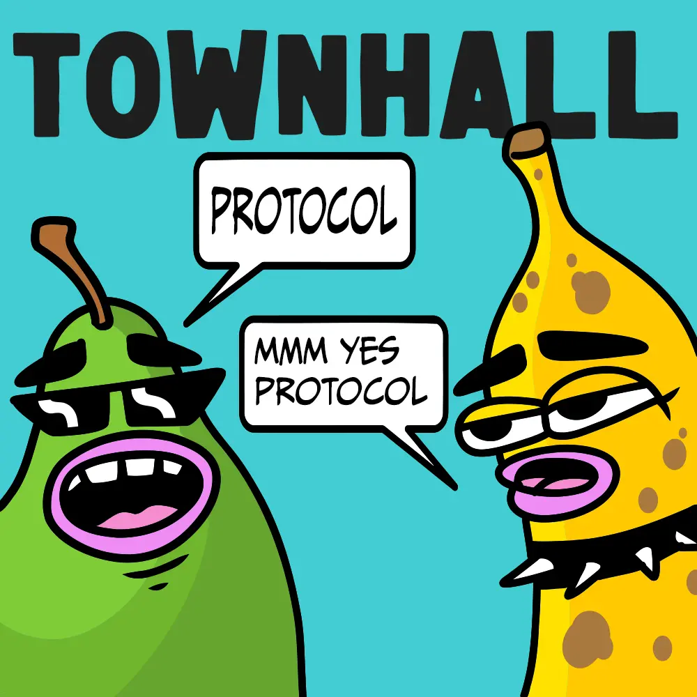
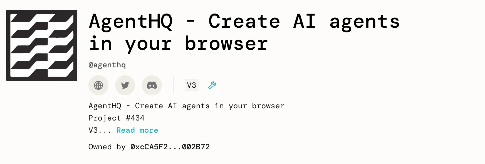
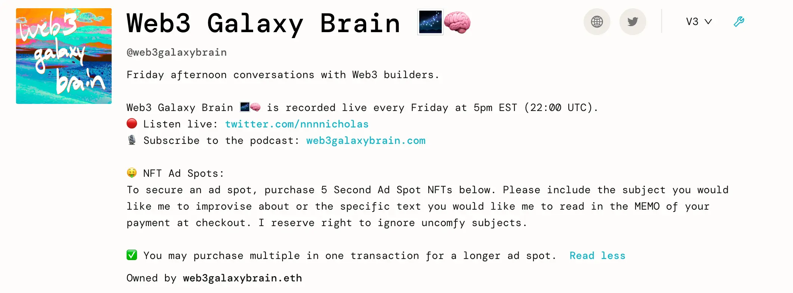
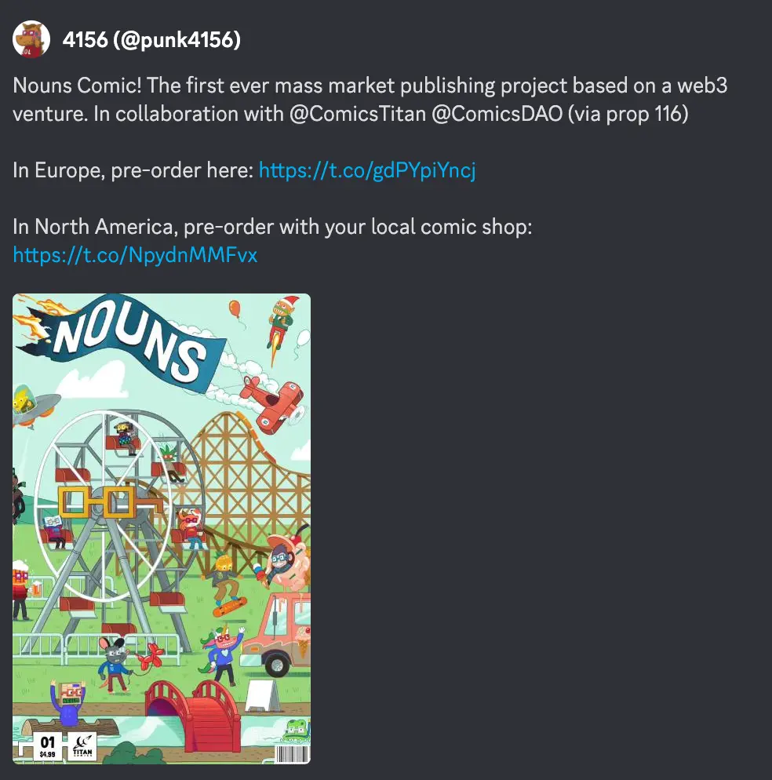
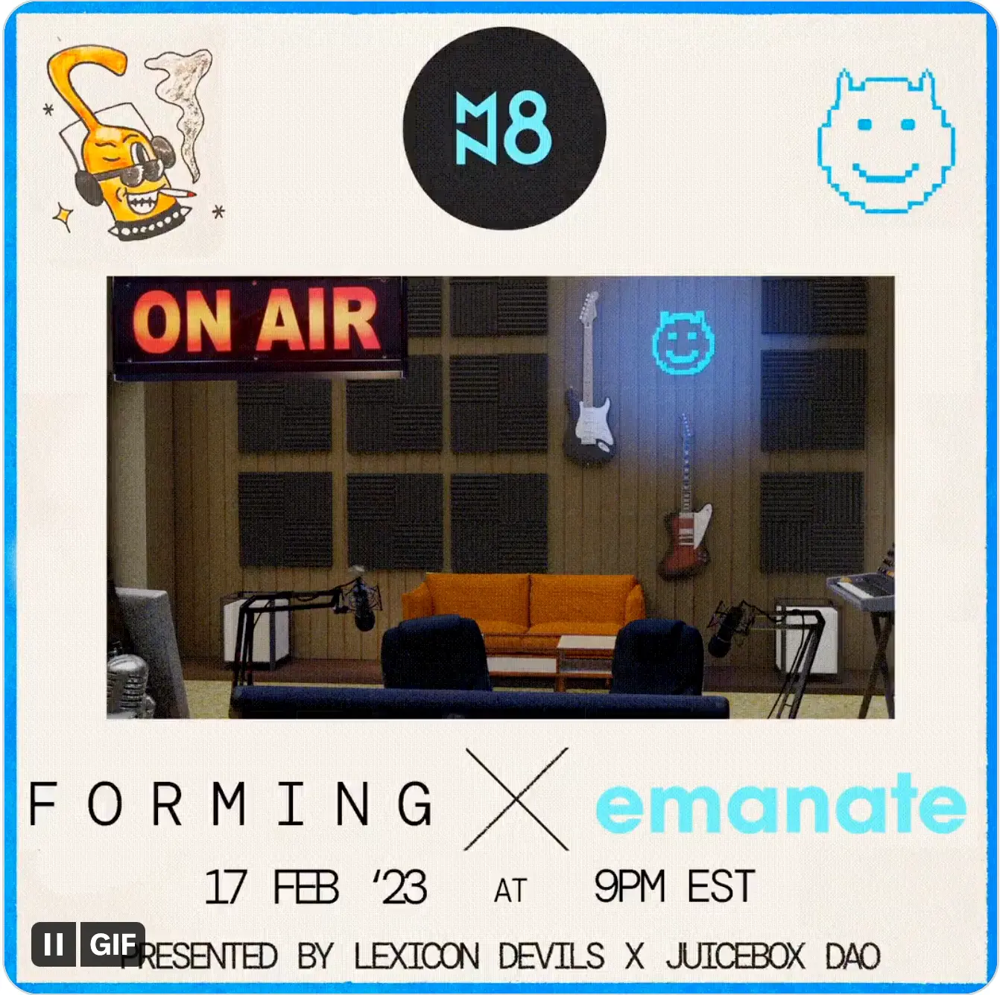

Art by [Sage Kellyn](https://twitter.com/SageKellyn)

## V3 JBX Deployment Bug Postmortem by Jango

Recently we have been going through the current strengths and current fragilities of JBX, meanwhile going through the last stretch of the V3 token migration, which we signed off on last Wednesday.

A few hours later, when Jango was checking the JuiceboxDAO V3 treasury page, he found that the numbers of reserved tokens were unjustifiably big. Jango immediately recognized that it was an inefficiency with how the V3 token was taking into account the balances from V1 and V2 token supplies. This was a design decision meant to make the redemption process smoother on V3, but it ended up exposing an accounting bug.

This issue was sort of delicate, if someone were to have sent the `distribute reserved token` transaction at that time, the big number of reserved tokens would have been distributed to everyone on the reserved rate list and we would have had a different recourse which would have been a little bit more annoying.

The governance cycle right before this happened, we had just approved an [proposal for emergency strategy of JuiceboxDAO](https://juicetool.xyz/snapshot/jbdao.eth/proposal/0xa12e8e5c7ae629548ae984b6a0e3e7454125e339079c65ca0f7eefcf20fddff5). Shoutout to Filipv for doing the research and Dr.Gorilla for helping that effort and everybody for approving it. We made use of it right away.

As the project owners can change where the reserved tokens are routed to during a funding cycle, we had the multisig set the reserved token splits to be the DAO's address, then distribute that big supple and instantly set a transaction to burn that extra supply. Thanks to the quick response of multisig team members, we managed to pull this off very quickly.

### How you will be affected

If you are a Juicebox project, you are unaffected. This only pertains to JuiceboxDAO treasury, JBX tokens and reserved token recipients in this case. If you're running on V3 protocol, you will probably be recommended to migrate the JBController to a V3.1 version.

If you are a DAO contributor, there is no reserved tokens on V3 right now, and that won't change for another few weeks until we're no longer printing reserved tokens unexpectedly.

If you are a JBX holder, the timeline to open redemption will be postponed a little bit longer. We currently have 0% redemption rate on V3, so let's take our first principles and then more forward with our previous plans.

If you are a multisig member, we'll probably still be receiving reserved rate  issuance into the DAO's account and burning them accordingly. If someone wants to make a proposal to go in and make token distribution as if this never happened, that's certainly possible, just requiring more steps on the part of multsig and the DAO. We could do that if that's something someone wants to do.

### Current situation

As it currently stands, V1 and V2 tokens are minted when fees are paid or funds are put into the treasuries, together with some corresponding issuance of reserved tokens. So if someone pays in V1 treasury, V1 reserved tokens will be minted and the same on V3, reserved tokens will increase in both treasuries, which is obviously not what we want. Hence it will be the responsibility of the multisig to burn the extra supply on V3.

The next step is to actually fix this problem so that we can move forward, by putting up the JBController V3.1, which is just a small shift in how tokens are accounted for, but will be a lot sturdier and dependable.

If you choose to change your reserved rate within a different funding cycle but you haven't minted or distributed the tokens reserved according to the previous reserve rate, it will calculate with the new reserved rate based upon the current outstanding supply as if the old rate has not existed all along. This was the way the reserved tokens had been calculated, but we won't do that anymore, we will shift it over to JBController V3.1 to solve this problem so as to get reserved tokens up and running on V3 treasury.

Jango has put up a proposal to [proceed with outlined recovery plan from this postmortem](https://juicetool.xyz/snapshot/jbdao.eth/proposal/0x5b11df589ac1c3bfd40bce63351099e0223d12a1aaf5bd9439a5ba61bb302437), which has been approved at the time of compiling this town hall summary.

And the reason why we choose the option of migrating the JBController to a new version of V3.1 is that it will allow us to keep V1 and V2 in place doing exactly what they're doing, and avoid the tradeoff of totally stopping V1 and V2 and no longer managing interoperable fee collecting treasuries, which was the big hypothesis of this migration strategy.

### Lesson learned

Once we have removed it problem from any immediate actions needed, we can assess what we have learned along the way, to prevent this from happening in the future or reduce is probability. We will need a stricter checklist to our GitHub repos, because theoretically V3 JBX migration tests should have been more broadly covered.

Also we have to do a better job of assessing ownership over different pieces of codes and projects, and keep aware that there are certain pieces of smaller, more passive codes that are greatly important and need focus and space, despite all the other exciting stuff happening in the surface.

There are also some thoughts, from the contract perspective, to evaluate tradeoffs between low probability unexpected behavior exposure and squeezing transaction costs down.

Jango thought that we would be in a much better place once these steps are taken, without this reserved rate risk looming over us.

We are thinking about reducing there risks and fragilities as much as possible in the name of building the stronger and more resilient JBX, as we talked about last week in the town hall.

### Takeaway

If we all commit a week and a half stitching this together and documenting it as well as teaching people how to make use of 3.1, we'll now have yet another instance of versioning under our belt. In some sense, we have this implicit understanding that the payment terminals controllers do have this lighter weight migration path which will require stitching together a few more components to facilitate those. But eventually as things emerge as risks or very very pointed opportunities and there might be moves to make, it will be easier to do it now when there isn't a whole lot of on-chains governance process and weight on the core infrastructure. We should try them now instead of doing it out of choice. Given the current need, it makes sense to get one of these under our belt, let's record it, let's lean into the postmortem all the way through till the end so that we learn from it. Then if we need to repeat this in the future, there will be very clear steps. At that moment, let's get back to where we were, which should be a great place of building more surface level experiments and imaging how this thing can be extended to do new things.

## Dripbox Update by Mieos

Mieos launched a Dripbox project recently, which will be in conjunction with some arts by Sage Kellyn.

Dripbox will offer some NFTs which are mystery boxes. If people buying those NFTs want to find out what is inside that NFT, they can hop over to [another website of dripbox](https://forms.bueno.art/dripbox) and link their wallet to check their holdings of this NFT, and provide an address to have the mystery box sent to them.

The proceeds used to provide these mystery boxes will be deducted from the treasury of this project, while all the leftover funds will be redeemable for the NFT holder in a "Slurp Overflow" phase. So there's basically a bulk discount rate for these mystery boxes that using the treasury redemption mechanism in Juicebox。

This is a little fun experiment, and Mieos that he was planning to start with something chill and simple and see if they can get this exciting project moving on into the year.

## Projects Update with STVG

### AgentHQ project

STVG created this [AgentHQ project](https://juicebox.money/@agenthq) on Juicebox, to help fundrasing and support the development of [Agent HQ](https://agent-hq.io/), which is a way to build your own AI info center basically by putting in some links or PDFs.

STVG has tried to created a “Juicebox learning center” using this Agent HQ, by putting in some of the links and docs related to Juicebox, . He demoed how the interaction with AI agent worked on the town hall. He thought that we could maybe do a better job of explaining some of the technical terms for project creators and eventually evolve this into something that people can ask questions about Juicebox before they want to reach out for help in Discord.

### Merch Squad

STVG would be attending the Office Hours of Nicholas and Jango to talk about some NFT drops along with pairing up the merch.

Also STVG and Justin Harder are talking about launching a project on Juicebox for a show calld Molarky, where they have the plan to do some NFT drops as an open edition for a week or 14 days, while buyers can get a Juicebox shirt or a shirt with the graphic of NFTs on it.

## Updates by Nicholas

### Office Hours Promo

They would be hosting their Office Hours at 4:20 pm EST every Wednesday. STVG will be the guest on the new episode.

All the past three episodes have been edited by Matthew and Brileigh and you can listen to them on [Juicecast](https://anchor.fm/thejuicecast).

### Galaxy Brain Ads

Nicholas is selling 5 second ad spots on its [Web3 Galaxy Brain project](https://juicebox.money/@web3galaxybrain) on Juicebox, for his Twitter Space podcast [Galaxy Brain](https://web3galaxybrain.com/). People who minted an NFT can let Nicholas to improvise in the show or read a specific text the minter leaves in the payment memo. This is an experiment of selling something practical through Juicebox NFTs.

### Gabriel Haines Frontend Open Call

Nicholas is working on the next version of the [Gabriel Haines project](https://juicebox.money/@rantsforyou), and they might be thinking of having a website to have some interaction with the NFTs of this Juicebox project and maybe also with 0xsplits or something of that kind. So he was thinking of inviting someone who might be interested in the frontend work to discuss together.

## ComicsDAO Nouns Comic Book Ad Page for Juicebox by Gogo

ComicsDAO is making a comic book for Nouns DAO, which will be the first mass market comic book printed from a Web3 venture.  As JuiceboxDAO had been very helpful when ComicsDAO created their project on Juicebox, they are happy to reserve one page in this comics book for JuiceboxDAO to promote itself or share something meaningful.

Gogo encouraged people to go to the thread of ComicsDAO Artwork to join the discussions, and share their suggestions of what would be cool to have on the Nouns comic book ad page for Juicebox.

## Forming Plug by Darbytrash

The next Forming event will be on February 17th, 2023. Lexicon Devils will be doing a collaboration with [Emanate](https://twitter.com/EmanateOfficial) featuring [djlethalskillz.eth](https://twitter.com/djlethalskillz).

w