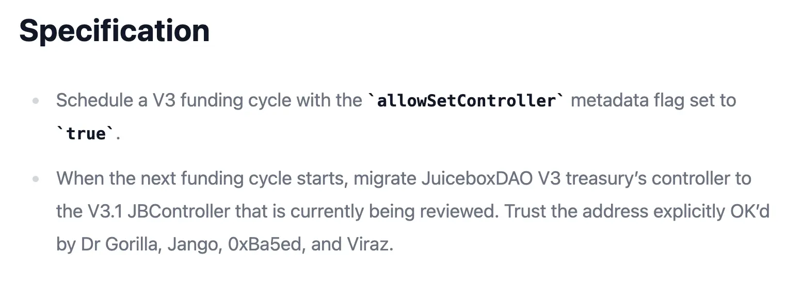
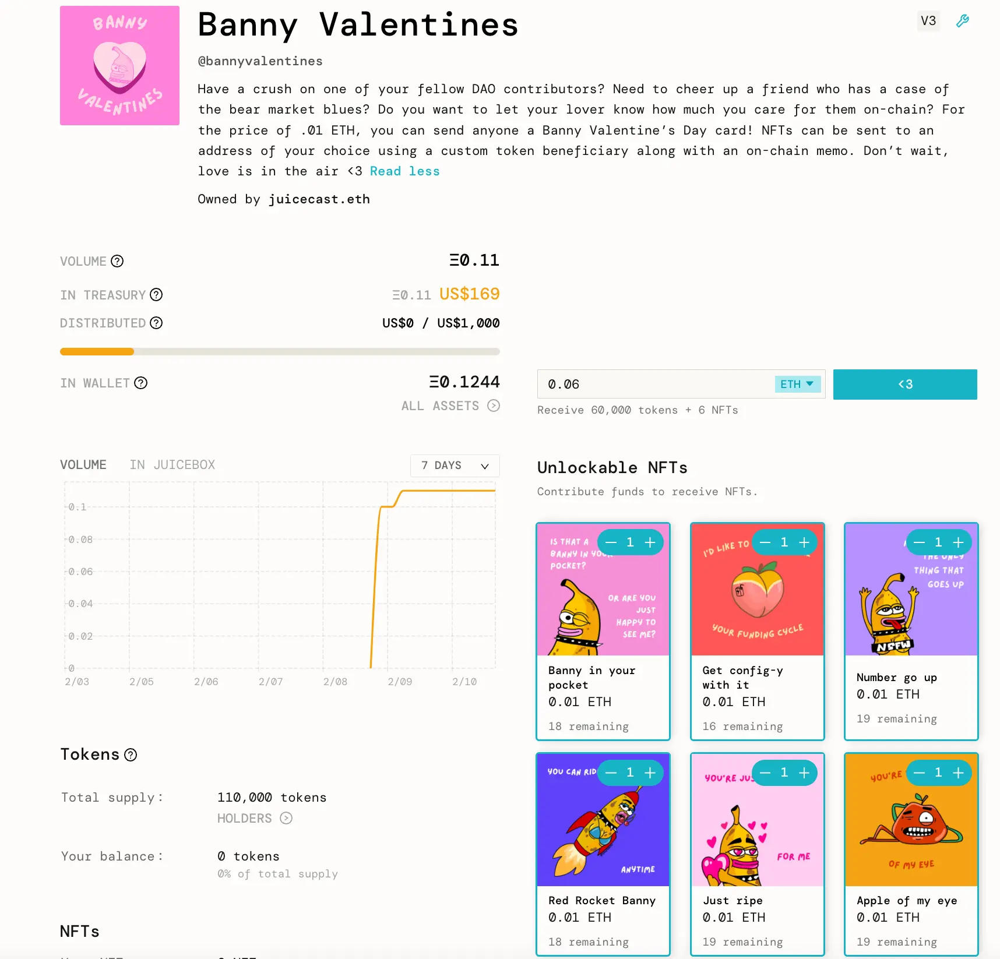
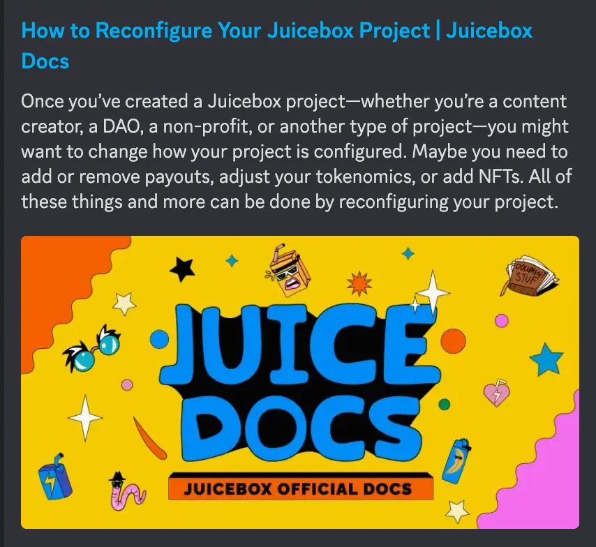
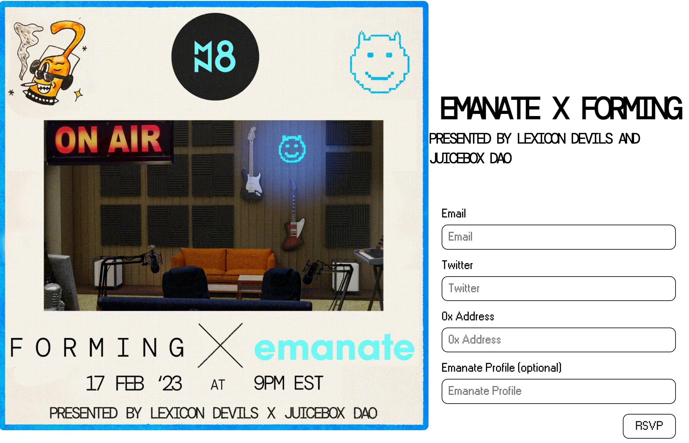
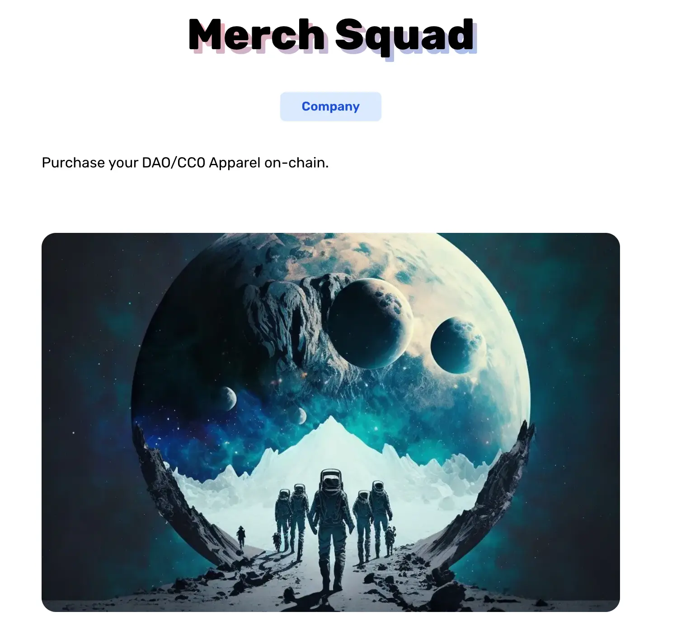

Art by [Sage Kellyn](https://twitter.com/SageKellyn)

## Postmortem Update by Jango

The [governance proposal](https://juicetool.xyz/snapshot/jbdao.eth/proposal/0x5b11df589ac1c3bfd40bce63351099e0223d12a1aaf5bd9439a5ba61bb302437) to migrate JBController V3.1 has been passed. Big shoutouts to Dr.Gorilla, 0xBA5ED and Viraz for helping test and publish this latest version of JBController, which is used to fix some reserved rate accounting inefficiency that exposed during the JBX V3 deployment.

Once we have the transaction queued by Dr.Gorilla and checked by Jango to especially conduct this migration on JuiceboxDAO, we will verify and sign it. By then, we will have the first principle things out of the way with a process agreed upon by the DAO. There is some ambiguity in the proposal because we had some last minute building, so we published the contracts and got their official addresses after the proposal was passed.

It also brought up a few other things so that we may want to look preventatively towards controllers, where a problem was exposed a few cycles ago when the payouts distribution transaction reverted because one of payouts recipient, the Defifa project, had its treasury paused. So we will be doing a quick audit of other components that we may look towards versioning. These components will just be controllers and payment terminals, there will be nothing that requires funding cycles reconfiguration or tokens like last time.

After this, we will be at a really good spot afterwards and having basically done all the versioning paths that available to us going forward in case of other risks that we may find, which hopefully will be very very far and few in between. And versioning should be kept very slim, because they are risks themselves when introducing some new components.

Big thanks to Dr.Gorilla, especially for helping to lead this process to get JBController V3.1 out there, as well as the migration components.

For project owners, they will soon have an opportunity on Juicebox.money to migrate controllers, which is just the contract that mints token on their behalf, listens to payment terminal intructions, etc.

And new projects will be created using the new controller. We'll have the actual UI components on Juicebox.money probably next week, as Aeolian is focusing on that work this week. Big shoutouts to Aeolian and the whole Peel team for working with project owners to really make sure the expectations are correct for them. Also we'll follow up with the instructions both in the form of documentation and some quick tutorials that our content contributors might help to create.

Thanks for everyone for moving very fast, it feels like we will be at a better place because of it. Despite the dogfooding having caused a little glitch and had us introspect a little bit and go through the process to learn from it, Jango thought that we might be better on the other side.

## Banny Valentines by Matthew and Brileigh

Matthew and Brileigh have just created a new project named [Banny Valentines](https://juicebox.money/@bannyvalentines), which is an experiment in collaboration with Sage.

This project has deployed a few NFTs of Valentine's Day cards so that people can mint and send them to their friends or loved ones. So it is meant to be a fund little project to spread the meme of Banny leading up to the Valentine's Day. Matthew and Brileigh have the plan to send them out to people tweeting about this project over the next few days before the Valentine's Day.

This project is also a very good demonstration of how to use the function of custom token beneficiary, so just enter another address when you are checking out with the NFTs and then these NFTs will end up in someone else's wallet.

Except for this project, Matthew and Brileigh have recently finished [a tutorial on how to reconfigure a project](https://docs.juicebox.money/user/guides/reconfigure-project/). And they will be making more tutorials and educational materials in the upcoming future.

## Ticket to Space on Juicecast by Kenbot@StudioDAO

Ticket to Space is a documentary that StudioDAO is going to produce for MoonDAO, which will also be a independent project in the network of StudioDAO. Kenbot said part of the launch strategy for Ticket to Space and the funding of it will be to run a series of interviews with filmmakers who are associated with this film, other filmmakers who are doing other space related content, MoonDAO contributors and also some real life scientists.

So they are thinking of partner up with Matthew and Brileigh to make a theme Juicecast series for a deep dive into the Ticket to Space Juicebox project. It seems to be a good place where they can combine forces, get helps from some other DAOs to get more distribution.

Matthew thought the idea with the Juicecast series would be like some thematic episodes leading up to the funding events. Ken said as they were not expecting it to explode out of the gate, they would want to do it and feed it gradually. So maybe they should plan to do the first Juicecast up, have some good experience, and then follow up with other conversations with other people who are associated with the film in one way or another.

Ken said they would be making announcements about this next week, by posting on Mirror for Ticket to Sapce on the Valentine's Day.

## Forming Plug by Germs

Lexicon Devils will be collaborating with [Emanate](https://twitter.com/EmanateOfficial) to hold a new Forming event on Feb. 17th. The RSVP to this event is open now at [the Forming webpage](https://forming.lexicondevils.xyz/).

## Merch Squad by STVG

STVG was wondering if folks were interested to purchase the Drippy Long Sleeve on his [Merch Squad project](https://slice.so/slicer/2?product=5), an experiment for different ways to sell some merchandise related to our ecosystem.

