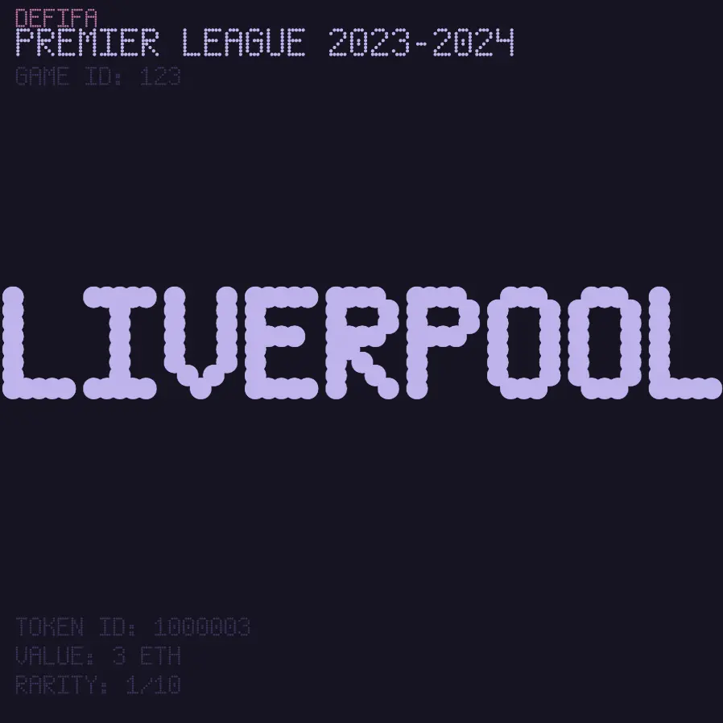
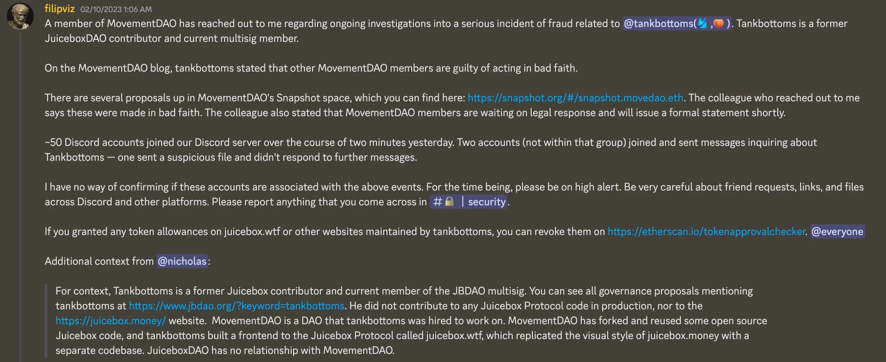
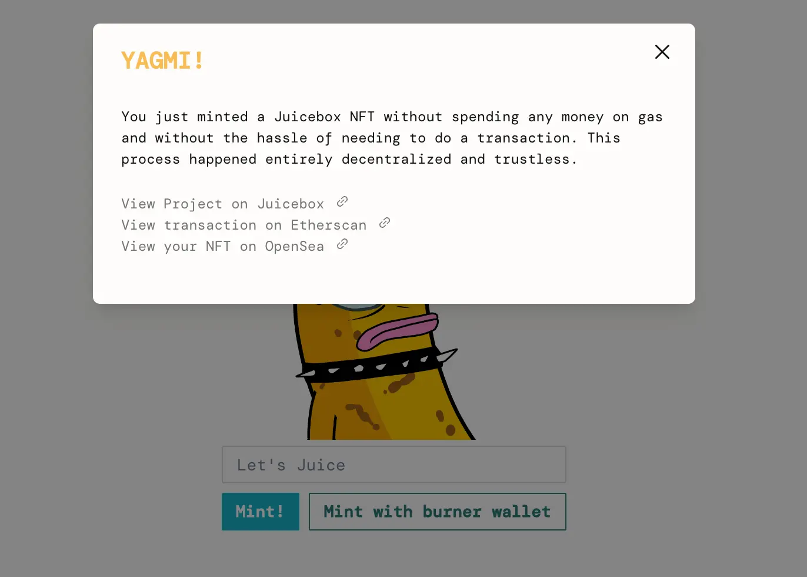
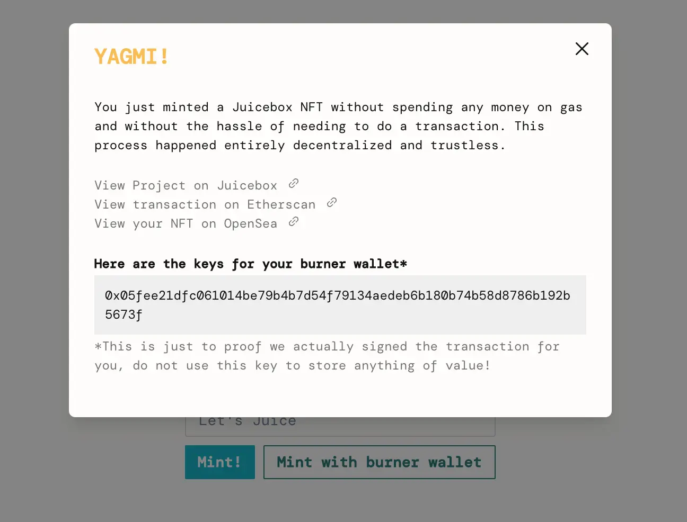
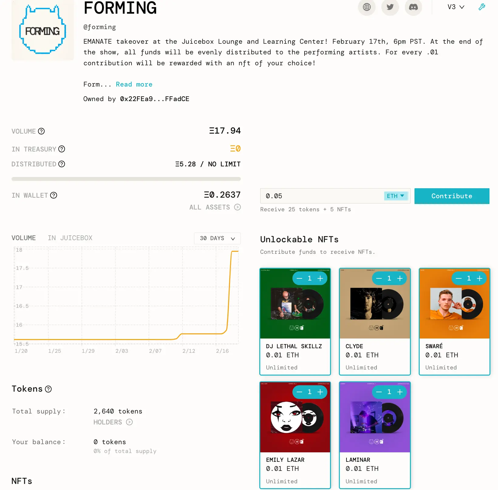
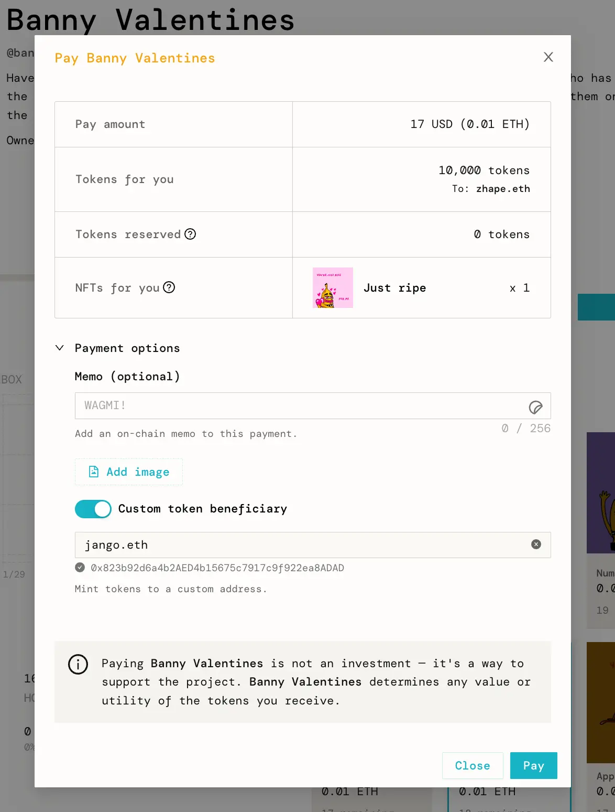
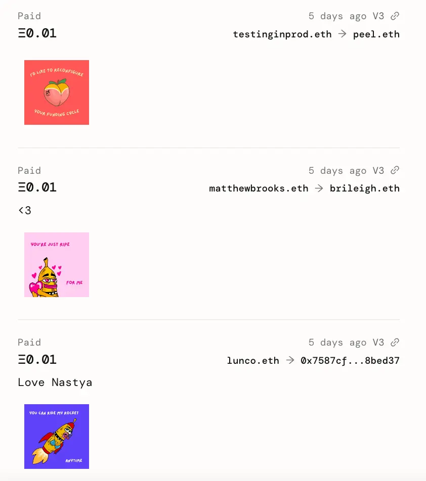

Art by [Sage Kellyn](https://twitter.com/SageKellyn)

## Versioning / Postmortem Update by Jango

Three week after the original JBX V3 contract was put up, we've put out the V3.0.1 JBController and migrated to it, which caused another bug in how payouts are distributed as we had scheduled that distribution from the previous V3 JBController.

So the impact is folks on the payouts won't get their distribution in this funding cycle, as we need to go through one transaction to swap the controller back to the old one, distribute the payouts and swap back to the new one again. This process is outlined in [this proposal](https://juicetool.xyz/snapshot/jbdao.eth/proposal/0xb7b3ccd64f9b27ed001e7d086b11ae1dc78c56bd525840636a1a79d62ba14ccc), which is currently up for voting. If this proposal is approved, we can mitigate this bug and fulfill the distribution of payouts within the next governance cycle.

And our next steps are to fix a few other things that we've noticed over the past several months. One of them is when you are trying to make a payment from one project to another project which is paused, the whole transaction will revert.

We're looking forward to this kind of more permanent migration verion, which is also in the abovementioned proposal, it should take effect in the next few weeks if the proposal is approved. If it all goes well, at that point we'll have actually done migrations in the system to the extent possible. Although it has added complexity and bugs in the meantime, but given the current state of things and the product in the pressure, it's actually nice having this dogfooding process go through.

Shoutouts to contract crew for helping out in the past week really focusing on making sure this migration stuff goes well, to the frontend team for dealing with the controller routing and soon-to-be terminal routing so that projects can make use of the best and most reliable versions going forward.

Next few weeks hopfully we'll see new versions. There's very little risks in the system for what were exposed, which are very well known and articulated, but the versioning is really just to reduce the risks for future projects that maybe will be running without us or without knowing they ever existed, and may not look through the documentation as closely as we would recommend.

## Peel Update by Aeolian

It has been a while since last time Peel gave an update on Nov. 15, 2022.

Aeolian started by acknowledging some of the growing pains we've had recently, when we had a few reasonably critical bugs pop up over the last few weeks. Although these bug got squashed quickly, we've recognized the need to definitely improve on this font.

A lot of versioning stuff is being worked, as certain parts of the App were revealed to be in need of improvement, which is a good segue into versioning. As a lot of stuff goes into versioning, there are also a lot of different parts of the UI that need to evolve to support multiple versions of these particular contracts.

Great progress is being made, with a UI coming up soon for other projects to upgrade to new versions of controller and ETH payment terminal, after which point other projects should be able to start their token migration process as well.

Also there are some exciting new fuctionalities available with the efforts of Peel:

- Video NFTs. This will be shipped at the end of this week. Projects will be able to deploy NFTs with MP4s;
- Multi-selection of NFTs. People can now select multiple NFTs before they want to mint, this feather was pioneered by folks in the Defifa project;
- Diff view in project's Safe page on Juicebox.money. Multisig members can go there, review transactions and compare the difference before signing them;

Search feature is also coming along, and Peri has been working on that. This is really another big pivotal change in the APP that has a lot of moving parts, so Peel team wants to take the steps slowing so that they can iron out the details before putting out in the wild.

Also Aeolian reminded us to keep looking out for the changes made to the create flow, because projection creation is always evolving and iterating with new feedbacks.

## SVG Template by Nicholas

Recently Nicholas has been cleaning up some stuff for the token resolver, and Jango needed an on-chain SVG solution for spinning up SVG metadata for Defifa, so Nicholas created a [repository of SVG template](https://github.com/jbx-protocol/juice-svg-template) which might be helpful to other people as well.

On the town hall, Nicholas did a demo of using this template to generate an SVG. Other users can make changes in the `SVG.sol` to write their own SVGs. People can use this template to make their own on-chain SVG metadata for NFT rewards, project, or whatever they are interested in, and it comes with the Juicebox contracts built-in.

And then in the `project-handle` branch of this repository, people can call a slightly more complicated test to load Juicebox project handles in the SVGs.

Jango had been playing with this template this week. He wanted to make it an auto generating terminal for Defifa NFTs, so that anyone can use and create their own tournament. We can start showing data on the NFTs and customizing it with Peri's on-chain fonts. He thought that it is a very cool and useful tool, especially on a data heavy protocol as Juicebox, quickly visualizing data on the NFTs will be a great default for many projects.

Nicholas added that it will be also really cool for NFT projects to be able to have their token metadata directly served from blockchains, so that if Juicebox.money or whatever stops pinning their IPFS, the NFTs won't disappear. It will also be super cool for projects that want to be more autonomous or founders that want to keep their anonymity.

## Reflection as a DAO contributor by Jango

Last week Filipv reported and shared some things in our announcements channel, about a former JuiceboxDAO contributor, tankbottoms. Last week some people on the MovementDAO multisig contacted Filipv to say that they had discovered that Tankbottoms was convicted of fraud in 2010 with a number of PDFs proving it. And he also exfiltrated millions of dollars from the MovementDAO multisig.

JuiceboxDAO has no connection with MovementDAO aside from some contributors work at both entities and MovementDAO forked some of open source code of Juicebox.

Taking a step back from this particular instance and reflecting on how as a DAO member sees with this proposal and contributor cadence that we're currently accustoming ourselves to, Jango wanted to reflect on what had happened and how it had happened, then to reflect on what we can be doing to learn from things in order to avoid things bad happen to us and to recognize things that going well and looking good.

Jango wrote a [blog post on his personal ENS address](https://jango.eth.limo/905FFC14-1A87-4FBA-B81F-00DEB2B5FBEB/), and shared his thoughts one by one on this town hall.

- Jango thought that he tends to over-index on being trusting and enabling to people, and open to whatever happens with a diversity of outcomes, not really with the strong opinion what these kinds of accompany and what happens along the way. This can be abused. He felt very disappointed at what had happened, reflecting on how he relates to that kind of enabling energy.

- He thought enabling certain ideas or energies in some degree feels like enabling of things, which tends to be not good, but instead doing so can be hurtful and disabling to others who may have a different approach or different engagement with that energy. There's something to reflect on as a kind of loose social orientation observation, but valuable nonetheless.

- He thought that people can behave very differently with one another 1:1 in a DM format. It's interesting to see how different perceptions can be made depending on which conversations you're having and how they're being approached.

- Good communication is very important obviously. It's very important as a DAO. We can address and observe periods of miscommunication and reflect on their shadiness and how we might improve those, so that we're at least more consistently understanding the current context that we find ourselves in, so we can think about an approach to move forward.

- The 7-cycle recurring payout term that we have developed precedents for does seem to limit risk, which is something to look back on and be happy about. In his perspective, that system somewhat evolved from the void of systems altogether in the beginning. Recurring payout proposals can cause moments of reflection that can lead to inflammation and more difficult conversation, which then puts pressure on contributor's expectations -- both social and technical -- and shifts leverage a bit more into JBX community's value set. This value set is always changing and hard to get right because there's no right or wrong and this is the product of the people that are around.

- Contributor and JBX holder skepticism is really necessary to the DAO's health, but being the contributor that instigates the inflammation can be risky and hard to do. Jango thought that we should try to figure out how to allow skepticism to occur, to support it and to actually figure out forums or venues to make some certain things actionable. This can be taken in various degrees.

- The DAO's values outlined in the Foundation that we confirmed a few governance cycles ago, does leave room for interpretation. A lot of it talks about finding balance between urgency and patience, what kind of things that make our process tick or of particular value. It's a good thing that we do have the room for interpretation. It's not clockwork rules that you either adhere to or break, but a great set of values to reflect on and really figure out what does pulling towards balance mean when stuff like last week happens.

- A strong DAO immune system that minimizes bad risk and maximizes good risk over time takes attention and taste. Taste is a hard thing to get right, because we're an evolving community that has a Venn diagram of overlapping interests, tastes and tolerance. A lot of it does come down to the gut feeling or taste, and a lot of it technical, we have to be open and accepting of folks who are different from ourselves and may be providing new points of view. It's the balance, but it takes attention and taste, and we have to trust each other with the stuff we delegates to each other.

  There exist specialized viruses which is just part of building the system that we're building in. It's an adversarial environment. There're also designed viruses to attach these systems and figure out how to ride that way. To some extent the risk mitigation that the DAO has already pronounced is pretty cool, but there's obviously work to do.

- Developing an efficient and consistently sensible mechanism for moving JBX to productive workers and productive funders over time is a priority. It's a tricky thing. The buyback delegate will start, but that's something we talked about recently with the JBX strategy. There are more objective token things that we've already talked about and we're already aware of on the horizon from a technology and governance perspective. We'll hopefull have to take a consideration of the broader social environment that we exist in.

It's unfortunate to give a lot of chances or open space for something to exist, many times things blossom from that, but sometimes things just occupy that space and cause pressure to the actual fun beautiful things that are being worked on in blossom along side. The whole journey is just part of this dance and it's cool to be part of it, but it also takes these heavy amounts of reflection and actually feeling the consequences that can sometimes play against the general train of optimism towards actually creating cooler world of more open finance.

### Discussions in the town hall

**Aeolian**: Thank you Jango, those are really good. One of these points you made has been on my mind and definitely on people's mind for a while, which is that being the contributor that instigates inflammation can be risky.

I don't know what the solution is. Folks who have pushed back on proposals know that it's very hard to do so from a number of levels, which is emotionally taxing having to be involved in proposal and takes time to do. Obviously the risky part is that suddenly you publicly state your disagreement with someone's payout essentially, which can be risky for yourself. But folks who are willing to put in that effort, passion and care to push back where is appropriate on proposals because it's obviously really important and probably would have gone some ways to preventing this scenario that we found ourselves in.

**Filipv**: I certainly agree. I think that's a great point. Not just in proposals, but also in everything we do as a DAO. There's a tendency to want to agree on everything, which is human nature in some ways. If you're in a small group, you depend on these other people's approval to get things done. It can be hard to disagree with people, but we all need to continuously remind ourselves because there's that natural bias.

It's okay to express our opinions and hopefully we can come towards the right anwers even if no individual has the perfect answer all the time. Hopefully we can more towards it on the aggregate.

## OpenGSN explainer and demo by 0xBA5ED

[OpenGSN](https://opengsn.org/) is an open gas station network, it essentially allows you to make transactions without having to pay the gas for them. You don't actually perform the transaction yourself, you just sign a message, which gets sent to a decentralized network of relayers that in turn put it on the chain for you.

There are a few reasons why this would be useful.

- To improve the UX for projects. When projects want to onboard new users, those new users need to create a wallet and maybe go through KYC procedures, before they can fill the wallet with ETH through onramp. Then they have to perform the actual transaction when they get confronted with the need to pick a gas price and go through the rest of the entire flow.
- To incentivize users to perform certain actions, by projects paying the gas for them if they do this or that.
- It's also useful to automate tasks that need to happen, so that contributors don't need to do it manually.

0xBA5ED made a demo of minting an NFT on Juicebox without needing to pay gas or make transaction himself. Here is [the link to his experiment](https://demo.ba5ed.com/) on Goerli testnet.

For people who may find this a bit scary, 0xBA5ED also added and option of "Mint with burner wallet", which would just create a burner wallet in the browser and then perform the transaction with it. Nothing need to be signed in this case.

This is a good example of how the `distribute` function on Juicebox could work. Currently the distribution of payouts on Juicebox projects need to be triggered by someone clicking the `distribute` button, and this person will have to pay the gas of this transaction and may or may not get refunded from the project treasury later on. By this "Mint with burner wallet", in theory someone can just click `distribute`, the browser will make a burner wallet, sign the transaction and send it to a relayer to put it on-chain, at the expense of the project treasury.

0xBA5ED wrote a pay master which allows owner to set which addresses are allowed, which contracts are allowed to be called, which methods allowed to be called, and also to deploy system contract to verify the calldata.

By doing this demo, he wanted to give us some idea about what openGSN is and how it could be useful in lowering or reducing onboarding barriers for Juicebox.

## Forming Plug by Darbytrash

Lexicon Devils will be holding their next volume of Forming in collaboration with Emanate on Friday Dec. 17th.

There is another very exciting thing revealved in [the Forming Juicebox project](https://juicebox.money/@forming), an idea that Lexicon Devils have been toying with for a while. From this volume on, they are going to launch the new Forming Record Store NFT collectibles every month, which will be the personalized NFTs for each artist going to perform in the Forming event of that month. And as usual, all the artists on the event will be set as the beneficiaries of distribution, all the funds in Forming project treasury will be distributed to the artists after the event.

## Banny Valentines by Matthew and Brileigh

Matthew and Brileigh created a [Banny Valentines project](https://juicebox.money/@bannyvalentines) in collaboration with Sage, putting forth some Banny Valentine's Day NFTs.

If people want to buy one of these NFTs and have it sent to someone else, they can turn on the option of "Custom token beneficiary" in the pop-up payment window and put in the intended recipient's ENS or wallet address. After the payment is made, the NFT will end up in the hands of that recipient.

And we've just implemented a new functionality in the front end. If the custom token beneficiary is enabled at the time of payment, the caller and the token recipient of that transaction will be both shown in the project's activity feed.

