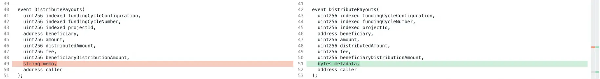
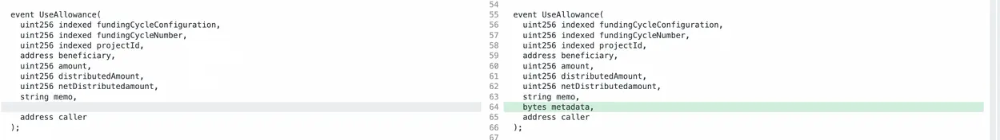
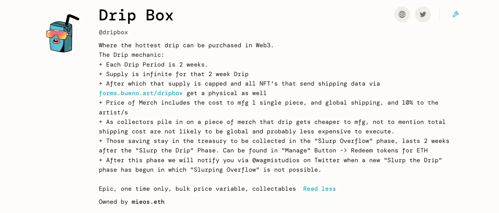

Art by [Sage Kellyn](https://twitter.com/SageKellyn)

## Specifications 3.1 by Jango

We are now on the creative side of reacting to the lessons learned of the protocol, such as in the token migration bug that we experienced the past few weeks. Jango outlined what changes we've made in the controller and terminals, for reference purpose of the projects who are using the current terminals and controllers. Even though it will be a little more technical, but it should be useful to go through and explain it in terms of user experience.

***You may also check the full version of this report by Jango [here](https://juicebox.notion.site/e940e45c08774388bdd31b21f38e4f30#b728fd6e3e734d5aad35dd636c401ec6)***

Here are the changes made to the three malleable surface components of Juicebox projects:

### Controller

*You can check full code difference [here](https://www.diffchecker.com/bEuD9b4b/).*

Every project uses the same contract but accesses it via their project ID, and then every project gets to choose one of these canonical controller contracts to use. The controller contracts are stored in this contract called the JBDirectory, which you can ask what current controller a project is using and it will return the current address of the controller.

This controller has permissions to mint tokens on behalf of a project, burn tokens and keep track of a few other things. It also has exclusive access to do a few things in the `fundingCycleStore` and the `tokenStore` on behalf of every project.

The changes that we've made to the new controller, which project can choose to migrate later, are two reserved token oriented function interfaces, the `reservedTokenBalanceOf` and `totalOutstandingTokensOf`. This new version of controller won't be backwards compatible with old versions payment terminals, so projects that are going to implement migration will have to move both controller and terminal to their new verions. The same for new project creation.

Essentially it's just a very simple and small change, which just changed where the distribution limit of a project is accessed. Before, you access it directly in the controller with`controller.distributionLimitOf`, and the project would return what the distribution is set and properties such as which terminal it applies to, etc.  Same with overflow allowance by `overflowAllowanceOf`.  But now, these are accessed in a separate store called `fundAccessConstraintStore` which fixes the problem that we experienced with payouts when we did the first patch migration.

And then there are some changes to how reserved token balances are accessed. The amount of reserved tokens outstanding is no longer a function of the current reserved rate, as now reserved tokens get tracked automatically when payments come in.  You can just get from the new controller the reserved token balance of a particular project ID, and it will give you the full amount. The same with `totalOutstandingTokensOf`.

These are all very small and very inconsequential changes made to the controller, if you are not depending on this original interface explicitly. But if you are, you will need to figure out how to connect with these updated APIs.

### Payment terminal

*You can check full code difference [here](https://www.diffchecker.com/7Zf5CnrL/).*

You can think about the payment terminal as where funds are stored. It accepts new payments on behalf the project, allows token holders to redeem tokens to get their share of fund, and allows anyone to trigger the `distribute` transaction of funds.

#### Specifics

Payment terminal is changing very slightly but meaningfully. As we had to publish a new terminal to be compatible with the new controller, in so doing we are also fixing the problem that we noticed a few funding cycle ago, when we tried to pay a grant to Defifa project which had its payment terminal paused, the entire transaction of distribution got reverted.

What we did was to wrap a functionality to catch that error coming back from trying to pay a project or an allocator and dump the funds back into the paying project's terminal, so that other payouts in that transaction still go out and any reverted ones will be negated. Then we emit events so that subgraphs can check if there is any reversion happening.

Another change in the payment terminal is of the `addToBalanceOf` call, which used to  automatically bypass minting tokens when funds are injected into project's treasury by calling this function. We have been refunding any held fees by this call. If projects chose to hold fees when they were sending funds out of the ecosystem, they could deposit any amount distributed funds back in to release a proportionate fees back to the project.

Now the `addToBalanceOf` call will not do so automatically any more. There is a separate `addToBalanceOf` overloaded call that has a Boolean parameter requirement. If projects intend to refund any held fees, they have to pass that parameter as True in the transaction.

#### New event signatures

- The `distributePayoutsOf` function used to emit a memo, which is kind of pointless since it is a public transaction. So we replace `_memo` with a  `_metadata` parameter which allows callers to send their project ID in that first chunk of metadata, that way we can use events to attribute which projects are responsible for these value adding actions in the ecosystem.

​     `distributePayoutsOf` is important because it's the one where fees actually get accumulated and registered.

-  `useAllowanceOf`, we don't even expose this in the client yet, but we probably should consider doing some version, or at least alerting in the project page when there is an allowance in the contract, even though the UI doesn't facilitate it.

  Its API is also changing to include the `_metadata` parameter alongside `_memo`. As this will only be called by the project owner, so it's usefull to keep the `_memo` there.

####  Tiered 721 delegate

The tiered 721 delegate is an extension that projects can use for their NFTs.

There are some new properties in the create flow concerning NFT functionality:

- Project owners now can specify a royalty rate and a royalty beneficiary. These get exposed in a standard way that some marketplaces listen to.
- There are categories as well so project owners can add tiers that are organized by categories. They can get NFTs by particular category and start to create a new organizational traits around these tiers.
- Project owners can also set the metadata of tiers after they have been made, without having to deploy a tokenURI resolver. They can just upload the encoded IPFS hash and then the metadata of NFTs will get uploaded and changed.

Obviously the NFT stuff also needs to correspond to the new controller and terminal, so new projects will use all these new contracts instead of the old ones.

Also, as the NFT deployment is now using a proxy deployer pattern, the cost of deploying an NFT contract will be much more cheaper than it used to be, which is a very big win.

Hopefully we're inching towards a more resilient place where there will be few risks that projects owners need to know about, and adding a few different opportunities for features along the way.

## Ticket To Space Update by Kenbot@StudioDAO

Ticket To Space is a documentary that StudioDAO will be partnering with MoonDAO to create to document a Ticket To Space winner's journey and story.

StudioDAO is about to launch a funding process for Ticket To Space, which Kenbot thinks a big win for MoonDAO, for Juicebox and for StudioDAO. He also thinks with a lot of creative energy that can be deployed through this effort from people such as Matthew and Brilleigh, Jango, Mieos and Aeolian etc., we will be in a good moment where some of the big corporate companies are working that well.

He is very interested in terms of  how they can do some NFT drops, more in a form of open editions and potentially with some burn capabilities. He is going to make use of the functionalities of Juicebox V3 protocol and offer different tiers of NFTs to supporters.

On one hand, they will have some high end NFTs which will cost 50ETH or 10ETH each. For example, he is going to put up a proposal in Nouns DAO to get them buy the NFT of 50 ETH in exchange for a credit in the creation of this film. But on the other hand, there will also be the open edition ones that will be more bottoms-up driving force to engage hundred of thousands of people around the project.

## Drip Box Update by Mieos

[Drip Box](https://juicebox.money/@dripbox) is a project that Mieos launched to try to sell some NFTs and comes with them some mystery boxes of merchandise.

People can mint the NFTs and go to another website and have their holdings verified so that they can leave their physical addresses to have the mystery boxes sent to them later. After the selling phase, with all the cost and proceeds deducted, the project treasury will be open to NFT holders to redeem their share, in a sense giving buyers some discount or refund. The logic is, more people buy the NFTs, the more the purchasing cost of merchandise and operational overhead will be spread out and lowered, and in turnthe leftover funds to be redeemed gets bigger.

Mieos thought he would need to figure out how to work on marketing and build some traction for this project, in order to scale it properly so that it would be possible to get bulk discounts on the merchandise.

And he has spent much time researching some best-in-class items for the mystery box, and this first NFT drop will becalled the bug-out bag, which is a collection of goods that people would want to have at any given time and comes as a pack people can grab and run out the door feeling well set up to encounter things in the world.

Also Mieos and Jango discussed about the possibility of offering some producer NFT to give some potential sponsors a choice to put their brands on the products.

