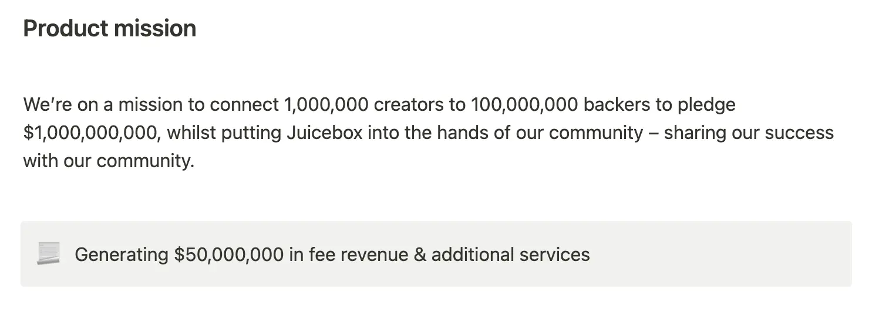
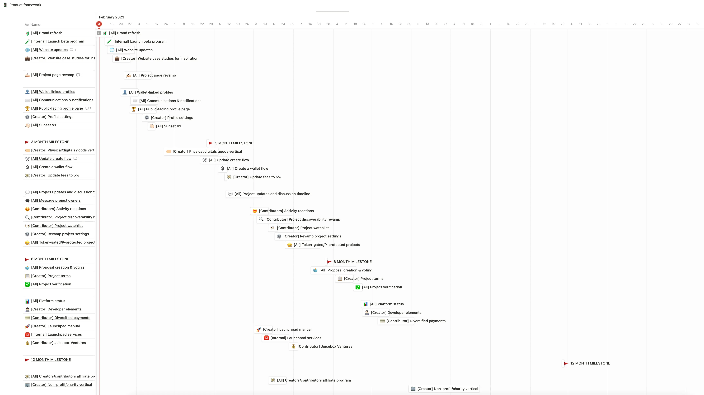
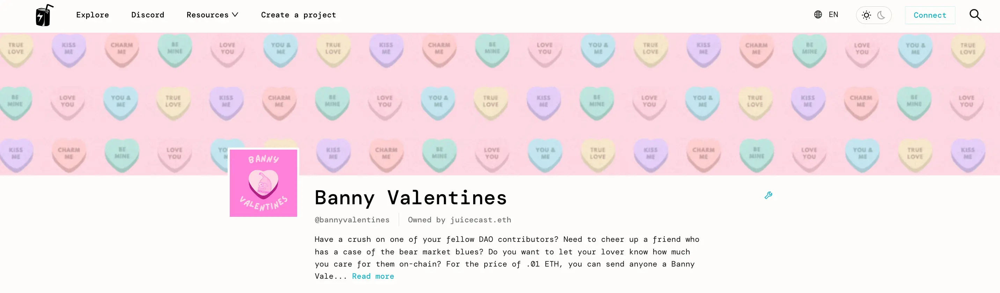
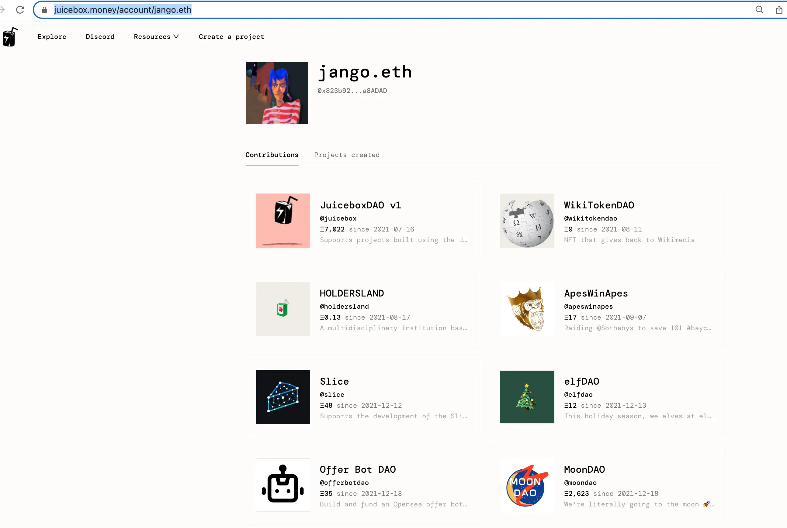
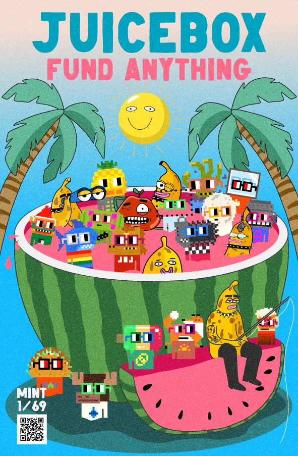

## Roadmap Presentation by Tjl

Tjl was doing a roadmap presentation on the town hall, which is realistically a guiding force for those in Peel so that they can make progress and track against it and work towards a unified vision and goal.

### Product Framework

The full version of this document can be found [here](https://grand-popcorn-c81.notion.site/Product-framework-dc8da04f5b7e4197bd27ebbf5fa43e9b).

As a very high level context, this product framework by tjl has been pulled together through a series of workshops, some front end analytics, on-chain and  off-chain analytics, as well as the user testing and interviews by Strath. Thanks for all the efforts by everybody involved, which has been the premise of building all of this.

According to this roadmap, which is supposed to be with a trickle-down effect, we will start from the top of the **vision** to enable creators of tomorrow to launch, fund and manage the boldest projects on the internet.

We are on a **mission**, there are some of the numbers we're looking to work towards. Even if we only achieve 10% of those, that will an absolute win for us.

Some of the **product goals**:

- Create the easiest way to get your thing funded online;
- Encourage everyday dreamers to launch their thing and make it successful;
- Create the world's largest network of contributors;
- Connect contributors to projects;
- Make it simple and straightforward to contribute to projects;
- Introduce the benefits of transparent funding to the corporate world;
- Create much trustworthy and reliable Web3 platform.

Some **values** we're working towards are trust, transparency, reliability, fun and exciting, community driven and customization and control.

### Product Roadmap

- Phase 1: The makeover.

   Refreshing the brand to commuicate to a wider audience.

- Phase 2: Engaging users.

  There are a couple of different features here, such as introducing profiles and linked email communication.

  Shoult out to Filipv, Mathew and Brileigh for their previous effort in the area of product marketing.

- Phase 3: Expanding verticals.

  Breaking into and expanding our reach so that we can capture new parts of the market.

- Phase 4: Optimizing the reach

  Overhauling the project display and discoverability features to increase contribution participation and expose us to new opportunities.

- Phase 5: Increasing engagement

  We worked really well at the early part of the user journey, which is launching and getting the project funded. But, there's so much to do after that, where Nance and a few others have been doing some great work, to expand the juicebox.money engagement through and post the early stages of the user journey.

- Phase 6: Supporting and serving

  Trying to introduce new support services.

- Phase 7: Expansion of large-scale experiments

The items in this graph are pretty much categorized into the above phases, with some milestones in between.  We have given these objective quite conservative estimations, so very likely these will be happening a lot sooner.

1. Firstly there will be the brand refresh, launching a beta program, making some updates to the website, and including case studies on the website.
2. We're going to jump into project page, make a small refresh on the project page, get into the user profile setup.
3. Then we will be moving back in the create flow and expanding the capabilities,
4. Next will be some features around project discoverability:
   - giving project updates, making it possible to discuss on project pages;
   - ability to message project owners;
   - activity reactions;
   - project discoveratbility platform;
   - ability to watch projects and subscribe to them;
   - revamping the setting.
5. At the 6 Month Milestone, we will be looking to increase the engagement features, such as proposal creation and voting, project verification, etc.
6. The phase after that will be all about the reliability, introducing platform status features, developer elements, diversified payments, and so on.

When asked by Filipv when will we sunset V1 protocol, Aeolian explained that the only real delay in the V1 sunsetting right now is the availability of the token migration to let V1 projects migrate their tokens to V3, which will be coming in the next couple of days. Once that's done, we can probably broadcast the end of V1. He also thought that we would always maintain read support for V1 projects so that folks will be able to visit the original Juicebox project and ConstitutionDAO project. We're just going to probably remove all the edit functionality from it, but if V1 projects do need to edit their projects later on, we can look at making some V1 sites available later on.

### JB Branding brief

The day before this town hall, some contributors from WAGMI Studios and Peel had a very good call to discuss about the branding efforts, which is the first project on the roadmap, in order to refresh the identity to expose us to new opportunities.

They came to agreement and essentially approved [the branding brief](https://grand-popcorn-c81.notion.site/JB-branding-brief-d9fa806598354ece8d9c73b8f4c10820). In two weeks' time, we'll have a very solid foundation for a new brand to be shipped.

## Features Update by Aeolian

1. Cover image. Projects can now add a cover image on the top of their project page.

  A tutorial of adding cover image made by Matthew and Brileigh:

<iframe width="560" height="315" src="https://www.youtube.com/embed/DniwX3OQTUQ" title="YouTube video player" frameborder="0" allow="accelerometer; autoplay; clipboard-write; encrypted-media; gyroscope; picture-in-picture; web-share" allowfullscreen></iframe>

2. Project page tabs. The infomation of projects such as funding cycles, payouts etc. will be neatly displayed in different tabs, instead of cluttering together in one place.

3. ENS avatars. We will show ENS avatars next to the addresses in the activity feed of the project.
4. Personal profile page. Every user will have a profile page of their own, showing the Juicebox projects that they contributed or created, and the activity feed of this particular address is yet to come later.

5. MP4 NFTs. Now Juicebox will support using video files to deploy NFTs.

    The tutorial of deploying video NFTs made by Matthew and Brileigh:

   <iframe width="560" height="315" src="https://www.youtube.com/embed/bPEus8si2yM" title="YouTube video player" frameborder="0" allow="accelerometer; autoplay; clipboard-write; encrypted-media; gyroscope; picture-in-picture; web-share" allowfullscreen></iframe>

## New Create Flow Changes by Wraeth

In our current create flow, funding target and payouts are two separate steps where they have to be set individually. But as the funding target of a Juicebox project is actually the distribution limit of its certain funding cycle, which is also euqal to all the payouts added together, so we are now going to consolidate the two steps into one Payout tab.

In the new Payout tab, instead of setting a separate funding target, all you need to do is choose among the options of Limited, Unlimited or None.

Limited means the project will have a specific distribution limit, which is the total of all payouts added together.

Unlimited mean the project will have a infinite distribution limit, while all payout recipients will share by percentage splits.

None just literally means the project will have a distribution limit of zero, there will be no funds distributed out of the project.

## Introduction Of Bruno From AgentHQ with STVG

 Bruno is the founder of [AgentHQ](https://agent-hq.io/), which is his attempt to make building AI enabled tools easy and fun so that people who are non-technical can build tools that leverage different language models.

AgentHQ lets users build an AI agent in their browsers, and it also has a lot of built-in tools that the users can lean on, such as text summarization, text generation, interfacing with APIs, pulling and pushing data from APIs, even connecting to users' emails.

STVG created the [AgentHQ Juicebox project](https://juicebox.money/@agenthq) and handed it over to Bruno, in a hope that Juicebox will be leveraged to support his effort in AgentHQ.

## Nouns Comic Book Ad Page by Nicholas

ComicsDAO is going to publish a printed comic book for Nouns DAO, and they are offering an Ad page for Juicebox for thanks for the support and help from JuiceboxDAO when ComicsDAO was launched.

With the efforts of Sage and Nicholas, we've come up with a page which Nicholas shared on the town hall to see if folks have any feedback on it.

The QR code on the image will link to a Juicebox project, where limited edition NFTs with this same artwork will be available for minting.

NIcholas thought that this would be an opportunity to speak to the Nouns audience, as well as to cross pollinate, as Nouns is playing in an overlapping space with Juicebox, both communities are actually compatible to explore more development possibilities.

