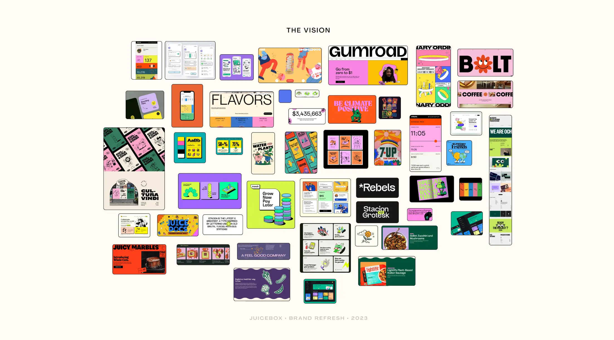
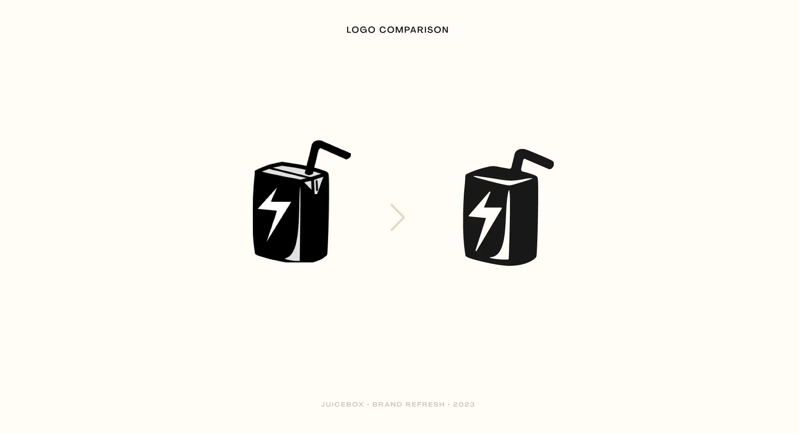
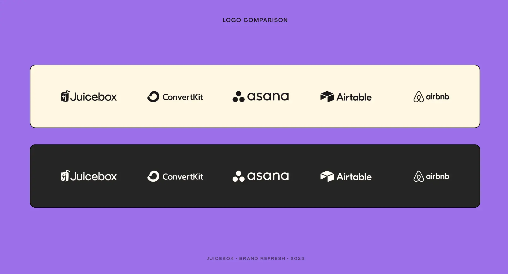
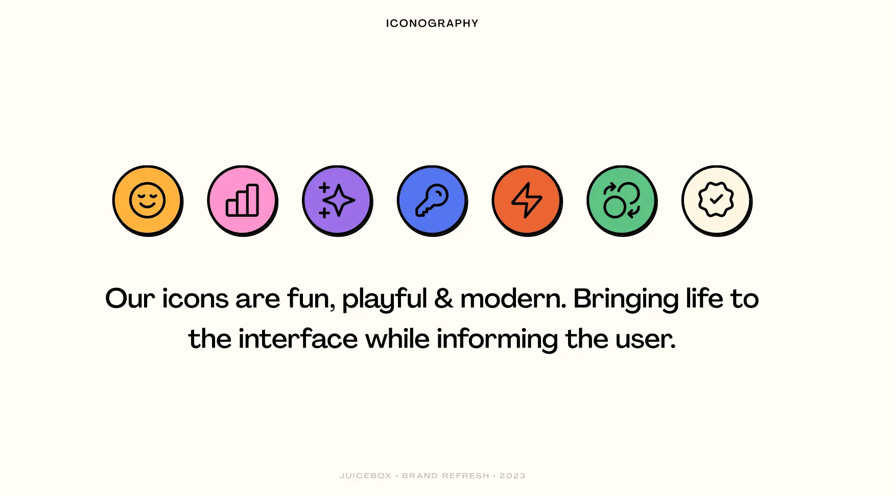
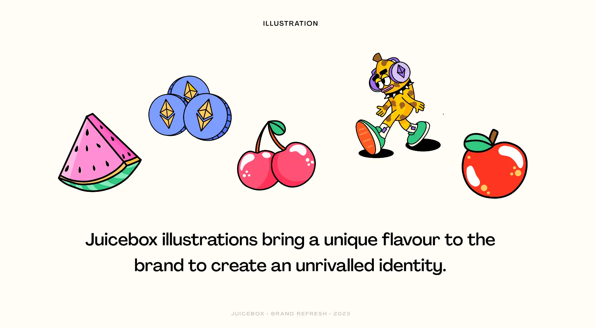
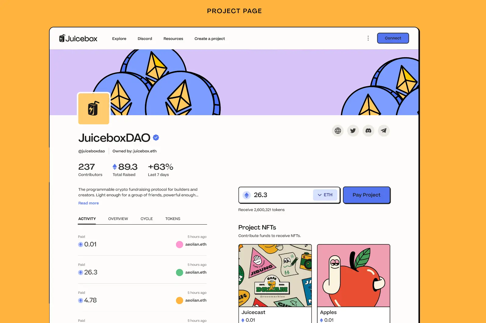
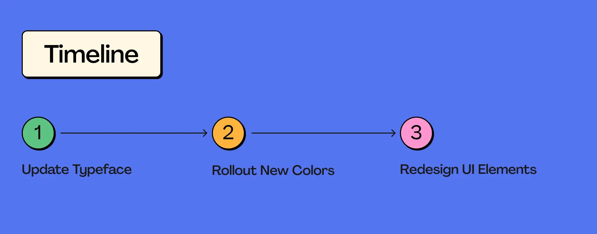
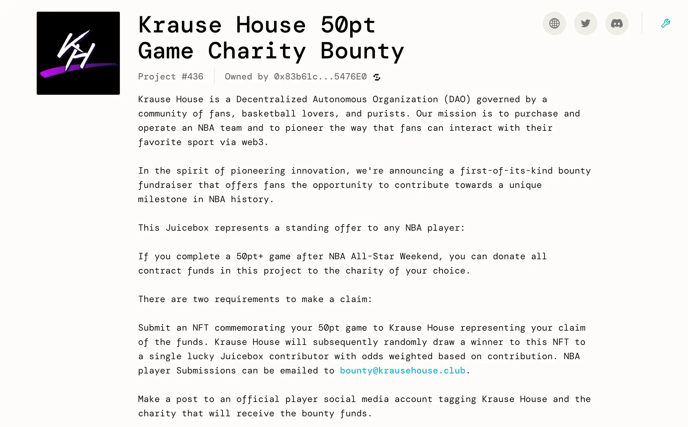

## Brand Refresh Representation by Strath

Over the last couple of weeks, we've been talking a lot about the Juicebox brand, moving into some new audiences and really building the trust with them. We've come to a conclusion that if we want to grow, build trust with new audiences and get bigger project etc., we will need to think of building a brand that is more aligned with those audiences and can be perceived as trustworthy and super top tiered.

#### Goal

The goal for this brand refresh: Give Juicebox a refreshed look, while paying tribute to our creative and unique origins. Make Juicebox feel easier, more familiar and more enjoyable to use. Creating a strong brand presence and building trust among new audiences and verticals.

The No.1 thing that we want to be is trustworthy because people are exchanging a lot of money here in Juicebox, but we also want to bring the fun, cheeky human element into it, especially with this brand refresh to keep it clean while still having that bold and cheeky Juicebox vibe that we all know and love.

#### Vision

Strath put toger a mood board, collaborating with WAGMI Studios on creating illustrations and really bringing out the Juicebox vibe.

 #### Logo

For the logo, we are giving Juice a fresh, clean and unique feel while keeping true to our roots.

Thanks to Sage, the current logo has been serving us really really well. And the refreshed logo is quite similar to the old one, basically just taking what we had and making it able to be scaled, able to be used on different color backgrounds, pair a little bit better with different fonts, etc. We're just tidying it up a little so that we can use it across a broader range of use cases.

As we don't have an official logo lockup yet, what we've come up with is like this:

A comparison to other industry standard branding. It sits really well next to some of these tech companies, but still holds its own unique and interesting feel.

#### Color Palette

This is obviously very important for us. Strath wanted to go with something that really fits Juicebox, inspired by tropical and good times. The new Juicebox color palette conveys our playful nature while building trust and setting us aside from the crowd.

#### Typography

There has been a lot of contention around this topic. Obviously it will be a very big choice to shift from DM Mono, which we have been using all along and has served us very well. But it's absolutely time to move to a new typeface.

Agrandir is a contemporary sans serif that celebrates the beauty of being imperfect. It was designed to be a brave antipode to the nuetral modernist font. Agrandir accepts its own shapes as they are, unaligned, quirky and funky. It celebrates humanity, not machines.

#### Iconography

Another thing that will obviously get refreshed as we go into the brand refresh. Our icons need to be fun, playful and modern, bringing the interface to life for informing the users. It's a fairly easy switch, but definitely makes a difference.

In a lot of the user interviews that Strath has done, people said they'd love to see more visual representations, because there're quite many reading and complex terms.  He thought that we can use the illustrations to pair with the iconography to really bring some of that to life and make it easier to use.

#### Illustration

With the help of Sage, we will be using the same sort of stuff we've had before, but bringing a little more or a playful, fun, funky vibe to it. Also having some fruits and interesting Web3 Juicebox related objects around throughout the experience will work very well.

This is where we create the super unique identity that nobody can copy.

#### User Interface

This is probably a question that everyone is having. What will it be looking like when we are refreshing the interface?

What we really need to move into is, making the experience a  lot more fun and playful, but still really drawing the user into some of those main call-to-actions.

#### Timeline

There'll be a phased rollout. We will have a very structured plan of how we are going to phase the branding in, updating the type face, rolling out the new colors and then starting by slowly redesigning some of those UI elements. It will seamlessly migrates over to the refreshed brand.

### Discussion After The Presentation

**Jango**: Super sweet. Lots of work goes into this, big shoutouts for pulling it together end to end over all these time.

**Strath**: Really appreciate it. Though it only looks like just some new colors and stuff, a lot of research and work goes into coming up with the ideas  and refining it all. It's not just some random choices as well, but very specific choices to move us into this direction.

Also big shoutouts to Tjl for some of insight into where we're heading and how we want to position ourselves, which was really helpful. And also to Sage and WAGMI team for bringing the vibes.

**Jango**: The thing that's going to really tie together for me will be those customized illustrations by WAGMI that define the edge and ride that line, which is how they serve in the current site. And there's definitely a version of those that fit really nicely with this aesthetic. It still pulls towards that edge and that line which set the tone for use.

I think the last piece of feedback I have for the broader group is that the current juicebox.money in some sense rides this line somewhat awkwardly, between the more dev-oriented aesthetic with mono font and maybe data forward, and the fun aesthetic that this version pulls more heavily towards.

It's kind of an awkward pilgrim to seeing that you will go and bring JBM in this direction. I think it's necessary to really explore in earnest what this means and there will be a massive audience that feels home and comfortable here. But it will leave that opportunity for the other client or other kind of aesthetic to maybe find some foothold within more of a developer community or something like that. That's totally ok.

I think both of the things can, and maybe even should, exist at the same time, but it's just awkward to try to do them both at the same time in the same interface. So we are going to double down here and give this our go.

But I also want to acknowledge that the alternative side, which is more computer, more mono and more straight to the point, is still valid and may have some visibility at some point. And it's going to be really really cool. I think both can borrow a lot from each other while also catering towards specifi audiences, specific tool sets, etc. But from a perspective of project owner and payer, I think this is such an exciting direction to try.

**Strath**: For sure. There could be the more developer-esque side of things, but I think as we move more into growth, having something that both sets of users can use and enjoy in going to be really crucial for that.

**Peri**: Thanks, Strath. There has been a ton of work into this and it's looking great. Thanks for such a thorough presentation and a breakdown of everything. Echoing Jango's sentiment here, I think it definitely makes sense right now to be optimizing for what we try to improve. I think everyting that you've done is going to make the site look a lot more approachable to people who come to the current site and feel that it's a little overwhelming or not meant for them for one reason or another. This is going to serve those people really well.

If there's a future version of the UI that is much more dev-oriented, I could totally see a home for that. But I like where our priorities are right now, and I think we are making good progress towards it.

## Ticket to Space Juicecast Episode by Matthew and Brileigh

Matthew and Brileigh just released a new episode of Juicecast about the Ticke to Space documentary of MoonDAO.

<iframe width="560" height="315" src="https://www.youtube.com/embed/OWt_zWWoFz8" title="YouTube video player" frameborder="0" allow="accelerometer; autoplay; clipboard-write; encrypted-media; gyroscope; picture-in-picture; web-share" allowfullscreen></iframe>

MoonDAO last year held a contest of randomly drawing a winner of its Ticket to Space free mint NFTs, the winner will be sent to space on a Blue Origin flight. A MoonDAO member from Beijing won this contest and is going to be sent into space. There will be a documentary made about the journey of this winner, and the film is going to be made via StudioDAO.

Matthew and Brileigh recently had a conversation with Kenny and Rachel from StudioDAO, and the two filmmakers, Susie and Fernando, as well as Pablo, one of the founders of MoonDAO. They had a roundtable discussion about this Ticket to Space documentary, which will be the first one ever being made about a DAO.

Also StudioDAO is going to launch a Juicebox project to support this effort, and people will be able to buy a Ticket to Space NFT to sponsor the production of this film.

## Krause House Project Introduction by Nicholas

The [Krause House 50pt Game Charity Bounty](https://juicebox.money/v2/p/436) is a Juicebox project created by Acidicsantana. This project is crowdfunding and offering its treasury to a NBA player who scores more than 50 point in one single game. The eligible player can unlock the funds in this Juicebox treasury and have them sent to a charity of his choice, by interacting with this fandom project as outlined in the project description.

Nicholas is very interested in the overall mechanics and he thinks there are couple of takeaways that are worth thinking about for future projects.

First of all, it's a bounty. People are fundraising for a bounty, with an explicit goal stated upfront and its mechanics made clear in the project description. Nicholas thinks that it will be more interesting for people building projects or helping people build projects to take a little more inspiration from what works for traditional fundraisings in Kickstarter.

But even more than that, when the project reaches certain goals of fundraising, it will unlock other things such as raffling off an NFT randomly to a lucky contributor. This is getting closer to what really works for Kickstarter, which is the benefits for donors.

And Nicholas thinks that cumulative sum of the treasury unlocking other features or actions can also be motivating to get people to donate and participate. In the case of this project, a fandom is collecting their funds until they have enough money to attract the attention of somebody more influential and has more reach on social media.

There are some elements of this project that are worth repeating in future projects. And he encouraged folks to take a closer look at this project.

## Roadmap Process Update by Tjl

Tjl presented a roadmap for Peel and juicebox.money last week on our town hall.

He thinks Peel is making quite an effort to move towards our goal in a project-based working style, while giving clarity of where they are along the way, just like they did in the brand refresh presentation today.

The roadmap they build now lives in Linear, anyone who wants to keep track of the project management can apply for an invitation.  This will help a few folks, like WAGMI team, Brileigh and Matthew to work in coordination to make some marketing materials so that we can have a deeper connection and relationship with end users and our community members by giving them updates about the progress of this roadmap.

