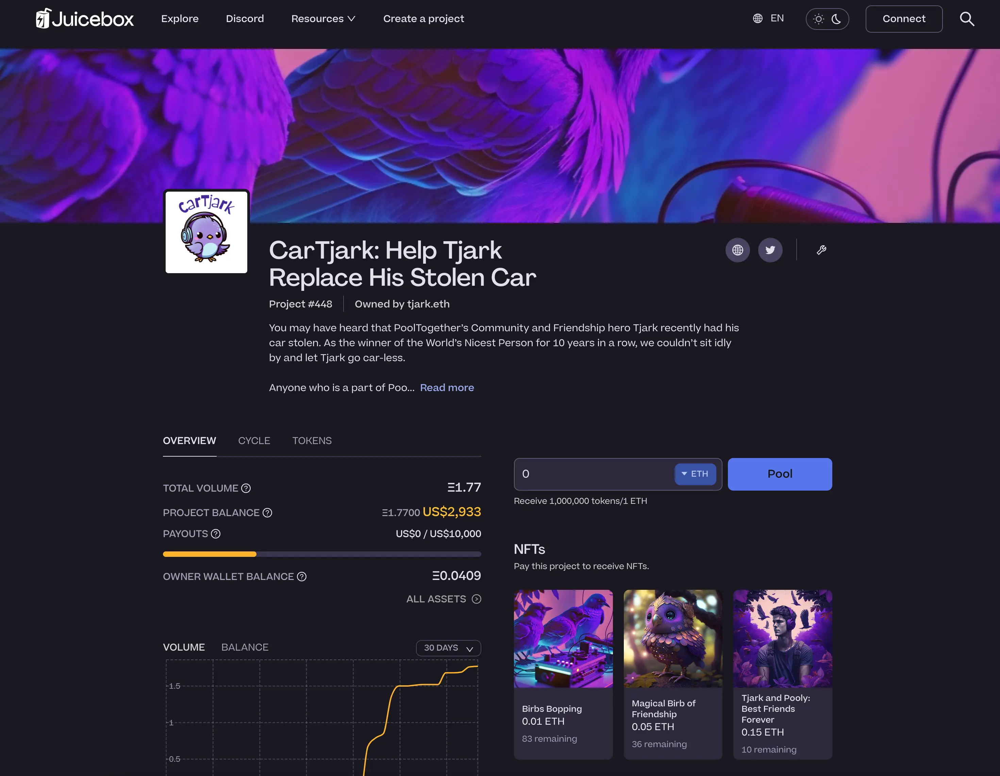
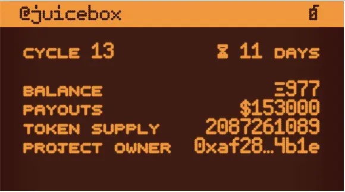
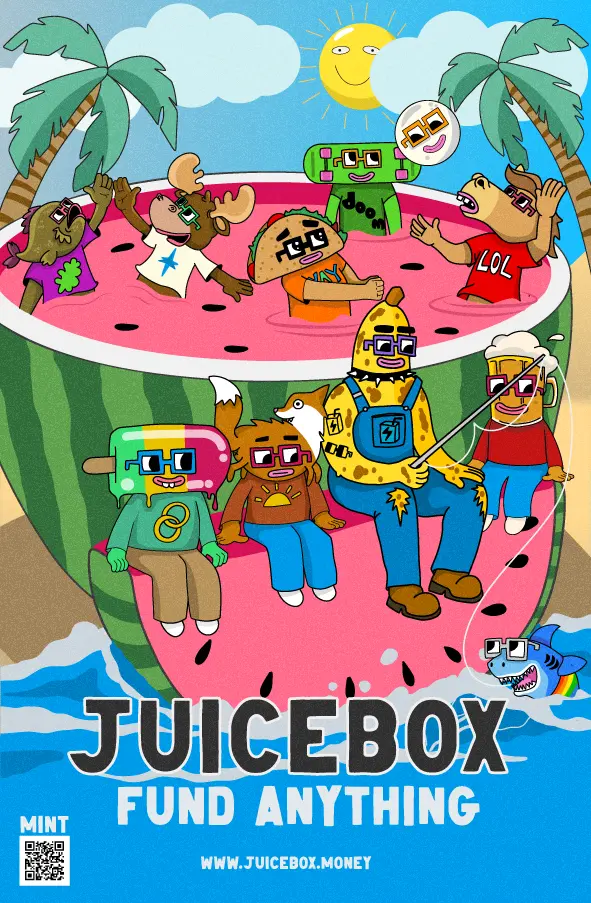

## Peel Update by Tjl

### Brand Refresh And Website Reskinned

The Peel team has been working on a brand refresh project recently, in collaboration with WAGMI Studios and others. Today they have collaboratively designed and shipped the new brand and our juicebox.money website.

We should shout out to Strath for leading this effort, to Sage for the incredible illustrations, and to the rest of the team, especially JohnnyD and Aeolian. All of them has done an amazing job together. This is absolutely a tremendous effort from the entire team. It was only two weeks ago that we started to discuss and work together on this direction. Then in this period of time, the team managed to define the direction, collaborate with WAGMI Studios, make the entire brand refresh, get it approved by the DAO and finally publish it on our website.

Hopefully we will get some comments and feedback from the community around the new brand refresh.

Not just the home page, literally the whole APP is taking on a very different look, in areas such as create flow, project discovery, project pages, etc.

### Features to be released

Not only have they shipped the brand refresh on the website, but they have also been very busy working with some other features that will be shipped soon.

- Profile settings, wallet auth and email engine by Wraeth. He has done a really fantastic job of actually linking the user's profile pages to their wallets. Now users can connect their wallets and then essentially personalize their profile, where users' email address can be added and in turn be used to kick off some product-based email marketing at some stage later on.
- Project tags. This is a feature that Peri has been working on lately, which will enable us to tag different types of projects such as Art, NFTs, Games, and so on.
- Leaderboard and announcement notifications. Products also developed by Peri. The headboard is going to be visible in the new footer on the homepage, while the annoucement notifications on the top right with messages letting users be informed with the updates in our ecosystem.
- JBController3.1 and JBETHPaymentTerminal3.1 support by Aeolian. After the Multisig signing a transaction for the migration of these components , the front end support of these new versions of contracts is currently at a testing stage and will ready to go very soon. Also as result to this upgrade, the gas fees of NFT deployment in Juicebox protocol will be lowered dramatically, thanks to the efforts of our contract crew.

## L2 Update by Jango

During the past few days, there has been some hefty gas spikes, moments when the protocol felt very unusable, which is something we have always known to be true, it's the trade-off the Ethereum Mainnet.

Just like we'll figure out how to operate organizations with independent treasuries on mainnet, it has in some sense been an open question revisited over the past couple of years that we may need to have separate treasuries and memberships across different chains. This question is now being heavily discussed in the thread of # Juice Distributor under the Protocol channel.

Essentially in the next stage, we will try to run a new treasury on a L2 network, to experiment with a few different things and attempt to take on a strategy that won't overburden Juicebox or the organization that runs on this treasury right now.

Over the past while, we have noticed the tax that it takes to do versioning and migration work on the core treasury. Even if expansion in other L2s is something that JuiceboxDAO might want to adopt in the near future, it makes sense to de-risk by running a separate treasury with its own incentive structures which is related to JuiceboxDAO through the regular Juicebox treasury components.

Jango wrote a [blog post](https://jango.eth.limo/03EDF541-0137-45F7-834B-B346DD0CEBD5/) to summarize his string of thoughts about this matter derived from the recent discussions. There's not much specifics at the moment, but he hopes that he will be able to share them on a more regular basis, when they are available in the near future.

## Token Resolver Preview by Nicholas

The new token resolver will look something like this for projects in Juicebox protocol.

If project owners want to try a customized theme for their token resolver, they can do it with the [default token resolver contract](https://goerli.etherscan.io/address/0x280dd5911677ADcA9411936F0EEA97510284f4a6#readContract),  or implement from [this etherfunk interface](https://goerli.etherfunk.io/address/0x280dd5911677ADcA9411936F0EEA97510284f4a6?fn=setTheme&args=%5B%22340%22%2C%22FF6B93%22%2C%22FFB3C7%22%2C%22FFB3C7%22%5D&run=1) which will be more convenient by just inputting project ID and relevant HEX colors.

If people prefer their own image setup, they can also go to the [token resolver contract](https://goerli.etherscan.io/address/0xd32Bbb759246FCFbe1cB17f8730051dd7e006D7c#readContract), which is like a main registry contract. Project owners can set their own token resolver, which will entirely generate image with whatever contract they want, on the condition that a few codes of solidity will be needed.

The setup is very nice because the token resolver contract points to the default token resolver contract, in which case we will be able to change what a default resolver looks like, to add metadata or to improve other details, without overwriting what has been made by the project owners with their own token resolver.

This feature has been deployed on Goerli testnet, when [the proposal to extend the permission of the multisig for this product](https://www.jbdao.org/p/356) is passed, it will also be released on our mainnet APP a little bit later.

## ComicsDAO x Juicebox Art Reveal by Nicholas, Sage and Gogo

Here is the artwork delivered with the efforts of WAGMI Studios and Nicholas. It will be submitted to ComicsDAO and printed on the first edition comic book of Nouns DAO.

Through the QR code on the bottom, people will be linked to a Juicebox project and can mint a limited edition NFT of this artwork. The proceeds from this NFT sale will be split between WAGMI Studios (50%), ComicsDAO (25%) and JuiceboxDAO (25%), which is also a good way to showcase the distribution mechanism of Juicebox protocol.

This artwork went through a lot of different iterations, they came to an agreement that we should try and create some Sage Kellyn art that brings the Juicebox and Nouns communities together through a fun scenario. And NIchilas thought that we had learned a lot about the creative process of doing a more involved illustration, hopefully some of that experience can be taken forward into future projects.

In the process of deciding which Nouns characters to include in this image, Nicholas suggested that we choose those Nouns whose owners are active and relatively more influential on social media or Twitter, so that they will be more emotionally involved in this artwork.

## SongADay Project by Nicholas

At the request of Nicholas, [Jonathan Mann](https://twitter.com/songadaymann) aka the SongADay man, made a song all about Juicebox.

<iframe width="560" height="315" src="https://www.youtube.com/embed/uPIEcjbttWo" title="YouTube video player" frameborder="0" allow="accelerometer; autoplay; clipboard-write; encrypted-media; gyroscope; picture-in-picture; web-share" allowfullscreen></iframe>

Like all the other songs he produced, this song was put on auction as a NFT on the website of SongADAO [here](https://songaday.world/auction/5181/). So Nicholas created [a Juicebox project](https://juicebox.money/v2/p/455) to crowdfund and use the raised funds to successfully bid the NFT, which in turn was transferred to the multisig of JuiceboxDAO.

Nicholas also thinks it extremely interesting way for an independent musician to fund a whole NFT DAO platform, and the mechanics they are using might also be informative for Juicebox projects.

