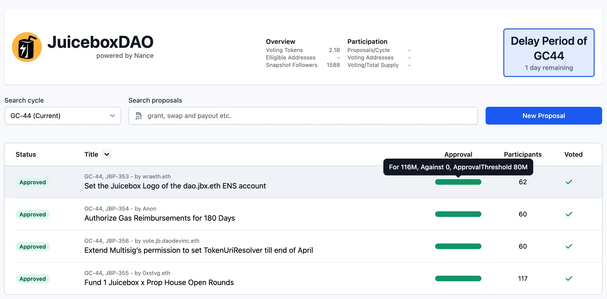
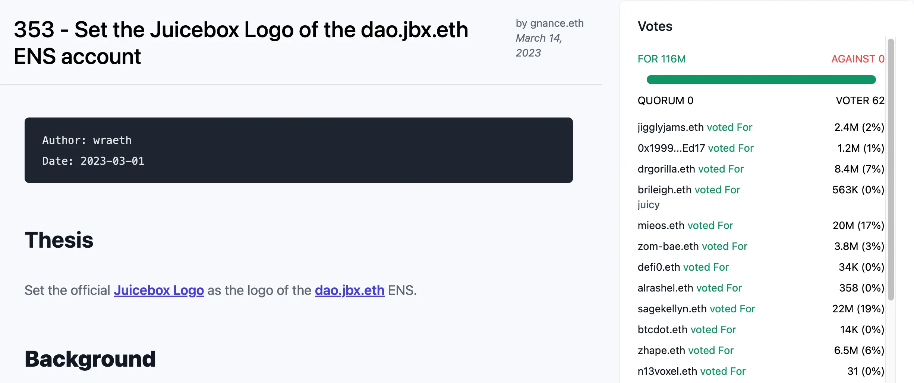
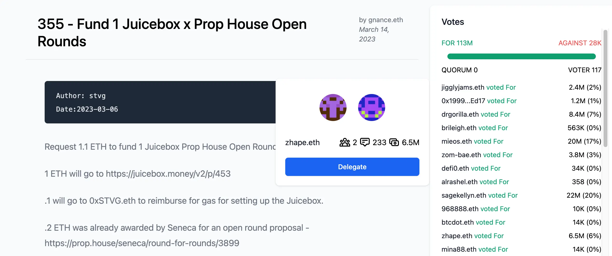
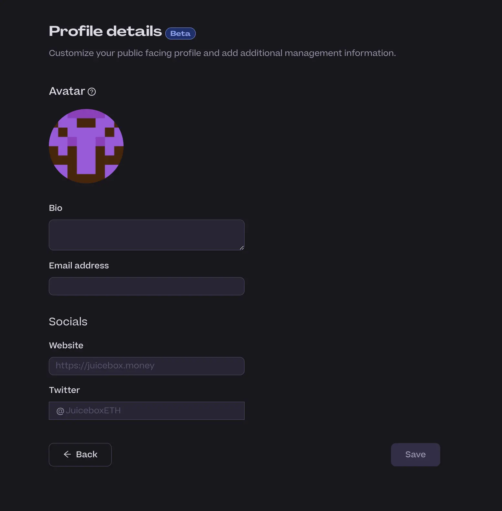
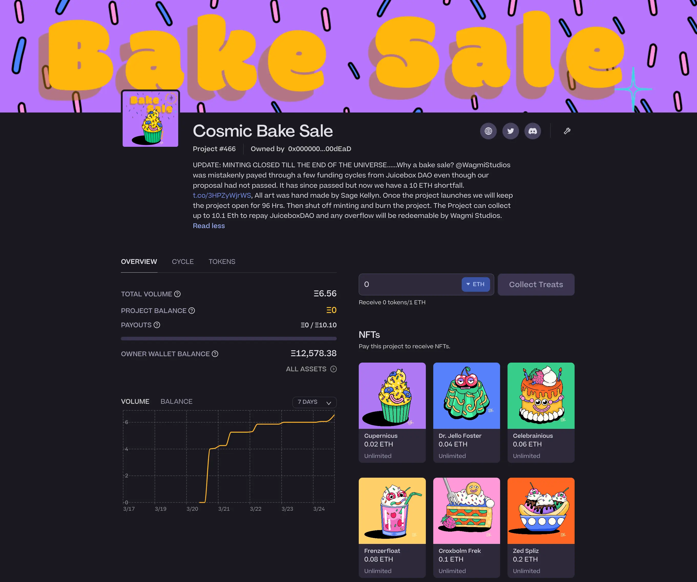

## Jbdao.org Updates by Twodam

In the town hall, Twodam presented the improvements he and Jigglyjams made to [jbdao.org](https://www.jbdao.org/), where we conduct our Snapshot voting recently.

- New UI design, now we have more graphics;
- We now have a VotesBar to indicate the status of voting;

- Sorting by fields, desc or asc;
- Now we have unique short link for proposals, e.g.: https://www.jbdao.org/p/353;
- And a sidebar to display votes

- A pop-up for information of voters, showing their delegation status, voting history and voting power, as well as enabling more convenient voting delegation.

## Juicy-reimburser by Filipviz

Presently, when DAO contributors are deploying Juicebox contracts, distributing JuiceboxDAO payouts, and distributing reserved JBX tokens, they have to pay the gas fees incurred in these transactions on their personal account first and apply for reimbursement from the DAO with individual proposals.

Filipviz recently submitted a [proposal](https://www.jbdao.org/p/354) to authorize the reimbursements of these payments by the DAO's multisig, and this proposal has been approved by the DAO earlier. But fetching all those transactions and the addresses executed them and organizing the reimbursement details before queuing the transaction manually can be a very annoying and backbreaking work.

So Filipviz developed a Node.js application caledl Juicy-reimburser to help facilitating this task. With this tool, user can specify a Gnosis Safe or any Juicebox project and a time range, it will grab all the relevant transactions from them and build them into two files, one being a JSON file for Gnosis Safe Transaction Builder and the other one a regular CSV file. Users can use these files to execute transactions to reimburse those gas fee with a Gnosis Safe or some APP like the [Disperse](https://disperse.app/).

On the town hall, Filipviz demontrated how to build these files with Juicy-reimburser and use the JSON file to queue a transaction on a Gnosis Safe multisig.

## EduDAO with Felixander

Felixander came to our town hall and shared some of his thoughts and plans about a project temporarily named as EduDAO, and wanted to get some feedback from our community regarding the governance models of this project.

The concept of this project is to ultimately create a network of schools that shares an open source curriculum that is blockchain oriented and allows anybody to create a school and make use of the curriculum. And this is also done in an attempt to make changes to the education system and the accreditation system, which in Felixander's view had been broken for quite some time.

According to Felixander, there will be 3 phases to accomplish the high level goal of this concept.

1. Setting up a tech lab in a public school.  This something Felixander had managed to accomplish by coming into agreement with some school in Los Angeles, the 2nd largest school district in U.S. The tech labs are meant to teach technology and innovation.
2. The next phase will be create some kind of after-school program.
3. At the last stage, it would evolve into a full blown school.

Felixander expected that it might take about one and a half to two years to ride through these three levels, with all the necessary funding and support in place.

He thought that it would be more appropriate that the EduDAO doesn't directly manage or get involved with the funds, but to focus on the development and curation of curriculum instead. And he's trying to figure out a tokenomic system where educators who are putting more efforts into this DAO will have more decision making power.

In terms of the targets of EduDAO, although Felixander has mapped out from K to 8th grade, but the plan would be a full school system covering K through 12th grade. He also introduced some expected results of students from this education system by giving a rough example about an 8th grade might be able to do.

STVG is currently also working with GeniiDAO, which has a plan to set up a project on Juicebox, on something to a similiar effect. They are discussing about some ideas of DE-SCHOOLING and open source curriculum resources. They thought maybe they might to able to share thoughts and work in collaboration with Felixander in this respect.

## ComicsDAO Updates by Gogo

ComicsDAO recently started [an open edition NFT mint of Nouns Comics #1 Generative Cover](https://zora.co/collections/0xf3d27d5143c92b5b2618ab46db1b7666350353b7), at the time when they are about to publish the physical comic book for Nouns DAO, and all the proceeds from this sale will be used to purchase physical comic books which will be donated to children's hospitals in North America.

## Peel Updates with Peel team

For the branding refresh Peel delivered last week, we have had pretty positive responses from the community, while at the same time we are also seeing a bit of uplifting in our traffic.

### Project Tag by Peri

We are adding a new data structure to projects which allows project owners to tag their projects with up to 3 tags from a list of 10 different pre-set tags available. This will open up some possibilities for actually discovering projects in Juicebox.

Right now, the search function on our "Explore projects" page is quite simple, supporting searches only by project handles. We have recently overhauled the search function using Sopana, so that the searching experience will be greatly improved, especially when we have tags in place as well.

We'll be able to highlight projects in certain categories across the APP, so as to make it a lot easier for people to create projects on Juicebox and get them exposed to their potential supporters.

### Profiles And Events Notifications by Wraeth

Last week we shipped the function to support editting user's profiles, where people can add their profile picture, bio, Twitter handle, website and etc.

Another useful function that we are going to integrate is the association between email address and wallet address of the users. This function, which will hopefully be shipped within this week, supports the event notification of projects, so that if someone pays a project, they will be able to receive notifications of any future "pay events" happen in that project.

## Front End Support of JBM by Aeolian

All new projects will be created with JB3.1 contracts. And NFTs will be deployed with new NFT contracts, which will also support NFT collection category and royalties, the two functions yet to be exposed in the Juicebox.money front end in the near future.

Also Aeolian will be coordinating with the contract crew and some other contributors to work on the token migration process, where eventually we will need to migrate all the tokens from V1 JBX to V3 JBX.

## WAGMI Bake Sale with Mieos

At the beginning of February, when WAGMI Studios renewed its recurring payout, their proposal was not approved by the DAO. But due to some following bookkeeping error, they were mistakenly paid according to their last approved proposal for another two cycles.

Both for a purpose of crowdfunding to return the funds back to the DAO, and for a purpose of experimenting an open edtion NFT mint with Sage Kellyn's new artwork, they set up a Juicebox project called [Cosmic Bake Sale](https://juicebox.money/v2/p/466).

