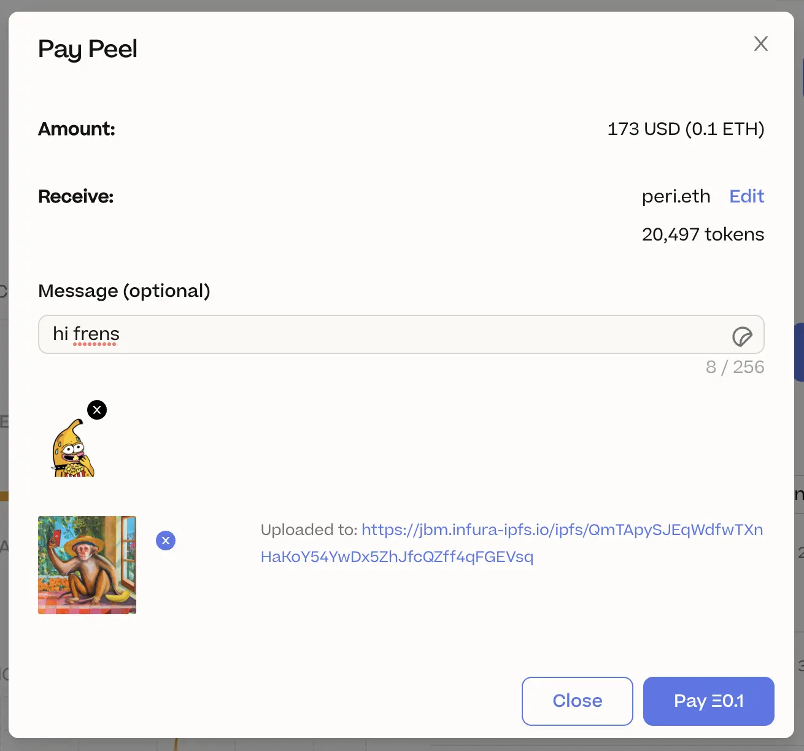

## JBX V3 Migration by Jango

The JBX V3 migration is on the final finish line. Jango has moved some of his tokens into a vault to test stuff out.

We are just wrapping up a very clean and safe UX for the migration purpose. Next week we will have more to announce together with the actual instructions to migrate tokens. Huge ups to the versioning efforts, and shoutout to Aeolian for his great effort in putting all this togerther.

## Peel Updates

### Preliminary Home Page Designs by Strath

Peel is working to enhance the functionality of our juicebox.money homepage by placing greater emphasis on project creators, and by making it easier for users to discover relevant projects in different categories.

They have redesigned the main navigation bar, reducing it to three items with subcategories, placing greater emphasis on the "create a project" function and simplifying options on the right-hand side.

Peri's project tags will be prominently displayed at the top, significantly enhancing discoverability of relevant projects.

In the central section, they have incorporated project cards that will showcase trending projects.

They are also planning to feature a 'Success Stories' section that will showcase case studies of previous projects. Rather than linking directly to the projects, this section is likely to provide information about the successes of each project. The team may use Filipviz's excellent work on case studies for this purpose.

And an area for docs:

Additionally, they plan to introduce a new section called 'Juicy Picks', which will feature the most popular projects as voted on by the community on a monthly basis through polls hosted on Discord. These results will be displayed on the website using an exclusive project tag named "Juicy Picks".

Lastly, we will have exploration section by categories:

### Email Pay Event by Wraeth

Now users can edit the profile to add their bio, email address, Twitter accounts etc.

- If someone makes a payment now on Juicebox, they will receive a transaction receipt by email if they have added in their profile:

- If there is any activity in a project that a user has subscribed to, such as payment events, they will receive email notifications about the events to their registered email address.

### Token Migration by Aeolian

There are still a few more steps that need to be completed before we can migrate our tokens, but we are now in the final 5% of the process.

Next week, we will provide clear instructions and visuals to assist with the migration. We are optimistic that we will be able to complete this versioning soon.

### Pay Modal by Peri

Peri is currently working on a improved pay modal, which is the window that will pop up when people are going to pay a project.

### Upcoming Projects by Tjl

Peel is currently completing updates to several pages on the website, including the home page, the About page, and the DAO page. They plan to unveil these changes over the course of next week.

In addition to these updates, they will be revamping the project page to better cater to contributors and project creators. They will be rethinking the design from the ground up to display more relevant information and attract more contributions.

## Token Resolver by Nicholas

Previously, the project NFTs representing ownership of projects on Juicebox had no metadata. However, Nicholas has recently developed a TokenUriResolver that provides dynamic and customizable metadata for Juicebox's project NFTs.

This token resolver comes with several features, including the ability to view live project stats in an on-chain-generated SVG, customize colors for a project's metadata, and use a custom metadata resolver contract to replace the default entirely.

For more information on how this token resolver works, you can check out the documentation [here](https://docs.juicebox.money/dev/api/extensions/juice-token-resolver/).

## StudioDAO Updates by Kenbot

StudioDAO plans to sign a contract between StudioDAO Backlot LLC and Tiket to Space LLC to establish an investment relationship and downstream revenue stream for both the DAO and Backlot.

Meanwhile, production for the Ticket to Space film has recently begun, with Fernando, the director, and Pablo attending a Blue Origin event in Orlando. There, they obtained behind-the-scenes footage and interviewed several executives about the prospect of sending someone from China on a Blue Origin spaceflight.

## Prop House Juicebox Open Round by STVG

STVG has launched an open funding round for Juicebox on Prop House, inviting anyone to propose ideas that they believe will benefit the creator ecosystem using a Juicebox programmable treasury. Once submissions are closed, JBX holders will vote on the proposals, and the top three will be awarded 0.3 ETH each in funding.

## Defifa Updates by Jango

In mid-April, they plan to launch a competition for the NBA playoffs, along with a create flow that enables anyone to design their own tournament game. Mieos and Sage are developing exciting ideas for the NBA competition, including the use of canned beverage artwork to represent each NBA team.

