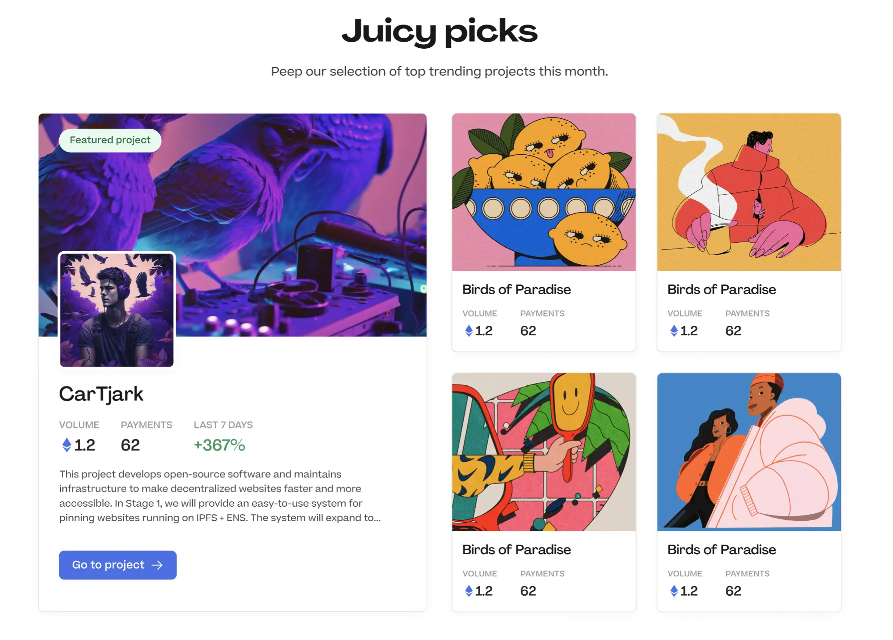
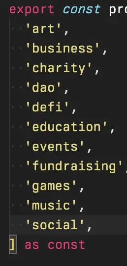
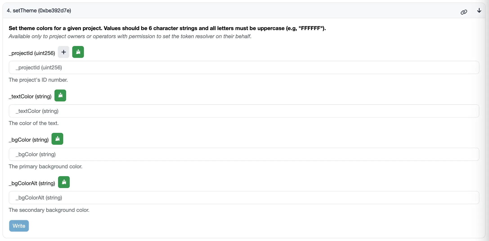

## Peel Updates

### Website update walkthrough by Strath

This is a project that includes redesigning the home page and then creating some supporting pages, such as About Us, creating some case studies, activity feed, and so on.

The purpose of this project was to make the project page a lot more functional, highlight the project creators, highlight the projects themselves, and then increase contributions as well as project credit, making it a lot more clear and concise for users to come in there, getting a few different value competitions.

#### Hero Section

The section of trending projects have been pulled up in this iteration. And also we are about to implement project tags and introduce them immediately more as a sub-heading, so that when someone lands on the page, we can give them the option to take a look at the different categories of projects and click into them. It also serves to free up this space and have only one primary call-to-action, which should be working very well.

- Hero section discussion

Jango thought that the main sticking point right now seems to be the character set, art and style, so pulling Banny off the hero section seems a trade-off here.

Strath was initially hesitant to pull it off due to the new hero illustration being very nice, but they have leaned more towards having a functional homepage to balance aesthetics and functionality. Strath thought that functionality will be the one really drives people to use our protocol, especially by pulling the trending projects above the fold, which will help people understand immediately what it is and inspire them to create their own projects. Tjl also mentioned that highlighting the project art here is important and a chance to let creators and their art to shine as well.

They all agreed that there will be a very cool challenge in how might we make sure that there is always a trending Banny up here via the trending mechanism.

- "Create a project" Action

Nicholas asked about the "create a project" feature and the reasoning behind having it on the homepage. Strath explains that they considered different options, but ultimately decided to focus on showcasing projects and their content on the homepage. They removed the call to action for exploring projects and made creating a project the primary action they want people to take. However, exploring projects is still a built-in part of the experience, similar to other NFT marketplaces like Opensea. The idea behind this is to make people aware that creating a project is possible, while still allowing them to explore projects by default.

#### Features Section: Built for ideas like yours

This section is just reassuring people like "This is what we can do and for people like you. " We help DAOs, Crowdfunding, NFT, Creators and builder. Big shoutout to Sage for these epic illustrations which are super nice.

#### Features Section: Success stories

During the user testing, the main reason most people had used Juicebox or felt trustworthy to use it was the fact that all the these big projects have put so much money through it and it worked without anything bad ever happened. We are really highlighting the fact that we've had a ton of ETH come through the platform and people have used it successfully, which really helps cement that trust with new users.

#### Features Section: How Juicebox works

This section is pretty straightforward and Filipv's new copy has been implemented here. And in the actual build of this, there will be an animated effect with this line going down with scrolling.

#### Features Section: Why Juicebox?

This is a really cool section which is just giving people a run-through of some of the benefits to use Juicebox, really highlighting why Juicebox is so good and giving them the tools to explore without having to read the docs and really do their own research.

#### Features Section: Juicy Picks

The idea behind this is: each month we will select five projects and give them the tag of "Juicy picks" and then they will jump into this section.

And we will have 1 featured project, which is like a huge call-out. This would be really interesting to use as a kind of marketing tool, where we can run various competitions to get projects featured on Juicebox for the month, which could help drive a lot of engagement.

There should be a lot we can do with this in the marketing visibility sense.

#### Features Section: Explore categories

We will have project tags coming soon, so there will be full project categories that people can scroll through here and browse the various categories, whether they are fundraisers, DAOs, NFTs, Art projects, Photography, etc.

#### Final call to action

### Project Tags by Peri

The background of this project tags is that we want to allow project owners to tag their projects with up to 3 labels that they can pick from a pre-defined list of 10 different tags. And the main goal is to increase discoverability of projects.

For people who are coming to Juicebox right now, it's pretty hard to find random projects that fit particular interests unless they already know the name of them, or they will be just browsing trending or the latest projects that were created.

Once project owners add some tags to their projects, people will be able to go the explore page and filter by a specific project tag. The idea is to make it more fun for people to actually browse projects and hopefully find some projects that might be interesting to them.

The project tags will be a big win and it will also be shipped together with an improved search functionality as well. Right now people can only search for projects by their handles, when the search functionality gets updated, they will be able to search for projects and match things, by their names and also their description.

The reason why it has taken so long to implement this new search functionality is that we've been building on a new tool called Sepana and it became a little too tedious to deal with some of their growing pains and we've been waiting on them to fix some things.

But in last week, we've updated the whole infrastructure of that to be built aound the database that we've built in to the APP and given up on Sepana. A whole bunch of updates coming with new features will be coming verys soon, which will be a pretty big update and very fun one.

### JBX V3 Migration Update by Aeolian and Jango

We have officially announced the start of JBX V3 migration this week. Token holders of V1 JBX will be able to migrate their tokens to V3 JBX which will be redeemable on the JuiceboxDAO V3 treasury. Also our Snapshot strategy accounts for V3 JBX now so it can be used for voting on Snapshot.

Jango said it's fun to reiterate the function of legacy JBX and that of the new V3 JBX, they are backed respectively by these particular treasuries and are the effort of moving all of our operations from V1 to V3. We are now progressively moving funds from V1 treasury to V3, V1 JBX won't be backed by anything there anymore. In order to maintain the redemption value, people will need to exchange it for V3 JBX.

The journey we've travelled so far to get here, was really the motivation for all the versioning work we've done. Jango was very relieved and very impressed in many ways by the effort it took to get here and the fact that we have pulled it off.

Jango has moved his JBX holdings over to V3.

The instructions for JBX migration:

-  [JBX V3 Migration Guide by Aeolian;](https://docs.juicebox.money/updates/jbx-v3-migration-guide/)
-  JBX migration video tutorial by Matthew and Brileigh
<iframe width="560" height="315" src="https://www.youtube.com/embed/Mk2GdYri1mU" title="YouTube video player" frameborder="0" allow="accelerometer; autoplay; clipboard-write; encrypted-media; gyroscope; picture-in-picture; web-share" allowfullscreen></iframe>

## Versioning History by Jango

Jango wrote a [blog post](https://jango.eth.limo/31469E9F-8C0D-49E9-8003-0077674708A6/) in the day when he migrated all his JBX over to V3, which is one that he has been wanting to write for a long time to recap our versioning history.

He felt very good to write and recall all the steps to get to where we are, giving a very broad stroke reflection on where we started and how we got to where we are today. It's not perfectly linked to other pieces of content over time, but hopefully it at least serves to tell the versioning story and give some rationales to the trade-offs that we made along the way.

Jango also talked about how the versioning work has made the development process more laborious for those trying to make cross-compatible extensions or reference documentation and addresses. However, he believes that building on a stable set of contracts will bring long-term stability to Juicebox.

Jango expressed gratitude towards the DAO for backing the versioning process, which has been expensive and patient. He feels that the commitment made by the DAO to this process will provide Juicebox with long-term stability and prepare it for any future versioning work that may need to be done.

He also thank folks at Peel for building these great experiences, and the contract crew for writing this and testing it along the way including Dr.Gorilla, 0xBA5ED and Viraz for their heroic work in making all this possible over the past year and a half to two years.

## Juicecast New Episodes by Matthew and Brileigh

Matthew and Brileigh recently published a new Juicecast episode featuring Jigglyjams, who has been one of our contributors for a long time and building Nance, another DAO tooling in our ecosystem.

<iframe width="560" height="315" src="https://www.youtube.com/embed/bpbzR0VwU-M" title="YouTube video player" frameborder="0" allow="accelerometer; autoplay; clipboard-write; encrypted-media; gyroscope; picture-in-picture; web-share" allowfullscreen></iframe>

Next episode, they will be interviewing Chris Carella from PurpleDAO. Recently there was [a proposal in Purple DAO](https://www.alphacaster.xyz/dao/purple-publicgoods/vote/16) to fund a developer in residence through a Juicebox treasury. 6.9 ETH was funded for this residence by Purple DAO and the Farcaster ecosystem.

Also they plan for a special ETH Tokyo Peel episode to chat with Peel team members Strath, Wraeth, JohnnyD, Tim and maybe Aeolian.

## Prop House Voting by STVG

[Juicebox's 1st Open Funding Round on Prop House](https://prop.house/juicebox/open-funding-round-1) created by STVG is live for voting. STVG encouraged everybody to vote.

STVG created a Juicebox project for this purpose, where the grants from JuiceboxDAO will go into that project while the top 3 winners of this open round will be added to the payouts of this project and distributed with 0.3 ETH each after the voting is ended.

STVG said this is a really good opportunity for us to create some sort of intersection between Nouns and Juicebox, and give a little bit more visibility to Juicebox,

## Thirsty Thirsty Updaes by Bruxa

Jango recently put up [a proposal in Thirsty Thirsty](https://snapshot.org/#/gov.thirstythirsty.eth/proposal/0xe5c4c1c754487854b05b938f4e8c884e06f738592bacbd1ddd4e03e10cd0ff00) Snapshot Space to help create a Thirsty Thirsty treasury to manage the funds and membership of its community through Juicebox. This will allow them to reinvigorate their membership and link to other project ideas.

Secondly, they are working on an interesting project with one of their partners, focusing on experimenting with selling staples with crypto, specifically flower. Bruxa is excited to keep iterating on this project and launch it on Juicebox.

Finally, they are doing a charming NFT NYC activation on Saturday, April 15th, where they will be hosting a flower and wine tasting with an amazing wine shop in Williamsburg called Dandy Wine.

## Token Resolver Theming Demo & Project Cards by Nicholas

### Project Cards

Nicholas developed an experimental contract, [the Juicebox project cards contract](https://etherscan.io/address/0xe601eae33a0109147a6f3cd5f81997233d42fedd#code), which is an 1155 NFT contract that lets anybody mint an 1155 NFT that replicates the metadata from any of those Juicebox projects.

People can use [the etherfunk dedicated page](https://etherfunk.io/address/0xe601eae33a0109147a6f3cd5f81997233d42fedd?fn=mint&args=%5B%221%22%5D) to interact with this contract and mint a project card of Juicebox project, by inputting the relevant project ID and at least 0.01 ETH.

And the project cards minted can be found on OpenSea at this [page](https://opensea.io/collection/juicebox-project-cards).

### Theming option

[The DefaultTokenUriResolver contract](https://etherscan.io/address/0x9D63AFc505C6b2c9387ad837A1Acf23e1e4fa520#writeContract) is the one that generates the default orange theme for project NFT metadata in Juicebox. On this contract, Juicebox project owners can have access to the function called `setTheme`, where they can pass their projectID and HEX colors to update the theme colors of the metadata to whatever they like.

Another more visual option to do this is at [the etherfunk setTheme page](https://etherfunk.io/address/0x9D63AFc505C6b2c9387ad837A1Acf23e1e4fa520?fn=setTheme&args=%5B%22%22%2C%22EB4334%22%2C%22EBAAA0%22%2C%22BFA09B%22%5D).

## Staking Via ERC-20 terminals by Jango

The contract crew tried to create a pull request against the JBM repository, aiming to accept a project token.

Consider a project that accepts ETH and issues NANA tokens in return. The team is currently testing a method for another project to accept NANA tokens and generate NFTs, which can be burned to reclaim NANA tokens. To accomplish this, they are utilizing the juicebox.money website and frontend as the entry point for a basic staking mechanism through ERC-20 terminals. By limiting it to a specific application, they can create one-off contracts to solve staking issues for multi-chain organizations or other purposes.

However, the frontend is typically a hurdle as it is crucial for accessibility and ease of operation by users. Jango is contemplating how to leverage the tools and extensibility that have been developed with Juicebox to build various applications that can reuse similar visual elements without requiring significant effort or starting from scratch.

One example could be a "Stake" button for staking, and a "Unstake" button for redeeming, both wrapped in a Juicebox treasury for standardization and interoperability with other treasuries.

