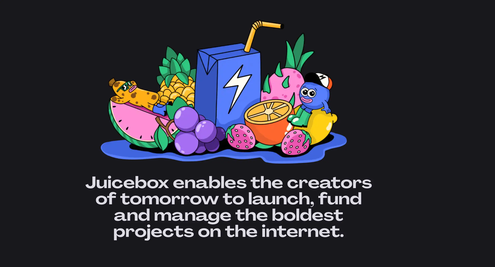

## Bananapus Updates by Jango

The [proposal to fund Bananapus project](https://www.jbdao.org/p/368) has been approved by the DAO earlier this week. Bananapus is an experimental ground for some more delicate token related things so that it won't pose too much risks for JuiceboxDAO. We can keep proposing specifics to tackle, in realms of front end, contract, visibility and collaboration between everyone.

A dedicated [Bananapus Discord server](https://discord.gg/E2FHqxhVhU) has been created, and folks are welcome to join and participate in this project.

Right now there is no roadmap or game plan for Bananapus, but there are several steps we want to take as  depicted in the general gist that Jango posted in the discord thread.

These can been considered as the three objectives of Bananapus:

1. To allow active stakeholders to participate in a treasury's growth. Part of the treasury's reserved tokens can be allocated to token staker.

   For example, JuiceboxDAO could route 10% of its reserved token issuance to be claimed by those staking JBX, so that the treasury's growth which is measured in reserved rate issuance is claimable by those who already have a part of the community and are staked.

   The claimed rewards can be vested over certain interval of time, e.g. a year. If you unstake before that vesting period ends, any of the unvested rewards will be forfeit.

   The goal here is to distribute tokens more efficiently so that we have a body of active members participating in a treasury's growth. It will be a lot better to get the tokens into the hands of active participants directly, instead of some project owners of other orgnizations.

2. Same thing as 1, but allow active stakeholders to particpate in the treasury's growth across chains.  An organization running on an L2 allocates a portion of its reserved tokens to staked members of an L1 organization. There are certainly some complexities to figure out, but we will try to allow these organizations to relate to one anohter and share each other's incentivized growth across chains.

3. To figure out how to govern a Juicebox treasury on-chain, while also making it safe for JBX to be able to use.  We will be working closely with Nance to carry much of the governance process used by JuiceboxDAO over into Bananapus.

4. There is an intermediary step. Right now Bananapus is routing some of its NANA reserved rate to dao.jbx.eth, the multisig of JuiceboxDAO. It would be a lot better if we could reroute the reserved NANA to JBX holders directly. We will try to get JBX holder an opportunity to claim this experimental NANA situation in the next few weeks or months, so that JBX holder who are active here can participate in the actual on-chain governance process in Bananapus.

## Blunt Recap by Jango

JuiceboxDAO also approved the [proposal to support Blunt Finance project](https://www.jbdao.org/p/369) in the same governance cycle.

This project has been in development for a while, and it's meant to solve a simplification problem of Juicebox project's first funding cycle.

You can try out the [Blunt Finance](https://testnet.blunt.finance/) create flow, which is only available on Goerli testnet right now. It's a very simple create flow which allows to set a funding target, a hard cap and an optional issuance rate.

Also it allows to set a time frame for the fundraising, so that it gives everyone confidence that if a project doesn't raise its funding target within a certain amount of time,  a funding cycle No.2 will be automatically triggered to open up refunds which takes the burden of management away from that process.

If the goal is met successfully, the project will be passed to a pre-specified project owner and put into operation in subsequent cycles just the same as a regular Juicebox project.

Obiously Blunt project is all open source, so we can all learn from it, copy it, use it and fork it. Also we want to recognize that indie devs taking on an initiative and going to try something, prototype something and take on that risk would be healthy for the ecosystem. We should all work together to share and propagate an idea forward, as well as to create room for others to come in with new ideas of what simplicity means to them or to another subset of target audience projects.

At the same time, Blunt has got some business models within its system, so there's opportunity for its treasury to potentially see some growth. It will be also on-chain governed. We need to think pretty critically about how we will approach this kind of stuff as an ecosystem, make sure things are audited, safe and reliable before making it available to people.

### Fee structure of Blunt

When a project successfully raises its target within a certain point in time, the project's ownership will be transferred from the Blunt contract to the pre-specified project owner address.

Right before that transfer happens, the Blunt contract will schedule another funding cycle and set a payout from this project to [Blunt's Juicebox treasury](https://juicebox.money/v2/p/490) as the fees charged by Blunt in this fundraising. And in turn, BLUNT tokens will be issued back out to the project as the on-chain governance tokens of Blunt.

So essentially, after a successful Blunt round, the pre-specified project owner will receive a Juicebox project that encoded with a Blunt Finance payout. And the project owner can choose to remove this payout in the upcoming funding cycles that they reconfigure themselves.

Blunt collecting fees from projects that use it will be considered project-to-project payment within the Juicebox ecosystem, so no Juicebox membership fee will be charged. But if funds in the Blunt treasury were to exit the ecosystem, there still be JBX fees incurred.

## Peel Updates by Tjl

Our search functionality by Peri is live, which has been put together by Aeolian and Wraeth. There is no statistics yet, but they will put some together and find some much better than the last one.

Project tags are being used now, which is also a product by Peri and a huge win as well. Projects are slowly and surely starting to add tags for themselves, which is awesome.

Peel is making some progress with the website update. In the town hall, Wraeth is showcasing the new About page that will be shipped together with all the other website updates by end of this week.

And in the Mission section of the About page, Tjl suggests that we could discuss about some ideas to use community monetization milestones, such as 250m, 500m, 750m or 1b to do an airdrop or something similar to the community and bring them in on that mission.

Secondly, he suggests that we add an + button in the contributor section to link to the specific docs that show visitors how to contribute to Juicebox, so as to encourage new contributors to come onto JuiceboxDAO.

### Feedback From Jango

Jango suggest that we put in a JBX token ditribution information, pie chart or something of that kind. The folks in the contributors chart are the ones contributing more on a day-to-day basis with their expertise in our development flow or whatever, but there's a ton of projects that have JBX tokens by paying fees, there's also a ton of people contributed into the JuiceboxDAO treasury where we're still using the funds to actually get stuff done. Those are just as much members as everyone else. This is something that we shouldn't forget. We've got to respect ETH and the broader scope of membership, and respect ourselves as folks working here, but surely not just in the Discord process. It's kind of hard because it gets a little fuzzy and open-ended, but that's also kind of the beauty of it. Maybe it's worth figuring out how to communicate.

## Buyback Delegate Update by Jango

This is a project that has been in discussion for a while since last year, and it was something that we couldn't really do until we've stitched together the entirety of versioning since it involves the actual JBX token as well as treasuries.

Now we're at a good point after all the versioning work is done, and we have built and tested this delegate. The only next steps would be formal audits and then DAO's approval to actually stitch it onto our funding cycle.

We all know that, for each ETH that comes into our treasuries, the DAO will create new JBX according to its issuance rate and issue them outwards to those either are paying fees or just clicking the contributing button. Also we acknowledge that there is just someone out there willing to sell JBX in an open market like Uniswap for a different rate.

So in the case of open market price is lower than our issuance rate, what the buyback delegate will be proposing is that DAO will forgo taking ETH into its treasury and instead route ETH into the market, to make sure that whoever pays into our treasury will get the most JBX possible for the ETH they pay in.

We are aware that right now there's a very shallow Uniswap pool for V1 JBX, and people are still migrating to the new V3 JBX. So the buyback delegate has the open question of which pools should it be looking at. There's a case to be made that it should go and get V1 JBX to the extent that it can, and then convert it to new JBX for people as they're 1:1 convertible.

Hopefully we'll eventually start to talk about audits in the near future. There will probably be a proposal to fund the audit, and if that goes well, we'll see an opportunity to actually use the buyback delegate on the JuiceboxDAO funding cycle, and we'll get JBX in the hands of active projects and members for a better distribution.

## 721 Tiered Delegate Updates with Jango

The 721 tiered delegate is the standard NFT rewards, the one that we've been using and evolving. We're at a good point now where the delegates can be evolved on their own very independently from the core terminal controller infrastructure.

There're a few improvements to the current [`JBTiered721Delegate`](https://docs.juicebox.money/v4/deprecated/v3/extensions/juice-721-delegate/README.md/contracts/jbtiered721delegate) that have been queued for a new version.

1. Renaming of the variable `contributionFloor` to `prices`, because we're actually treating them more as a price these days;
2. Introducing the operatable pattern, so project owners can delegate certain functions to operators, which are basically other contracts or addresses that can manage these functions on their behalf. It will be cool for allowing other contracts to post NFT tiers on a project's behalf and open up functionality there.
3. Reassessing storage bits to make more design space for certain features, and removing some other features that haven't really been used, like locking fuctionality.

There're still a few things from the current version that the front end has yet to expose and we're in the process of designing them, such as categorization aspect, and royalty function which is now available contractually for projects to deploy collections with royalties.

For now, Jango is hesitant to publish or push for prioritization of any new 721 delegates, rather just to make sure everyone know that it's changeable. We can make changes to that contract and publish new versions, and that's not a big weighty taxing versioning process as the other stuff has been.

We can also publish new types of 721 delegates, like the staking delegate that Bananpus is proposing. There are various ways you can imagine NFT working on Juicebox. Right now we're opinionated towards one because that's where we started, and we've created a flexible one to make it workable by a wide variety of applications.

We can go narrow, we can go broader, we can go specific in various ways. But it's a tricky thing to build front ends that cater towards one specifically, more so to build for something that handles a variety of different types of extensions. So, it will be a long term patient process, but hopefully we manage to capture this open-mindedness of how delegates can work on Juicebox.

