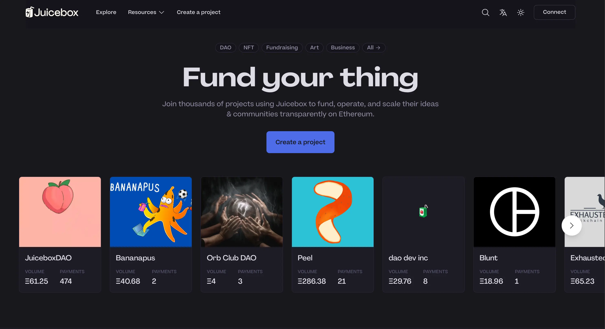
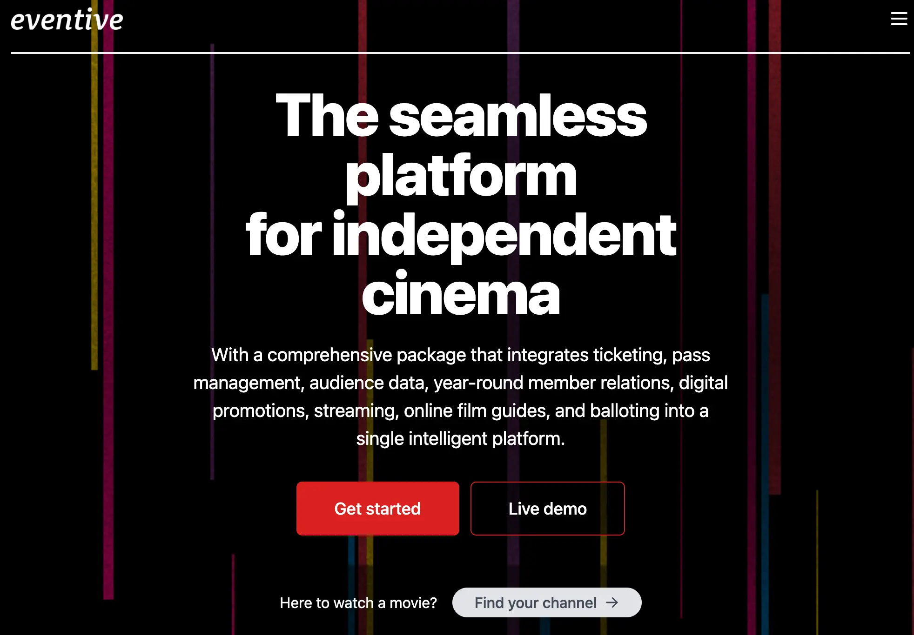

## Peel Updates by Strath

Peel was set to unveil a brand new homepage for juicebox.money, along with an "About" page, on the day of the town hall. This launch was the culmination of extensive planning and preparation, including a thorough exploration of user needs through interviews, testing, and data analysis. Peel had also gathered feedback from the DAO to inform the development process.

One major user request was for more content showcasing project creators and their projects at the forefront of juicebox.money. This included a desire to bring trending projects above the fold, and was a high priority for the team.

Peel has implemented a clear and concise approach on their homepage to immediately inform users of what's going on in our ecosystem as soon as they land on the page.

During the town hall, Strath shared his screen to demonstrate different sections of the homepage, including "Built for ideas like yours," "Success stories," "How Juicebox works," "Why Juicebox," and "Juicy picks," among others.

The upcoming works from Peel include two major initiatives:

1. The launch materials created by Matthew and Brileigh, which will accompany these website updates. This marks the first time that we have implemented a comprehensive launch strategy across multiple platforms, including podcasts and social media.
2. The project page design phase, which Peel initiated with a kickoff meeting prior to the town hall. Peel will continue iterating on the project page design and hopes to launch it within the next couple of weeks.

## Projects Updates by Jango

### Bananapus

Filipv had been working on a more manual instantiation of what the full mechanism could look like, and some members of the contract crew - Viraz, Dr. Gorilla, and 0xBA5ED - are collaborating to create a stripped-down version of the 721 delegate, which are the NFT rewards currently displayed on project pages. However, this project is still in development and has yet to be finalized.

### Blunt

The Blunt project is ready to be deployed to mainnet. We are also exploring ways to make the juicebox.money experience more accessible to everyday users seeking an easy fundraise and low commitment tool.

Hopefully the Blunt experiment will play out on blunt.finance as a website, where we can play with it, study it and prove it safe. Once we are confident that this is something worth investing and prioritizing on juicebox.money, we can have discussions with the Peel team.

You may go to blunt.finance and give it a try on Goerli testnet now.

### Defifa

Defifa didn't make it to the initial NBA playoff run. However, Viraz completed the last tests yesterday morning and we reviewed some things over the weekend. Currently, DeFIFA feels good and we're planning to run a contest next week that's more relevant to one NBA playoff game or series.

Our goal is to be able to play a Defifa style tournament with everything updated, updated front end with the create flow and updated contracts, in time for the semi-finals of the playoff and definitely the finals.

### Thirsty Thirsty

Thirsty Thirsty group was about to launch their treasury on Juicebox. The proposal to run Thirsty Thirsty alongside their new season's NFT was approved by their governance process. They were trying to attend as many events as possible to host a workshop, so it would be beneficial to have a landing page on Juicebox to sell memberships and build a treasury.

Although the aim is to accelerate project creation and simplify the process so that people can easily spin up projects, Jango acknowledged that for some of the projects under discussion, they might not be ready to be deployed immediately. Instead, he suggested that the drafting of their configurations could be used to communicate to their community about the specifications and the way it could work. These projects are seeds of thoughts that a Juicebox project can help articulate, and their deployment may require more patience and considerations for a longer time.

Thirsty Thirsty is launching a project named Ten Bags, where they will sell 10 bags of premium quality flour from a Juicebox project. They will set up a treasury and sell 10 NFTs, and the proceeds will be split between the distributor group, Thirsty Thirsty, the restaurant group, and the farmer. This project can be a source of storytelling, showcasing where the money ends up going once they sell those bags.

This project represents an ambitious long-term vision of building relationships with Earth-friendly goods directly from treasuries, starting from just selling 10 bags of flour. It might inspire some thinking on how these kinds of projects can be part of a narrative as they build and consider who their users are and what they want to use Juicebox for.

Bruxa also expressed her eagerness to offer more dynamic content and support the storytelling, like some recipes for pasta, an interview with farmers or aerial video of the farm and dry storage, etc. And she hoped for opinions about Thirsty Thirsty from our community as well.

### Art Collection with Nacho Fredes

Jango has plans to create a project for his friend Nacho Fredes, a Spanish designer who has been making digital art since the 80s. The project is called Happy Gods and comprises of 128 hand-drawn images that celebrate happiness.

As part of the project, a portion of the proceeds will be allocated to the museum that Nacho Fredes works closely with in Spain, while another chunk will be donated to a non-profit organization. Jango aims to distribute and display these artworks on a Juicebox interface, though he may initially rely on juicebox.money.

Overall, this project aims to support both the arts and philanthropy, while showcasing the unique digital artwork of Nacho Fredes to a wider audience.

### Pinnable CropTop Template with Livid

Last December, Livid presented his decentralized website building and hosting app, Planet, at our town hall meeting. He subsequently created a Juicebox project, Planetable Pinning, which has its own discussion channel in the JuiceboxDAO Discord server.

Planet enables users to locally host their content, which is pinned to IPFS, and can be referenced via IPNS to an ENS name. This means that content creators can publish their work from their computer, and once the content is distributed through peer-to-peer networks, it can be accessed by anyone by visiting the related ENS address on a browser, such as Jango's personal address jango.eth.limo.

Recently, Jango and Livid have been collaborating on the CropTop template for Planet, which offers a visual blog format for publishing content. The template uses the same underlying technology as Planet, and allows users to optionally use Pinnable as a centralized storage service. By going to the Planetable Pinning project, users can mint an NFT, which gives them access to centralized storage for their content.

Jango has shared his vision of creating a version of CropTop where users can mint or record pinned images onto the blockchain, which cannot be removed by their owner, and use that same transaction to fundraise for other Juicebox projects. In this scenario, anyone on the internet can add content to a project and mint it in the same transaction, with project owners potentially offering to let people post whatever they want on the project for a fee that goes into the project treasury.

While still in the research phase, this idea holds exciting potential for creative interactions between peer-to-peer websites hosted on .eth addresses and smart contracts. For example, we could use juicebox.money/@juicebox as a hub for JuiceboxDAO's treasury information, while using juicebox.eth to showcase a more unique template that offers multiple entry points into Juicebox projects.

Ultimately, the possibilities are endless, and it will be interesting to see how the Juicebox community continues to innovate and leverage decentralized technology to build new and exciting projects.

### Internet Archive

After Livid's introduction, Jango made his way to the Internet Archive building in San Francisco. Internet Archive is a non-profit organization on a mission to archive the Internet, and they have been doing so for quite some time. Jango felt a personal connection to Internet Archive's mission, particularly with their goal of creating a more peer-to-peer internet-based infrastructure, which he believes aligns with the principles of unstoppable money and treasuries.

During the pandemic, Internet Archive was sued by large media conglomerates for lending out digital library books. As a result, they may require substantial financial support to navigate the lawsuit. Given the cultural alignment between the Ethereum, crypto, and Internet Archive communities, there is an opportunity to raise funds to help them fulfill their mission. However, the question remains: what is the best approach? Is fundraising the only option, or can we offer other types of assistance to make the idea of a permanent, indexable Internet Archive a reality?

At this stage, it's still early days, and we need to explore the right moment and toolbox to determine how we can best support Internet Archive. By understanding their situation and aligning our efforts, we can create a more legitimate and impactful outcome for everyone involved.

## Thoughts on NFT Brazil by Gogo

There will be an NFT Brazil event from June 2nd - 4th in Bienal, Brazil, which will be the largest Web3 event in Brazil this year, with Bienal be an iconic art venue in Brazil. The event is targeting an audience such as creators, gamers, artists, developers, investors and etc. to onboard people into Web3.

And also the reach is huge, there is expected to be around 40,000 people that will go to this event, so Gogo thought that it will be an incredible opportunity to showcase Juicebox and connect with the Web3 communities there. He had the plan to submit a proposal to suggest JuiceboxDAO to attend this event in a certain way.

## StudioDAO Update with Kenbot

They spent time learning and navigating Eventive, a film festival platform, and have successfully included two documentaries and a video podcast in their movie festival. They are also incorporating NFTs as membership passes, allowing fiat-paying users access to the films.

A particularly exciting aspect is that Eventive's API provides a clear record of all user actions, which they plan to leverage for retroactive rewards to those who participate in the festival, fund the films, and share them. By using the data to generate a record of these activities and implementing token rewards, they hope to scale the token economy and integrate it into the festival.

