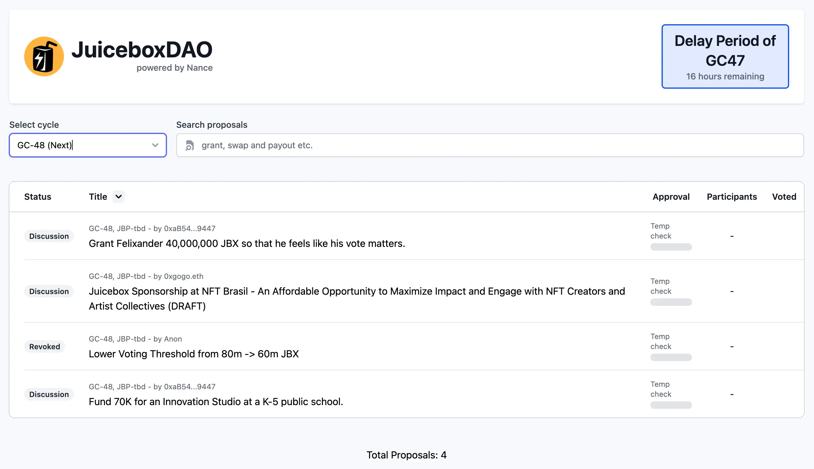
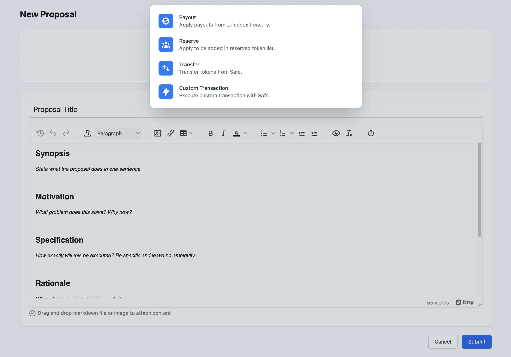
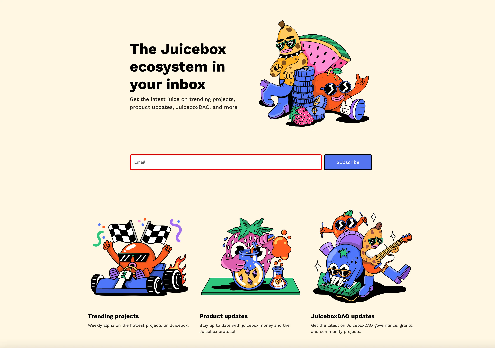
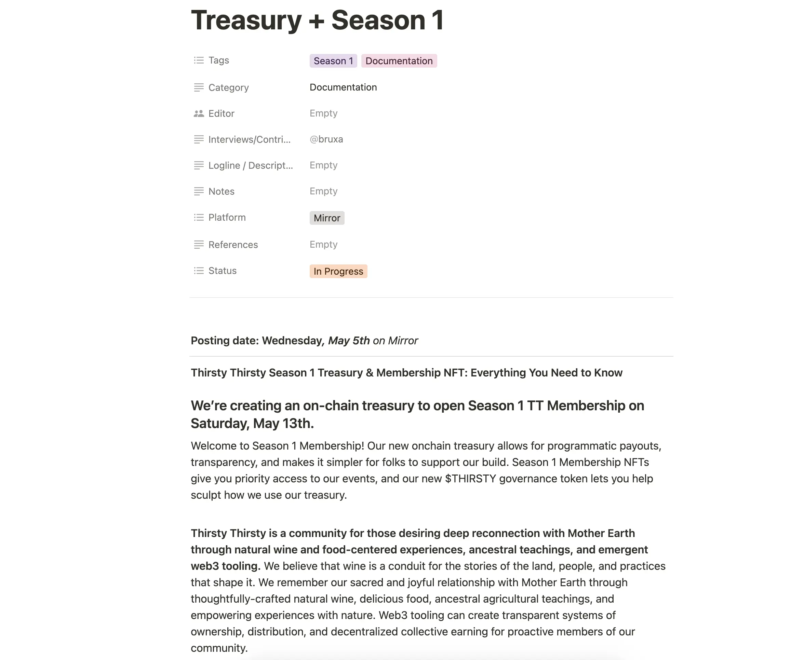
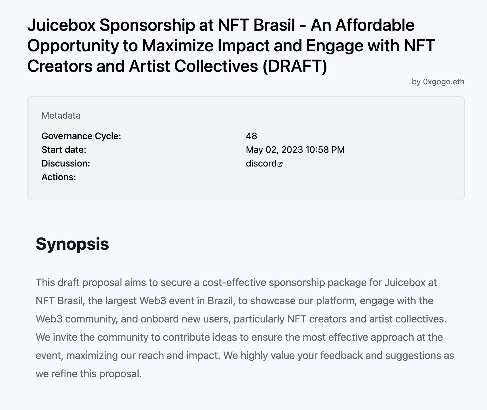

## Nance Updates by Jigglyjams

During the Town Hall, Jigglyjams introduced the new homepage for [JBDAO.org](https://jbdao.org/).

One notable feature of the updated proposal process is that proposals now include links to the relevant discussion threads in Discord during the Community Temp Check stage.

Additionally, the new proposal template allows authors to easily drag and drop Markdown files or images, and add actions such as payouts, reserve rate distribution, and token transfers from multisig wallets by clicking the "Add an action" button.

Another exciting development is the effort to genericize JBDAO.org, allowing other Juicebox projects to use the same front-end for managing their community governance. Several communities, including Thirsty Thirsty and Bananapus, have expressed interest in this product.

## Visibility Updates by Matthew and Brileigh

They have recently given Juicenews a [new landing page](https://subscribepage.io/juicenews), where folks can subscribe to the updates in Juicebox ecosystem.

Peel team has launched a new website in collaboration with WAGMI Studios, featuring an updated homepage, an About page, Case Studies, as well as new functions like improved search and project tags. Matthew and Brileigh published a [blog post of website updates](https://docs.juicebox.money/updates/website-updates/) to introduce some of the new pages and features, while also releasing a walkthrough video to accompany it, as part of the launch strategy of new products.

<iframe width="560" height="315" src="https://www.youtube.com/embed/1IlGgVO07tg" title="YouTube video player" frameborder="0" allow="accelerometer; autoplay; clipboard-write; encrypted-media; gyroscope; picture-in-picture; web-share" allowfullscreen></iframe>

And they also are going to have an interview with [CryoDAO](https://juicebox.money/v2/p/501) for the new episode of Juicecast.

## Defifa Updates by Jango

The Defifa team is in the final stages of organizing a tournament for the NBA Playoffs. The plan is to host a Defifa game for each series and focus on smaller competitions within those.

Jango has suggested the idea of a Town Hall minting session in the near future, but for now the team is focused on wrapping up a few remaining tasks.

## Thirsty Thirsty Updates by Bruxa

Bruxa has written a document about the Season 1 treasury and membership NFTs for the Thirsty Thirsty community, which she plans to publish on the Thirsty Thirsty Community Journal and formally announce on May 13th.

New contributors will be able to mint their Season 1 membership NFTs and join the governance, building together with the rest of the community. Additionally, there will be an airdrop of $THIRSTY tokens to Season 0 membership holders.

Bruxa believes that this will provide a strong foundation for the community to explore further in the Web3 world and help new potential users understand the mechanisms of IRL communities in this space.

## NFT Brazil Proposal by Gogo

Gogo put up a proposal this week concerning the thoughts of suggesting JuiceboxDAO to attend the NFT Brazil event, which he mentioned in our last Town Hall.

He thought that this initiative can bring some value to Juicebox from this event. And he invited people to brainstorm together some cool things that we could do during this event.

