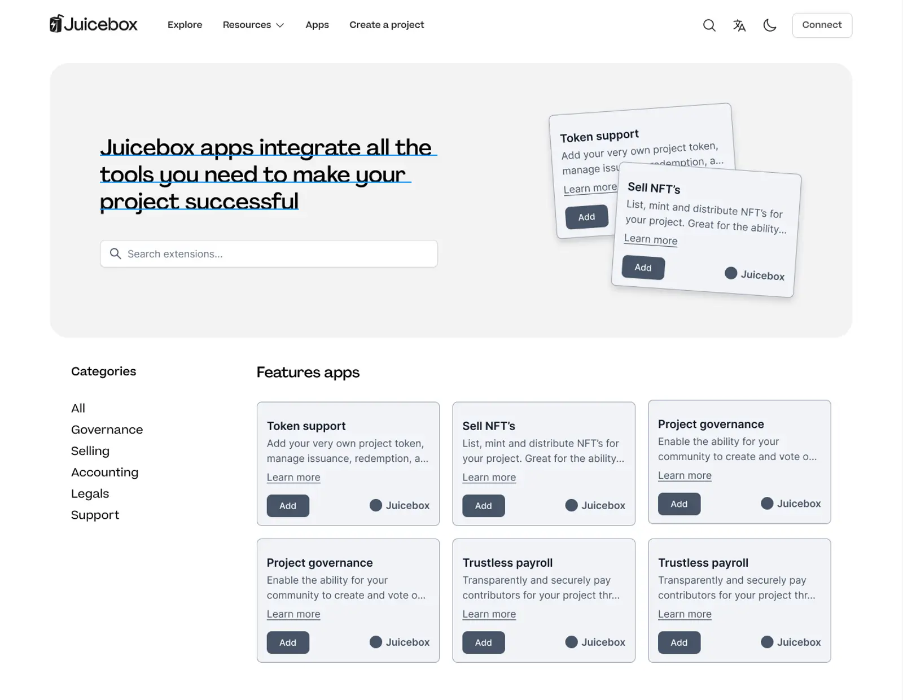

## App Framework introduction by TJL

In response to some of the relevant discussion lately in the Discord, Tjl had been working on the [App ecosystem framework](https://grand-popcorn-c81.notion.site/Juicebox-Apps-Ecosystem-dfd59363bc894f328897e37a3b2bec54) that he believed can be enabling an extensive ecosystem of Apps to extend the Juicebox fuctionalities and drive continued development.

On the town hall, Tjl gave a walkthrough of this document, identifying some of main problems in the Juicebox ecosystem, givinng some suggestions and corresponding solution, projecting the potential changes this framework is going to bring to our ecosystem, as well as some opportunities that will be opened up with this initiative.

### Problems

1. **Brand strength**: It's the lack of uniformity, consistency and strength to the brand, and not tying back to the original Juicebox, therefore suffering on the branding front.

2. **DAO Alignment**:Everybody in Juicebox speaks about Juicebox in a slightly different way, causing a fundamental problem of value alignment and over time creating inconsistencies with the way we talk about Juicebox and what it is.

3.  **Product complexity**: Difficulty in effectively nailing a clear value proposition for JuiceboxDAO to try and move towards Product Market Fit (PMF).

4. **Growth effforts**: We failed to do a great job at focusing on growth initiatives and strategies.

### Suggestions

### Solution

The solution here is using JBM as the key vehicle in the market to

- firstly, define a core set of features that provide clarify to what Juicebox is, and are essentially 100% valuable to 100% of projects, while everything else that is in contention to every single other project made available as a plugin;

- then slowly peel back extensive features of the platform, but replacing with in-house built plugins which ultimately match the current fuctionalities.

We wouldn't be changing what Juicebox is, but just changing how we market it and how we talk about it. And then we'd be changing some of the UX and opening up more opportunities on the plugins front.

### Changes

Acording to TJl, there will be following changes:

- Simplified JBM create flow;
- JBX create flow with a modular design;
- Settings with a modular design;
- Project pages with similar modular design;
- A new page/section of JBM for exploring and project plug-ins.

### How might this work

Tjl also demonstrated some very early stage wireframes as the visual indiction of how this might work in regards to Juicebox.

He also showed the audience some rudimentary mockups to visually represent how this framework might work within the current setup, in areas such as App Store, Developer assets, List an app, Create flow, Project page and Project setting.

### Opportunities

What Tjl saw as the opportunities of take this initiative:

### What do we need to make this work?

If we were to go down this path, there are a few things to make it work:

- We need complete alignment and support from the DAO. We're all working towards a single goal, we talk about it in a single way and we have a kind of a single destiny.

- A slight shift in priorities for the Peel, even though we've kind of put all of the building blocks in place for this, it would be a slight shift in priorities for us in the way that we build some things.

- And cooperation from existing JB-funded projects.
- And Contract crew development support
- Documentation from Filip.

## Discussions On App Framework

**Nicholas**: I completely agree with a lot of the motivations, but I think that clarifying the core function of Juicebox makes a lot of sense, or at least what it is advertised as, even if it has a lot of extensibility beyond that.

And I want a bit more certainty that App Store not only is a convenient solution for updating the front end from something more complicated to something more streamlined, but also can move us towards increasing adoption.

**Tjl**: I totally agree that we're already doing this in a sense, but I don't think we're doing it with guardrails, and we're losing a lot of potential opportunities by doing so.  Also it doesn't tie back to the brand and the growth of Juicebox.

Secondly, we definitely have a Product Market Fit (PMF) problem that we have yet to solve. And we haven't nailed our positioning, which is a product of the fact that we can't get consistent with talking about it.

**NIcholas**: To get that process started, it would be interesting to have a single front end which is compatible with separate work streams, updateing them at the same time. If Blunt is something that can be executed inside of an optional add-on tab instead of a project, then a handful of devs, internal or external, Peel or non-Peel, can start working on that. And it can be integrated into juicebox.money immediately, rather that having to either spin up an entirely new site, or to redirect Peel resources to it.

**Tjl**: Totally. That's definitely one of the biggest motivations. Let's tidy everything up, move everything towards a single source,  and start to grow that as an ecosystem, rather than crumbling off in different directions.

**Nicholas**: It does remind me of interacting with an AMM like Uniswap or Matcha and importing untrusted tokens. I would be curious to know, more from the perspective of contract crew, if we could achieve something like a level of standardization around front ends, or extensions to the protocol where they can be added either as trusted or not trusted. For instance, right now if you want to rip the NFTs, you can take NFTs out of the create flow pretty easily.

I don't know if it's possible to achieve, but it would allow for a faster, simultaneous and concurrent development of extensions to the protocol, if it is easier to get them into an interface.

**Filipv**: I think the generic UI problem is probably the biggest question there. For people to build Juicebox extensions, we would have to find some generic solution for that and it's not very easy to generalize.

**Kenbot**: I don't think that Juicebox is a fundraising protocol. The complexity of it is beyond the scope of what most people who are looking for fundraising capability are looking for.

I think the strength of the protocol, the platform and even everything that's been created so far, is a fundraising solution. It's a smart treasury that remembers who contributes and can reward them later on, making it a powerful tool for managing money flow.

I think that Juicebox's strength lies in its general purpose treasury tooling, and then the more specific interaction interfaces are where we will win.

**Jango**: I think there are two ways to look at it.  There's the revenue angle, which will lead us to a certain path of what do we really enjoy working on and what's our passion. And we are building something in alignment with what has previously brought the DAO's revenue, which in a sense you can see it as revenue, and in another you can see it as a community building exercise, because the bulk of the funds we use were from folks who tripped into the treasury and not even though a project.

Another interesting way to look at it too is: what are the projects that we really care about and what do we want to build? Folks like Kenbot, Livid and Kmac etc., are building their thoughts here. It might be telling to take what we've done, what we've seen and what we've learned from, and then figure out how we should apply it to the current cast of motivated people who are here and building.

**Tjl**: Most definitely important. I think that's step one over everything else. We need to get clear, and there needs to be a lot more clarity on the direction and why.

**Jango**: I think part of the motivation in trying to figure out the right way to express these Apps, what we used to call extensions or templates, is because ultimately we can't really control what comes the protocol's way. We don't have the luxury of a single alignment and a single brand. The paramount principle of our old strategy was to welcome diversity and recognize that folks are encouraged to build their own wacky things, while the DAO would step in and add some level of legitimization if things prove interesting.

So I am aligned with the conversation in large part, but I think it will be really tricky or impossible to actually get on a single same page. I think it's worth considering, despite it being counterintuitive, the opposite of how can we be as accomodating as possible to chaos.

**Tjl**: I think it's incredibly important to try to at least nail down where we are going, Even if you do think it's impossible, I think having many and frequent discussions about this will be important in moving us into a direction which makes sense. And that should be a priority over everything else, because it seems to be too many narratives over there.

**Nicholas**: I feel that we need clarity. It's okay to have some clarity what this thing is about. I don't think that's the enemy of chaos or productivity or creativity. In fact, I think it's enabling of creativity and chaos.

## JB Project Metadata: Static Metadata by Nicholas

Nicholas had developed a TokenUri Resolver contract in the past several month, which can visualize some details of a project on its ownership NFT. Some of the projects that deployed this contract can be found in the [Juicebox projects page on OpenSea](https://opensea.io/collection/juicebox-projects-izoueqj). And he also made another contrat called Project cards to let folks mint an NFT to keep a copy of any Juicebox project's metadata in their own wallet, which can be found [here](https://opensea.io/collection/juicebox-project-cards) on OpenSea also.

In the past week, he made a small contract, which basically is a custom token resolver that lets project owners change their projects' static metadata to some JSON posted on some custom location like IPFS, HTTPS or even Arweave.  So people don't need to upload or deploy their own contracts, they can just set the text using this contract and then set their projects to use that as a resolver.

Though he is going to make a dedicated website to help people mint those project cards more easily, if anyone wants to try it out earlier, they can follow these steps below:

1. Pin your desired metadata to ipfs (use this template ipfs://QmQs3MLLqyxVKWn7BccxEmweQ17JfT3ttnmZ7nga7c1D3S);
2. Call `setUri` on this contract, passing the project ID and URI from step 1 (eg `ipfs://...`)[here]( https://etherfunk.io/address/0xbd6cf252598bbfd87a429ded71adf9f8d2bb9558?fn=setUri&args=%5B%22500%22%2C%22ipfs%3A%2F%2FQm..........%22%5D);
3. Set the token uri registry as your custom token resolver by passing it's address and the project ID of your project  [here](https://etherfunk.io/address/0x2c39bb41e2af6bec6c3bb102c07c15eda648a366?fn=setTokenUriResolverForProject&args=%5Bnull%2C%220xbD6cf252598BBFD87a429dED71aDF9f8d2bb9558%22%5D).

Filipv had made a [PR for the earlier contracts shipped by Nicholas](https://github.com/jbx-protocol/juice-interface/pull/3521), as soon as it gets reviewed and merged, project owners can go to the projects' settings to set their custom metadata, instead of interacting with the contracts directly themselves.

## Post Mortem of V1 Payouts by Filipv

Filipv had put up a proposal recently to move all the ETH from JuiceboxDAO V1 treasury to V3 treasury.

After this proposal got approved, Filipv went to queue a transaction to increase the funding target of V1 treasury to 100m ETH, the total amount that can be paid out of the treasury, and set the payout beneficiary as the address of V3 treasury. This transaction was approved and signed by the multisig later.

But later Jango noticed that the payout beneficiary was set as the V1 treasury itself instead of V3 treasury, and the team soon found this was a bug which would set the allocator to the zero address when the funding target of a V1 project was changed, which meant that the V1 treasury will pay itself and mint some new JBX tokens.

Theoretically, this could be exploited to make the V1 treasury keep paying itself until the 100m funding target is reached and mint out an astronomical number of JBX to be allocated to the multisig and other reserved rate recepients.

Filipv quickly hid the "Send payouts" button in the front end of V1 project, and Jango queued a transaction to set the right V1 allocator, which was signed and executed by multisig members soon after.

To recount and analyze this bug, Filipv had posted a post mortem [here](https://docs.juicebox.money/v4/deprecated/v3/resources/post-mortem/2023-06-05/), he also  outlined some procedures to be taken in order to prevent similar problems in this article.

## Community Feedback by Gogo

Gogo came to our [town hall two weeks ago](https://docs.juicebox.money/town-hall/23-04-25/#thoughts-on-nft-brazil-by-gogo) and announced that he wanted to suggest the DAO to attend the NFT Brazil event but he didn't have a chance to fully explain his thoughts and instead suggested to submit a proposal. And he did put up [the proposal for NFT Brazil](https://www.jbdao.org/p/378) and came to [our town hall last week](https://docs.juicebox.money/town-hall/23-05-02/#nft-brazil-proposal-by-gogo) again to advise folks to brainstorm what cool things we can do on this event. This proposal was turned down by the DAO in the phase of community temprature check.

He thought that there isn't a space in our community to brainstorm and give ideas. As a OG Juiceboxmember ever since 2021, Gogo felt he had been very passionate about our community. And this was the first time he want to do something for Juicebox directly and specifically, together with the community. He had not felt very welcome and neither had a space to discuss with the rest of the community.

But instead, when the first time he created a proposal to Nouns DAO, he had fours calls with the whole team, got together with them to have some feedback from that community and think about what would be the best approach. He created a proposal and changed many details according to the ideas of the community, and finally the proposal was passed.

He suggested that we should have a space to communicate, a space to think about what we want as a DAO and make people feel they'are welcome here.

Jango expressed his gratitude to Gogo for bringing this up. He felt that we spent a lot of energy thinking more about next future customer and product market fit, which didn't really make much sense  in the context of the tools that we're building. He suggested that we prioritize the needs of current builders and community members, instead of constantly seeking new customers or revenues. He believed in building strong relationships with the current members and providing them with the necessary support and resources to succeed.

Jango also emphasized the importance of focusing on individuals rather than revenue and product market fit. He believed in fostering a community of passionate builders who can work together to create innovative solutions.

Mieos thought that we need to find a nice balance between pushing the family vibe where we all feel welcom, loved, appreciated and motivated to take risks, and a place where we are trimed and efficient towards a product that the world wants and makes profit to make it more sustainable.

And he thougt that we recently got a little too serious in the proposals, maybe it was because we had been hot and loose for a while and the pendulum had swung back a bit. He suggested that we find a way to add more productive feedback and be more open to giving and receiving. He also was grateful for Gogo to catch the vibe and be willing to step in and say something about it.

## Planet Croptop Template Demo by Jango and Livid

Livid introduced that [Planet](https://www.planetable.xyz/) is an App that lets users have a website running on their ETH domains. It's a fully decentralized solution, which means that the users' content and domains are totally controlled by their own private keys, and there is no server and no centralized thing with this project.

On the town hall, Livid demonstrated posting a screenshot onto a website of ENS domain, and then collecting one of the images on [Jango's ENS website](https://jango.eth.limo/) as an NFT.

Jango then took over and introduced the mechanism of this Croptop template for Planet App.

As you create websites using Planet App and post content, you are esentially hosting it on your computer. Anyone who follows your planet can then access and distribute the content in a peer-to-peer network.

The model from the peer-to-peer perspective is that the content kind of lives in this peer-to-peer network, and it can be removed or de-referenced. But once someone collects the content, then it lives forever, it's stored and permanent, and can't be removed or deleted by the person who made the content and posted it in the peer-to-peer network in the first place.

This might be a path to build the unstoppable sites that are hosted on the Ethereum network, and the content is peer-to-peer. And then the only step missing is to really make this a fundraising tool, to let these images be posted and mintable on a Juicebox treasury.

Recently, Jango developed a Croptop contract and made these content collectible/mintable as NFTs and be posted onto a Juicebox project.

Any project on Juicebox can give this contract permission to post a new NFT onto its project page. Up till now, our mental model of NFTs that only the project owners can go to their project and post a new NFT on their project page, but now they can give this Croptop contract permission to post a new NFT on their project page, and put these NFTs in a specific category if they want, so that the NFTs posted by the Croptop contract can live besides or separate from the project's main NFTs on the project page, how ever the project owners see fit.

And then the project owner can also set some thresholds like the minimum price and the minimum quantity of NFTs can be posted on their project page.  So that when someone goes to a project and post their own NFTs with the Croptop contract, they can set the price for that NFT, as long as the price is higher than the threshold set by the project owner before.

In the example above, one of the images on [Jango's ENS website](https://jango.eth.limo/) was collected/minted and posted to the project page of  [Test Croptop](https://goerli.juicebox.money/v2/p/670) (Goerli testnet), at the same time a 5% fee was paid into another [Croptop Publishing Network](https://goerli.juicebox.money/v2/p/669) (Goerli testnet) for using the Croptop contract. ( Right now, Croptop is still an experiment that lives in Goerli testnet.)

So then anyone can basically post art or things they want onto a project page, which can be a project page or something specific for this feed aggregation. In order to post on someone's feed with Croptop contract, you will both add the NFT and mint the first copy, so you're basically paying the project to post a new piece of content.

Maybe there will be a reverted model, where project owner is not posting NFTs, but its community is getting together and deciding which items should be posted on a certain project.
