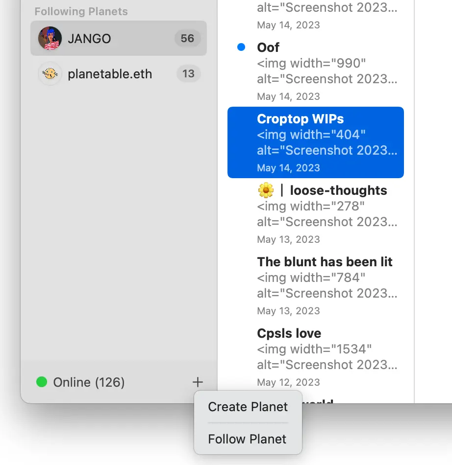
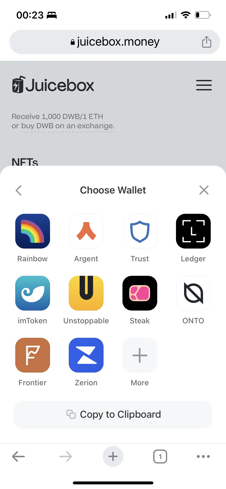
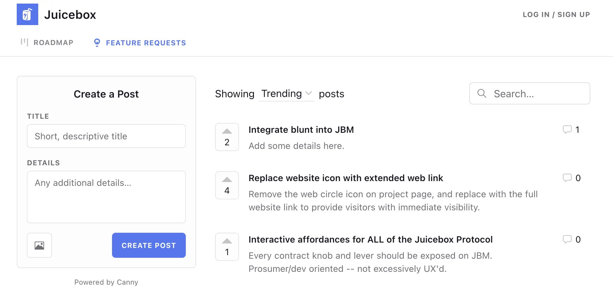

## Meme Coin Fair Lunch with Blunt by Jango

**Blunt** is a project that has been supported and funded by JuiceboxDAO to experiment some niche features of fundraising's first rounds. A Blunt round can be created with very tightly scoped preconfigured rules, such as a funding hard cap, funding target and a funding deadline, etc. For example, if a fundraising campaign doesn't reach its target within a deadline, a funding cycle #2 will be automatically configured to open the refunds for everyone participated in the Blunt round. If the fundrasing ends with success, then the ownership of this project will be automatically transferred to the pre-defined owner's wallet address, and the project will be operating onward, same as an ordinary Juicebox project.

**Fair Lunch** is a project that aims to help people crowdfund to create a meme coin in a fair and decentralized way. When funding is closed with success, the new meme coins and funded ETH will be used to start a liquidity pool on AMMs automatically at a proportion defined in advance, so as to ensure a fair launch of the meme coin, lunch served!

In the Town Hall, Jango demonstrated how to use Blunt to create a Fair Lunch funding round. When this fundraising ends successfully, then the ownership of this project will be transferred to, intead of a pre-defined owner. but the Fair Lunch contract, which will in turn schedule a new funding cycle immediately that allows owner's token minting and distribution of all ETH in the project's treasury to Fair Lunch contract. Then the meme coins will be paired with ETH at a certain ratio and  added to a liquidity pool on AMMs.

From a pattern's perspective, we have this hook `onERC721Received`, which is the standard hook for ERC721s, and it will be used to detect when the project ownership on Blunt is passed to the Fair Lunch contract and trigger the actions thereafter.

 There are two parameters to make a new fair lunch and describe a particular Fair Lunch contract, the Multipler and the Splits.

- The Multiplier sets the initial price that the tokens will be offered in the LP. A multiplier of 1 basically means mint exactly at the token/ETH ratio specified in the Blunt round to start the LP. A higher multiplier will make the token price better in the initiation of that LP.
- Juicebox Splits can be set so that as soon as the Blunt ownership is transferred and so are the raised the funds, some of the funds can be split off and routed to a list of beneficiary addresses, while the leftover funds will be used to kickstart the LP.

## Croptop Contract on Planet by Jango

Planet App is a decentralized solution for users to run their websites on ENS domains, they can locally host the contents which will be pinned to IPFS and referenced to an ENS through IPNS address. The contents are distributed through a peer-to-peer network without relying on servers or other centralized services. Once distributed and collected by other users, the contents will no longer be removable by their original publishers.

Croptop contract is a Planet template developed by Jango, to help make this a fundraising tool and let people post the contents onto a Juicebox treasury and make them available for minting as NFTs.

To try the Planet app with the Croptop template, here are the steps to be followed (only available in Mac right now):

1. Download Planet Mac app from [here](https://planetable.eth.limo/insider/);

2. Create your own Planet by clicking "Create Planet";

   

3. Set Croptop as the template of the new Planet;

   

4. Right click the created Planet and copy IPNS;

   

5. Go to [ENS app](https://app.ens.domains/) to edit records for your ENS name, paste the IPNS into the field of Content Hash and add a prefix of "ipns://" in front of it.

   

6. After the planet is propagated through the peer-to-peer network,  you can visit your Planet with your ENS name by going a corresponding address like jango.eth.limo in the browser.

7. Go to the template setting and your can set the Juicebox project ID that images on your Planet will be posted and minted from.

   

8. Juicebox.money front end will soon support the Juicebox project owners to set the Croptop contract as an operator in the project's settings, to post NFTs on the project page on their behalf.

If you are interested in how to collect a image from an ENS website and post it onto a Juicebox project, please jump [here](https://docs.juicebox.money/town-hall/23-05-09/#planet-croptop-template-demo-by-jango-and-livid) to check what Jango and Livid introduced in our last Town Hall.

Though Planet allows people to host the contents distributed peer-to-peer, propagation in the peer-to-peer system might not very fast at this stage. Planet has a Juicebox project called [Plantable Pinning](https://juicebox.money/@pinnable) which offers a central pinning service to make the propagation a lot faster, people can choose to mint NFTs on this project to have access to this pinning service.

Anyone who is interested to know more about Croptop is welcome to join the [Croptop Discord](https://discord.gg/tjkZrhhMAU).

## Peel Updates by Tjl

Recent work by Peel:

- Peri had been doing a lot of work under the hood on Apollo and subgraph and making a better developer experience and performance.

- New NFT contracts was live on Goerli testnet, they should be ready to be in production by next week, pending some collaboration with the contract crew.

- There had been a relatively big bug with Edit payouts section which turned out not being structured the right way, it had been fixed by JohnnyD.

- We now have a new ConnectKit wallet in our Connect section, to provide a much smoother UX, especially for people who don't have wallets. It looks really nice on mobile.

  

On the Town Hall, Tjl also walked us through [Canny](https://canny.io/), which is essentially a tool that allows people to add a feature request idea or some feedback, and also allows people to vote on it.  Peel team had been using this in front end work for a while. Nicholas suggested that we should expand this tool outwards and allow anybody in the DAO to post in Canny our updates, ideas or feeback. So, now anybody can come [here](https://juicebox.canny.io/feature-requests) to post their ideas or feedback, vote on them or add some comments.

It will probably be a very good way to get a temperature check on things that community members care about or are interested in.

