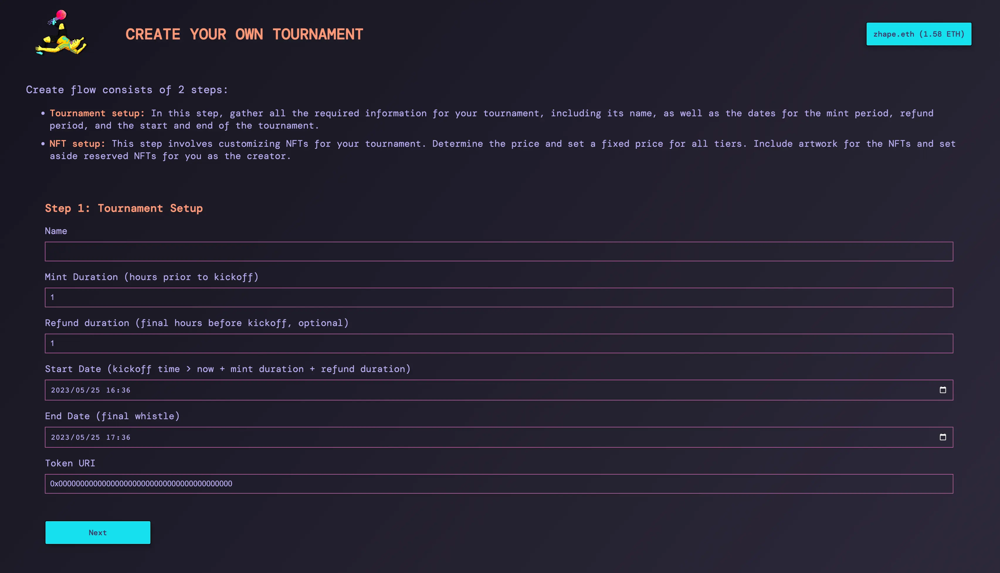
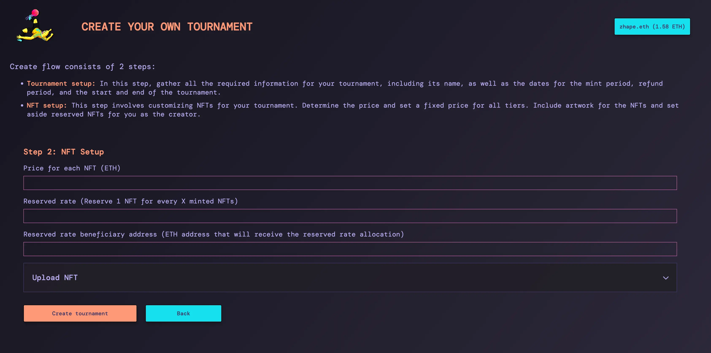
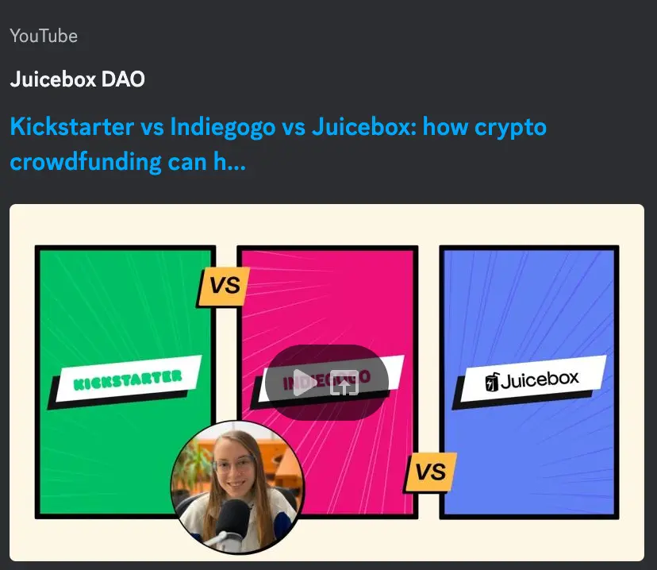
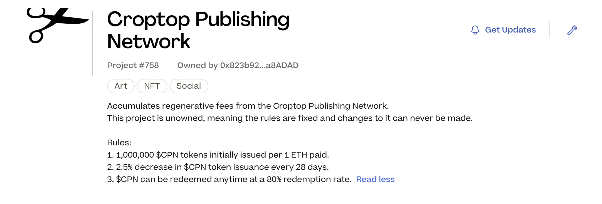

## Defifa Demo by Kmac

Defifa is a project that received grants from JuiceboxDAO to organize a game for the World Cup at the end of last year. The tournament game was highly successful. Following that, they also arranged a tournament for NFL playoffs in early 2023.

During this process, the team realized that the concept of creating tournaments should be accessible to the public, not just limited to their own use. This led them to explore the idea of developing a protocol and platform for creating money games and delivering an arcade-like experience.

Kmac took the lead in applying for grants with Seed Club and Base Ecosystem Fund. Additionally, they were preparing to submit a similar proposal to JuiceboxDAO in the near future.

During the Town Hall, Kmac presented the game flow of a Defifa tournament using an example game he created. This particular game focused on the top Spotify artists for June 2023. Participants could mint NFTs representing different artists to contribute to the prize pool. The distribution of the prize pool was designed as follows: 50% to the player who selected the most popular artist, 30% to the second most popular, and the remaining 20% divided among the third to fifth most popular artists.

The tournament followed a structured flow, consisting of the following phases:

1. Open ceremony: A minting phase where participants could mint NFTs of their choice. They had the flexibility to quit and receive a refund at any time during this phase.
2. Refund deadline: Participants had the opportunity to review the minting status of the game and assess their odds of winning. They could choose to leave the game before the refund deadline.
3. Kickoff: The game officially started, and the pot of funds became locked. Refunds were no longer permitted.
4. Final whistle: The game concluded, and all players came together to validate the final result on the blockchain. Based on the outcome, the funds in the treasury would be backing the winning NFTs. Those NFT holders had the option to either burn and reclaim the ETH or retain the NFTs and trade them in the market.

### The Create Flow of Defifa

During the town hall, Kmac provided a demonstration of the new create flow of Defifa, outlining the two steps involved in game creation.

1. The first step entails setting the name of the game, the duration for minting NFTs, the refund duration, and the start and end times of the game.

2. The second step allows users to customize the NFTs for the tournament, including setting their prices and allocating a reserved rate to a pre-defined beneficiary.

While the create flow was still a work in progress, Jango highlighted two noteworthy features in the contract that have not yet been supported in the UI:

- Distribution limit: This feature enables a percentage of the game's treasury to be allocated to a charity or another Juicebox project. Once the game starts, this allocation can be distributed, while the remaining treasury is utilized to run the game.
- Splits of reserved rate distribution: Users can designate a reserved rate beneficiary for each tier of the NFTs or each team of a competition. For example, a certain address could receive one out of every ten NFTs minted for one team, while a different address could receive the reserved rate for another team.

Jango expressed interest in exploring how the contracts work, how users perceive them, and the potential patterns that may emerge from their usage.

Furthermore, Jango emphasized that the artwork associated with the past two tournaments held significant value beyond the treasury backing the NFTs. These expressive playing cards could have a lasting presence in people's wallets, and it was exciting to consider how they could attach to emerging tournaments and amplify their significance.

Lastly, Jango mentioned that all the components on defifa.net should be compatible with juicebox.money, allowing users to play the game on either platform. As long as the platform recognizes the Defifa delegate and creates an adapter that can interpret the NFT view, cross-referenced games accessible from different front ends with standard interactivity and interconnectivity could become a reality.

## Visibility Updates by Matthewbrooks

Matthew and Brileigh were preparing to interview Livid, the developer of Planet APP and the Juicebox project called Planetable Pinning, for an upcoming episode of Juicecast. You can learn more about Planet at [Planet](https://planetable.xyz/) and explore [Planetable Pinning](https://juicebox.money/@pinnable) on Juicebox.

In addition to that, they will also be having discussions with the team at [CryoDAO](https://juicebox.money/v2/p/501).

To provide more helpful resources, they had recently published several videos and blog posts with guides for various purposes. These valuable resources will be showcased in our upcoming Town Hall next week. Stay tuned for more updates and exciting demos!

## L2 and Croptop Updates from Jango

We had seen some great progress in the Bananapus staking component thanks to the efforts of both 0xBA5ED and Viraz. We would be excited to have an update in the upcoming week.

Regarding the L2 deployment of the Juicebox protocol, there had been a slight delay. The team had decided it would be more efficient to organize the repositories separately. This means the Juicebox V3 repository will remain as it is, while a new repository will be created specifically for multi-chain purposes. Once the new repository is up and running, we will proceed with integrating it into Defifa.

In recent weeks, Jango had been actively working on updates for the Croptop templates. Additionally, he had launched an experimental [Croptop Publish Network](https://goerli.juicebox.money/v2/p/758) project on Goerli test net, which serves as an unowned central hub for decentralized posting and minting of P2P distributed contents.

