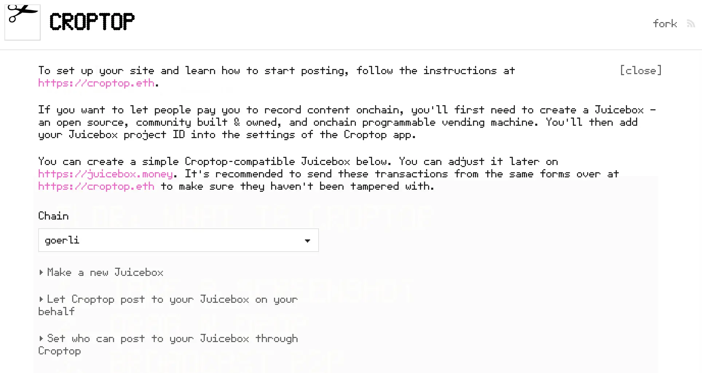
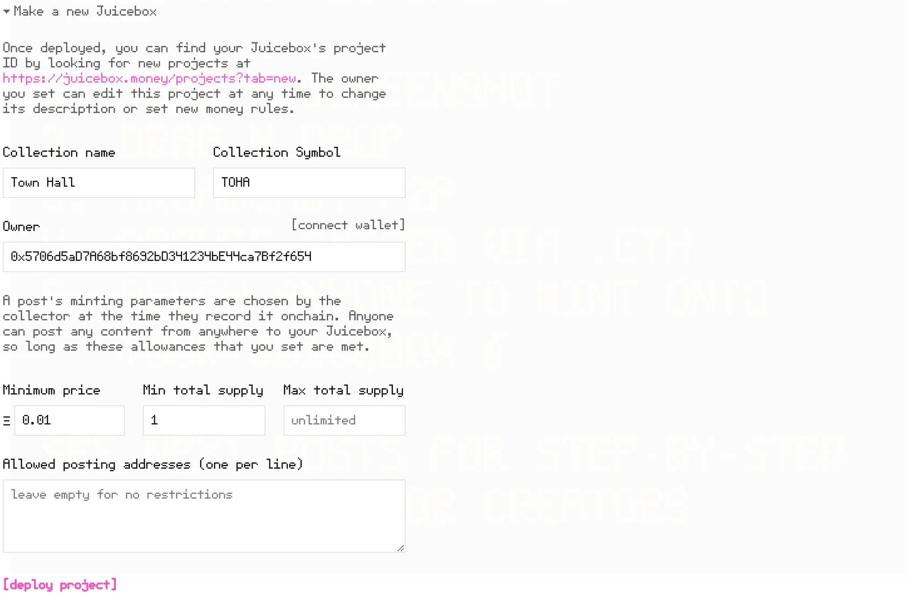
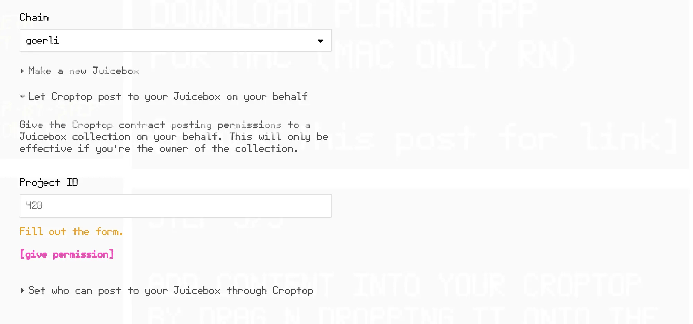
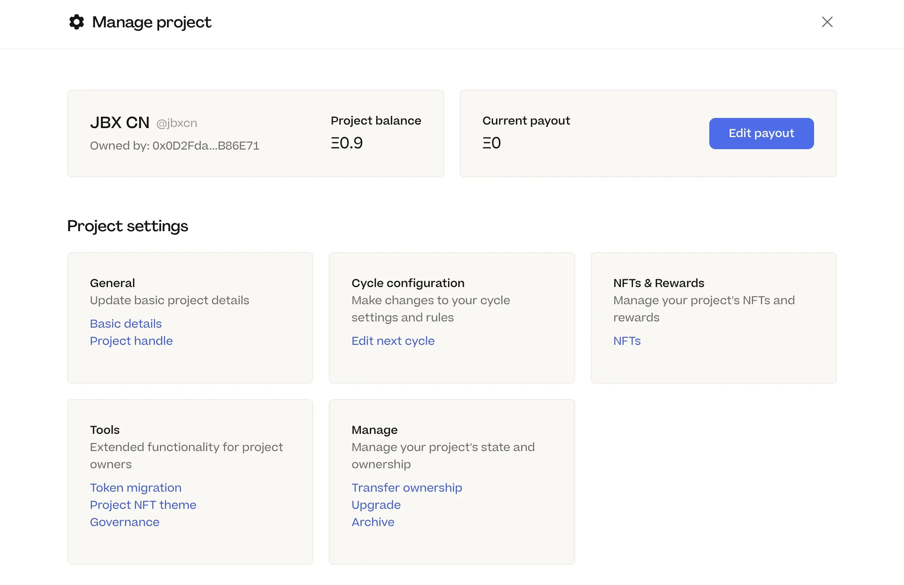
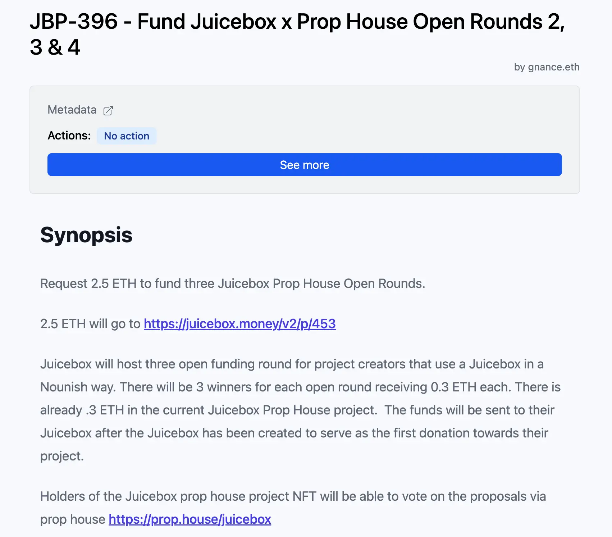
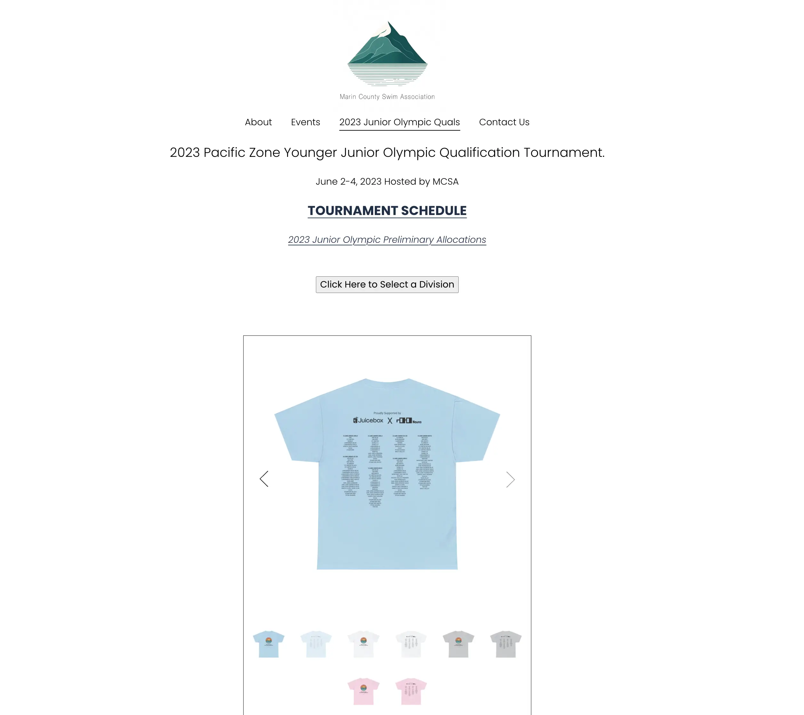

## Croptop Updates by Jango

The development of Croptop had been close to its final stage, things were really starting to shape up, and Jango were eager to wrap it up and see how it unfolds.

To try to play with the current version of Croptop, you may go to [croptop.eth](https://croptop.eth.limo/) and follow the steps there:

Jango introduced that there were a `Fork` button at the top right corner on any site that is running with Croptop template.  By clicking it, people can try to start using Croptop to post and mint contents onchain in a decentralized way in the following steps:

1. Choose the chain that you want to deploy your project. Right now, it will be only available on Goerli testnet, but Ethereum, Polygon and other L2 deployment will be coming soon.

2. By click the "Make a new Juicebox", there will be a shortcut to quickly launch a Juicebox project, where people can pay you to record content onchain. You will need to set the name and symbol of the NFT collection, as well as the owner of this Juicebox project. And the Minimum price, Min total supply and Max total supply are the boundaries set for posting on your project. When people post specific content on your project, they can set their own parameters for prices and supply, but those parameters must fall within the boundaries set originally by you, the project owner.

   

3. Next step will be giving permisson to Croptop contract to post on your Juicebox project on your behalf, as an operator. After deploying the project in the step before, you can get its project ID and fill it in so as to give Croptop contract the permission to post NFTs on this project.

   

4. Last step will be optional, setting the addresses that can post to your Juicebox project via Croptop, and also the category of NFTs that will be allowed to be posted.

   

Right now, we were still using the Planet App to implement this Croptop fundraising initiative, but Jango said we would soon have a dedicated Croptop Mac App, which should be more straightforward and easy to use.

So if you're on a Mac and you want to make use of your ENS name to run a personal fundraising site, this is going to be a really good way to tell stories about what you're working on.

## Defifa Updates by Jango and Kmac

The Defifa team had been planning to host a tournament for the NBA finals, but their plans had been delayed quite a few times, mainly due to a lack of devs taking care of the front end stuff. Jango was very grateful for Aeolian to show up recently in Defifa and help cleaning stuff up, which made a tournament for NBA finals very likely now.

According to Kmac, the Defifa code base had got a total refresh and the create flow finalized with the help of Aeolian, giving the team the ability to actually go discovering some games in a light way. Their first goal was to set up a few self-hosted tournaments, making sure that everything is working fine before the create flow is officially open for public use.

Jango reiterated that the cool thing about Defifa is that, we don't really need an official oracle to define the games for us, but in stead we can make whatever rules and distributions that we want, allowing for some very cool and creative outcome.

## Peel Update by Tim

There were two major work projects underway in Peel team at this momentl: the project page revamp and the project settings improvement.

For project page revamp, Peel was starting on a new trajectory in terms of project page layout and what could be done, as well as introducing  some new features such as a cart to support adding multiple NFTs or collections.

And for project settings, there was already a delegation page live on the project setting home page, which was an easier navigation page. Peel had split up some items in the settings and made them more user friendly and easier to navigate.

Next, they would be focusing on the revamp of Cycle configuration and payout components in the project settings page.

## Project NFT Theme and Juicebox Cards by Nicholas

### Project NFT Theme

Nicholas developed a TokenURI resolver contract a little while ago, which lets project owners to tweak the metadata of their projects, or totally replace the project's default metadata by setting their own custom resolver. This function had been officially integrated into the project settings on Juicebox.money website, and now available to use for all project owners.

### Juicebox Cards

Nicholas also wrote a Juicebox project cards contract, an ERC-1155 NFT contract that lets users mint an NFT replicating the metadata of any Juicebox project and keep it in their wallets,  making it possible for them to stay updated with any changes of that specific project.

Nicholas had been absent from this Town Hall, so he asked Matthew to concisely introduce this product in the town hall, and help calling out people to go to the [Beta site of Juicebox Cards](https://juicebox-cards.vercel.app/) and give it a try. Any feedback on that would be highly welcome.

## Juicecast Updates by Matthew and Brileigh

Matthew and Brileigh announced the release of a new Juicecast episode, featuring [Livid](https://twitter.com/Livid) from [Planet](https://www.planetable.xyz/), the App that recently Jango had been using to push his Croptop efforts.

In this episode, they talked about:

- How Livid had been building [V2EX](https://v2ex.com/), one of the most active communities for Chinese devs;
- Planet, an open source tool helping people build decentralized ENS websites;
- [Planetable Pinning](https://juicebox.money/@pinnable), the project Livid created on Juicebox as the infrastructure of pinning services for decentralized websites;
- Croptop, an experimental Planet template that he helped developing in collaboration with Jango;
- Livid's personal passion about retro games and the game database built from Internet Archive.

<iframe width="560" height="315" src="https://www.youtube.com/embed/0e6lWvKM2VI" title="YouTube video player" frameborder="0" allow="accelerometer; autoplay; clipboard-write; encrypted-media; gyroscope; picture-in-picture; web-share" allowfullscreen></iframe>

## Prop House and MCSA Updates by STVG

STVG joined the Prop House Twitter space today, talking about the process of getting JuiceboxDAO's approval on [the proposal to fund more Juicebox Open Rounds on Prop House](https://www.jbdao.org/s/juicebox/396). He was planning to host 3 more Open Rounds respectively on June, July and August this year.

And in the same cycle, he also submitted another [proposal to sponsor T-shirts for water polo events](https://www.jbdao.org/s/juicebox/397), which had been approved by the DAO too. These sports events would be hosted by the non-profit Juicebox project [MCSA](https://juicebox.money/@mcsa) created by STVG. He felt that the sponsorship on these events would help promoting Juicebox to people in real life, and also he expressed his gratitude to community members in supporting his proposal.

