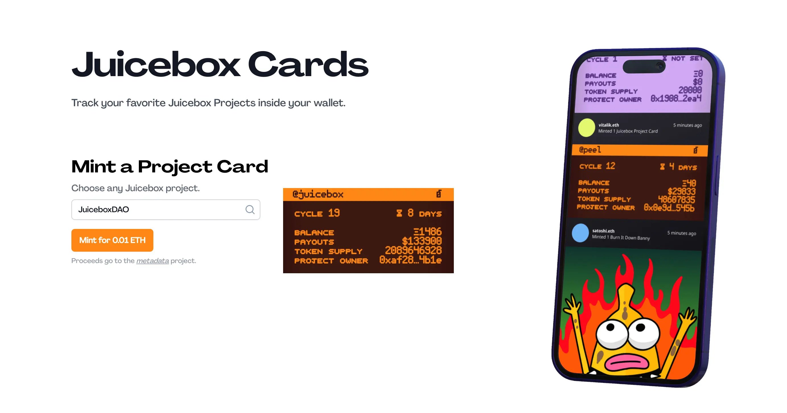
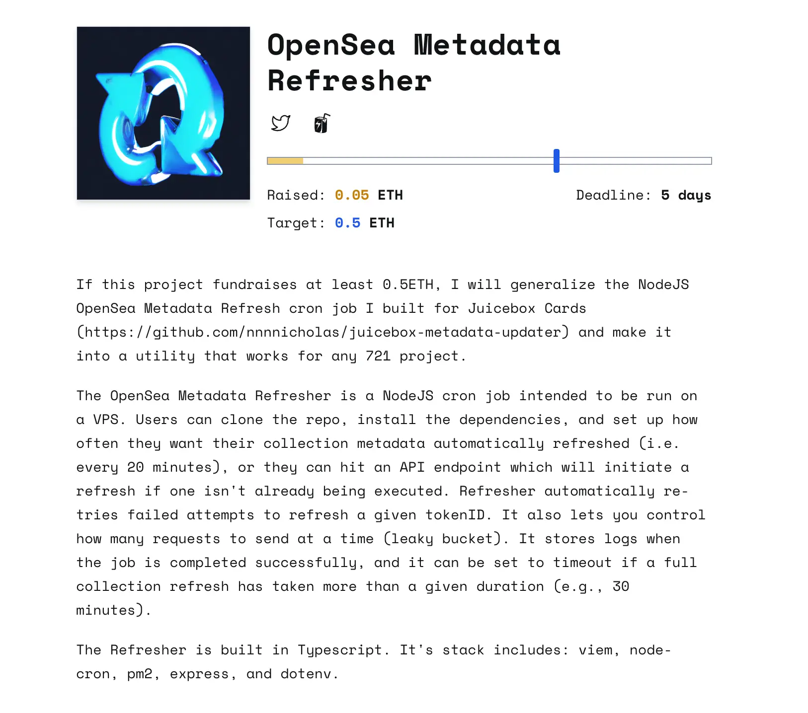

## Defifa Demo by Kmac

Defifa project had made some progress recently, and the team was starting to run some small games to make sure that the mechanics of the protocol and the front end UI would be working as intended, and hopefully get some feedback from users as well.

In the Town Hall, Kmac invited the audience to play a simple chicken-shit-bingo style game that he ran with  Defifa.

Aeolian recently joined the Defifa team and helped improving some front end stuff and updated the codebase with a few libraries.. Most of the original codebase had still been those started and evolved by Blaz and Devian in the early stage of this project last yea, and their technical components under the hood were quite different from those being used on juicebox.money.

And according to Kmac, the NFTs are all dynamically generating SVGs that will reflect some information about the game, such as number of times they have been minted, and the different phases that the game evolves into, which means the state of the game will always be represented in each NFT in real time.

This SVG development had been carried out mainly by Jango, and Kmac was working to push it one step further to accept artwork uploaded by users, so that the NFTs would have custom artwork on one side, and  full onchain SVGs reflecting the state of the game on the other side.

They wanted to get to a place where the game would be reflected inside the NFTs, so that no matter where people look at them, either from their wallets or makets like OpenSea, they can get a glimpse of the current phase of a game, or the NFT's backing value if the game is over and distribution is done.

And also according to Jango, the attestation process that they were about to try out for the Defifa project was based on a Governor Bravo contract, which Jango had been refactoring to make it more Defifa specific and lean. He thought that maybe this component could be reused, if other folks had similar game mechanics they wanted to implement as a state machine.

## Buyback Delegate Audit Updates by Dr.Gorilla

The [audit contest of Buyback delegate on Code4rena](https://code4rena.com/contests/2023-05-juicebox-buyback-delegate#top) had ended on May 23rd. According to Dr.Gorilla, the full process of auditing had not been finished yet. Our contract crew had reviewed the findings, acknowledged or disputed them accordingly, and Code4rena had yet to publish the final audit report at the moment of this town hall. By far, no bugs of high severity had been found, and only a few  medium severity ones and some gas optimizations had been proposed to our contract crew.

Dr.Gorilla said that he had started implementing what was in need of improvement, expecting to get it done by end of this week.

## Metadata Refresh Demo by Nicholas

The Juicebox cards was a project which allowed users to mint an NFT to replicate the metadata of a Juicebox project and stay updated with its changes. This project was developed by NIcholas,  and was now working at [Juicebox.cards](https://juicebox.cards/), but it was not yet finalized because there was still some work in progress as he needed to rewrite the contract to implement some more things.

Nicholas had been working on a Juicebox metadata updater. As the metadata of a Juicebox project is generated onchain, its values change over time. But when these NFTs are shown on OpenSea or other sites that relying on OpenSea, their metadata won't be refreshed real time, but rather with their cache stored in OpenSea. This Juicebox metadata updater helps updating the metadata of these NFTs on OpenSea so that the metadata shown there are always up-to-date.

Also Nicholas launched [a fundrasing round on Blunt](https://blunt.fund/rounds/519), to check if there would be enough interest in generlizing this product for all other 721 projects on OpenSea.

## Delegate Hackathon Callout by Filipv

Filipv was coordinating with [Austin Griffith](https://twitter.com/austingriffith) from [BuidlGuidl](https://buidlguidl.com/) to host a new hackathon on Juicebox. The plan was to make use of the leftover funds in [BuidlGuidl's Juicebox project](https://juicebox.money/@buidlguidl) from their [last hackathon](https://docs.juicebox.money/hackathon/), and some grants that Filipv had the thought of applying from JuiceboxDAO for support,  and to implement this event as a joint effort of JuiceboxDAO and BuidlGuidl.

This hackathon is aimed at building new Juicebox delegates and/or data source for the use in the Juicebox ecosystem, and the draft game plan of it can be found [here](https://docs.juicebox.money/delegate-hackathon).

In the Town Hall, Filipv called out that folks with ideas about funds delegates or data sources can come forth and share them in our Discord.

