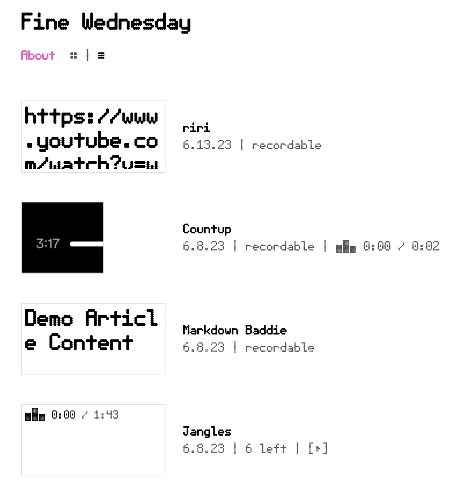
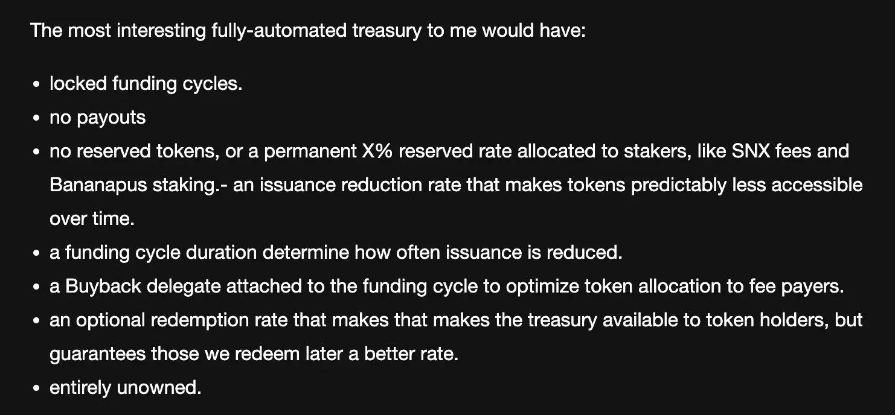
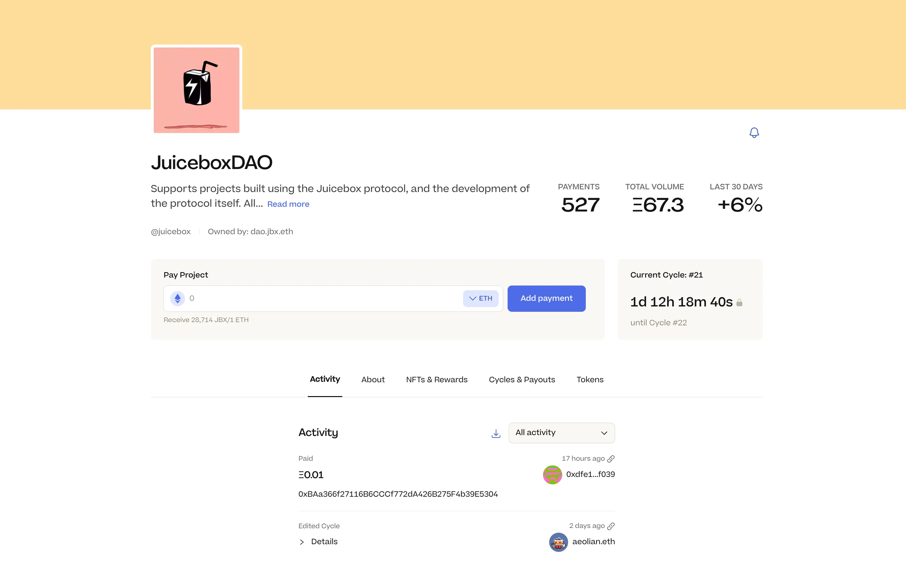

## Croptop Updates by Jango

Jango and Livid had done a lot of work to make the Croptop template support posts of audio, video and Markdown formats, so that now users can post whatever snippet of content on their ENS websites and have them all linked back to their Juicebox treasuries.

They had worked a lot in CID (Content Identifier) to make sure the content was being correctly displayed and funneled into minting process.

During the town hall, Jango showed us [a website created with Croptop template](https://ipfs.io/ipns/k51qzi5uqu5di0scaadzossc8tf6bupz2hbfvpfq56sg9g8afn5bnauuyab8zg/) but not yet pinned to an .eth domain, and demonstrated how to post and mint these contents of different formats onto a Juicebox project.

Jango had been playing with some treasury design stuff recently for both Defifa and Croptop, which had in turn led to his reflections on where JuiceboxDAO's intitial treasury design started, what were some learnings, what were some things to take into consideration moving forward, and what were the experiments Jango was eager to try. Jango wrote down his thoughts in the blog post [Treasury Design Reflections](https://blog.jango.eth.limo/38C20F69-0391-4C54-AA5F-9658265A204C/) on his personal ENS domain website.

In the blog post, Jango proposed some treasury designs he thought would apply decently well to projects like Croptop and Defifa. But he also thought that this design was still up for discussion, so he ecouraged folks with doubts or curiosities to come forward and share their ideas, so that hopefully we could make a better design in this respect.

Jango gave an example of a possible treasury design for Croptop in this town hall.

This [Croptop Publishing Network project](https://goerli.juicebox.money/v2/p/1016) will collect 5% fee when anybody posting on this project using Croptop template. $CPN project token will in turn be issued at a ratio of 1,000,000 / ETH with a decreasing cadence of 4% each following cycle (28 days). 10% of total $CPN issuance will be reserved to a multisig for two years, with a reconfiguration to remove this reserved token allocation scheduled to start two years from now. Also a 70% redemption rate is set so that $CPN holders can choose to claim their share from the treasury anytime if they want. Ideally a buyback delegate will also be attached to the cycles so as to guarantee payments will always get $CPN at its best price available.

Then the project ownership will be thrown away, or essentially be given to a wallet that doesn't have access to make further changes to this project. It will be an experiment to check if we can figure out enough incentives to have $CPN distributed to developers who are keen to manage this project. It is a setup that leaves the bulk of the treasury unmanaged, which means folks have certain guarantees when contributing to it, and ETH in the treasury can serve a particular purpose and everyone is playing by similar rules.

At that point, Jango hoped that "devs can dev, community can community and network can network" without too many isolated concerns and interest is equally aligned throughout.

## Ideas of ETH Shanghai meetup by LJ

LJ introduced that he was planning to host a Juicebox meetup during ETH Shanghai for Juicebox Chinese community from Jun. 26 - 30. His plan for this event were as follows:

1. Host a IRL happy hour, and submit a proposal to the DAO for financial support;
2. Organize workshops with some other DAOs that are buiding public goods, discuss about juicebox.money and how people can use Juicebox to raise funds, as well as the governance improvement of existing Juicebox projects.
3. Put Juicebox's logo on some merchandises (like T-shirts).

## Peel Updates by Aeolian

Latest work by Peel team:

1. Bookmarked projects by Peri. On a project page, users can now click the bookmark icon to save the project to their account for future convenience.

2. Improvements to the Safe page of projects by JohnnyD. If a Juicebox project is owned by a multisig, there will be dedicated Safe page for this project on Juicebox.money, so that people can check any queued transactions or the history of transactions.

3. Revamp of project page mainly done by Wraeth.

4. Thanks to Aeolian, Juicebox.money now supported the new JBTiered721Delegate V3.3 contract (NFT rewards), new project would be created with this new version.

## Juicecast New Episode by Matthew and Brileigh

Matthew and Brileigh had been on the DAO Talk interview hosted by Frission from Tally, to talk about Juicebox, about working in a DAO as contributors, about decentralized media, and about making content for DAOs.

<iframe width="560" height="315" src="https://www.youtube.com/embed/GS-qoOZQ7F0" title="YouTube video player" frameborder="0" allow="accelerometer; autoplay; clipboard-write; encrypted-media; gyroscope; picture-in-picture; web-share" allowfullscreen></iframe>

Also they invited Tommy and Frission from Tally over to the new Juicecast episode, to talk about their views on the future of onchain DAOs. This new Juicecast episode was released shortly after our town hall.

<iframe width="560" height="315" src="https://www.youtube.com/embed/aIoPZD2ki7Y" title="YouTube video player" frameborder="0" allow="accelerometer; autoplay; clipboard-write; encrypted-media; gyroscope; picture-in-picture; web-share" allowfullscreen></iframe>

## Buyback Delegate Updates by Jango

According to Jango, Dr.Gorilla had been working on some of the touchups after the Code4rena audit and Jango had also made a review on this work. Things were looking great, as soon as our contract crew went through all the questions found in this audit, the buyback delegate would be ready to use for Juicebox projects, and anyone can propose for the DAO to use it.

Jango was looking forward to using it in a few more experimental treasury designs, but he was not in a rush to put up a proposal for JuiceboxDAO to make use of it in a short period of time. Although he was definitely exited to try it in production, Jango also said he would be pretty conservative about this delegate, because it is a very  big component that carries out some important functions.

Jango also believed that it had the potential to bring about significant changes to contributor operations, fee paying operations and investor operations, due to the way it work in the reserved and outward token issuance.

