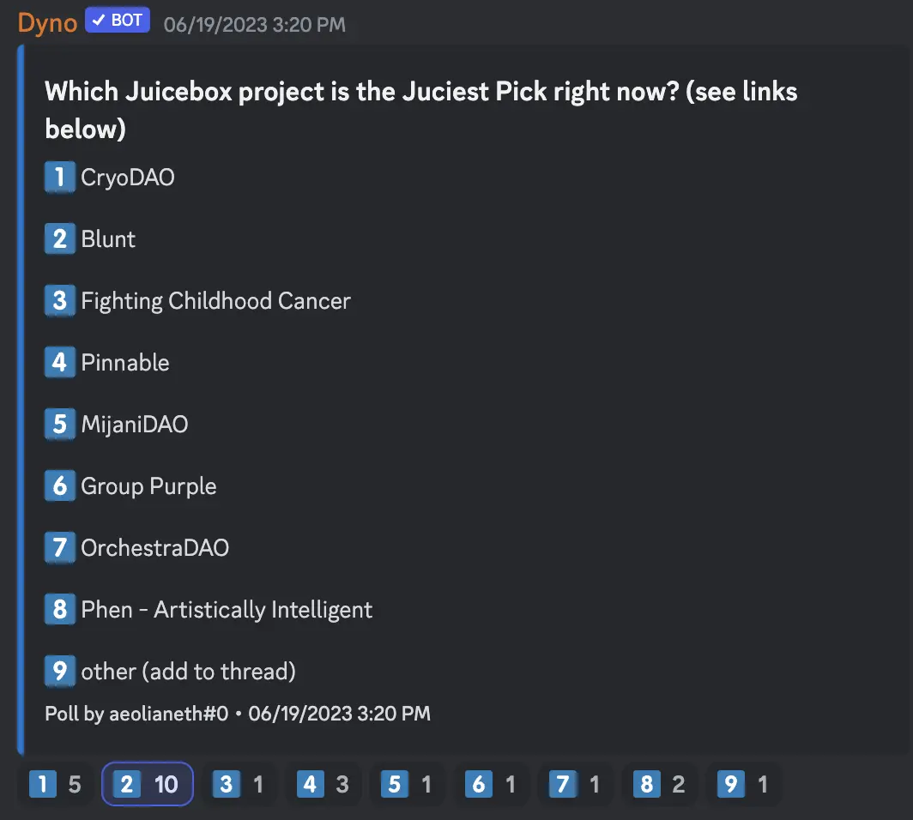

## Peel Updates by Tjl

TJl gave a quick overview of some changes that Peel had made to the project pages recently, which had been a common effort of the whole team.

Some of the main changes were to highlight the key statistics of a project, arrange other details into various tabs such as Activity, About, NFTs, Cycles, Tokens etc. A short link straight to NFTs and Rewards had also been introduced for purpose of user's convenience.

One of the biggest changes they made was a cart structure for the NFTs, similar to our mental model of purchasing something in real life, users now can add multiple NFTs to the cart and make a lumpsum payment for their choices of NFTs.

There would be some really great upcoming features in the next two weeks, which include the ability for project owners to post updates about their projects directly on the project page, and also that for community members to engage in comments on these updates.

Also the 'About' section would soon have a makeover with addtion of rich markdown function, users would be able to add headings and different stylistic text changes, images and etc.

## Juicy Picks Poll by Aeolian

Aeolian made a poll in the Discussion channel of our Discord server, to let community members elect which projects should be put on the Juicy picks section on our homepage.

Here under was the current layout of Juicy Picks, which would be rearranged according to the poll results above.

## ETH Shanghai Meetup Updates by LJ

According to LJ, his plan to host workshops with other DAOs during ETH Shanghai would have to be cancelled, due to the fact that for some reason ETH Shanghai had essentially moved all the activities of this event online.

But expecting some people would still go to Shanghai in that period of time, he was planning to host a more casual meetup such as a IRL Juicebox happy hour by then.

 Also LJ announced that he had been working with Filipv on some legal templates that will be provided to project creators to create their legal entities. They had been working on setting up a website where people can download a template and sign with their crypto wallet, and also building a GitHub repository where people can submit a template through PR and other people will review and accept the template if it turns out to be useful.

## Speech at ETH Waterloo by Nicholas

Nicholas would be giving a talk at [ETH Waterloo](https://ethglobal.com/events/waterloo2023) on June 23rd about the token resolver, Juicebox protocol metadata contracts. He also planned to talk about how the contracts work, introduce the concept of Juicebox cards as a very cool application enabled with onchain metadata, and share some of the template contracts that people can easily fork and write their own metadata.

## Nance Updates by Nicholas

Nicholas introduced that lately the Nance team had been making lots of improvements to jbdao.org, our custom website for governance.

One of new features is the “Fork Proposal", which allows people to literally fork an arbitrary proposal and make a similar one very conveniently.

And another feature was to allow authors of proposal to add actions for a certain proposal, with the onchain transactions or reconfiguration parameters, etc. which are supposed to happen on the blockchain once the proposal is approved.  These are structured data parameters that will show up at the top of a proposal, and in the future iteration of Nance, these actions will be propogated into a new interface where people can reconfigure a project directly without needing extra efforts to manually construct a reconfiguration, and in turn lowering the risks of errors might be incurred.

